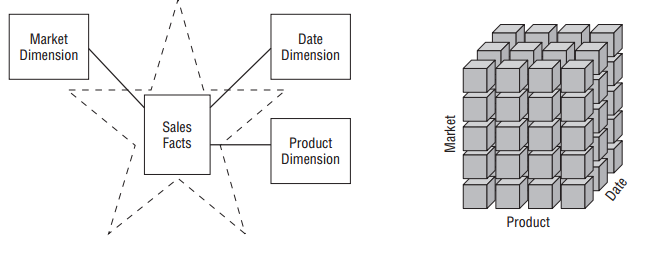
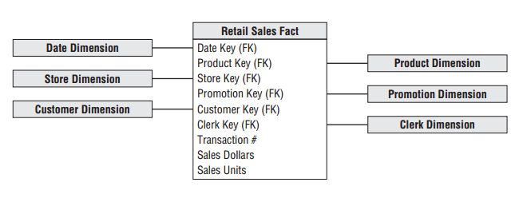
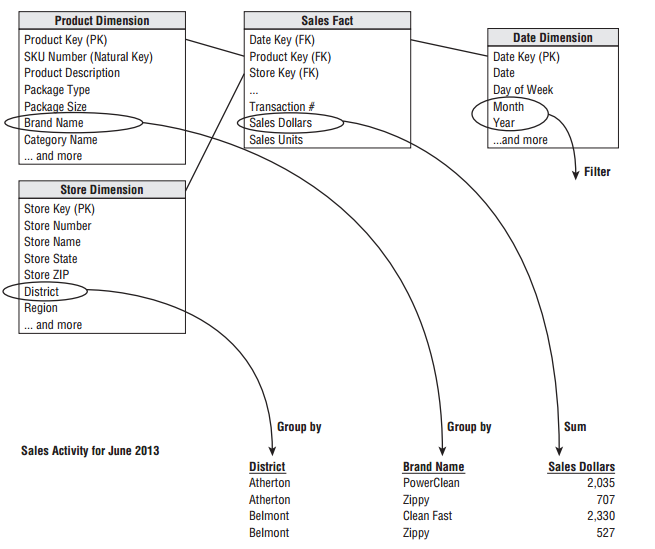

# Dimensional Modelling
***

## Kimball Approach

Before work begins of the data modelling, it is neccessary to understand the needs of the business and the underlying data [@Kimball2013, pg 37].  The business needs arise out of meetings with manangers, decision makers and other representatives of the business.  Kimball also recommends meetings with _'source system experts and doing high-level
data profiling to assess data feasibilities'_ [@Kimball2013, pg 38].  Whilst the data modeller is 'in charge' the actual model should unfold via a series of interactive workshops with those business representatives.  Data governance reps should also be involved to obtain buy-in.

## Four-Step Dimensional Design Process

Kimball outlines four key decisions that are to be made during the design of a dimensional model include:

1. Select the business process - the operational activities done by the business, these activities create the facts

2. Declare the grain - what a single row represents.  The _atomic grain_ is the lowest data captured by the business, which is the ideal and can be aggregared (rolled-up) to other levels.  Different grains must not be mixed in the same fact table


3. Identify the dimensions - the descriptive attributes about the facts, to be used for analysis.  Provide the “who, what, where, when, why, and how” (6W) context 

4. Identify the facts - the measurements (how many) from the business process, it should relate to a physical observable event, rather than reporting needs

Typicall the output of this process is a star schema, with a fact table at the centre supported by the associated dimension tables, with primary/forenigh key relationships.  This is often then structured into a online analytical processing (OLAP) cube, which contains the facts and dimensions appropriate to the analysis, but allows for more detailed analytical capabilities than SQL.  Sometimes aggregated fact tables are built to speed up query performance, as are aggregated OLAP cubes which are typically designed for users.

A key advantage of the dimensional model approach is that new dimensions can be added to an existing fact table by adding a new foreign key column. 

## Graphical Representations

```{r StarOLAP, echo = FALSE, fig.cap='Star schema versus OLAP cube [@Kimball2013, pg 9]'}

```

```{r starexample, echo = FALSE, fig.cap='Star schema example [@Kimball2013, pg 16]'}

```

```{r starreport, echo = FALSE, fig.cap='Star schema reporting [@Kimball2013, pg 17]'}

```

`r if (knitr:::is_html_output()) '# References {-}'`