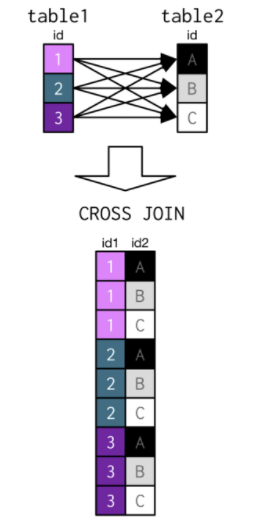
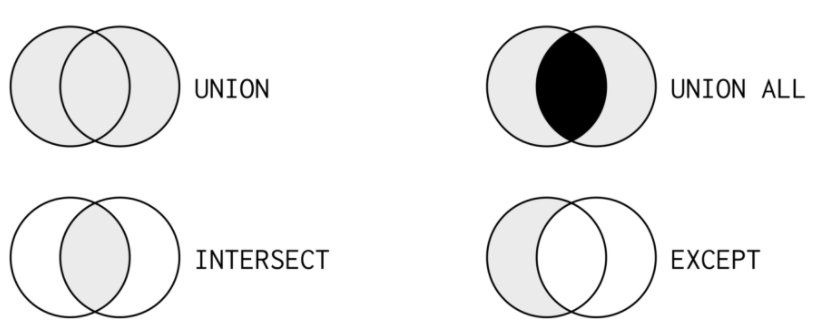
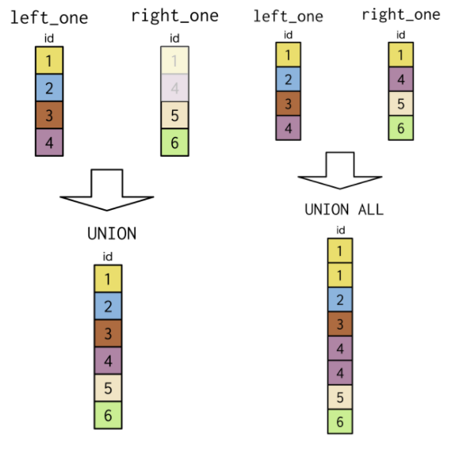
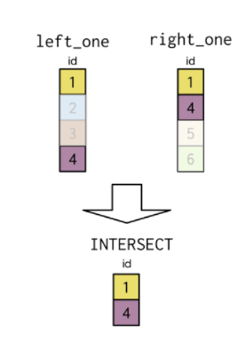
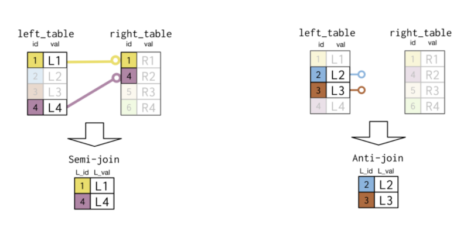

# Joining Data in PostgreSQL
***
Notes taken during/inspired by the Datacamp course 'Joining Data in PostgreSQL' by Chester Ismay. 

Course sections:

* Part 1 - Introduction to joins
* Part 2 - Outer joins and cross joins
* Part 3 - Set theory clauses
* Part 4 - Subqueries
* [Additional - Join Cheat Sheet](http://stevestedman.com/vzAph)

```{r setup}
library(RPostgreSQL)

# create a connection
# save the password that we can "hide" it as best as we can by collapsing it
pw <- {"PASSWORD"}

# loads the PostgreSQL driver
drv <- dbDriver("PostgreSQL")
# creates a connection to the postgres database
# note that "con" will be used later in each connection to the database
con <- dbConnect(drv, dbname = "countries",
                 host = "localhost", port = 5432,
                 user = "postgres", password = pw)
rm(pw) # removes the password

# Sets knitr to use this connection as the default so we don't need to specify it for every chunk
knitr::opts_chunk$set(connection = "con")
```


## Introduction to joins

Throughout this course, we will be working with the countries database containing information about the most populous world cities as well as country-level economic data, population data, and geographic data. This countries database also contains information on languages spoken in each country.  OUr basic syntax for joins is:

> SELECT *
  FROM left_table
  INNER JOIN right_table
  ON left_table.id = right_table.id;
  
So to (inner) join cities (left) and countries (right) together we have 

```{sql connection=con}
SELECT * 
FROM cities
INNER JOIN countries
ON cities.country_code = countries.code
LIMIT 10;
```

Or to just select the columns you are interested in and alias the names in to something more useful

```{sql connection=con}
SELECT cities.name AS city, countries.name AS country, countries.region 
FROM cities
INNER JOIN countries
ON cities.country_code = countries.code
LIMIT 10;
```

Instead of writing the full table name, you can use table aliasing as a shortcut. For tables you also use AS to add the alias immediately after the table name with a space. Check out the aliasing of cities and countries below.

> SELECT c1.name AS city, c2.name AS country
  FROM cities AS c1
  INNER JOIN countries AS c2
  ON c1.country_code = c2.code;

Notice that to select a field in your query that appears in multiple tables, you'll need to identify which table/table alias you're referring to by using a . in your SELECT statement.

Now we look at how to get data from both the countries and economies tables to examine the inflation rate for both 2010 and 2015.

```{sql connection=con}
SELECT c.code AS country_code, c.name, e.year, e.inflation_rate
FROM countries AS c
INNER JOIN economies AS e
ON c.code = e.code
LIMIT 20;
```

To get the fertility rate over time

```{sql connection=con}
SELECT c.code, c.name, c.region, p.year, p.fertility_rate, p.country_code
FROM countries AS c
INNER JOIN populations AS p
ON c.code = p.country_code
LIMIT 20;
```

Then to add in the unemployment rate

```{sql connection=con}
SELECT c.code, c.name, c.region, p.year, p.fertility_rate, p.country_code, e.year, e.unemployment_rate
FROM countries AS c
INNER JOIN populations AS p
ON c.code = p.country_code
INNER JOIN economies AS e
ON c.code = e.code
LIMIT 20;
```

The results are not correct here, as the join on c.code = e.code whilst not also including year causes a cross join e.g. the 2010 value for fertility_rate is also paired with the 2015 value for unemployment_rate. Let's correct that by joining on CODE and YEAR.

```{sql connection=con}
SELECT c.code, c.name, c.region, p.year, p.fertility_rate, p.country_code, e.year, e.unemployment_rate
FROM countries AS c
INNER JOIN populations AS p
ON c.code = p.country_code
INNER JOIN economies AS e
ON c.code = e.code AND p.year = e.year
LIMIT 20;
```

When two tables contain the same field, it is possible to use the USING command rather than ON to join the two tables.  

```{sql}
SELECT c.name AS country, continent, l.name AS language, official
FROM countries AS c
INNER JOIN languages AS l
USING (code)
LIMIT 20;
```

Sometimes we want to join a table to iself, to see different permeatations of columns and variables, which is called a self-join.

Now we will use the populations table to perform a self-join to calculate the percentage increase in population from 2010 to 2015 for each country code.

As we will be joining the populations table to itself, we can alias populations as p1 and also populations as p2. This is good practice whenever you are aliasing and your tables have the same first letter. Note that you are required to alias the tables with self-joins.

```{sql connection=con}
SELECT p1.country_code, 
       p1.size AS size2010,
       p2.size AS size2015
FROM populations AS p1
INNER JOIN populations AS p2
ON  p1.country_code = p2.country_code
LIMIT 30;
```

Notice from the result that for each country_code you have four entries laying out all combinations of 2010 and 2015.  This is similar to a cross join or cartesian join where every combination of variables is made.  

To remedy this, we add to the ON to the query to include only those records where the p1.year (2010) matches with p2.year - 5 (2015 - 5 = 2010).

```{sql connection=con}
SELECT p1.country_code, 
       p1.size AS size2010,
       p2.size AS size2015
FROM populations AS p1
INNER JOIN populations AS p2
ON  p1.country_code = p2.country_code AND p1.year = p2.year - 5
LIMIT 30;
```

Next we can calculate the change over time by calculating a new field.

```{sql connection=con}
SELECT p1.country_code, 
       p1.size AS size2010,
       p2.size AS size2015,
       (p2.size - p1.size) / p1.size * 100 AS growth_perc 
FROM populations AS p1
INNER JOIN populations AS p2
ON  p1.country_code = p2.country_code AND p1.year = p2.year - 5
LIMIT 30;
```


Another scenario is when we want to create a group or category within our data.  We can do this using the CASE function, which is similar to a series of IF then functions, where if a condition is met, a variable (column) is assigned a value or name.  This process is then iterated until we remain with our final ELSE component.  

You can use CASE with WHEN, THEN, ELSE, and END to define a new grouping field.

```{sql connection=con}
-- get name, continent, code, and surface area
SELECT name, continent, code, surface_area,
    -- first case
    CASE WHEN surface_area > 2000000
    -- first then
            THEN 'large'
    -- second case
       WHEN surface_area > 350000
    -- second then
            THEN 'medium'
    -- else clause + end
       ELSE 'small' END
    -- alias resulting field of CASE WHEN
       AS geosize_group
-- from the countries table
FROM countries
LIMIT 10;
```

If we wanted to create a new table, we could use the INTO command

```{sql connection=con, echo = FALSE}
SELECT name, continent, code, surface_area,
    CASE WHEN surface_area > 2000000
            THEN 'large'
       WHEN surface_area > 350000
            THEN 'medium'
       ELSE 'small' END
       AS geosize_group
INTO countries_plus
FROM countries;
```

We will now explore the relationship between the size of a country in terms of surface area and in terms of population using grouping fields created with CASE, focusing on just 2015.  We will save the results in to a new table, pop_plus.

```{sql connection=con}
SELECT country_code, size,
    CASE WHEN size > 50000000
            THEN 'large'
        WHEN size > 1000000
            THEN 'medium'
        ELSE 'small' END
        AS popsize_group
INTO pop_plus
FROM populations
-- any conditions to check?
WHERE year = 2015;
```


Now we will join countries_plus to pop_plus and order our results based on geosize_group so the largest appear at the top.

```{sql connection=con}
SELECT c.name, c.continent, c.geosize_group, c.code, p.popsize_group, p.country_code
FROM countries_plus AS c
INNER JOIN pop_plus AS p
ON  c.code = p.country_code
ORDER BY geosize_group
LIMIT 25;
```

## Outer joins and cross joins

Outer joins can be thought of as 'reaching out' to another tables, whilst keeping all of the records from the original table.  Inner joins only keep the records IN both tables.  

* A left join will add data from the right table, to that on the left (the original) and mark and variables not in the right table as missing
* A right join is much less common than the left join.  We add fields from the left table to that on the right, leaving missing values where needed

In the next examples we will compare an inner join to a left join

```{sql connection=con}
SELECT c1.name AS city, code, c2.name AS country,
       region, city_proper_pop
-- specify left table
FROM cities AS c1
-- specify right table and type of join
INNER JOIN countries AS c2
-- how should the tables be matched
ON c1.country_code = c2.code
-- sort based on descending country code
ORDER BY code DESC;
```

There are 230 rows here.  Next, we will use a left join

```{sql connection=con}
SELECT c1.name AS city, code, c2.name AS country,
       region, city_proper_pop
-- specify left table
FROM cities AS c1
-- specify right table and type of join
LEFT JOIN countries AS c2
-- how should the tables be matched?
ON c1.country_code = c2.code
-- sort based on descending country code
ORDER BY code DESC;
```

We now have 236 rows and we can see that there are some cities  which are not matching corresponding results in the countries table.

Now we will use the use of the AVG() function introduced in our Intro to SQL for Data Science course. we will use it in combination with left join to determine the average gross domestic product (GDP) per capita by region in 2010, grouped by region/

```{sql connection=con}
-- select name, region, and gdp_percapita
SELECT region, AVG(gdp_percapita) AS avg_gdp
-- countries (alias c) on the left
FROM countries AS c
-- join with economies (alias e)
LEFT JOIN economies AS e
-- match on code fields
ON c.code = e.code
-- focus on 2010 entries
WHERE year = 2010
GROUP BY region
ORDER BY avg_gdp DESC;
```

Right joins are not as common as left joins, because in part, a right join can always be written as a left join.

```{sql connection=con}
-- Right Join
SELECT cities.name AS city, urbanarea_pop, countries.name AS country,
       indep_year, languages.name AS language, percent
FROM languages
RIGHT JOIN countries
ON languages.code = countries.code
RIGHT JOIN cities
ON countries.code = cities.country_code
ORDER BY city, language
LIMIT 20;

/*
The Left Join would look like
SELECT cities.name AS city, urbanarea_pop, countries.name AS country,
       indep_year, languages.name AS language, percent
FROM cities
LEFT JOIN countries
ON cities.country_code = countries.code
LEFT JOIN languages
ON countries.code = languages.code
ORDER BY city, language
LIMIT 20;
*/
```

So far we have encountered 3 join types, now we look at Full Joins, which is similar to combining a LEFT and a RIGHT join together.

```{r JoinTypes, echo = FALSE, fig.cap='Inner, Left, Right and Full Joins'}
knitr::include_graphics("images/JoinTYpes.png")
```

Now we will examine how your results differ when using a full join versus using a left join and versus using an inner join with the countries and currencies tables.

We will focus on the North American region and also where the name of the country is missing (NULL). 

```{sql connection=con}
SELECT name AS country, code, region, basic_unit
FROM countries
FULL JOIN currencies
USING (code)
WHERE region = 'North America' OR region IS NULL
ORDER BY region;
```

Then with a LEFT join

```{sql connection=con}
SELECT name AS country, code, region, basic_unit
FROM countries
LEFT JOIN currencies
USING (code)
WHERE region = 'North America' OR region IS NULL
ORDER BY region;
```

And finally an INNER join

```{sql connection=con}
SELECT name AS country, code, region, basic_unit
FROM countries
INNER JOIN currencies
USING (code)
WHERE region = 'North America' OR region IS NULL
ORDER BY region;
```

Now we will investigate a similar exercise to the last one, but this time focused on using a table with more records on the left than the right. We will use the languages and countries tables.

Begin with a FULL join with languages on the left and countries on the right. 

```{sql connection=con}
SELECT countries.name, code, languages.name AS language
FROM languages
FULL JOIN countries
USING (code)
WHERE countries.name LIKE 'V%' OR countries.name IS NULL
ORDER BY countries.name
LIMIT 25;
```

Then with a LEFT join

```{sql connection=con}
SELECT countries.name, code, languages.name AS language
FROM languages
LEFT JOIN countries
USING (code)
WHERE countries.name LIKE 'V%' OR countries.name IS NULL
ORDER BY countries.name
LIMIT 25;
```

And finally with a INNER join

```{sql connection=con}
SELECT countries.name, code, languages.name AS language
FROM languages
INNER JOIN countries
USING (code)
WHERE countries.name LIKE 'V%' OR countries.name IS NULL
ORDER BY countries.name
LIMIT 25;
```

Next we will explore using two consecutive full joins on the three tables you worked with in the previous two exercises.

```{sql connection=con}
SELECT c.name AS country, region, l.name AS language,
       cur.basic_unit, cur.frac_unit
FROM countries AS c
FULL JOIN languages AS l
USING (code)
FULL JOIN currencies AS cur
USING (code)
WHERE region LIKE 'M%esia';
```

A cross join results in pair wise combinations of all records.  

```{r CrossJoin, echo = FALSE, fig.cap='Cross Join'}

```

We will now explore languages potentially and most frequently spoken in the cities of Hyderabad, India and Hyderabad, Pakistan.

We begin with a cross join with cities AS c on the left and languages AS l on the right. 

```{sql connection=con}
SELECT c.name AS city, l.name AS language
FROM cities AS c
CROSS JOIN languages AS l
WHERE c.name LIKE 'Hyder%'
LIMIT 20;
```

Then as a INNER join

```{sql connection=con}
SELECT c.name AS city, l.name AS language
FROM cities AS c
INNER JOIN languages AS l
ON c.country_code = l.code
WHERE c.name LIKE 'Hyder%';
```

To select the five countries with the lowest average life expectancy

```{sql connection=con}
SELECT c.name AS country, c.region, life_expectancy AS life_exp
FROM countries AS c
LEFT JOIN populations AS p
ON c.code = p.country_code
WHERE year = 2010 AND life_expectancy IS NOT NULL
ORDER BY life_exp
LIMIT 5;
```

And the five highest

```{sql connection=con}
SELECT c.name AS country, c.region, life_expectancy AS life_exp
FROM countries AS c
LEFT JOIN populations AS p
ON c.code = p.country_code
WHERE year = 2010 AND life_expectancy IS NOT NULL
ORDER BY life_exp DESC
LIMIT 5;
```

## Set theory clauses

```{r Venn, echo = FALSE, fig.cap='Set Theory Venn Diagrams'}

```

* UNION includes every record in both tables, without double counting
* UNION ALL includes those records in both tables and does replicate those that are in both tables
* INTERSECT results in only those records found in both tables
* EXCEPT results in only those records in one table and not the other

Unlike joins, unions do not lookup values across tables, they simply stack records on top of each other.  These record stacks must also be of the same data type e.g. numeric on numeric, char on char.

```{r Venn, echo = FALSE, fig.cap='Union set types'}

```

So to add all the fields of one table to another, we use

```{sql connection=con}
-- pick specified columns from 2010 table
SELECT *
-- 2010 table will be on top
FROM economies2010
-- which set theory clause?
UNION
-- pick specified columns from 2015 table
SELECT *
-- 2015 table on the bottom
FROM economies2015
-- order accordingly
ORDER BY code, year
LIMIT 20;
```

We can also use the UNION command to check for occurrances of a field across multiple tables (excluding duplicates).

```{sql connection=con}
SELECT code AS country_code
FROM currencies
UNION 
SELECT country_code
FROM cities
ORDER BY country_code
LIMIT 20;
```

We can use the UNION ALL command to check for all possible combinatons across tables (including duplicates).

```{sql connection=con}
SELECT country_code AS code, year
FROM populations
UNION ALL
SELECT code, year
FROM economies
ORDER BY code, year
LIMIT 30;
```

### INTERSECT

UNION and UNION ALL are not the same as a join, they bind fields on top of each either in the two tables.  INTERSECT will work in a similar fashion to UNION and UNION ALL but onyl includes those records in common to both tables and fields selected.   

```{r Intersect, echo = FALSE, fig.cap='Intersect'}

```

If we run the same query as before (the last union all) but with intersect

```{sql connection=con}
SELECT country_code AS code, year
FROM populations
INTERSECT
SELECT code, year
FROM economies
ORDER BY code, year
LIMIT 30;
```

The total number of records for union all was 814, with intersect it is now 380.

As you think about major world cities and their corresponding country, which countries also have a city with the same name as their country name?

```{sql connection=con}
SELECT name
FROM countries
INTERSECT
SELECT name
FROM cities;
```

Another type of join is the EXCEPT join, that includes records from the left table that do appear in the right table.  An example might be all job titles held by males but not female employees.  In the following example we will get the names of cities in cities which are not noted as capital cities in countries as a single field result.

NOTE there are some countries in the world that are not included in the countries table, which will result in some cities not being labeled as capital cities when in fact they are.

```{sql connection=con}
SELECT name
FROM cities
EXCEPT
SELECT capital
FROM countries
ORDER BY name;
```

Or we could have the REVERSE of the previous query - the names of capital cities that are not listed in the cities table.

```{sql connection=con}
SELECT capital
FROM countries
EXCEPT
SELECT name
FROM cities
ORDER BY capital;
```

### Semi-joins and Anti-joins

So far we have looked at six joins which add columns to the original (usually left) table.  These last two join types will keep records similar to using a WHERE clause, depending on the values of the second table. A semi-join includes records where a condition is met in the second table, an anti-join will include records where a condition is not met from the second table.

```{r Semi, echo = FALSE, fig.cap='Semi and Anti Joins'}

```

Now we will look at using a semi-join to identify languages spoken in the Middle East.  First we will build up a query from a select statement. We will begin by selecting all country codes in the Middle East as a single field result using SELECT, FROM, and WHERE.

```{sql connection=con}
SELECT code
FROM countries
WHERE region = 'Middle East'
LIMIT 20;
```

Then identify the languages spoken in the Middle East

```{sql connection=con}
SELECT DISTINCT name
FROM languages
ORDER BY name
LIMIT 20;
```

Then combine together into a nested subquery

```{sql connection=con}
SELECT DISTINCT name
FROM languages
WHERE code IN
    (SELECT code
    FROM countries
    WHERE region = 'Middle East')
ORDER BY name;
```

We will now look at anti-joins, which are useful for identifying which records are causing the incorrect number of records to appear in join queries.   First, the number of countries appearing in Oceania;

```{sql connection=con}
SELECT count(*)
FROM countries
WHERE continent = 'Oceania';
```

Next, let's get get the different currencies used in the countries of Oceania.

```{sql connection=con}
SELECT c1.code, c1.name, c2.basic_unit AS currency
FROM countries AS c1
INNER JOIN currencies AS c2
USING (code)
WHERE continent = 'Oceania';
```

Note that not all countries in Oceania were listed in the resulting inner join with currencies. We will use an anti-join to determine which countries were not included.

```{sql connection=con}
SELECT code, name
FROM countries 
WHERE continent = 'Oceania'
    AND code NOT IN
        (SELECT code 
         FROM currencies);
```

Now we are going to use multiple sub-clauses to identify the country codes that are included in either economies or currencies but not in populations.

```{sql connection=con}
-- select the city name
SELECT name
-- alias the table where city name resides
FROM cities AS c1
-- choose only records matching the result of multiple set theory clauses
WHERE country_code IN
(
    -- select appropriate field from economies AS e
    SELECT e.code
    FROM economies AS e
    -- get all additional (unique) values of the field from currencies AS c2  
    UNION
    SELECT c2.code
    FROM currencies AS c2
    -- exclude those appearing in populations AS p
    EXCEPT
    SELECT p.country_code
    FROM populations AS p
);
```

## Subqueries

This last part is focues on embedding queries inside of queries, which are called nested or subqueries.  What is inside of a WHERE statement, as shown previously, is the most common kind.  You can use subqueries to select items where an item meets a numerical condition, for instance where an area (state) is below the average (fertility rate) e.g.

```{sql connection=con, eval = FALSE}
SELECT name, fert_rate
FROM states
WHERE continent = 'Asia'
  AND fert_rate <
    (SELECT AVG(fert_rate)
    FROM states);
```

The second most common type of subquery is inside of a SELECT clause.  e.g. if we wanted to count the number of countries listed in the state table versus each continet in the prime ministers table, we use a COUNT and WHERE statement matching the continent field.  As we are doing the subquery inside the SELECT statement you need to give the subquery an alias like countries_num.

```{sql connection=con, eval = FALSE}
SELECT DISTINCT continet,
  (SELECT COUNT(*)
  FROM states
  WHERE prime_ministers.continet = states.continet) AS countries_num
FROM prime_minsters;
```

NOTE that in the above example it could be possible to use join(s) to achieve the same result, often there is more than one way to achieve a desired outcome in SQL.

Let's say we wanted to select all countries where the life expectancy is 1.15 times the average:

```{sql connection=con}
    
SELECT *
FROM populations
WHERE life_expectancy > 
    1.15 * (SELECT AVG(life_expectancy)
    FROM populations
    WHERE year = 2015) AND
    year = 2015
ORDER BY life_expectancy DESC;   
```

NOTE that a double year = 2015 condition is needed, once for the calculation and one for the results.  If we calculate the 2015 average:

```{sql connection=con}
SELECT AVG(life_expectancy)
FROM populations
WHERE year = 2015;
```

1.15 * 71.67 = 82.42, meaning for 2015 there are just the ten areas previously listed.  If we instead run the following code:

```{sql connection=con}
SELECT *
FROM populations
WHERE year = 2015 
    AND life_expectancy > 1.15 *
    (SELECT AVG(life_expectancy)
    FROM populations)
ORDER BY life_expectancy DESC;
```
The 1.15 * avg(life_expectancy) is calculated over both 2010 and 2015, however just the resulting 2015 life expectancy rates are shown, for instance Luxemberg is below the 2015 average threshold of 82.42. 

In the next example we use a subquery to select the capital of each country, before then returning the urban population of that capital.

```{sql connection=con}
-- select the appropriate fields
SELECT name, country_code, urbanarea_pop
-- from the cities table
FROM cities
-- with city name in the field of capital cities
WHERE name IN
  (SELECT capital
   FROM countries)
ORDER BY urbanarea_pop DESC
LIMIT 10;
```

Also some queries can be written using either a join or a subquery.

Previously we saw how to use GROUP BY with aggregate functions and an inner join to get summarized information from multiple tables.

```{sql connection=con}
SELECT countries.name AS country, COUNT(*) AS cities_num
FROM cities
INNER JOIN countries
ON countries.code = cities.country_code
GROUP BY country
ORDER BY cities_num DESC, country
LIMIT 9;
```

Or the same but as a subquery

```{sql connection=con}
SELECT countries.name AS country,
  (SELECT COUNT(*)
   FROM cities
   WHERE countries.code = cities.country_code) AS cities_num
FROM countries
ORDER BY cities_num DESC, country
LIMIT 9;
```

### FROM subqueries

It is possible to use FROM with insider a subquery.  It is often easier to build up from the subquery first, i.e. if we select the number of languages spoken in a country

```{sql connection=con}
SELECT code, COUNT(*) AS lang_num
FROM languages
GROUP BY code
LIMIT 10;
```

Then use this (and alias it) as a subquery.  Here we select the local name for the country, then join the subquery result to that table.

```{sql connection=con}
SELECT local_name, subquery.lang_num
FROM countries,
    (SELECT code, COUNT(*) AS lang_num
    FROM languages
    GROUP BY code) AS subquery
WHERE countries.code = subquery.code
ORDER BY lang_num DESC
LIMIT 10;
```

You can also next multiple sub-queries.  In this example, for each of the six continents listed in 2015, we identify which country had the maximum inflation rate (and how high it was) using multiple subqueries. So again, let's start with a select query that will later become a subquery.

```{sql connection=con}
SELECT name, continent, inflation_rate
FROM countries
INNER JOIN economies 
USING (code)
WHERE year = 2015
LIMIT 5;
```

Next we determine the maximum inflation rate for each continent in 2015 using the previous query as a subquery.

```{sql connection=con}
SELECT MAX(inflation_rate) AS max_inf
FROM (
    SELECT name, continent, inflation_rate
    FROM countries
    INNER JOIN economies 
    USING (code)
    WHERE year = 2015) AS subquery 
GROUP BY continent;
```

