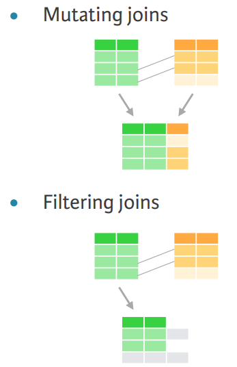

# Joining Data in R with dplyr
***
Notes taken during/inspired by the Datacamp course 'Joining Data in R with dplyr' by Garrett Grolemund.

Other useful info:

* [R for Data Science Book](http://r4ds.had.co.nz/)
* [Data Wrangling Cheatsheet](https://www.rstudio.com/wp-content/uploads/2015/02/data-wrangling-cheatsheet.pdf)
* [dplyr two table verbs vignette](https://cran.r-project.org/web/packages/dplyr/vignettes/two-table.html)
* [dbplyr vignette](https://cran.r-project.org/web/packages/dbplyr/vignettes/dbplyr.html)

Course Slides:

* [Part1 - Mutating Joins](https://s3.amazonaws.com/assets.datacamp.com/production/course_1074/slides/ch1-pdf.pdf)
* [Part2 - Filtering joins and set operations](https://s3.amazonaws.com/assets.datacamp.com/production/course_1074/slides/ch2-pdf.pdf)
* [Part3 - Assembling data](https://s3.amazonaws.com/assets.datacamp.com/production/course_1074/slides/ch3-pdf.pdf)
* [Part4 - Advanced joining](https://s3.amazonaws.com/assets.datacamp.com/production/course_1074/slides/ch4-pdf.pdf)
* [Part5 - Case Study](https://s3.amazonaws.com/assets.datacamp.com/production/course_1074/slides/ch5-pdf.pdf)

## Mutating joins

Data is best used in R when in a single data table.  This course introduces a number of techniques to achieve this.  Dplyr also has connectors to a range of different databases, so can be used to both extract and manipulate data in databases.

### Keys

We often want to join two tables together, adding a set of values or variables from a second table(s).  For this to happen, we need a key, whereby we have a key in the initial table (a primary key) that is uniquely identifies rows in that within that table or dataset (we don't have duplicates) and we then use this key to add in data from a secondary table (the foreign key to that table).  The foreign key in the secondary table may be duplicated or not appear at all.  Sometimes no single variable acts as a primary key in a dataset. Instead, it takes a combination of variables to uniquely identify each row, for example a table of addresses with different columns representing sections of the address - house number, street name, postcode/zip code.

When working with dplyr, it works with the following tables for the purposes of joining data

* **Tables** in dplyr are one of the following:
* **data frames**
* **tibbles (tbl_df)** - similar to data frame but only what fits in to your R console window will be displayed but you can use View() all the table if needed 
* **tbl references**

### Left and right joins

left_join() is the basic join function in dplyr. You can use it whenever you want to augment a data frame with information from another data frame.

For example, left_join(x, y) joins y to x. The second dataset you specify is joined to the first dataset. In right_join() the order of the datasets reversed

```{r, eval = FALSE}
# Join artists to bands
bands2 <- left_join(bands, artists, by = c("first", "last"))

# Examine the results
bands2

# Recreate bands3 with a right join
bands2 <- left_join(bands, artists, by = c("first", "last"))
bands3 <- right_join(artists, bands, by = c("first", "last"))

# Check that bands3 is equal to bands2
setequal(bands2, bands3)
```

### Inner and full joins

Left_join and right_join are half of a class of 'mutating joins' with the name coming from dplyrs mutate() function which returns a copy of the dataset with one or more columns of the data added to it.  The other two functions are:

* **inner_join**: only retains rows from both/all datasets
* **full_join**: retains any row from both/any data set
* **%>%**: Can be used to string joins or other functions together

```{r, eval = FALSE}
# Create goal2 using full_join() and inner_join() 
goal2 <- artists %>%
  full_join(bands, by = c("first","last")) %>%
  inner_join(songs, by = c("first","last"))

# Create one table that combines all information
artists %>%
  full_join(bands, by = c("first","last")) %>%
  full_join(songs, by = c("first","last")) %>%
  full_join(albums, by = c("album", "band"))

```

## Filtering joins and set operations

Filtering joins returns a copy of the origianl data set rather than an augmented version of the original dataset.  

```{r Filtering Joins, echo = FALSE, fig.cap='Filtering and Mutating Joins'}

```

Semi_join() is one of the filtering join functions, it can be used to check which rows in one table match the rows in another table, perhaps before a mutating join.  Semi_join is sometimes easier than many seperate functions together, for instance

```{r, eval = FALSE}
# View the output of semi_join()
artists %>% 
  semi_join(songs, by = c("first", "last"))

# Create the same result
artists %>% 
  right_join(songs, by = c("first", "last")) %>% 
  filter(!is.na(instrument)) %>% 
  select(first, last, instrument) 
```

Semi-joins provide a useful way to explore the connections between multiple tables of data.

For example, you can use a semi-join to determine the number of albums in the albums dataset that were made by a band in the bands dataset.

```{r, eval = FALSE}
albums %>% 
  # Collect the albums made by a band
  semi_join(bands, by = "band") %>% 
  # Count the albums made by a band
  nrow()
```

