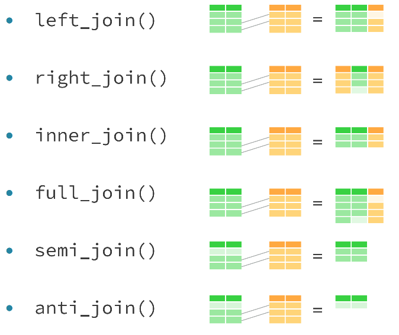
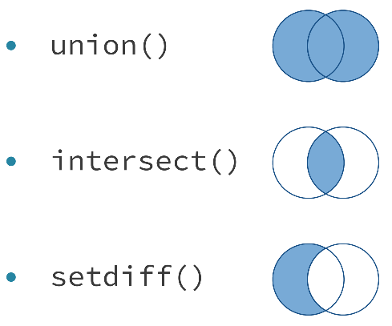

# Joining Data in R with dplyr
***
Notes taken during/inspired by the Datacamp course 'Joining Data in R with dplyr' by Garrett Grolemund.

Other useful info:

* [R for Data Science Book](http://r4ds.had.co.nz/)
* [Data Wrangling Cheatsheet](https://www.rstudio.com/wp-content/uploads/2015/02/data-wrangling-cheatsheet.pdf)
* [dplyr two table verbs vignette](https://cran.r-project.org/web/packages/dplyr/vignettes/two-table.html)
* [dbplyr vignette](https://cran.r-project.org/web/packages/dbplyr/vignettes/dbplyr.html)

Course Slides:

* [Part1 - Mutating Joins](https://s3.amazonaws.com/assets.datacamp.com/production/course_1074/slides/ch1-pdf.pdf)
* [Part2 - Filtering joins and set operations](https://s3.amazonaws.com/assets.datacamp.com/production/course_1074/slides/ch2-pdf.pdf)
* [Part3 - Assembling data](https://s3.amazonaws.com/assets.datacamp.com/production/course_1074/slides/ch3-pdf.pdf)
* [Part4 - Advanced joining](https://s3.amazonaws.com/assets.datacamp.com/production/course_1074/slides/ch4-pdf.pdf)
* [Part5 - Case Study](https://s3.amazonaws.com/assets.datacamp.com/production/course_1074/slides/ch5-pdf.pdf)

## Mutating joins

Data is best used in R when in a single data table.  This course introduces a number of techniques to achieve this.  Dplyr also has connectors to a range of different databases, so can be used to both extract and manipulate data in databases.

### Keys

We often want to join two tables together, adding a set of values or variables from a second table(s).  For this to happen, we need a key, whereby we have a key in the initial table (a primary key) that is uniquely identifies rows in that within that table or dataset (we don't have duplicates) and we then use this key to add in data from a secondary table (the foreign key to that table).  The foreign key in the secondary table may be duplicated or not appear at all.  Sometimes no single variable acts as a primary key in a dataset. Instead, it takes a combination of variables to uniquely identify each row, for example a table of addresses with different columns representing sections of the address - house number, street name, postcode/zip code.

When working with dplyr, it works with the following tables for the purposes of joining data

* **Tables** in dplyr are one of the following:
* **data frames**
* **tibbles (tbl_df)** - similar to data frame but only what fits in to your R console window will be displayed but you can use View() all the table if needed 
* **tbl references**

```{r Dplyr Joins, echo = FALSE, fig.cap='Joins available in Dplyr'}

```

### Left and right joins

left_join() is the basic join function in dplyr. You can use it whenever you want to augment a data frame with information from another data frame.

For example, left_join(x, y) joins y to x. The second dataset you specify is joined to the first dataset. In right_join() the order of the datasets reversed

```{r, eval = FALSE}
# Join artists to bands
bands2 <- left_join(bands, artists, by = c("first", "last"))

# Examine the results
bands2

# Recreate bands3 with a right join
bands2 <- left_join(bands, artists, by = c("first", "last"))
bands3 <- right_join(artists, bands, by = c("first", "last"))

# Check that bands3 is equal to bands2
setequal(bands2, bands3)
```

### Inner and full joins

Left_join and right_join are half of a class of 'mutating joins' with the name coming from dplyrs mutate() function which returns a copy of the dataset with one or more columns of the data added to it.  The other two functions are:

* **inner_join**: only retains rows from both/all datasets
* **full_join**: retains any row from both/any data set
* **%>%**: Can be used to string joins or other functions together

```{r, eval = FALSE}
# Create goal2 using full_join() and inner_join() 
goal2 <- artists %>%
  full_join(bands, by = c("first","last")) %>%
  inner_join(songs, by = c("first","last"))

# Create one table that combines all information
artists %>%
  full_join(bands, by = c("first","last")) %>%
  full_join(songs, by = c("first","last")) %>%
  full_join(albums, by = c("album", "band"))

```

## Filtering joins and set operations

Filtering joins returns a copy of the origianl data set rather than an augmented version of the original dataset.  

```{r Filtering Joins, echo = FALSE, fig.cap='Filtering and Mutating Joins'}
knitr::include_graphics("images/FilteringJoins.png")
```

Semi_join() is one of the filtering join functions, it can be used to check which rows in one table match the rows in another table, perhaps before a mutating join.  Semi_join is sometimes easier than many seperate functions together, for instance

```{r, eval = FALSE}
# View the output of semi_join()
artists %>% 
  semi_join(songs, by = c("first", "last"))

# Create the same result
artists %>% 
  right_join(songs, by = c("first", "last")) %>% 
  filter(!is.na(instrument)) %>% 
  select(first, last, instrument) 
```

Semi-joins provide a useful way to explore the connections between multiple tables of data.

For example, you can use a semi-join to determine the number of albums in the albums dataset that were made by a band in the bands dataset.

```{r, eval = FALSE}
albums %>% 
  # Collect the albums made by a band
  semi_join(bands, by = "band") %>% 
  # Count the albums made by a band
  nrow()
```

Anti-joins shows records which are in the primary table but do not have matches in the second data table.  This can be useful for checking spelling or key value errors.

```{r}
# Return rows of artists that don't have bands info
artists %>% 
  anti_join(bands, by = c("first", "last"))

# Check whether album names in labels are mis-entered
labels %>% 
  anti_join(albums, by = "album")
```

Joins can also be used to count the number of records.

```{r}
# Determine which key joins labels and songs
labels
songs

songs %>% 
  # Find the rows of songs that match a row in labels
  semi_join(labels, by = "album") %>% 
  # Number of matches between labels and songs
  nrow()
```

## Set Operations

When two datasets contain the same variables, it can be useful to combine the datasets with set operations (rather than joins).  The three set operations can be used to combine observations from two datasets in to a single dataset.

```{r Set Ops, echo = FALSE, fig.cap='Set Operations'}

```

For instance we can count the number of unique songs in two data tables.

```{r}
library(dplyr)

# Import files
aerosmith <- read.csv("C:/Users/DEsktop/Nextcloud/Documents/2017/RData/aerosmith.csv", stringsAsFactors = FALSE)
greatest_hits <- read.csv("C:/Users/DEsktop/Nextcloud/Documents/2017/RData/greatest_hits.csv", stringsAsFactors = FALSE)

aerosmith %>% 
  # Create the new dataset using a set operation
  union(greatest_hits) %>% 
  # Count the total number of songs
  nrow()

```

Or use it to see which is in both (where the dataset has the exact same variables) - this is similar to the semi_join function.

```{r}
# Create the new dataset using a set operation
aerosmith %>% 
  intersect(greatest_hits)
```

Or use it to identify which are in one dataset but not the other.  Here, we also match on just the variable we are interested in that matches across both datasets.

```{r}
# Import file
live <- read.csv("C:/Users/DEsktop/Nextcloud/Documents/2017/RData/live.csv", stringsAsFactors = FALSE)

# Select the song names from live
live_songs <- live %>% select(song)

# Select the song names from greatest_hits
greatest_songs <- greatest_hits %>% select(song)

# Create the new dataset using a set operation - songs in live that are not in greatest_hits
live_songs %>% 
  setdiff(greatest_songs)
```

There is no set operation to find rows that appear in one data frame or another, but not both. However, you can accomplish this by combining set operators.

```{r}

live_songs <- live %>% select(song)
greatest_songs <- greatest_hits %>% select(song)

# Return the songs that only exist in one dataset
live_songs %>% 
  setdiff(greatest_songs) %>% 
  union(greatest_songs %>% 
  setdiff(live_songs))
```

**Note**: The union() function removes duplicate rows, even if a duplicate is desired (perhaps a different record such as someone with the same name).

Its common to want to know if one data set is the same as another dataset dplyr’s setequal will do this easily base R’s identical is will only return true if the datasets have the exact same rows in the exact same order
Recap:

* Mutating Joins:
  *left_join
  *right_join
  *inner_join
  *full_join

*Filtering Joins:
  *semi_join
  *anti_join

*Set Operations:
  *union
  *intersect
  *setdiff

*Comparisions:
  *setequal
  
The definitive and complete contain the songs that appear in competing Led Zeppelin anthologies: The Definitive Collection and The Complete Studio Recordings, respectively.

Both anthologies claim to contain the complete studio recordings of Led Zeppelin, but do the anthologies contain the same exact songs?
```{r}
# Import files
complete <- read.csv("C:/Users/DEsktop/Nextcloud/Documents/2017/RData/complete.csv", stringsAsFactors = FALSE)
definitive <- read.csv("C:/Users/DEsktop/Nextcloud/Documents/2017/RData/definitive.csv", stringsAsFactors = FALSE)

# Check if same order: definitive and complete
identical(definitive, complete)

# Check if any order: definitive and complete
setequal(definitive, complete)

# Songs in definitive but not complete
complete %>% 
  setdiff(definitive)

# Songs in complete but not definitive
definitive %>%
  setdiff(complete)

# Return songs in definitive that are not in complete
definitive %>% 
  anti_join(complete, by = c("song", "album"))

# Return songs in complete that are not in definitive
complete %>% 
  anti_join(definitive, by = c("song", "album"))
```

It appears that The Definitive Collection contains songs from the soundtrack of The Song Remains the Same, a movie filmed during a live Led Zeppelin concert. Is this the only difference between The Definitive Collection and The Complete Studio Recordings?  

* **Remember**: base R’s identical is will only return true if the datasets have the exact same rows in the _exact_ same order.

```{r}
# Import file sounddtrack
soundtrack <- read.csv("C:/Users/DEsktop/Nextcloud/Documents/2017/RData/soundtrack.csv", stringsAsFactors = FALSE)

# Check if same order: definitive and union of complete and soundtrack
complete %>%
  union(soundtrack) %>%
  identical(definitive)


# Check if any order: definitive and union of complete and soundtrack
complete %>%
  union(soundtrack) %>%
  setequal(definitive)

```

## Bind in  Dplyr

Whilst base R has rbrind and cbind, dplyr has bind_rows and bind_cols as equivalents.  Bind_rows adds the second dataset underneath the first, bind_cols assumes the datasets are in the exact same order and can be thought of as a 'lazy join'.

The benefits of dplyr binds are:

* Faster
* Return a tibble
* Can handle lists of data frames
* .id

The last one (.id) will return a name to indicate which source the data in the new data frame (tibble) the data came from, particularly useful for things like ggplot and keeping track of your data overall.

```{r, eval = FALSE}
# Examine side_one and side_two
side_one
side_two

# Bind side_one and side_two into a single dataset
side_one %>% 
  bind_rows(side_two)
```

discography and jimi contain all of the information you need to create an anthology dataset for the band The Jimi Hendrix Experience.

discography contains a data frame of each album by The Jimi Hendrix Experience and the year of the album.

jimi contains a list of data frames of album tracks, one for each album released by The Jimi Hendrix Experience. You can pass bind_rows() a list of data frames like jimi to bind together into a single data frame.

```{r}
# Examine discography and jimi
discography
jimi

jimi %>% 
  # Bind jimi into a single data frame
  bind_rows(.id = "album")  %>% 
  # Make a complete data frame
  left_join(discography)
```

```{r}
# Import file sounddtrack
hank_years <- read.csv("C:/Users/DEsktop/Nextcloud/Documents/2017/RData/hank_years.csv", stringsAsFactors = FALSE)
hank_charts <- read.csv("C:/Users/DEsktop/Nextcloud/Documents/2017/RData/hank_charts.csv", stringsAsFactors = FALSE)

# Examine hank_years and hank_charts
hank_years
hank_charts

hank_years %>% 
  # Reorder hank_years alphabetically by song title
  arrange(song) %>% 
  # Select just the year column
  select(year) %>% 
  # Bind the year column
  bind_cols(hank_charts) %>% 
  # Arrange the finished dataset
  arrange(year, song)

```
Unfortunately, there is usually no clear way to tell whether or not the rows in two datasets align unless the datasets contain a mutual key. In that scenario, you can use a mutating join to bind the datasets in a foolproof way.

### Data frames

data.frame() defaults

* Changes strings to factors
* Adds row names
* Changes unusual column names

However sometimes we do not want this behaviour, so we can use data_frame() from dplyr

data_frame() will not…

* Change the data type of vectors (e.g. strings to factors)
* Add row names
* Change column names
* Recycle vectors greater than length one

```{r, eval = FALSE}
# Make combined data frame using data_frame()
data_frame(year = hank_year, song = hank_song, peak = hank_peak) %>% 
  # Extract songs where peak equals 1
  filter(peak == "1")


# Or if the data was a list of vectors

# Convert the hank list into a data frame
as_data_frame(hank)  %>% 
  # Extract songs where peak equals 1
  filter(peak == "1")

# Or if we had nested data tables as a list of vectors

bind_rows(michael, .id = "album") %>% 
  group_by(album) %>% 
  mutate(rank = min_rank(peak)) %>% 
  filter(rank == 1) %>% 
  select(-rank, -peak)

```

### Data Types

Usually R will do sensible things when working with data, linke 1 + 1 = 2, but "one" + "one" = error.  You should be aware of some of the data types when working in R.  

Every piece of data in R is a vector, even if it only has a single value in it.  Unless the data is in a list, all elements in the vector are going to be in one of six data types - known as atomic data types.  You can use typeof() to identfy what is in a vector.


Table: (\#tab:simple-table) Atomic Data Types in R

Type             Output          Atomic data type   
---------------  --------------  -------------  
>typeof(TRUE)    [1] "logical"   Logical        
>typeof("hello") [1] "character" Character (i.e. string)
>typeof(3.14)    [1] "double"    Double (i.e. numeric w/ decimal)  
>typeof(1L)      [1] "integer"   Integer (i.e. numeric w/o decimal)
>typeof(1 + 2i)  [1] "complex"   Complex
>typeof(raw(1))  [1] "raw"       Raw  

New classes of data, such as factors which are used for categorical variables, are created from one of the six types above giving it a class attributing and other metadata stored as attributes.  A factor is a an integer vector with a factor class atribute, a levels attribute and sometimes a level attribute.  Whilst they contain a sequence of integers, they are dispalyed as the asssocicated labels.

**In R, each column in a data frame must be of a single type or class of data** because each column is stored as a single vector. If mutliple tables or columns are being combined, R uses coercion rules to decide what to do.  

* If any variable being combined has a character, it stores it as a character string
* Doubles being combined with Integers or logicals gets stored as a double (T = 1, F = 0)
* If integers are being combined with a logical, it gets stored as a integer (T = 1, F = 0)
* factors with charecters, the factor lables gets converted to strings (A = "A", B = "B")
* factors with doubles or integers, the factor gets converted to their numeric values (A = 1, B = 2)

**Note** pay particular attention to factor data with numeric labels - e.g. if 4, 5 and 6 values have factor levels of 1, 2 and 3, when combining or coercing with or to a numeric, the result will be 4, 5 and 6 rather than the factor lables.  To get the lables which are numeric values, convert the factor to a character string then convert those to a double or integer e.g. as.numeric(as.character(x)).  

Dplyr won't try and coerce different data but will throw an error and let you manually determine what you want to do with the data.  If combining factors, dplyr will convert them to charecters then give a warning message. 

For example, sixties contains the top selling albums in the US in the 1960s. It stores year as a numeric (double). When you combine it with seventies, which stores year as a factor, bind_rows() returns an error.

You can fix this by coercing seventies$year to a numeric. But if you seventies %>% mutate(year = as.numeric(year)) will not return the correct year.  We need to convert the factor to a string.

```{r, eval = false}

seventies %>% 
  # Coerce seventies$year into a useful numeric
  mutate(year = as.numeric(as.character(year))) %>% 
  # Bind the updated version of seventies to sixties
  bind_rows(sixties) %>% 
  arrange(year)

```

## Advanced Joining

Sometimes joins can fail for one of two principle reasons - missing keys or duplicate keys.  These can be either related to the values or the columns.    

One common problem can be that column names are missing and that the rows are called by their actual value.   R's data frames can store important information in the row.names attribute. This is not a tidy way to store data, but it does happen quite commonly. If the primary key of your dataset is stored in row.names, you will have trouble joining it to other datasets.

For example, stage_songs contains information about songs that appear in musicals. However, it stores the primary key (song name) in the row.names attribute. As a result, you cannot access the key with a join function.

One way to remedy this problem is to use the function rownames_to_column() from the tibble package. rownames_to_column() returns a copy of a dataset with the row names added to the data as a column.

```{r}
# Import the data
stage_songs <- read.csv("C:/Users/DEsktop/Nextcloud/Documents/2017/RData/stage_songs.csv", stringsAsFactors = FALSE)
stage_writers <- read.csv("C:/Users/DEsktop/Nextcloud/Documents/2017/RData/stage_writers.csv", stringsAsFactors = FALSE)

# And view
stage_songs
stage_writers

# Load the tibble package
library(tibble)

stage_songs %>% 
  # Add row names as a column named song
  rownames_to_column(var = "song") %>% 
  # Left join stage_writers to stage_songs
  left_join(stage_writers)

```

If there are duplicate rows in the primary table, there will be duplicate joins to the second table, resulting in a mutiple of new rows.  Equally, if there are multiple rows in the secondary table there will be duplicate entries.  This can be made worse if there are what appear to be duplicate key values in both sets of tables resulting in n^2 rows.

In the case of missing data, it is best to remove the data with a filter first, before joining.

```{r, eval = FALSE}
# Remove NA's from key before joining
two_songs %>% 
  filter(!is.na(movie)) %>% 
  inner_join(singers, by = "movie")
```

