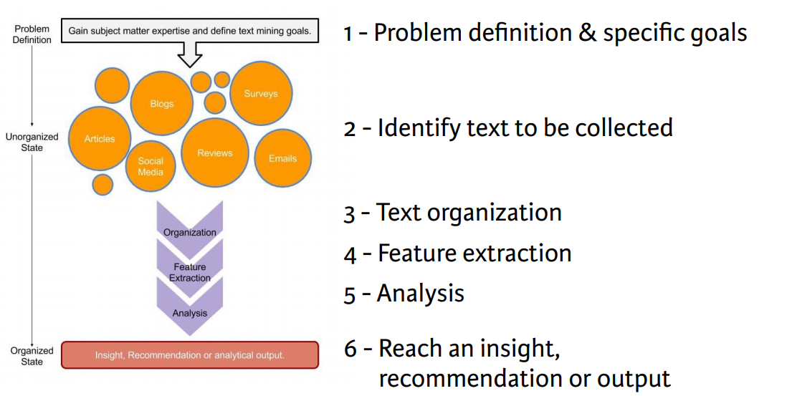

Text Mining in R
***
Notes taken during/inspired by the Datacamp course 'Text Mining: Bag of Words' by Ted Kwartler. 

Course slides:
* [Part 1 - Jumping into text mining with bag of words]()
* [Part 2 - Word clouds and more interesting visuals]()
* [Part 3 - Addining to your skills]()
* [Part 4 - Case Study]()
* [Additional - Dendextend package](https://cran.r-project.org/web/packages/dendextend/vignettes/introduction.html)
* [Additional - R Colours](http://www.stat.columbia.edu/~tzheng/files/Rcolor.pdf)

## Text Mining Intro

Ted mkaes the definition of Text Mining as 'The process of distilling actionable insights from text'.  We can use Text Mining to reduce the information space in to something more manageable and draw out the important features.  The steps we take are:

* 1 - Problem definition and goals
* 2 - Identify text to be collected
* 3 - Text organisation
* 4 - Feature extraction
* 5 - Aanlysis
* 6 - Reach and insight or make a reccomendation

In this course we look at the bag of words approach, we don't care about word type or order.  The alternative is semantic parsing, which does and looks at word type breaks the elements in to nouns and verb elements, but results in many features for analysis.  

Sometimes we can find out the author's intent and main ideas just by looking at the most common words.

At its heart, bag of words text mining represents a way to count terms, or n-grams, across a collection of documents. 

Manually counting words in the sentences is a pain! Fortunately, the qdap package offers a better alternative. You can easily find the top 4 most frequent terms (including ties) in text by calling the freq_terms function and specifying 4.

> frequent_terms <- freq_terms(text, 4)

The frequent_terms object stores all unique words and their count. You can then make a bar chart simply by calling the plot function on the frequent_terms object.

> plot(frequent_terms)

```{r}
new_text <- "DataCamp is the first online learning platform that focuses on building the best learning experience specifically for Data Science. We have offices in Boston and Belgium and to date, we trained over 250,000 (aspiring) data scientists in over 150 countries. These data science enthusiasts completed more than 9 million exercises. You can take free beginner courses, or subscribe for $25/month to get access to all premium courses."

# Load qdap
library(qdap)

# Print new_text to the console
new_text

# Find the 10 most frequent terms: term_count
term_count <- freq_terms(new_text, 10)

# Plot term_count
plot(term_count)
```

Next we are going to build our first corpus of text using tweets.  A corpus is a collection of documents, specifying it as a text source for the tm package.  

Text mining begins with loading some text data into R, which we'll do with the read.csv() function. By default, read.csv() treats character strings as factor levels like Male/Female. To prevent this from happening, it's very important to use the argument stringsAsFactors = FALSE.

Best practice is to examine the object you read in to make sure you know which column(s) are important. The str() function provides an efficient way of doing this. You can also count the number of documents using the nrow() function on the new object. In this example, it will tell you how many coffee tweets are in the vector.

If the data frame contains columns that are not text, you may want to make a new object using only the correct column of text (e.g. some_object$column_name).

```{r}
# Import text data
tweets <-  read.csv("D:/CloudStation/Documents/2017/RData/coffee.csv", stringsAsFactors = FALSE) 

# View the structure of tweets
str(tweets)

# Print out the number of rows in tweets
nrow(tweets)

# Isolate text from tweets: coffee_tweets
coffee_tweets <- tweets$text
```

Your next step is to convert this vector containing the text data to a corpus, a corpus is a collection of documents, but it's also important to know that in the tm domain, R recognizes it as a data type.

There are two kinds of the corpus data type, the permanent corpus, PCorpus, and the volatile corpus, VCorpus. In essence, the difference between the two has to do with how the collection of documents is stored in your computer. In this course, we will use the volatile corpus, which is held in your computer's RAM rather than saved to disk, just to be more memory efficient.

To make a volatile corpus, R needs to interpret each element in our vector of text, coffee_tweets, as a document. And the tm package provides what are called Source functions to do just that! In this exercise, we'll use a Source function called VectorSource() because our text data is contained in a vector. The output of this function is called a Source object.

```{r}
# Load tm
library(tm)

# Make a vector source: coffee_source
coffee_source <- VectorSource(coffee_tweets)
```

Now that we've converted our vector to a Source object, we pass it to another tm function, VCorpus(), to create our volatile corpus. 

The VCorpus object is a nested list, or list of lists. At each index of the VCorpus object, there is a PlainTextDocument object, which is essentially a list that contains the actual text data (content), as well as some corresponding metadata (meta). It can help to visualize a VCorpus object to conceptualize the whole thing.

For example, to examine the contents of the second tweet in coffee_corpus, you'd subset twice. Once to specify the second PlainTextDocument corresponding to the second tweet and again to extract the first (or content) element of that PlainTextDocument:

> coffee_corpus[[15]][1]

```{r}
# Make a volatile corpus: coffee_corpus
coffee_corpus <- VCorpus(coffee_source)

# Print out coffee_corpus
coffee_corpus

# Print data on the 15th tweet in coffee_corpus
coffee_corpus[[15]]

# Print the content of the 15th tweet in coffee_corpus
coffee_corpus[[15]]$content
```

Because another common text source is a data frame, there is a Source function called DataframeSource(). The DataframeSource() function treats the entire row as a complete document, so be careful you don't pick up non-text data like customer IDs when sourcing a document this way.

```{r}
# Setup the example text
num <- 1:3
Author1 <- c("Text mining is a great time.","Text analysis provides insights" , "qdap and tm are used in text mining")
Author2 <- c("R is a great language" , "R has many uses" , "DataCamp is cool!")
example_text <- cbind(num, Author1, Author2)
example_text <- as.data.frame(example_text, stringsAsFactors = FALSE)

# Print example_text to the console
example_text

# Create a DataframeSource on columns 2 and 3: df_source
df_source <- DataframeSource(example_text[, 2:3])

# Convert df_source to a corpus: df_corpus
df_corpus <- VCorpus(df_source)

# Examine df_corpus
df_corpus

# Create a VectorSource on column 3: vec_source
vec_source <- VectorSource(example_text$Author2)

# Convert vec_source to a corpus: vec_corpus
vec_corpus <- VCorpus(vec_source)

# Examine vec_corpus
vec_corpus

```

### Cleaning and Preprocessing Text

There are a number of functions within R that can help process text, including tolower(), removePunctuation(), removeNumbers(), stripWhiteSpace() and removeWords() - however it is important to note and consider that some of these elements might convey meaning, so removing them can strip some of that meaning out.  

In bag of words text mining, cleaning helps aggregate terms. For example, it may make sense that the words "miner", "mining" and "mine" should be considered one term. Specific preprocessing steps will vary based on the project. For example, the words used in tweets are vastly different than those used in legal documents, so the cleaning process can also be quite different.

Common preprocessing functions include:

* tolower(): Make all characters lowercase
* removePunctuation(): Remove all punctuation marks
* removeNumbers(): Remove numbers
* stripWhitespace(): Remove excess whitespace

Note that tolower() is part of base R, while the other three functions come from the tm package. Going forward, we'll load the tm and qdap for you when they are needed. Every time we introduce a new package, we'll have you load it the first time.

```{r}
# Create the object: text
text <- "<b>She</b> woke up at       6 A.M. It\'s so early!  She was only 10% awake and began drinking coffee in front of her computer."

# All lowercase
tolower(text)

# Remove punctuation
removePunctuation(text)

# Remove numbers
removeNumbers(text)

# Remove whitespace
stripWhitespace(text)
```

The qdap package offers other text cleaning functions. Each is useful in its own way and is particularly powerful when combined with the others.

* bracketX(): Remove all text within brackets (e.g. "It's (so) cool" becomes "It's cool")
* replace_number(): Replace numbers with their word equivalents (e.g. "2" becomes "two")
* replace_abbreviation(): Replace abbreviations with their full text equivalents (e.g. "Sr" becomes "Senior")
* replace_contraction(): Convert contractions back to their base words (e.g. "shouldn't" becomes "should not")
* replace_symbol() Replace common symbols with their word equivalents (e.g. "$" becomes "dollar")

```{r}
## text is still loaded in your workspace

# Remove text within brackets
bracketX(text)

# Replace numbers with words
replace_number(text)

# Replace abbreviations
replace_abbreviation(text)

# Replace contractions
replace_contraction(text)

# Replace symbols with words
replace_symbol(text)
```

Often there are words that are frequent but provide little information. So you may want to remove these so-called stop words. Some common English stop words include "I", "she'll", "the", etc. In the tm package, there are 174 stop words on this common list.

In fact, when you are doing an analysis you will likely need to add to this list. In our coffee tweet example, all tweets contain "coffee", so it's important to pull out that word in addition to the common stop words. Leaving it in doesn't add any insight and will cause it to be overemphasized in a frequency analysis.

Using the c() function allows you to add new words (separated by commas) to the stop words list. For example, the following would add "word1" and "word2" to the default list of English stop words:

> all_stops <- c("word1", "word2", stopwords("en"))

Once you have a list of stop words that makes sense, you will use the removeWords() function on your text. removeWords() takes two arguments: the text object to which it's being applied and the list of words to remove.

```{r}
# List standard English stop words
stopwords("en")

# Print text without standard stop words
removeWords(text, stopwords('en'))

# Add "coffee" and "bean" to the list: new_stops
new_stops <- c("coffee", "bean", stopwords("en"))

# Remove stop words from text
removeWords(text, new_stops)
```

Still another useful preprocessing step involves word stemming and stem completion. The tm package provides the stemDocument() function to get to a word's root. This function either takes in a character vector and returns a character vector, or takes in a PlainTextDocument and returns a PlainTextDocument.

For example,

> stemDocument(c("computational", "computers", "computation"))

returns "comput" "comput" "comput". But because "comput" isn't a real word, we want to re-complete the words so that "computational", "computers", and "computation" all refer to the same word, say "computer", in our ongoing analysis.

We can easily do this with the stemCompletion() function, which takes in a character vector and an argument for the completion dictionary. The completion dictionary can be a character vector or a Corpus object. Either way, the completion dictionary for our example would need to contain the word "computer" for all the words to refer to it.

```{r}
# Create complicate
complicate <- c("complicated", "complication", "complicatedly")

# Perform word stemming: stem_doc
stem_doc <- stemDocument(complicate)

# Create the completion dictionary: comp_dict
comp_dict <- "complicate"

# Perform stem completion: complete_text 
complete_text <- stemCompletion(stem_doc, comp_dict)

# Print complete_text
complete_text
```

Let's consider the following sentence as our document for this exercise:

> "In a complicated haste, Tom rushed to fix a new complication, too complicatedly."

This sentence contains the same three forms of the word "complicate" that we saw in the previous exercise. The difference here is that even if you called stemDocument() on this sentence, it would return the sentence without stemming any words. 

This happens because stemDocument() treats the whole sentence as one word. In other words, our document is a character vector of length 1, instead of length n, where n is the number of words in the document. To solve this problem, we first remove the punctation marks with the removePunctuation(). We then strsplit() this character vector of length 1 to length n, unlist(), then proceed to stem and re-complete.

```{r}
text_data <- "In a complicated haste, Tom rushed to fix a new complication, too complicatedly."

# Remove punctuation: rm_punc
rm_punc <- removePunctuation(text_data)

# Create character vector: n_char_vec
n_char_vec <- unlist(strsplit(rm_punc, split = ' '))

# Perform word stemming: stem_doc
stem_doc <- stemDocument(n_char_vec)

# Print stem_doc
stem_doc

# Re-complete stemmed document: complete_doc
complete_doc <- stemCompletion(stem_doc, comp_dict) 

# Print complete_doc
complete_doc
```

The tm package provides a special function tm_map() to apply cleaning functions to a corpus. Mapping these functions to an entire corpus makes scaling the cleaning steps very easy.

To save time (and lines of code) it's a good idea to use a custom function, since you may be applying the same functions over multiple corpora. Here we use the clean_corpus() function. It takes one argument, corpus, and applies a series of cleaning functions to it in order, then returns the final result.

Notice how the tm package functions do not need content_transformer(), but base R and qdap functions do.

Be sure to test your function's results. If you want to draw out currency amounts, then removeNumbers() shouldn't be used. Plus, the order of cleaning steps makes a difference. For example, if you removeNumbers() and then replace_number(), the second function won't find anything to change.

```{r}
# Alter the function code to match the instructions
clean_corpus <- function(corpus){
  corpus <- tm_map(corpus, stripWhitespace)
  corpus <- tm_map(corpus, removePunctuation)
  corpus <- tm_map(corpus, content_transformer(tolower))
  corpus <- tm_map(corpus, removeWords, c(stopwords("en"), "coffee", "mug"))
  return(corpus)
}

# Apply your customized function to the tweet_corp: clean_corp
clean_corp <- clean_corpus(coffee_corpus)

# Print out a cleaned up tweet
clean_corp[[227]][1]

# Print out the same tweet in original form
tweets$text[227]
```

In bag of words analysis, either we have a Term Document Matrix (TDM) or a Document Term Matrix (DTM).  One is a transposition of the other, 

* TDM - rows are terms/words, columns are tweets/documents
* DTM - rows are tweets/documents, columns are terms/words

Let's revisit the coffee tweets to build a document-term matrix.

Beginning with the coffee.csv file, we have used common transformations to produce a clean corpus called clean_corp.

The document-term matrix is used when you want to have each document represented as a row. This can be useful if you are comparing authors within rows, or the data is arranged chronologically and you want to preserve the time series.

```{r}
# Create the dtm from the corpus: coffee_dtm
coffee_dtm <- DocumentTermMatrix(clean_corp)

# Print out coffee_dtm data
coffee_dtm

# Convert coffee_dtm to a matrix: coffee_m
coffee_m <- as.matrix(coffee_dtm) 

# Print the dimensions of coffee_m
dim(coffee_m)

# Review a portion of the matrix
coffee_m[148:150, 2587:2590]
```

Next we are performing a similar process but taking the transpose of the document-term matrix. In this case, the term-document matrix has terms in the first column and documents across the top as individual column names.

The TDM is often the matrix used for language analysis. This is because you likely have more terms than authors or documents and life is generally easier when you have more rows than columns. An easy way to start analyzing the information is to change the matrix into a simple matrix using as.matrix() on the TDM.

```{r}
# Create a TDM from clean_corp: coffee_tdm
coffee_tdm <- TermDocumentMatrix(clean_corp)

# Print coffee_tdm data
coffee_tdm

# Convert coffee_tdm to a matrix: coffee_m
coffee_m <- as.matrix(coffee_tdm)

# Print the dimensions of the matrix
dim(coffee_m)

# Review a portion of the matrix
coffee_m[2587:2590, 148:150]
```

## Word Clouds and other visuals

Visual information is quickly processed so using visuals helps.  Here we are going to look at two corpora - one for coffee tweets and the other for chardonnay tweets.  

Calling rowSums() on your newly made matrix aggregates all the terms used in a passage. Once you have the rowSums(), you can sort() them with decreasing = TRUE, so you can focus on the most common terms.

Lastly, you can make a barplot() of the top 5 terms of term_frequency with the following code.

> barplot(term_frequency[1:5], col = "#C0DE25")

```{r}
# Create a matrix: coffee_m
coffee_m <- as.matrix(coffee_tdm)

# Calculate the rowSums: term_frequency
term_frequency <- rowSums(coffee_m) 

# Sort term_frequency in descending order
term_frequency <- sort(term_frequency,
 decreasing = TRUE) 

# View the top 10 most common words
term_frequency[1:10]

# Plot a barchart of the 10 most common words
barplot(term_frequency[1:10],
 col = "tan", las = 2)
```

A fast way to get frequent terms is with freq_terms() from qdap, although you loose some control.  The function accepts a text variable, which in our case is the tweets$text vector. You can specify the top number of terms to show with the top argument, a vector of stop words to remove with the stopwords argument, and the minimum character length of a word to be included with the at.least argument. qdap has its own list of stop words that differ from those in tm. Our exercise will show you how to use either and compare their results.

Making a basic plot of the results is easy. Just call plot() on the freq_terms() object.

Note that using different lists of stop words can produce different results, as shown here.

```{r}
# Create frequency
frequency <- freq_terms(
 tweets$text,
 top = 10,
 at.least = 3,
 stopwords = "Top200Words"
 ) 

# Make a frequency barchart
plot(frequency)

# Create frequency2
frequency2 <- freq_terms(
 tweets$text,
 top = 10,
 at.least = 3,
 stopwords = tm::stopwords("english")
 ) 

# Make a frequency2 barchart
plot(frequency2)
```

### Word Clouds

n celebration of making it this far, let's try our hand on another batch of 1000 tweets. For now, you won't know what they have in common, but let's see if you can figure it out using a word cloud. The tweets' term-document matrix, matrix, and frequency values are preloaded in your workspace.

A word cloud is a visualization of terms. In a word cloud, size is often scaled to frequency and in some cases the colors may indicate another measurement. For now, we're keeping it simple: size is related to individual word frequency and we are just selecting a single color.

As you saw in the video, the wordcloud() function works like this:

> wordcloud(words, frequencies, max.words = 500, colors = "blue")

Text mining analyses often include simple word clouds. In fact, they are probably over used, but can still be useful for quickly understanding a body of text.

```{r}
# Load the data
tweets2 <-  read.csv("D:/CloudStation/Documents/2017/RData/chardonnay.csv", stringsAsFactors = FALSE) 

# Isolate text from tweets: chard_tweets
chard_tweets <- tweets2$text

# Make a vector source: coffee_source
chard_source <- VectorSource(chard_tweets)

# Make a volatile corpus: coffee_corpus
chard_corpus <- VCorpus(chard_source)

# Alter the function code to match the instructions
clean_corpus <- function(corpus){
  corpus <- tm_map(corpus, stripWhitespace)
  corpus <- tm_map(corpus, removePunctuation)
  corpus <- tm_map(corpus, content_transformer(tolower))
  corpus <- tm_map(corpus, removeWords, c(stopwords("en"),  "amp",
 "chardonnay", "wine", "glass"))
  return(corpus)
}

# Apply your customized function to the tweet_corp: clean_chardonnay
clean_chardonnay <- clean_corpus(chard_corpus)

# Create a TDM from clean_corp: chardonnay_tdm
chardonnay_tdm <- TermDocumentMatrix(clean_chardonnay)

# Create a matrix: chardonnay_m
chardonnay_m <- as.matrix(chardonnay_tdm)

# Sum rows and sort by frequency
term_frequency <- rowSums(chardonnay_m)
word_freqs <- data.frame(term = names(term_frequency),
 num = term_frequency)

# Load wordcloud package
library(wordcloud)

# Print the first 10 entries in term_frequency
term_frequency[1:10]

# Create word_freqs
word_freqs <- data.frame(
  term = names(term_frequency),
  num = term_frequency
)

# Create a wordcloud for the values in word_freqs
wordcloud(
  word_freqs$term, 
  word_freqs$num,
  max.words = 100, 
  colors = "red")
```

We can also use custom R colours for our word clouds.

```{r}
# Print the list of colors
head(colors())

# Print the wordcloud with the specified colors
wordcloud(
  word_freqs$term, 
  word_freqs$num, 
  max.words = 100, 
  colors = c("cornflowerblue", "darkgoldenrod1", "tomato"))
```

You can use the RColorBrewer package to help. RColorBrewer color schemes are organized into three categories:

* Sequential: Colors ascend from light to dark in sequence
* Qualitative: Colors are chosen for their pleasing qualities together
* Diverging: Colors have two distinct color spectra with lighter colors in between

To change the colors parameter of the wordcloud() function you can use a select a palette from RColorBrewer such as "Greens". The function display.brewer.all() will list all predefined color palettes. More information on ColorBrewer (the framework behind RColorBrewer) is available on its [website](http://colorbrewer2.org).

The function brewer.pal() allows you to select colors from a palette. Specify the number of distinct colors needed (e.g. 8) and the predefined palette to select from (e.g. "Greens"). Often in word clouds, very faint colors are washed out so it may make sense to remove the first couple from a brewer.pal() selection, leaving only the darkest.

Here's an example:

> green_pal <- brewer.pal(8, "Greens")
> green_pal <- green_pal[-(1:2)]

Then just add that object to the wordcloud() function.

> wordcloud(chardonnay_freqs$term, chardonnay_freqs$num, max.words = 100, colors = green_pal)

```{r}
# List the available colors
display.brewer.all()

# Create purple_orange
purple_orange <- brewer.pal(10, "PuOr")

# Drop 2 faintest colors
purple_orange <- purple_orange[-(1:2)]

# Create a wordcloud with purple_orange palette
wordcloud(
  word_freqs$term, 
  word_freqs$num, 
  max.words = 100, 
  colors = purple_orange)
```

### Other word clouds and word networks

If we want to combine multiple corpora in to a single corpus - the intersection in a commonality cloud - we first use paste and collapse on each document group.  WE then run this corpus through the commonality cloud function.

Altenrtiavely we might be interested in words which are different, to do so we use a comparison cloud - we first to the same as before, paste and collapse the documents.  Then we add colnames() to the tdm, then run comparison.cloud().

We could create a pyramid plot.  The process is the same as before - paste, collapse and combine c() our corpora.  However, for pyramid plots we use subsetting to identify what each document shares.  Finally we could create a word network.  

Say you want to visualize common words across multiple documents. You can do this with commonality.cloud().

Each of our coffee and chardonnay corpora is composed of many individual tweets. To treat the coffee tweets as a single document and likewise for chardonnay, you paste() together all the tweets in each corpus along with the parameter collapse = " ". This collapses all tweets (separated by a space) into a single vector. Then you can create a vector containing the two collapsed documents.

> all_coffee <- paste(coffee$tweets, collapse = " ")
> all_chardonnay <- paste(chardonnay$tweets, collapse = " ")
> all_tweets <- c(all_coffee, all_chardonnay)

Once you're done with these steps, you can take the same approach you've seen before to create a VCorpus() based on a VectorSource from the all_tweets object.

```{r}
# Import text data
coffee_tweets <-  read.csv("D:/CloudStation/Documents/2017/RData/coffee.csv", stringsAsFactors = FALSE) 
chardonnay_tweets <-  read.csv("D:/CloudStation/Documents/2017/RData/chardonnay.csv", stringsAsFactors = FALSE) 

# Create all_coffee
all_coffee <- paste(coffee_tweets$text, collapse = " ")

# Create all_chardonnay
all_chardonnay <- paste(chardonnay_tweets$text, collapse = " ")

# Create all_tweets
all_tweets <- c(all_coffee, all_chardonnay)

# Convert to a vector source
all_tweets <- VectorSource(all_tweets)

# Create all_corpus
all_corpus <- VCorpus(all_tweets)
```

Now we have a corpus filled with words used in both the chardonnay and coffee tweets files, you can clean the corpus, convert it into a TermDocumentMatrix, and then a matrix to prepare it for a commonality.cloud()

The commonality.cloud() function accepts this matrix object, plus additional arguments like max.words and colors to further customize the plot.

> commonality.cloud(tdm_matrix, max.words = 100, colors = "springgreen")

```{r}

# Add new stop words to clean_corpus()
clean_corpus <- function(corpus){
  corpus <- tm_map(corpus, removePunctuation)
  corpus <- tm_map(corpus, stripWhitespace)
  corpus <- tm_map(corpus, removeNumbers)
  corpus <- tm_map(corpus, content_transformer(tolower))
  corpus <- tm_map(corpus, removeWords, 
    c(stopwords("en"), "amp", "chardonnay", "wine", "glass", "coffee"))
  return(corpus)
}

# Clean the corpus
all_clean <- clean_corpus(all_corpus)

# Create all_tdm
all_tdm <- TermDocumentMatrix(all_clean)

# Create all_m
all_m <- as.matrix(all_tdm)

# Print a commonality cloud
commonality.cloud(
  all_m,
  max.words = 100,
  colors = "steelblue1")
```

Next, if you want to visualize the words not in common you can also use comparison.cloud() and the steps are quite similar with one main difference.

Like searching for words in common, you start by unifying the tweets into distinct corpora and combining them into their own VCorpus() object. Next apply a clean_corpus() function and organize it into a TermDocumentMatrix.

To keep track of what words belong to coffee versus chardonnay, you can set the column names of the TDM like this:

> colnames(all_tdm) <- c("chardonnay", "coffee")

Lastly, convert the object to a matrix using as.matrix() for use in comparison.cloud(). For every distinct corpora passed to the comparison.cloud() you can specify a color as in colors = c("red", "yellow", "green") to make the sections distinguishable.

```{r}
# Clean the corpus
all_clean <- clean_corpus(all_corpus)

# Create all_tdm
all_tdm <- TermDocumentMatrix(all_clean)

# Give the columns distinct names
colnames(all_tdm) <- c("coffee", "chardonnay")

# Create all_m
all_m <- as.matrix(all_tdm)

# Create comparison cloud
comparison.cloud(
  all_m,
  max.words = 50,
  colors = c("orange", "blue"))
```

A commonality.cloud() may be misleading since words could be represented disproportionately in one corpus or the other, even if they are shared. In the commonality cloud, they would show up without telling you which one of the corpora has more term occurrences. To solve this problem, we can create a pyramid.plot() from the plotrix package.

Building on what you already know, we have created a simple matrix from the coffee and chardonnay tweets using all_tdm_m <- as.matrix(all_tdm). Recall that this matrix contains two columns: one for term frequency in the chardonnay corpus, and another for term frequency in the coffee corpus. So we can use the subset() function in the following way to get terms that appear one or more times in both corpora:

> same_words <- subset(all_tdm_m, all_tdm_m[, 1] > 0 & all_tdm_m[, 2] > 0)

Once you have the terms that are common to both corpora, you can create a new column in same_words that contains the absolute difference between how often each term is used in each corpus.

To identify the words that differ the most between documents, we must order() the rows of same_words by the absolute difference column with decreasing = TRUE like this:

> same_words <- same_words[order(same_words[, 3], decreasing = TRUE), ]

Now that same_words is ordered by the absolute difference, let's create a small data.frame() of the 20 top terms so we can pass that along to pyramid.plot():

> top_words <- data.frame(
  x = same_words[1:20, 1],
  y = same_words[1:20, 2],
  labels = rownames(same_words[1:20, ])
)

Note that top_words contains columns x and y for the frequency of the top words for each of the documents, and a third column, labels, that contains the words themselves.

Finally, you can create your pyramid.plot() and get a better feel for how the word usages differ by topic!

> pyramid.plot(top_words$x, top_words$y,
             labels = top_words$labels, gap = 8,
             top.labels = c("Chardonnay", "Words", "Coffee"),
             main = "Words in Common", laxlab = NULL, 
             raxlab = NULL, unit = NULL)
             
```{r}
# Create the simple matrix
all_tdm_m <- as.matrix(all_tdm)

# Create common_words
common_words <- subset(all_tdm_m, all_tdm_m[, 1] > 0 & all_tdm_m[, 2] > 0)

# Create difference
difference <- abs(common_words[, 1] - common_words[, 2])

# Combine common_words and difference
common_words <- cbind(common_words, difference)

# Order the data frame from most differences to least
common_words <- common_words[order(common_words[, 3], decreasing = T), ]

# Create top25_df
top25_df <- data.frame(x = common_words[1:25, 1],
                       y = common_words[1:25, 2],
                       labels = rownames(common_words[1:25, ]))

# Load the pyramid library
library(plotrix)

# Create the pyramid plot
pyramid.plot(top25_df$x, top25_df$y,
             labels = top25_df$labels, gap = 8,
             top.labels = c("Chardonnay", "Words", "Coffee"),
             main = "Words in Common", laxlab = NULL, 
             raxlab = NULL, unit = NULL)
```

Another way to view word connections is to treat them as a network, similar to a social network. Word networks show term association and cohesion. A word of caution: these visuals can become very dense and hard to interpret visually.

In a network graph, the circles are called nodes and represent individual terms, while the lines connecting the circles are called edges and represent the connections between the terms.

Qdap provides a shorcut for making word networks. The word_network_plot() and word_associate() functions both make word networks easy.

```{r}
# Word association
word_associate(coffee_tweets$text, match.string = c("barista"), 
               stopwords = c(Top200Words, "coffee", "amp"), 
               network.plot = TRUE, cloud.colors = c("gray85", "darkred"))

# Add title
title(main = "Barista Coffee Tweet Associations")
```

## More text minig skills

One way we can visualse similarity and group items together is by using a hierarchical clustering method, which we can visualse using a dendogram.  We can use the dendextend package to give us more control over the dendograms.  Using this package we can colour specific branches of the dendogram.

A simple way to do word cluster analysis is with a dendrogram on your term-document matrix. Once you have a TDM, you can call dist() to compute the differences between each row of the matrix.

Next, you call hclust() to perform cluster analysis on the dissimilarities of the distance matrix. Lastly, you can visualize the word frequency distances using a dendrogram and plot(). Often in text mining, you can tease out some interesting insights or word clusters based on a dendrogram.

Consider the table of annual rainfall below. Cleveland and Portland have the same amount of rainfall, so their distance is 0. You might expect the two cities to be a cluster and for New Orleans to be on its own since it gets vastly more rain.

Table: (\#tab:simple-table) City Rainfall

City        Rainfall
___________ _____     
  Cleveland 39.14
   Portland 39.14
     Boston 43.77
New Orleans 62.45

```{r}
# Create the datarame
rain <- data.frame(city = factor(c("Cleveland", "Portland", "Boston", "New Orleans")),
                  rainfall = as.numeric(c(39.14, 39.14, 43.77, 62.45)))
              
# Create dist_rain
dist_rain <- dist(rain$rainfall)

# View the distance matrix
dist_rain

# Create hc
hc <- hclust(dist_rain)

# Plot hc
plot(hc, labels = rain$city)
```

Next we can apply them to text. But first, you have to limit the number of words in your TDM using removeSparseTerms() from tm. 

TDMs and DTMs are sparse, meaning they contain mostly zeros. Remember that 1000 tweets can become a TDM with over 3000 terms. You won't be able to easily interpret a dendrogram that is so cluttered, especially if you are working on more text.

A good TDM has between 25 and 70 terms. The lower the sparse value, the more terms are kept. The closer it is to 1, the fewer are kept. This value is a percentage cutoff of zeros for each term in the TDM and is defined using the sparse = element within the removeSparseTerms() command.

```{r}
# Create tweets_tdm from chardonnay tweets tdm
tweets_tdm <- chardonnay_tdm

# Print the dimensions of tweets_tdm
dim(tweets_tdm)

# Create tdm1
tdm1 <- removeSparseTerms(tweets_tdm, sparse = 0.95)

# Create tdm2
tdm2 <- removeSparseTerms(tweets_tdm, sparse = 0.975)

# Print tdm1
tdm1

# Print tdm2
tdm2
```

Now we can make a text-based dendrogram. Dendrograms reduce information to help you make sense of the data. This is much like how an average tells you something, but not everything, about a population. Both can be misleading. With text, there are often a lot of nonsensical clusters, but some valuable clusters may also appear.

A peculiarity of TDM and DTM objects is that you have to convert them first to matrices (with as.matrix()), then to data frames (with as.data.frame()), before using them with the dist() function.

```{r}
# Create tweets_tdm2
tweets_tdm2 <- removeSparseTerms(tweets_tdm, sparse = 0.975)

# Create tdm_m
tdm_m <- as.matrix(tweets_tdm2)

# Create tdm_df
tdm_df <- as.data.frame(tdm_m)

# Create tweets_dist
tweets_dist <- dist(tdm_df)

# Create hc
hc <- hclust(tweets_dist)

# Plot the dendrogram
plot(hc)
```

The dendextend package can help your audience by coloring branches and outlining clusters. dendextend is designed to operate on dendrogram objects, so you'll have to change the hierarchical cluster from hclust using as.dendrogram().

A good way to review the terms in your dendrogram is with the labels() function. It will print all terms of the dendrogram. To highlight specific branches, use branches_attr_by_labels(). First, pass in the dendrogram object, then a vector of terms as in c("data", "camp"). Lastly add a color such as "blue".

After you make your plot, you can call out clusters with rect.dendrogram(). This adds rectangles for each cluster. The first argument to rect.dendrogram() is the dendrogram, followed by the number of clusters (k). You can also pass a border argument specifying what color you want the rectangles to be (e.g. "green").

```{r}
# Load dendextend
library(dendextend)

# Create hc
hc <- hclust(tweets_dist)

# Create hcd
hcd <- as.dendrogram(hc)

# Print the labels in hcd
labels(hcd)

# Change the branch color to red for "marvin" and "gaye"
hcd <- branches_attr_by_labels(hcd, c("marvin", "gaye"), color = "red")

# Plot hcd
plot(hcd, main = "Better Dendrogram")

# Add cluster rectangles 
rect.dendrogram(hcd, k = 2, border = "grey50")
```

Another way to think about word relationships is with the findAssocs() function in the tm package. For any given word, findAssocs() calculates its correlation with every other word in a TDM or DTM. Scores range from 0 to 1. A score of 1 means that two words always appear together, while a score of 0 means that they never appear together.

To use findAssocs() pass in a TDM or DTM, the search term, and a minimum correlation. The function will return a list of all other terms that meet or exceed the minimum threshold.

> findAssocs(tdm, "word", 0.25)

Minimum correlation values are often relatively low because of word diversity. Don't be surprised if 0.10 demonstrates a strong pairwise term association.

```{r}
# Create associations
associations <- findAssocs(tweets_tdm, "venti", 0.2)

# View the venti associations
associations

# Create associations_df
associations_df <- list_vect2df(associations)[, 2:3]

# Plot the associations_df values (don't change this)
ggplot(associations_df, aes(y = associations_df[, 1])) + 
  geom_point(aes(x = associations_df[, 2]), 
             data = associations_df, size = 3) + 
  theme_gdocs()
```

The context of words is often important, for instance the words and not and good individually have a different context to not good.  We can therefore look to increase the 'tokenisation' of our words, which increases the size of the dtm and tdm.  The default is to make tdm and dtms with unigrams, but you can also focus on tokens containing two or more words. This can help extract useful phrases which lead to some additional insights or provide improved predictive attributes for a machine learning algorithm.

The function below uses the RWeka package to create trigram (three word) tokens: min and max are both set to 3.

> tokenizer <- function(x) 
    NGramTokenizer(x, Weka_control(min = 3, max = 3))

Then the customized tokenizer() function can be passed into the TermDocumentMatrix or DocumentTermMatrix functions as an additional parameter:

> tdm <- TermDocumentMatrix(
    corpus, 
    control = list(tokenize = tokenizer)
  )
  
```{r, eval = F}
library(RWeka)

# Make tokenizer function 
tokenizer <- function(x) 
  NGramTokenizer(x, Weka_control(min = 2, max = 2))

# Create unigram_dtm
unigram_dtm <- DocumentTermMatrix(text_corp)

# Create bigram_dtm
bigram_dtm <- DocumentTermMatrix(
  text_corp,
  control = list(tokenize = tokenizer))

# Examine unigram_dtm
unigram_dtm

# Examine bigram_dtm
bigram_dtm

```
  
Now we have a bigram DTM, we can examine it and remake a word cloud. The new tokenization method affects not only the matrices, but also any visuals or modeling based on the matrices.


```{r}
# Create bigram_dtm_m
bigram_dtm_m <- as.matrix(bigram_dtm)

# Create freq
freq <- colSums(bigram_dtm_m)

# Create bi_words
bi_words <- names(freq)

# Examine part of bi_words
bi_words[2577:2587]

# Plot a wordcloud
wordcloud(bi_words, freq, max.words = 15)
```

We can also do more useful approaches, such as penalising words that appear in many documents.  If such words appear in most documents, the idea is that they must convey little informational value.  This is the tfIdf which stands for term frequency-inverse document frequency.

If a term appears often it must be important. This attribute is represented by term frequency (i.e. Tf), which is normalized by the length of the document. However, if the term appears in all documents, it is not likely to be insightful. This is captured in the inverse document frequency (i.e. Idf).

The [wiki page](https://en.wikipedia.org/wiki/Tf%E2%80%93idf) on TfIdf contains the mathematical explanation behind the score, but this code will demonstrate the practical difference.

```{r}

# Import text data
tweets <-  read.csv("D:/CloudStation/Documents/2017/RData/coffee.csv", stringsAsFactors = FALSE) 

# Isolate text from tweets: coffee_tweets
coffee_tweets <- tweets$text

# Make a vector source: coffee_source
coffee_source <- VectorSource(coffee_tweets)

# Make a volatile corpus: coffee_corpus
coffee_corpus <- VCorpus(coffee_source)

# Clean the Corpuse
clean_corpus <- function(corpus){
  corpus <- tm_map(corpus, stripWhitespace)
  corpus <- tm_map(corpus, removePunctuation)
  corpus <- tm_map(corpus, content_transformer(tolower))
  corpus <- tm_map(corpus, removeWords, c(stopwords("en")))
  return(corpus)
}
coffee_clean_corpus <- clean_corpus(coffee_corpus)

# Create tdm and matrix with normal weighting
tf_tdm <- TermDocumentMatrix(coffee_clean_corpus)
tf_tdm_m <- as.matrix(tf_tdm)
tf_tdm_m[510:520, 5:10]

# Create tdm and matrix with tf-idf weighting
tf_idf_tdm <- TermDocumentMatrix(
  coffee_clean_corpus, 
  control = list(weighting = weightTfIdf)
  )
tf_idf_tdm_m <- as.matrix(tf_idf_tdm)
tf_idf_tdm_m[510:520, 5:10]
```

Coffee is now a much lower weight.

Depending on what you are trying to accomplish, you may want to keep metadata about the document when you create a TDM or DTM. This metadata can be incorporated into the corpus fairly easily by creating a readerControl list and applying it to a DataframeSource when calling VCorpus().

You will need to know the column names of the data frame containing the metadata to be captured. The names() function is helpful for this.

To capture the text column of the coffee tweets text along with a metadata column of unique numbers called num you would use the code below.

>custom_reader <- readTabular(
  mapping = list(content = "text", id = "num")
)
text_corpus <- VCorpus(
  DataframeSource(tweets), 
  readerControl = list(reader = custom_reader)
)

```{r}
# Add author to custom reading list
custom_reader <- readTabular(mapping = list(content = "text", 
                                            id = "num",
                                            author = "screenName",
                                            date = "created"
                                            ))

# Make corpus with custom reading
text_corpus <- text_corpus <- VCorpus(DataframeSource(tweets),
  readerControl = list(reader = custom_reader))

# Clean corpus
text_corpus <- clean_corpus(text_corpus)

# Print data
text_corpus[[1]][1]

# Print metadata
text_corpus[[1]][2]
```

## 

We have a typical Text Mining workflow as shown below

```{r TMWorkflow, echo = FALSE, fig.cap='Workflow outline'}

```

Now we are going to look at this process but trying to understand how external people may understand your company compared to another company - in this case Amazon vs Google based on emloyer reviews.  Our problem, as defined by the workflow, becomes:

* 1 - Does Amazon or Gloogle have better work life balance?  And which has better perceived pay according to online reviews?
* 2 - Identify the sources - this has already been done and provided as text corpora, there are 2,000 online reviews in total.  There are positive and negative sets for both Amazon and Google.

```{r TMWorkflow, echo = FALSE, fig.cap='Workflow outline'}

```

First, lets setup our data for analysis.

```{r}
# Import text data 
amzn <-  read.csv("D:/CloudStation/Documents/2017/RData/500_amzn.csv", stringsAsFactors = FALSE) 
goog <-  read.csv("D:/CloudStation/Documents/2017/RData/500_goog.csv", stringsAsFactors = FALSE) 

# Print the structure of amzn
str(amzn)

# Create amzn_pros
amzn_pros <- amzn$pros

# Create amzn_cons
amzn_cons <- amzn$cons

# Print the structure of goog
str(goog)

# Create goog_pros
goog_pros <- goog$pros

# Create goog_cons
goog_cons <- goog$cons
```

Next we more on to cleaning our data

3. Organise text and clean

We will do this using a custom qdap clean function, qdap functions can be directly applied to a text vector object rather than a text corpus.  Before we used a tm based clean, which was performed on a VCorpus.  

```{r}
# qdap cleaning function
qdap_clean <- function(x) {
x <- replace_abbreviation(x)
x <- replace_contraction(x)
x <- replace_number(x)
x <- replace_ordinal(x)
x <- replace_symbol(x)
x <- tolower(x)
return(x)
}

# tm cleaning function
tm_clean <- function(corpus) {
tm_clean <- tm_map(corpus, removePunctuation)
corpus <- tm_map(corpus, stripWhitespace)
corpus <- tm_map(corpus, removeWords,
 c(stopwords("en"), "Google", "Amazon", "company"))
return(corpus)
}

# Alter amzn_pros
amzn_pros <- qdap_clean(amzn_pros)

# Alter amzn_cons
amzn_cons <- qdap_clean(amzn_cons)

# Create az_p_corp 
az_p_corp <- VCorpus(VectorSource(amzn_pros))

# Create az_c_corp
az_c_corp <- VCorpus(VectorSource(amzn_cons))

# Create amzn_pros_corp
amzn_pros_corp <- tm_clean(az_p_corp)

# Create amzn_cons_corp
amzn_cons_corp <- tm_clean(az_c_corp)

```

Now that the Amazon reviews have been cleaned, the same must be done for the Google reviews. 

```{r}
# Apply qdap_clean to goog_pros
goog_pros <- qdap_clean(goog_pros)

# Apply qdap_clean to goog_cons
goog_cons <- qdap_clean(goog_cons)

# Create goog_p_corp
goog_p_corp <- VCorpus(VectorSource(goog_pros))

# Create goog_c_corp
goog_c_corp <- VCorpus(VectorSource(goog_cons))

# Create goog_pros_corp
goog_pros_corp <- tm_clean(goog_p_corp)

# Create goog_cons_corp
goog_cons_corp <- tm_clean(goog_c_corp)
```

4. Now we want to extract features from the text.  This could be sentiment scoring, but in this case we will create a bigram tdm.  We will use the RWeka tokenizer function.  

5. We undertake some analysis on our extracted text features, for instance getting term frequencies.  

```{r}
# Create amzn_p_tdm
amzn_p_tdm <- TermDocumentMatrix(
 amzn_pros_corp,
 control = list(tokenize = tokenizer))

# Create amzn_p_tdm_m
amzn_p_tdm_m <- as.matrix(amzn_p_tdm)

# Create amzn_p_freq
amzn_p_freq <- rowSums(amzn_p_tdm_m) 

# Plot a wordcloud using amzn_p_freq values
wordcloud(names(amzn_p_freq), amzn_p_freq, max.words = 25, color = "blue")
```

Next we look at the negative (con) reviews for Amazon.  

```{r}
# Create amzn_c_tdm
amzn_c_tdm <- TermDocumentMatrix(
 amzn_cons_corp,
 control = list(tokenize = tokenizer))

# Create amzn_c_tdm_m
amzn_c_tdm_m <- as.matrix(amzn_c_tdm)

# Create amzn_c_freq
amzn_c_freq <- rowSums(amzn_c_tdm_m) 

# Plot a wordcloud of negative Amazon bigrams
wordcloud(names(amzn_c_freq), amzn_c_freq, max.words = 25, color = "red")
```

It looks like there is a strong indication of long work hours and a poor work life balance in the negative reviews.  You can perform a hierarchical cluster and create a dendrogram to see how connected these phrases are.

```{r}

# Print amzn_c_tdm to the console
amzn_c_tdm

# Create amzn_c_tdm2 by removing sparse terms 
amzn_c_tdm2 <- removeSparseTerms(amzn_c_tdm, sparse = .993)

# Create hc as a cluster of distance values
hc <- hclust(dist(amzn_c_tdm2, method = "euclidean"), method = "complete")

# Produce a plot of hc
plot(hc)
```

Next we will examine the positive/pro comments using word associations.  

```{r}
# Create amzn_p_tdm
amzn_p_tdm <- TermDocumentMatrix(
  amzn_pros_corp,
  control = list(tokenize = tokenizer))

# Create amzn_p_m
amzn_p_m <- as.matrix(amzn_p_tdm)

# Create amzn_p_freq
amzn_p_freq <- rowSums(amzn_p_m)

# Create term_frequency
term_frequency <- sort(amzn_p_freq, decreasing = T)

# Print the 5 most common terms
term_frequency[1:5]

# Find associations with fast paced
findAssocs(amzn_p_tdm, "fast paced", 0.2)
```

Next we can look at both positive and negative reviews to look for any areas of commonality.

```{r}
# Examine our original data and determine what columns we need
str(goog)

# Create out VCorpus for pro and con reviews
all_goog_corpus<- VCorpus(VectorSource(goog[,3:4]))

# Create all_goog_corp
all_goog_corp <- tm_clean(all_goog_corpus)

# Create all_tdm
all_tdm <- TermDocumentMatrix(all_goog_corp)

# Name the columns of all_tdm
colnames(all_tdm) <- c("Goog_Pros", "Goog_Cons")

# Create all_m
all_m <- as.matrix(all_tdm)

# Build a comparison cloud
comparison.cloud(
  all_m,
  max.words = 100,
  colors = c("#F44336", "#2196f3"))

```

Next we can see if there are any patterns across the positive reviews, by looking at the bigrams across both Google and Amazon.

```{r}
# create a data frame of just the positive revies
pros <- data.frame(
  amzn_pros = c(as.character(amzn$pros), 'NULL'),
  goog_pros = as.character(goog$pros),
  stringsAsFactors = F)

pros[is.na(pros)] <- "NULL"
pros <- qdap_clean(pros)

# Create a corpus
all_pros_corp <- VCorpus(VectorSource(pros))
all_pros_corp <- tm_clean(all_pros_corp)

# Create a tdm with bi-grams
all_tdm <- TermDocumentMatrix(
  all_pros_corp,
  control = list(tokenize = tokenizer))

# Create amzn_p_m
all_tdm_m <- as.matrix(all_tdm)

# Create common_words
common_words <- subset(all_tdm_m, 
  all_tdm_m[, 1] > 0 & all_tdm_m[, 2] > 0)

# Create difference
difference <- abs(common_words[, 1] - common_words[, 2])

# Add difference to common_words
common_words <- cbind(common_words, difference)

# Order the data frame from most differences to least
common_words <- common_words[order(common_words[,3], decreasing = T), ]

# Create top15_df
top15_df <- data.frame(
  x = common_words[1:15, 1],
  y = common_words[1:15, 2],
  labels = rownames(common_words[1:15, ]))

# Create the pyramid plot
pyramid.plot(top15_df$x, top15_df$y, 
             labels = top15_df$labels, 
             gap = 12, 
             top.labels = c("Amzn", "Pro Words", "Google"), 
             main = "Words in Common", unit = NULL)
```

Then the same again but for negative reviews.

```{r}
# create a data frame of just the positive revies

cons <- data.frame(
  amzn_cons = c(as.character(amzn$cons), 'NULL'),
  goog_cons = as.character(goog$cons),
  stringsAsFactors = F)

cons[is.na(cons)] <- "NULL"
cons <- qdap_clean(cons)

# Create a corpus
all_cons_corp <- VCorpus(VectorSource(cons))
all_cons_corp <- tm_clean(all_cons_corp)

# Create a tdm with bi-grams
all_tdm <- TermDocumentMatrix(
  all_cons_corp,
  control = list(tokenize = tokenizer)
)

# Create amzn_p_m
all_tdm_m <- as.matrix(all_tdm)

# Create common_words
common_words <- subset(
  all_tdm_m,
  all_tdm_m[, 1] > 0 & all_tdm_m[, 2] > 0
)

# Create difference
difference <- abs(common_words[, 1] - common_words[, 2])

# Bind difference to common_words
common_words <- cbind(common_words, difference)

# Order the data frame from most differences to least
common_words <- common_words[order(common_words[, 3], decreasing = T), ]

# Create top15_df
top15_df <- data.frame(x = common_words[1:15, 1],
                       y = common_words[1:15, 2],
                       labels = rownames(common_words[1:15, ]))

# Create the pyramid plot
pyramid.plot(top15_df$x, top15_df$y,
             labels = top15_df$labels, 
             main = "Words in Common",
             top.labels = c("Amzn",
                            "Cons Words",
                            "Google"),
             gap = 12,
             unit = NULL)
```

So - step 6 - what can we conclude?

Looking at our con words, it seems there are a lot more negative bigrams - worklife balance, work life and long hours - appearing in the Amazon con reviews.   In addition, we saw the positive reviews from Amazon tended to suggest a facst paced environment and lots of learning, so perhaps recruiting individuals with such traits may be more beneficial at Amazon.  
