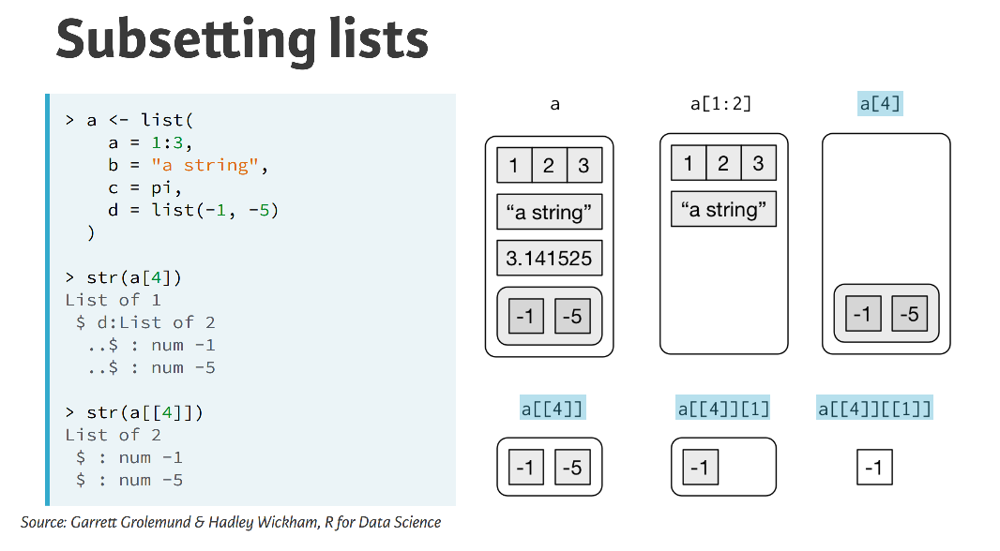

# Writing Functions in R
***
Notes taken during/inspired by the Datacamp course 'Writing Functions in R' by Hadley and Charlotte Wickham.

R can create functions using a basic 'receipe' as Hadley calls it


```{r, eval = FALSE}
my_fun <- function(arg1, arg2) {
   body
}
```

> 

Unlike in other languages, there is no special syntax for naming a function. Once created, there is no difference between the functions you create and the functions created by other developers such as those in base R.  

Every function has three components

* The formal arguments
* The body of the function 
* The environment - usually invisible but determines where the function looks for variables

The environemnt is where the function was defined, if just coding the function in this will be the global environment.  

The output from a function is usually the last expression evaluated.  However, it is possible to use a return statement to return(value) which will stop the function at that point.  It is possible to have functions without a name, so called 'anonymous' functions, which are covered later in this chapter.  Anonymous functions can be called, but have to be done on the same line.  

Course slides:
* [Part 1 - Refresher](https://s3.amazonaws.com/assets.datacamp.com/production/course_1008/slides/ch1_pdf_slides_v2.pdf)
* [Part 2 - When and how you should write a function](https://s3.amazonaws.com/assets.datacamp.com/production/course_1008/slides/ch2_pdf_slides.pdf)
* [Part 3 - Functional programming]()
* [Part 4 - Advanced inputs and outputs]()
* [Part 5 - Robust functions]

## Function overview

```{r}
# Define ratio() function
ratio <- function(x, y) {
  x / y
}

# Call ratio() with arguments 3 and 4
ratio(3, 4)
```

There are  two ways to specify the arguments - ratio(3, 4), which relies on matching by position, or ratio(x = 3, y = 4), which relies on matching by name.

For functions you and others use often, it's okay to use positional matching for the first one or two arguments. These are usually the data to be computed on. Good examples are the x argument to the summary functions (mean(), sd(), etc.) and the x and y arguments to plotting functions.

However, beyond the first couple of arguments you should always use matching by name. It makes your code much easier for you and others to read. This is particularly important if the argument is optional, because it has a default. When overriding a default value, it's good practice to use the name.

Notice that when you call a function, you should place a space around = in function calls, and always put a space after a comma, not before (just like in regular English). Using whitespace makes it easier to skim the function for the important components.

In the follwing example we tidy up the function to follow best practice and make it easier to understand and repeat if needed in the future.

```{r}
# Original
mean(0.1,x=c(1:9, NA),TRUE)

# Rewrite the call to follow best practices
mean(c(1:9, NA), trim = 0.1, na.rm = TRUE)
```

### Scoping

Scoping describes how R looks up values when given a name.  When creating a function, R will look within that function first for a name e.g. x.  If it doesn't exist in that environment, it will look one level up, so if you've defined x but not y in a function, R will look for y in the next environment up - if within a single function, this next level up will be the gobal environment.  Every time you cann a function, it will get a 'clean' environment.  

### Data Structures

There are two main typers of data structure in R - atomic vectors and lists (which are multiple vectors).  Lists are useful because they can be used to have different data ypes within them, they have nested vectors in effect.  Lists can be referenced either with a single brackedt [], a double braket [[]] which will strip out a level of hierachy or the usual dollar notation $.  

```{r Subsetting Lists, echo = FALSE, fig.cap='Subsetting List flavours'}

```

There are a few ways to subset a list. Throughout the course we'll mostly use double bracket ([[]]) subsetting by index and by name.

That is, my_list[[1]] extracts the first element of the list my_list, and my_list[["name"]] extracts the element in my_list that is called name. If the list is nested you can travel down the heirarchy by recursive subsetting. For example, mylist[[1]][["name"]] is the element called name inside the first element of my_list.

A data frame is just a special kind of list, so you can use double bracket subsetting on data frames too. my_df[[1]] will extract the first column of a data frame and my_df[["name"]] will extract the column named name from the data frame.


```{r, eval = FALSE}
# 2nd element in tricky_list
typeof(tricky_list[[2]])

# Element called x in tricky_list
typeof(tricky_list[["x"]])

# 2nd element inside the element called x in tricky_list
typeof(tricky_list[["x"]][[2]])

```

Sometimes the output of models can be quite challenging to get out, with many lists inside a single list.

```{r}
# Guess where the regression model is stored
names(tricky_list)

# Use names() and str() on the model element
names(tricky_list[["model"]])
str(tricky_list[["model"]])

# Subset the coefficients element
tricky_list[["model"]][["coefficients"]]

# Subset the wt element
tricky_list[["model"]][["coefficients"]][["wt"]]
```

### For loops

For loops are used for iteraction.  There are a number of parts within a loop:

* **1**: The sequence - describes the name of an object with indexes an iteration e.g. i, and the values that this index should iterate over 
* **2**: The body - between the curly braces {} and describes the operations to iterate over, referring back to the index (e.g. i)
* **3**: The output - where should the results of the loop go?  OFten this might print to the screen rather than saving the output

If you want to repeat a function for each column where the data frame is empty, rather than use the sequence for (i in 1:ncol(df)), it is better to use seq_along(df), since our sequence is now the somewhat non-sensical: 1, 0. You might think you wouldn't be silly enough to use a for loop with an empty data frame, but once you start writing your own functions, there's no telling what the input will be.

```{r}

df <- data.frame()
1:ncol(df)

# doesn't handle the empty data well
for (i in 1:ncol(df)) {
  print(median(df[[i]]))
}

# Replace the 1:ncol(df) sequence
for (i in seq_along(df)) {
  print(median(df[[i]]))
}

```

Our for loop does a good job displaying the column medians, but we might want to store these medians in a vector for future use.

Before you start the loop, you must always allocate sufficient space for the output, let's say an object called output. This is very important for efficiency: if you grow the for loop at each iteration (e.g. using c()), your for loop will be very slow.

A general way of creating an empty vector of given length is the vector() function. It has two arguments: the type of the vector ("logical", "integer", "double", "character", etc.) and the length of the vector.

Then, at each iteration of the loop you must store the output in the corresponding entry of the output vector, i.e. assign the result to output[[i]]. (You might ask why we are using double brackets here when output is a vector. It's primarily for generalizability: this subsetting will work whether output is a vector or a list.)

Let's edit our loop to store the medians, rather than printing them to the console.

```{r, eval = FALSE}
# Create new double vector: output
output <- vector("double", ncol(df))

# Alter the loop
for (i in seq_along(df)) {
  # Change code to store result in output
  output[i] <- median(df[[i]])
}

# Print output
output
```


## When and how you should write a function

Why might you write a function? Doing the same thing many times is not efficient and it can lead to errors - you copy the same function/formula from a previous exercise, but forget to change a variable name to fit your new instance.  

> If you have copied and pasted twice, meaning you now have three copies, it is time to write a function

As it takes less effort to check the intent of the code - there is just one function to check - more time can be spent on checking the validity or quality of the data and outputs.  In addition, since we have created a function, we can use other packages such as the map function in purrr, to repeat (map) our functions repeatadly.  

### Rescale example

We have a snippet of code that successfully rescales a column to be between 0 and 1:

  (df$a - min(df$a, na.rm = TRUE)) /  
  (max(df$a, na.rm = TRUE) - min(df$a, na.rm = TRUE))
  
Our goal over the next few exercises is to turn this snippet, written to work on the a column in the data frame df, into a general purpose rescale01() function that we can apply to any vector.

The first step of turning a snippet into a function is to examine the snippet and decide how many inputs there are, then rewrite the snippet to refer to these inputs using temporary names. These inputs will become the arguments to our function, so choosing good names for them is important. (We'll talk more about naming arguments in a later exercise.)

In this snippet, there is one input: the numeric vector to be rescaled (currently df$a). What would be a good name for this input? It's quite common in R to refer to a vector of data simply as x (like in the mean function), so we will follow that convention here.

```{r}
# Define example vector x
x <- seq(1:10)

# Rewrite this snippet to refer to x
(x - min(x, na.rm = TRUE)) /
  (max(x, na.rm = TRUE) - min(x, na.rm = TRUE))
```

Our next step is to examine our snippet and see if we can write it more clearly.

Take a close look at our rewritten snippet. Do you see any duplication?

  (x - min(x, na.rm = TRUE)) /
  (max(x, na.rm = TRUE) - min(x, na.rm = TRUE))
  
One obviously duplicated statement is min(x, na.rm = TRUE). It makes more sense for us just to calculate it once, store the result, and then refer to it when needed. In fact, since we also need the maximum value of x, it would be even better to calculate the range once, then refer to the first and second elements when they are needed.

What should we call this intermediate variable? You'll soon get the message that using good names is an important part of writing clear code! I suggest we call it rng (for "range").

```{r}
# Define example vector x
x <- 1:10

# Define rng
rng <- range(x, na.rm = TRUE)

# Rewrite this snippet to refer to the elements of rng
(x - rng[1]) /
  (rng[2] - rng[1])
```

What do you need to write a function? You need a name for the function, you need to know the arguments to the function, and you need code that forms the body of the function.

```{r}
# Define example vector x
x <- 1:10 

# Use the function template to create the rescale01 function
rescale01 <- function(x) {
  # body
  rng <- range(x, na.rm = TRUE) 
  (x - rng[1]) / (rng[2] - rng[1])
}

# Test your function, call rescale01 using the vector x as the argument
rescale01(x)
```

### Write a function step by step

Typically we go through a similar process in order to write a function:

1. Start with a simiple problem
2. Get a working snippet of code
3. Rewrite the code to use temporary variables
4. See if there is any duplication that we can minimise and rewrite to remove this
5. With this clearly working version, we can turn it in to a function, by wrapping the code in a function

In this next section we are going to go through these steps in order to write a function - both_na() - that counts at how many positions two vectors, x and y, both have a missing value.

So first, we start writing some simple code to see how we get something workable.  

```{r}
# Define example vectors x and y
x <- c( 1, 2, NA, 3, NA)
y <- c(NA, 3, NA, 3,  4)

# Count how many elements are missing in both x and y
sum(is.na(x) & is.na(y))
```

So the function appears to be doing what we want, the function is already quite simple so we don't need to simplify further, so we proceed to wrap the function.

```{r}
# Turn this snippet into a function: both_na()
both_na <- function(x, y) {
  sum(is.na(x) & is.na(y))
}
```

Now we can test whether the function operates as intended by using some other examples.

```{r}
# Define x, y1 and y2
x <-  c(NA, NA, NA)
y1 <- c( 1, NA, NA)
y2 <- c( 1, NA, NA, NA)


# Call both_na on x, y1
both_na(x, y1)

# Call both_na on x, y2
both_na(x, y2)
```

### How can you write a good function?

It should have the following criteria fulfilled

* It should be correct
* It should be understandable to other people
* Correct + understandable = obvioulsy correct

Good names can help make the data more understandable.  Good naming applies to all aspects in R - objects, functions or arguments.  Some examples are below, it doesn't matter which convention you follow although it is important to stick to the approach i.e. be consistent. 

* Long names - these should be lower case and seperated with underscores e.g. row_maxes
* Other names - don't override existing variables or functions e.g. T <- FALSE or c <- 10
* Function names - use a verb as a name, since the function does something
* Argument names - use nouns or naming words
* Argument length - use short names when appropriate e.g. x,y or z
* Data frames - usually referred to as df
* Numeric indices - use i and j typically rows and columns
* Others - n for the number of rows, p for the number of columns
* Argument order - usually we placed data objects first, like x or df, then things that control the computation next (detail) which should be given default values

Also think about having an [R style guide](http://adv-r.had.co.nz/Style.html).

## Functional Programming

Writing for loops in R is not best practice.  They are like detailed recipe books which outline very detailed step in a recipe, they don't rely on any pre-existing knowledge so as a consequence, become very long.  This can make it hard to understand and see differences and similarities between different recipes (for loops).  For loops tend to relegate the verbs by hiding them in a sea of nouns. Using functional programming allows you to create 'meta recipes' which helps to identify what is different and what is the same, by simplifying some of the steps.  

In the following example we will create a data frame, then try to calculate a median for each column.  This could be achieved by repeating median(df[[p]]) for each column p in the df, but it would be a lot of repetition.  The following shows how you would use a for loop

```{r}
# Create the dataframe
df <- data.frame(
  a = rnorm(10),
  b = rnorm(10),
  c = rnorm(10),
  d = rnorm(10)
)

# Initialize output vector
output <- vector("double", ncol(df))  

# Fill in the body of the for loop
for (i in seq_along(df)) {            
  output[i] <- median(df[[i]])
}

# View the result
output

```

Now if we had two more data frames, df2 and df3 we would have something similar to the following

```{r}
# Create the dataframe2
df2 <- data.frame(
  a = rnorm(10),
  b = rnorm(10),
  c = rnorm(10),
  d = rnorm(10)
)

# Create the dataframe3
df3 <- data.frame(
  a = rnorm(10),
  b = rnorm(10),
  c = rnorm(10),
  d = rnorm(10)
)

output <- vector("double", ncol(df2))  
for (i in seq_along(df2)) {            
  output[[i]] <- median(df2[[i]])      
}
output

output <- vector("double", ncol(df3))  
for (i in seq_along(df3)) {            
  output[[i]] <- median(df3[[i]])      
}
output
```

It would be easier to write a function in this instance.

```{r}
# Turn this code into col_median()
col_median <- function(df) {
  output <- vector("double", ncol(df))
  for (i in seq_along(df)) {            
    output[[i]] <- median(df[[i]])      
  }
  output
}

col_median(df2)
col_median(df3)
```
And if we wanted means instead of medians we could write a similar function.

```{r}
# Create col_mean() function to find column means
col_mean <- function(df) {
  output <- numeric(length(df))
  for (i in seq_along(df)) {
    output[[i]] <- mean(df[[i]])
  }
  output
}
col_mean(df2)
col_mean(df3)
```
And if we wanted standard deviations

```{r}
# Define col_sd() function
col_sd <- function(df) {
  output <- numeric(length(df))
  for (i in seq_along(df)) {
    output[[i]] <- sd(df[[i]])
  }
  output
}
col_sd(df2)
col_sd(df3)
```
We have now copied our median function twice - to create mean and sd functions.  It would be writter to write a function which will take column summaries for any summary function we provide.  

```{r}
f <- function(x, power) {
    # Edit the body to return absolute deviations raised to power
    abs(x - mean(x)) ^ power
}
```

We can also use functions as arguments, by replacing the mean or median elements with fun, where fun = the summary function desired.

```{r}
col_summary <- function(df, fun) {
  output <- vector("numeric", length(df))
  for (i in seq_along(df)) {
    output[[i]] <- fun(df[[i]])
  }
  output
}
```

### Using purrr

Passing functions as arguments is quite a common task in R, we can use the map function in purrr to achieve this.  Every function in the purrr package takes a vector to begin with (.x) and loops over it to do something (.f) e.g. map_dbl(.x, .f, ...).  The types of map functions are:

* map() returns a list
* map_dbl() returns a double vector
* map_lgl() returns a logical vector
* map_int() returns a integer vector
* map_chr() returns a character vector

Arguments to map() are .x and .f and not x and f because .x and .f are very unlikely to be argument names you might pass through the ..., thereby preventing confusion about whether an argument belongs to map() or to the function being mapped.

```{r}
# load the package and examine the data
library(purrr)
library(nycflights13)
library(dplyr) # to select just the numeric columns of our dataset 
str(planes)
planes2 <- select_if(planes, is.numeric)

# Find the mean of each column
map_dbl(planes2, mean)

# Find the mean of each column, excluding missing values
map_dbl(planes2, mean, na.rm = T)

# Find the 5th percentile of each column, excluding missing values
map_dbl(planes2, quantile, probs = .05, na.rm = T)
```

```{r}
# Find the columns that are numeric
map_lgl(df3, is.numeric)

# Find the type of each column
map_chr(df3, typeof)

# Find a summary of each column
map(df3, summary)
```

### Shortcuts

You can define an anonymous function on the fly like

> map(df, function(x) sum(is.na(x)))

Which will count how many missing values are in x.  This allows you to create and map your own functions.  

In the next set of exercises we will use the mtcars data, but split the dataset in to a set for each number of cylinders in the engine e.g. 4, 6 and 8 cylinders. 

Our goal is to fit a separate linear regression of miles per gallon (mpg) against weight (wt) for each group of cars in our list of data frames, where each data frame in our list represents a different group. How should we get started?

First, let's confirm the structure of this list of data frames. Then, we'll solve a simpler problem first: fit the regression to the first group of cars.

```{r}
# Split the data
cyl <- split(mtcars, mtcars$cyl)

# Examine the structure of cyl
str(cyl)

# Extract the first element into four_cyls
four_cyls <- cyl[[1]]

# Fit a linear regression of mpg on wt using four_cyls
lm(wt ~ mpg, four_cyls)
```

We now have a snippet of code that performs the operation we want on one data frame. One option would be to turn this into a function, for example:

> fit_reg <- function(df) {
>   lm(mpg ~ wt, data = df)
> }

Then pass this function into map():

> map(cyl, fit_reg)

But it seems a bit much to define a function for such a specific model when we only want to do this once. Instead of defining the function in the global environment, we will just use the function anonymously inside our call to map().

What does this mean? Instead of referring to our function by name in map(), we define it on the fly in the .f argument to map()

```{r}
# Rewrite to call an anonymous function
map(cyl, function(df) lm(mpg ~ wt, data = df))
```

Writing anonymous functions takes a lot of extra key strokes, so purrr provides a shortcut that allows you to write an anonymous function as a one-sided formula instead.

In R, a one-sided formula starts with a ~, followed by an R expression. In purrr's map functions, the R expression can refer to an element of the .x argument using the . character.

Let's take a look at an example. Imagine, instead of a regression on each data frame in cyl, we wanted to know the mean displacement for each data frame. One way to do this would be to use an anonymous function:

> map_dbl(cyl, function(df) mean(df$disp))

To perform the same operation using the formula shortcut, we replace the function definition (function(df)) with the ~, then when we need to refer to the element of cyl the function operates on (in this case df), we use a ..

> map_dbl(cyl, ~ mean(.$disp))

Much less typing. It also saves you from coming up with an argument name. Lets rewrite our previous anonymous function using this formula shortcut instead.

```{r}
# Rewrite to use the formula shortcut instead
map(cyl, ~ lm(mpg ~ wt, data = .))
```

There are also some useful shortcuts that come in handy when you want to subset each element of the .x argument. If the .f argument to a map function is set equal to a string, let's say "name", then purrr extracts the "name" element from every element of .x.

This is a really common situation you find yourself in when you work with nested lists. For example, if we have a list of where every element contains an a and b element:

> list_of_results <- list(
  list(a = 1, b = "A"), 
  list(a = 2, b = "C"), 
  list(a = 3, b = "D")
)

We might want to pull out the a element from every entry. We could do it with the string shortcut like this:

> map(list_of_results, "a")

Now take our list of regresssion models:

> map(cyl, ~ lm(mpg ~ wt, data = .))

It might be nice to extract the slope coefficient from each model. You'll do this in a few steps: first fit the models, then get the coefficients from each model using the coef() function, then pull out the wt estimate using the string shortcut.

```{r}
# Save the result from the previous exercise to the variable models
models <- map(cyl, ~ lm(mpg ~ wt, data = .))

# Use map and coef to get the coefficients for each model: coefs
coefs <- map(models, ~ coef(.))

# Use string shortcut to extract the wt coefficient 
map(coefs, "wt")
```

Another useful shortcut for subsetting is to pass a numeric vector as the .f argument. This works just like passing a string but subsets by index rather than name. For example, with your previous list_of_results:

> list_of_results <- list(
  list(a = 1, b = "A"), 
  list(a = 2, b = "C"), 
  list(a = 3, b = "D")
)

Another way to pull out the a element from each list, is to pull out the first element:

> map(list_of_results, 1)

Let's pull out the slopes from our models again, but this time using numeric subsetting. Also, since we are pulling out a single numeric value from each element, let's use map_dbl().

```{r}
# use map_dbl with the numeric shortcut to pull out the second element
map_dbl(coefs, 1)
```
purrr also includes a pipe operator: %>%. The pipe operator is another shortcut that saves typing, but also increases readability.  The example below pulls out the R2 from each model. Rewrite the last two lines to use a pipe instead.

```{r}
# Define models (don't change)
models <- mtcars %>% 
  split(mtcars$cyl) %>%
  map(~ lm(mpg ~ wt, data = .))

# Original code
# summaries <- map(models, summary) 
# map_dbl(summaries, "r.squared")

# Re-writen to single command with pipes
models %>%
  map(summary) %>%
  map_dbl("r.squared")


```

## Advanced Inputs and Outputs

When using purrr, problems like errors with a single item within the map function, for instance char instead of numeric data in a list of lists, can cause errors with all the map functions.  We don't know which element caused the error and we cant access any of the succesful runs.  Purrr comes with a function called safely, which will return both successful elements and errors. It will take a function and return a variaton of that function which will never give an error - it will return two results, those successful (result) and those not (errors).  This is one adverb for dealing with unusual output:

* safely() captures the successful result or the error, always returns a list
* possibly() always succeeds, you give it a default value to return when there is an error
* quietly() captures printed output, messages, and warnings instead of capturing errors

```{r}
# Create safe_readLines() by passing readLines() to safely()
safe_readLines <- safely(readLines)

# Call safe_readLines() on "http://example.org"
safe_readLines("http://example.org")

# Call safe_readLines() on "http://asdfasdasdkfjlda"
safe_readLines("http://asdfasdasdkfjlda")
```

Safely also works with map functions.

```{r}
# Define safe_readLines()
safe_readLines <- safely(readLines)

# Use the safe_readLines() function with map(): html
html <- map(urls, safe_readLines)

# Call str() on html
str(html)

# Extract the result from one of the successful elements
html[[1]]

# Extract the error from the element that was unsuccessful
html[[3]]
```

We now have output that contains the HTML for each of the two URLs on which readLines() was successful and the error for the other. But the output isn't that easy to work with, since the results and errors are buried in the inner-most level of the list.

purrr provides a function transpose() that reshapes a list so the inner-most level becomes the outer-most level. In otherwords, it turns a list-of-lists "inside-out". Consider the following list:

> nested_list <- list(
   x1 = list(a = 1, b = 2),
   x2 = list(a = 3, b = 4)
)

If I need to extract the a element in x1, I could do nested_list[["x1"]][["a"]]. However, if I transpose the list first, the order of subsetting reverses. That is, to extract the same element I could also do transpose(nested_list)[["a"]][["x1"]].

This is really handy for safe output, since we can grab all the results or all the errors really easily.

```{r}
# Define save_readLines() and html
safe_readLines <- safely(readLines)
html <- map(urls, safe_readLines)

# Examine the structure of transpose(html)
str(transpose(html))

# Extract the results: res
res <- transpose(html)[["result"]]

# Extract the errors: errs
errs <- transpose(html)[["error"]]
```

What you do with the errors and results is up to you. But, commonly you'll want to collect all the results for the elements that were successful and examine the inputs for all those that weren't.

```{r}
# Initialize some objects
safe_readLines <- safely(readLines)
html <- map(urls, safe_readLines)
res <- transpose(html)[["result"]]
errs <- transpose(html)[["error"]]

# Create a logical vector is_ok
is_ok <- map_lgl(errs, is_null)

# Extract the successful results
res[is_ok]

# Extract the input from the unsuccessful results
urls[!is_ok]
```

### Maps over multiple arguments

If we want to add multiple arguments - for instance creating a normal distribution using rnorm() with two arguments, one for the number of rows (n) and one for the desired mean - we can use the map2 function which now takes the form

> map2(.x, .y, .f ...) # iterate over two arguments

But if we wanted to extend this, by adding saying the standard deviation (sd) rather than use map3 and so on for more arguments, purr has a pmap function that takes lists as inputs

> pmap(.l, .f, ...) # iterate over many arguments

Or if we wanted to do a similar exercise but use different functions, say to run distributions for expontial as well as rnorm, we use the invoke map() functions

> invoke_map(.f, .x = list(NULL), ...) # iterate over functions and arguments

This next section will use the random number generator rnorm().

```{r}
# Create a list n containing the values: 5, 10, and 20
n <- list(5, 10, 20)

# Call map() on n with rnorm() to simulate three samples
map(n, rnorm)
```

If we also want to vary the mean, the mean can be specified in rnorm() by the argument mean. Now there are two arguments to rnorm() we want to vary: n and mean.

The map2() function is designed exactly for this purpose; it allows iteration over two objects. The first two arguments to map2() are the objects to iterate over and the third argument .f is the function to apply.

Let's use map2() to simulate three samples with different sample sizes and different means.

```{r}
# Initialize n
n <- list(5, 10, 20)

# Create a list mu containing the values: 1, 5, and 10
mu <- list(1, 5, 10)

# Edit to call map2() on n and mu with rnorm() to simulate three samples
map2(n, mu, rnorm)
```

We might want to vary: sd, the standard deviation of the Normal distribution. You might think there is a map3() function, but there isn't. Instead purrr provides a pmap() function that iterates over 2 or more arguments.

First, let's take a look at pmap() for the situation we just solved: iterating over two arguments. Instead of providing each item to iterate over as arguments, pmap() takes a list of arguments as its input. For example, we could replicate our previous example, iterating over both n and mu with the following:

> n <- list(5, 10, 20)
> mu <- list(1, 5, 10)

> pmap(list(n, mu), rnorm)

Notice how we had to put our two items to iterate over (n and mu) into a list.

Let's expand this code to iterate over varying standard deviations too.

```{r}
# Initialize n and mu
n <- list(5, 10, 20)
mu <- list(1, 5, 10)

# Create a sd list with the values: 0.1, 1 and 0.1
sd <- list(0.1, 1, 0.1)

# Edit this call to pmap() to iterate over the sd list as well
pmap(list(n, mu, sd), rnorm)
```

By default pmap() matches the elements of the list to the arguments in the function by position. 

Instead of relying on this positional matching, a safer alternative is to provide names in our list. The name of each element should be the argument name we want to match it to.

```{r}
# Name the elements so they are read correctly
pmap(list(mean = mu, n = n , sd = sd), rnorm)
```

Sometimes it's not the arguments to a function you want to iterate over, but a set of functions themselves. Imagine that instead of varying the parameters to rnorm() we want to simulate from different distributions, say, using rnorm(), runif(), and rexp(). How do we iterate over calling these functions?

In purrr, this is handled by the invoke_map() function. The first argument is a list of functions. In our example, something like:

> f <- list("rnorm", "runif", "rexp")

The second argument specifies the arguments to the functions. In the simplest case, all the functions take the same argument, and we can specify it directly, relying on ... to pass it to each function. In this case, call each function with the argument n = 5:

> invoke_map(f, n = 5)

In more complicated cases, the functions may take different arguments, or we may want to pass different values to each function. In this case, we need to supply invoke_map() with a list, where each element specifies the arguments to the corresponding function.

```{r}
# Define list of functions
f <- list("rnorm", "runif", "rexp")

# Parameter list for rnorm()
rnorm_params <- list(mean = 10)

# Add a min element with value 0 and max element with value 5
runif_params <- list(min =0, max = 5)

# Add a rate element with value 5
rexp_params <- list(rate = 5)

# Define params for each function
params <- list(
  rnorm_params,
  runif_params,
  rexp_params
)

# Call invoke_map() on f supplying params as the second argument
invoke_map(f, params, n = 5)
```

