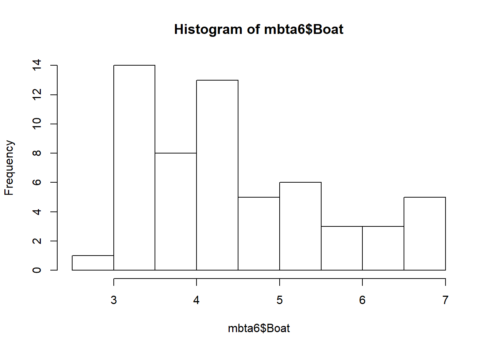
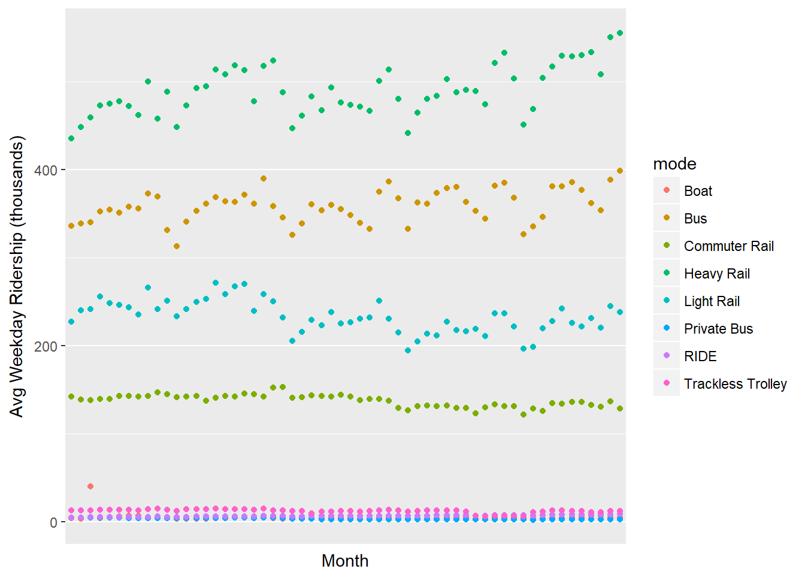

# Importing & Cleaning Data in R: Case Studies
***
Notes taken during/inspired by the Datacamp course 'Importing & Cleaning Data in R: Case Studies' by Nick Carchedi.

## Ticket Sales Data


```r
# Import sales.csv: sales
sales <- read.csv("https://assets.datacamp.com/production/course_1294/datasets/sales.csv", stringsAsFactors = FALSE)

# View dimensions of sales
dim(sales)
```

```
## [1] 5000   46
```

```r
# Inspect first 6 rows of sales
head(sales, n = 6)
```

```
##   X             event_id       primary_act_id     secondary_act_id
## 1 1 abcaf1adb99a935fc661 43f0436b905bfa7c2eec b85143bf51323b72e53c
## 2 2 6c56d7f08c95f2aa453c 1a3e9aecd0617706a794 f53529c5679ea6ca5a48
## 3 3 c7ab4524a121f9d687d2 4b677c3f5bec71eec8d1 b85143bf51323b72e53c
## 4 4 394cb493f893be9b9ed1 b1ccea01ad6ef8522796 b85143bf51323b72e53c
## 5 5 55b5f67e618557929f48 91c03a34b562436efa3c b85143bf51323b72e53c
## 6 6 4f10fd8b9f550352bd56 ac4b847b3fde66f2117e 63814f3d63317f1b56c4
##    purch_party_lkup_id
## 1 7dfa56dd7d5956b17587
## 2 4f9e6fc637eaf7b736c2
## 3 6c2545703bd527a7144d
## 4 527d6b1eaffc69ddd882
## 5 8bd62c394a35213bdf52
## 6 3b3a628f83135acd0676
##                                                       event_name
## 1 Xfinity Center Mansfield Premier Parking: Florida Georgia Line
## 2                  Gorge Camping - dave matthews band - sept 3-7
## 3                    Dodge Theatre Adams Street Parking - benise
## 4   Gexa Energy Pavilion Vip Parking : kid rock with sheryl crow
## 5                                  Premier Parking - motley crue
## 6                                      Fast Lane Access: Journey
##                           primary_act_name secondary_act_name
## 1 XFINITY Center Mansfield Premier Parking               NULL
## 2                            Gorge Camping Dave Matthews Band
## 3                            Parking Event               NULL
## 4         Gexa Energy Pavilion VIP Parking               NULL
## 5 White River Amphitheatre Premier Parking               NULL
## 6                         Fast Lane Access            Journey
##   major_cat_name         minor_cat_name la_event_type_cat
## 1           MISC                PARKING           PARKING
## 2           MISC                CAMPING           INVALID
## 3           MISC                PARKING           PARKING
## 4           MISC                PARKING           PARKING
## 5           MISC                PARKING           PARKING
## 6           MISC SPECIAL ENTRY (UPSELL)            UPSELL
##                                                  event_disp_name
## 1 Xfinity Center Mansfield Premier Parking: Florida Georgia Line
## 2                  Gorge Camping - dave matthews band - sept 3-7
## 3                    Dodge Theatre Adams Street Parking - benise
## 4   Gexa Energy Pavilion Vip Parking : kid rock with sheryl crow
## 5                                  Premier Parking - motley crue
## 6                                      Fast Lane Access: Journey
##                                                                                                                                                    ticket_text
## 1    THIS TICKET IS VALID        FOR PARKING ONLY         GOOD THIS DAY ONLY       PREMIER PARKING PASS    XFINITY CENTER,LOTS 4 PM  SAT SEP 12 2015 7:30 PM  
## 2                                                                %OVERNIGHT C A M P I N G%* * * * * *%GORGE CAMPGROUND%* GOOD THIS DATE ONLY *%SEP 3 - 6, 2009
## 3                               ADAMS STREET GARAGE%PARKING FOR 4/21/06 ONLY%DODGE THEATRE PARKING PASS%ENTRANCE ON ADAMS STREET%BENISE%GARAGE OPENS AT 6:00PM
## 4    THIS TICKET IS VALID        FOR PARKING ONLY      GOOD FOR THIS DATE ONLY       VIP PARKING PASS        GEXA ENERGY PAVILION    FRI SEP 02 2011 7:00 PM  
## 5                              THIS TICKET IS VALID%FOR PARKING ONLY%GOOD THIS DATE ONLY%PREMIER PARKING PASS%WHITE RIVER AMPHITHEATRE%SAT JUL 30, 2005 6:00PM
## 6         FAST LANE                  JOURNEY               FAST LANE EVENT         THIS IS NOT A TICKET    SAN MANUEL AMPHITHEATER   SAT JUL 21 2012 7:00 PM  
##   tickets_purchased_qty trans_face_val_amt delivery_type_cd
## 1                     1                 45          eTicket
## 2                     1                 75       TicketFast
## 3                     1                  5       TicketFast
## 4                     1                 20             Mail
## 5                     1                 20             Mail
## 6                     2                 10       TicketFast
##       event_date_time   event_dt presale_dt  onsale_dt
## 1 2015-09-12 23:30:00 2015-09-12       NULL 2015-05-15
## 2 2009-09-05 01:00:00 2009-09-04       NULL 2009-03-13
## 3 2006-04-22 01:30:00 2006-04-21       NULL 2006-02-25
## 4 2011-09-03 00:00:00 2011-09-02       NULL 2011-04-22
## 5 2005-07-31 01:00:00 2005-07-30 2005-03-02 2005-03-04
## 6 2012-07-22 02:00:00 2012-07-21       NULL 2012-04-11
##   sales_ord_create_dttm sales_ord_tran_dt   print_dt timezn_nm
## 1   2015-09-11 18:17:45        2015-09-11 2015-09-12       EST
## 2   2009-07-06 00:00:00        2009-07-05 2009-09-01       PST
## 3   2006-04-05 00:00:00        2006-04-05 2006-04-05       MST
## 4   2011-07-01 17:38:50        2011-07-01 2011-07-06       CST
## 5   2005-06-18 00:00:00        2005-06-18 2005-06-28       PST
## 6   2012-07-21 17:20:18        2012-07-21 2012-07-21       PST
##       venue_city   venue_state venue_postal_cd_sgmt_1
## 1      MANSFIELD MASSACHUSETTS                  02048
## 2         QUINCY    WASHINGTON                  98848
## 3        PHOENIX       ARIZONA                  85003
## 4         DALLAS         TEXAS                  75210
## 5         AUBURN    WASHINGTON                  98092
## 6 SAN BERNARDINO    CALIFORNIA                  92407
##             sales_platform_cd print_flg la_valid_tkt_event_flg  fin_mkt_nm
## 1 www.concerts.livenation.com        T                      N       Boston
## 2                        NULL        T                      N      Seattle
## 3                        NULL        T                      N      Arizona
## 4                        NULL        T                      N       Dallas
## 5                        NULL        T                      N      Seattle
## 6          www.livenation.com        T                      N  Los Angeles
##   web_session_cookie_val gndr_cd age_yr income_amt edu_val
## 1   7dfa56dd7d5956b17587    <NA>   <NA>       <NA>    <NA>
## 2   4f9e6fc637eaf7b736c2    <NA>   <NA>       <NA>    <NA>
## 3   6c2545703bd527a7144d    <NA>   <NA>       <NA>    <NA>
## 4   527d6b1eaffc69ddd882    <NA>   <NA>       <NA>    <NA>
## 5   8bd62c394a35213bdf52    <NA>   <NA>       <NA>    <NA>
## 6   3b3a628f83135acd0676    <NA>   <NA>       <NA>    <NA>
##   edu_1st_indv_val edu_2nd_indv_val adults_in_hh_num married_ind
## 1             <NA>             <NA>             <NA>        <NA>
## 2             <NA>             <NA>             <NA>        <NA>
## 3             <NA>             <NA>             <NA>        <NA>
## 4             <NA>             <NA>             <NA>        <NA>
## 5             <NA>             <NA>             <NA>        <NA>
## 6             <NA>             <NA>             <NA>        <NA>
##   child_present_ind home_owner_ind occpn_val occpn_1st_val occpn_2nd_val
## 1              <NA>           <NA>      <NA>          <NA>          <NA>
## 2              <NA>           <NA>      <NA>          <NA>          <NA>
## 3              <NA>           <NA>      <NA>          <NA>          <NA>
## 4              <NA>           <NA>      <NA>          <NA>          <NA>
## 5              <NA>           <NA>      <NA>          <NA>          <NA>
## 6              <NA>           <NA>      <NA>          <NA>          <NA>
##   dist_to_ven
## 1          NA
## 2          59
## 3          NA
## 4          NA
## 5          NA
## 6          NA
```

```r
# View column names of sales
names(sales)
```

```
##  [1] "X"                      "event_id"              
##  [3] "primary_act_id"         "secondary_act_id"      
##  [5] "purch_party_lkup_id"    "event_name"            
##  [7] "primary_act_name"       "secondary_act_name"    
##  [9] "major_cat_name"         "minor_cat_name"        
## [11] "la_event_type_cat"      "event_disp_name"       
## [13] "ticket_text"            "tickets_purchased_qty" 
## [15] "trans_face_val_amt"     "delivery_type_cd"      
## [17] "event_date_time"        "event_dt"              
## [19] "presale_dt"             "onsale_dt"             
## [21] "sales_ord_create_dttm"  "sales_ord_tran_dt"     
## [23] "print_dt"               "timezn_nm"             
## [25] "venue_city"             "venue_state"           
## [27] "venue_postal_cd_sgmt_1" "sales_platform_cd"     
## [29] "print_flg"              "la_valid_tkt_event_flg"
## [31] "fin_mkt_nm"             "web_session_cookie_val"
## [33] "gndr_cd"                "age_yr"                
## [35] "income_amt"             "edu_val"               
## [37] "edu_1st_indv_val"       "edu_2nd_indv_val"      
## [39] "adults_in_hh_num"       "married_ind"           
## [41] "child_present_ind"      "home_owner_ind"        
## [43] "occpn_val"              "occpn_1st_val"         
## [45] "occpn_2nd_val"          "dist_to_ven"
```

Luckily, the rows and columns appear to be arranged in a meaningful way: each row represents an observation and each column a variable, or piece of information about that observation.

In R, there are a great many tools at your disposal to help get a feel for your data. Besides the three you used in the previous exercise, the functions str() and summary() can be very helpful.

The dplyr package, introduced in Cleaning Data in R, offers the glimpse() function, which can also be used for this purpose. The package is already installed on DataCamp; you just need to load it.


```r
# Look at structure of sales
str(sales)
```

```
## 'data.frame':	5000 obs. of  46 variables:
##  $ X                     : int  1 2 3 4 5 6 7 8 9 10 ...
##  $ event_id              : chr  "abcaf1adb99a935fc661" "6c56d7f08c95f2aa453c" "c7ab4524a121f9d687d2" "394cb493f893be9b9ed1" ...
##  $ primary_act_id        : chr  "43f0436b905bfa7c2eec" "1a3e9aecd0617706a794" "4b677c3f5bec71eec8d1" "b1ccea01ad6ef8522796" ...
##  $ secondary_act_id      : chr  "b85143bf51323b72e53c" "f53529c5679ea6ca5a48" "b85143bf51323b72e53c" "b85143bf51323b72e53c" ...
##  $ purch_party_lkup_id   : chr  "7dfa56dd7d5956b17587" "4f9e6fc637eaf7b736c2" "6c2545703bd527a7144d" "527d6b1eaffc69ddd882" ...
##  $ event_name            : chr  "Xfinity Center Mansfield Premier Parking: Florida Georgia Line" "Gorge Camping - dave matthews band - sept 3-7" "Dodge Theatre Adams Street Parking - benise" "Gexa Energy Pavilion Vip Parking : kid rock with sheryl crow" ...
##  $ primary_act_name      : chr  "XFINITY Center Mansfield Premier Parking" "Gorge Camping" "Parking Event" "Gexa Energy Pavilion VIP Parking" ...
##  $ secondary_act_name    : chr  "NULL" "Dave Matthews Band" "NULL" "NULL" ...
##  $ major_cat_name        : chr  "MISC" "MISC" "MISC" "MISC" ...
##  $ minor_cat_name        : chr  "PARKING" "CAMPING" "PARKING" "PARKING" ...
##  $ la_event_type_cat     : chr  "PARKING" "INVALID" "PARKING" "PARKING" ...
##  $ event_disp_name       : chr  "Xfinity Center Mansfield Premier Parking: Florida Georgia Line" "Gorge Camping - dave matthews band - sept 3-7" "Dodge Theatre Adams Street Parking - benise" "Gexa Energy Pavilion Vip Parking : kid rock with sheryl crow" ...
##  $ ticket_text           : chr  "   THIS TICKET IS VALID        FOR PARKING ONLY         GOOD THIS DAY ONLY       PREMIER PARKING PASS    XFINIT"| __truncated__ "%OVERNIGHT C A M P I N G%* * * * * *%GORGE CAMPGROUND%* GOOD THIS DATE ONLY *%SEP 3 - 6, 2009" "ADAMS STREET GARAGE%PARKING FOR 4/21/06 ONLY%DODGE THEATRE PARKING PASS%ENTRANCE ON ADAMS STREET%BENISE%GARAGE OPENS AT 6:00PM" "   THIS TICKET IS VALID        FOR PARKING ONLY      GOOD FOR THIS DATE ONLY       VIP PARKING PASS        GEXA"| __truncated__ ...
##  $ tickets_purchased_qty : int  1 1 1 1 1 2 1 1 1 1 ...
##  $ trans_face_val_amt    : num  45 75 5 20 20 10 30 28 20 25 ...
##  $ delivery_type_cd      : chr  "eTicket" "TicketFast" "TicketFast" "Mail" ...
##  $ event_date_time       : chr  "2015-09-12 23:30:00" "2009-09-05 01:00:00" "2006-04-22 01:30:00" "2011-09-03 00:00:00" ...
##  $ event_dt              : chr  "2015-09-12" "2009-09-04" "2006-04-21" "2011-09-02" ...
##  $ presale_dt            : chr  "NULL" "NULL" "NULL" "NULL" ...
##  $ onsale_dt             : chr  "2015-05-15" "2009-03-13" "2006-02-25" "2011-04-22" ...
##  $ sales_ord_create_dttm : chr  "2015-09-11 18:17:45" "2009-07-06 00:00:00" "2006-04-05 00:00:00" "2011-07-01 17:38:50" ...
##  $ sales_ord_tran_dt     : chr  "2015-09-11" "2009-07-05" "2006-04-05" "2011-07-01" ...
##  $ print_dt              : chr  "2015-09-12" "2009-09-01" "2006-04-05" "2011-07-06" ...
##  $ timezn_nm             : chr  "EST" "PST" "MST" "CST" ...
##  $ venue_city            : chr  "MANSFIELD" "QUINCY" "PHOENIX" "DALLAS" ...
##  $ venue_state           : chr  "MASSACHUSETTS" "WASHINGTON" "ARIZONA" "TEXAS" ...
##  $ venue_postal_cd_sgmt_1: chr  "02048" "98848" "85003" "75210" ...
##  $ sales_platform_cd     : chr  "www.concerts.livenation.com" "NULL" "NULL" "NULL" ...
##  $ print_flg             : chr  "T " "T " "T " "T " ...
##  $ la_valid_tkt_event_flg: chr  "N " "N " "N " "N " ...
##  $ fin_mkt_nm            : chr  "Boston" "Seattle" "Arizona" "Dallas" ...
##  $ web_session_cookie_val: chr  "7dfa56dd7d5956b17587" "4f9e6fc637eaf7b736c2" "6c2545703bd527a7144d" "527d6b1eaffc69ddd882" ...
##  $ gndr_cd               : chr  NA NA NA NA ...
##  $ age_yr                : chr  NA NA NA NA ...
##  $ income_amt            : chr  NA NA NA NA ...
##  $ edu_val               : chr  NA NA NA NA ...
##  $ edu_1st_indv_val      : chr  NA NA NA NA ...
##  $ edu_2nd_indv_val      : chr  NA NA NA NA ...
##  $ adults_in_hh_num      : chr  NA NA NA NA ...
##  $ married_ind           : chr  NA NA NA NA ...
##  $ child_present_ind     : chr  NA NA NA NA ...
##  $ home_owner_ind        : chr  NA NA NA NA ...
##  $ occpn_val             : chr  NA NA NA NA ...
##  $ occpn_1st_val         : chr  NA NA NA NA ...
##  $ occpn_2nd_val         : chr  NA NA NA NA ...
##  $ dist_to_ven           : int  NA 59 NA NA NA NA NA NA NA NA ...
```

```r
# View a summary of sales
summary(sales)
```

```
##        X          event_id         primary_act_id     secondary_act_id  
##  Min.   :   1   Length:5000        Length:5000        Length:5000       
##  1st Qu.:1251   Class :character   Class :character   Class :character  
##  Median :2500   Mode  :character   Mode  :character   Mode  :character  
##  Mean   :2500                                                           
##  3rd Qu.:3750                                                           
##  Max.   :5000                                                           
##                                                                         
##  purch_party_lkup_id  event_name        primary_act_name  
##  Length:5000         Length:5000        Length:5000       
##  Class :character    Class :character   Class :character  
##  Mode  :character    Mode  :character   Mode  :character  
##                                                           
##                                                           
##                                                           
##                                                           
##  secondary_act_name major_cat_name     minor_cat_name    
##  Length:5000        Length:5000        Length:5000       
##  Class :character   Class :character   Class :character  
##  Mode  :character   Mode  :character   Mode  :character  
##                                                          
##                                                          
##                                                          
##                                                          
##  la_event_type_cat  event_disp_name    ticket_text       
##  Length:5000        Length:5000        Length:5000       
##  Class :character   Class :character   Class :character  
##  Mode  :character   Mode  :character   Mode  :character  
##                                                          
##                                                          
##                                                          
##                                                          
##  tickets_purchased_qty trans_face_val_amt delivery_type_cd  
##  Min.   :1.000         Min.   :   1.00    Length:5000       
##  1st Qu.:1.000         1st Qu.:  20.00    Class :character  
##  Median :1.000         Median :  30.00    Mode  :character  
##  Mean   :1.639         Mean   :  77.08                      
##  3rd Qu.:2.000         3rd Qu.:  85.00                      
##  Max.   :8.000         Max.   :1520.88                      
##                                                             
##  event_date_time      event_dt          presale_dt       
##  Length:5000        Length:5000        Length:5000       
##  Class :character   Class :character   Class :character  
##  Mode  :character   Mode  :character   Mode  :character  
##                                                          
##                                                          
##                                                          
##                                                          
##   onsale_dt         sales_ord_create_dttm sales_ord_tran_dt 
##  Length:5000        Length:5000           Length:5000       
##  Class :character   Class :character      Class :character  
##  Mode  :character   Mode  :character      Mode  :character  
##                                                             
##                                                             
##                                                             
##                                                             
##    print_dt          timezn_nm          venue_city       
##  Length:5000        Length:5000        Length:5000       
##  Class :character   Class :character   Class :character  
##  Mode  :character   Mode  :character   Mode  :character  
##                                                          
##                                                          
##                                                          
##                                                          
##  venue_state        venue_postal_cd_sgmt_1 sales_platform_cd 
##  Length:5000        Length:5000            Length:5000       
##  Class :character   Class :character       Class :character  
##  Mode  :character   Mode  :character       Mode  :character  
##                                                              
##                                                              
##                                                              
##                                                              
##   print_flg         la_valid_tkt_event_flg  fin_mkt_nm       
##  Length:5000        Length:5000            Length:5000       
##  Class :character   Class :character       Class :character  
##  Mode  :character   Mode  :character       Mode  :character  
##                                                              
##                                                              
##                                                              
##                                                              
##  web_session_cookie_val   gndr_cd             age_yr         
##  Length:5000            Length:5000        Length:5000       
##  Class :character       Class :character   Class :character  
##  Mode  :character       Mode  :character   Mode  :character  
##                                                              
##                                                              
##                                                              
##                                                              
##   income_amt          edu_val          edu_1st_indv_val  
##  Length:5000        Length:5000        Length:5000       
##  Class :character   Class :character   Class :character  
##  Mode  :character   Mode  :character   Mode  :character  
##                                                          
##                                                          
##                                                          
##                                                          
##  edu_2nd_indv_val   adults_in_hh_num   married_ind       
##  Length:5000        Length:5000        Length:5000       
##  Class :character   Class :character   Class :character  
##  Mode  :character   Mode  :character   Mode  :character  
##                                                          
##                                                          
##                                                          
##                                                          
##  child_present_ind  home_owner_ind      occpn_val        
##  Length:5000        Length:5000        Length:5000       
##  Class :character   Class :character   Class :character  
##  Mode  :character   Mode  :character   Mode  :character  
##                                                          
##                                                          
##                                                          
##                                                          
##  occpn_1st_val      occpn_2nd_val       dist_to_ven    
##  Length:5000        Length:5000        Min.   :   0.0  
##  Class :character   Class :character   1st Qu.:  12.0  
##  Mode  :character   Mode  :character   Median :  26.0  
##                                        Mean   : 158.2  
##                                        3rd Qu.:  77.5  
##                                        Max.   :2548.0  
##                                        NA's   :4677
```

```r
# Load dplyr
library(dplyr)
```

```
## 
## Attaching package: 'dplyr'
```

```
## The following objects are masked from 'package:stats':
## 
##     filter, lag
```

```
## The following objects are masked from 'package:base':
## 
##     intersect, setdiff, setequal, union
```

```r
# Get a glimpse of sales
glimpse(sales)
```

```
## Observations: 5,000
## Variables: 46
## $ X                      <int> 1, 2, 3, 4, 5, 6, 7, 8, 9, 10, 11, 12, ...
## $ event_id               <chr> "abcaf1adb99a935fc661", "6c56d7f08c95f2...
## $ primary_act_id         <chr> "43f0436b905bfa7c2eec", "1a3e9aecd06177...
## $ secondary_act_id       <chr> "b85143bf51323b72e53c", "f53529c5679ea6...
## $ purch_party_lkup_id    <chr> "7dfa56dd7d5956b17587", "4f9e6fc637eaf7...
## $ event_name             <chr> "Xfinity Center Mansfield Premier Parki...
## $ primary_act_name       <chr> "XFINITY Center Mansfield Premier Parki...
## $ secondary_act_name     <chr> "NULL", "Dave Matthews Band", "NULL", "...
## $ major_cat_name         <chr> "MISC", "MISC", "MISC", "MISC", "MISC",...
## $ minor_cat_name         <chr> "PARKING", "CAMPING", "PARKING", "PARKI...
## $ la_event_type_cat      <chr> "PARKING", "INVALID", "PARKING", "PARKI...
## $ event_disp_name        <chr> "Xfinity Center Mansfield Premier Parki...
## $ ticket_text            <chr> "   THIS TICKET IS VALID        FOR PAR...
## $ tickets_purchased_qty  <int> 1, 1, 1, 1, 1, 2, 1, 1, 1, 1, 1, 2, 4, ...
## $ trans_face_val_amt     <dbl> 45, 75, 5, 20, 20, 10, 30, 28, 20, 25, ...
## $ delivery_type_cd       <chr> "eTicket", "TicketFast", "TicketFast", ...
## $ event_date_time        <chr> "2015-09-12 23:30:00", "2009-09-05 01:0...
## $ event_dt               <chr> "2015-09-12", "2009-09-04", "2006-04-21...
## $ presale_dt             <chr> "NULL", "NULL", "NULL", "NULL", "2005-0...
## $ onsale_dt              <chr> "2015-05-15", "2009-03-13", "2006-02-25...
## $ sales_ord_create_dttm  <chr> "2015-09-11 18:17:45", "2009-07-06 00:0...
## $ sales_ord_tran_dt      <chr> "2015-09-11", "2009-07-05", "2006-04-05...
## $ print_dt               <chr> "2015-09-12", "2009-09-01", "2006-04-05...
## $ timezn_nm              <chr> "EST", "PST", "MST", "CST", "PST", "PST...
## $ venue_city             <chr> "MANSFIELD", "QUINCY", "PHOENIX", "DALL...
## $ venue_state            <chr> "MASSACHUSETTS", "WASHINGTON", "ARIZONA...
## $ venue_postal_cd_sgmt_1 <chr> "02048", "98848", "85003", "75210", "98...
## $ sales_platform_cd      <chr> "www.concerts.livenation.com", "NULL", ...
## $ print_flg              <chr> "T ", "T ", "T ", "T ", "T ", "T ", "T ...
## $ la_valid_tkt_event_flg <chr> "N ", "N ", "N ", "N ", "N ", "N ", "N ...
## $ fin_mkt_nm             <chr> "Boston", "Seattle", "Arizona", "Dallas...
## $ web_session_cookie_val <chr> "7dfa56dd7d5956b17587", "4f9e6fc637eaf7...
## $ gndr_cd                <chr> NA, NA, NA, NA, NA, NA, "M", NA, NA, NA...
## $ age_yr                 <chr> NA, NA, NA, NA, NA, NA, "28", NA, NA, N...
## $ income_amt             <chr> NA, NA, NA, NA, NA, NA, "112500", NA, N...
## $ edu_val                <chr> NA, NA, NA, NA, NA, NA, "High School", ...
## $ edu_1st_indv_val       <chr> NA, NA, NA, NA, NA, NA, "High School", ...
## $ edu_2nd_indv_val       <chr> NA, NA, NA, NA, NA, NA, "NULL", NA, NA,...
## $ adults_in_hh_num       <chr> NA, NA, NA, NA, NA, NA, "4", NA, NA, NA...
## $ married_ind            <chr> NA, NA, NA, NA, NA, NA, "0", NA, NA, NA...
## $ child_present_ind      <chr> NA, NA, NA, NA, NA, NA, "1", NA, NA, NA...
## $ home_owner_ind         <chr> NA, NA, NA, NA, NA, NA, "0", NA, NA, NA...
## $ occpn_val              <chr> NA, NA, NA, NA, NA, NA, "NULL", NA, NA,...
## $ occpn_1st_val          <chr> NA, NA, NA, NA, NA, NA, "Craftsman Blue...
## $ occpn_2nd_val          <chr> NA, NA, NA, NA, NA, NA, "NULL", NA, NA,...
## $ dist_to_ven            <int> NA, 59, NA, NA, NA, NA, NA, NA, NA, NA,...
```

### Removing redundant info

The first column of data is just a duplication of the row numbers. Not very useful. Go ahead and delete that column.

Remember that nrow() and ncol() return the number of rows and columns in a data frame, respectively.

Also, recall that you can use square brackets to subset a data frame as follows:

> my_df[1:5, ]      # First 5 rows of my_df

> my_df[, 4]        # Fourth column of my_df

Alternatively, you can remove rows and columns using negative indices. For example:

> my_df[-(1:5), ]   # Omit first 5 rows of my_df

> my_df[, -4]       # Omit fourth column of my_df


```r
# Remove the first column of sales: sales2
sales2 <- sales[, -1]
```

Many of the columns have information that's of no use to us. For example, the first four columns contain internal codes representing particular events. The last fifteen columns also aren't worth keeping; there are too many missing values to make them worthwhile.

An easy way to get rid of unnecessary columns is to create a vector containing the column indices you want to keep, then subset the data based on that vector using single bracket subsetting.


```r
# Define a vector of column indices: keep
keep <- c(5:30)

# Subset sales2 using keep: sales3
sales3 <- sales2[keep]
```

Some of the columns in your data frame include multiple pieces of information that should be in separate columns. In this exercise, you will separate such a column into two: one for date and one for time. You will use the separate() function from the tidyr package (already installed for you).

For isntance the event_date_time column has a date and time separated by a space. Therefore, you'll use sep = " " as an argument to separate().
  

```r
head(sales3$event_date_time)
```

```
## [1] "2015-09-12 23:30:00" "2009-09-05 01:00:00" "2006-04-22 01:30:00"
## [4] "2011-09-03 00:00:00" "2005-07-31 01:00:00" "2012-07-22 02:00:00"
```

```r
head(sales3$sales_ord_create_dttm)
```

```
## [1] "2015-09-11 18:17:45" "2009-07-06 00:00:00" "2006-04-05 00:00:00"
## [4] "2011-07-01 17:38:50" "2005-06-18 00:00:00" "2012-07-21 17:20:18"
```

```r
# Load tidyr
library(tidyr)

# Split event_date_time: sales4
sales4 <- separate(sales3, event_date_time,
                   into = c("event_dt", "event_time"), sep = " ")
```

Looks like that second call to separate() threw a warning. Not to worry; warnings aren't as bad as error messages. It's not saying that the command didn't execute; it's just a heads-up that something unusual happened.

The warning says Too few values at 4 locations. You may be able to guess already what the issue is, but it's still good to take a look.


```r
sales3$sales_ord_create_dttm[c(2516, 3863, 4082, 4183)]
```

```
## [1] "NULL" "NULL" "NULL" "NULL"
```

```r
# Define an issues vector
issues <- c(2516, 3863, 4082, 4183)

# Print values of sales_ord_create_dttm at these indices
sales3$sales_ord_create_dttm[issues]
```

```
## [1] "NULL" "NULL" "NULL" "NULL"
```

```r
# Print a well-behaved value of sales_ord_create_dttm
sales3$sales_ord_create_dttm[2517]
```

```
## [1] "2013-08-04 23:07:19"
```

## Working with dates

Some of the columns in your dataset contain dates of different events. Right now, they are stored as character strings. That's fine if all you want to do is look up the date associated with an event, but if you want to do any comparisons or math with the dates, it's MUCH easier to store them as Date objects.

Luckily, all of the date columns in this dataset have the substring "dt" in their name, so you can use the str_detect() function of the stringr package to find the date columns. Then you can coerce them to Date objects using a function from the lubridate package.

You'll use lapply() to apply the appropriate lubridate function to all of the columns that contain dates. Recall the following syntax for lapply() applied to some data frame columns of interest:

> lapply(my_data_frame[, cols], function_name)

Also recall that function names in lubridate combine the letters y, m, d, h, m, and s depending on the format of the date/time string being read in.


```r
# Load stringr
library(stringr)

# Find columns of sales5 containing "dt": date_cols
date_cols <- str_detect(names(sales4),"dt")

# Load lubridate
library(lubridate)
```

```
## Loading required package: methods
```

```
## 
## Attaching package: 'lubridate'
```

```
## The following object is masked from 'package:base':
## 
##     date
```

```r
# Coerce date columns into Date objects
sales4[, date_cols] <- lapply(sales4[, date_cols], ymd)
```

```
## Warning: 2892 failed to parse.
```

```
## Warning: 101 failed to parse.
```

```
## Warning: All formats failed to parse. No formats found.
```

```
## Warning: 424 failed to parse.
```

Some of the calls to ymd() caused a failure to parse warning. That's probably because of more missing data, but again, it's good to check to be sure.


```r
## stringr is loaded

# Find date columns (don't change)
date_cols <- str_detect(names(sales4), "dt")

# Create logical vectors indicating missing values (don't change)
missing <- lapply(sales4[, date_cols], is.na)

# Create a numerical vector that counts missing values: num_missing
num_missing <- sapply(missing, sum)

# Print num_missing
num_missing
```

```
##              event_dt            event_dt.1            presale_dt 
##                     0                     0                  2892 
##             onsale_dt sales_ord_create_dttm     sales_ord_tran_dt 
##                   101                  5000                     0 
##              print_dt 
##                   424
```

The number of NAs in each column match the numbers from the warning messages, so missing data is the culprit. How to proceed depends on your desired analysis. If you really need complete sets of date/time information, you might delete the rows or columns containing NAs.

## MBTA Ridership Data

The Massachusetts Bay Transportation Authority ("MBTA" or just "the T" for short) manages America's oldest subway, as well as Greater Boston's commuter rail, ferry, and bus systems.

It's your first day on the job as the T's data analyst and you've been tasked with analyzing average ridership through time. You're in luck, because this chapter of the course will guide you through cleaning a set of MBTA ridership data!

The dataset is stored as an Excel spreadsheet called mbta.xlsx.  You'll use the read_excel() function from Hadley Wickham's readxl package to import it.

The first time you import a dataset, you might not know how many rows need to be skipped. In this case, the first row is a title (see this Excel screenshot), so you'll need to skip the first row. 


```r
# Load readxl
library(readxl)

# Import mbta.xlsx and skip first row: mbta
mbta <- read_excel("D:/CloudStation/Documents/2017/RData/mbta.xlsx", skip = 1)

# View the structure of mbta
str(mbta)
```

```
## Classes 'tbl_df', 'tbl' and 'data.frame':	11 obs. of  60 variables:
##  $ X__1   : num  1 2 3 4 5 6 7 8 9 10 ...
##  $ mode   : chr  "All Modes by Qtr" "Boat" "Bus" "Commuter Rail" ...
##  $ 2007-01: chr  "NA" "4" "335.819" "142.2" ...
##  $ 2007-02: chr  "NA" "3.6" "338.675" "138.5" ...
##  $ 2007-03: num  1188 40 340 138 459 ...
##  $ 2007-04: chr  "NA" "4.3" "352.162" "139.5" ...
##  $ 2007-05: chr  "NA" "4.9" "354.367" "139" ...
##  $ 2007-06: num  1246 5.8 350.5 143 477 ...
##  $ 2007-07: chr  "NA" "6.521" "357.519" "142.391" ...
##  $ 2007-08: chr  "NA" "6.572" "355.479" "142.364" ...
##  $ 2007-09: num  1256.57 5.47 372.6 143.05 499.57 ...
##  $ 2007-10: chr  "NA" "5.145" "368.847" "146.542" ...
##  $ 2007-11: chr  "NA" "3.763" "330.826" "145.089" ...
##  $ 2007-12: num  1216.89 2.98 312.92 141.59 448.27 ...
##  $ 2008-01: chr  "NA" "3.175" "340.324" "142.145" ...
##  $ 2008-02: chr  "NA" "3.111" "352.905" "142.607" ...
##  $ 2008-03: num  1253.52 3.51 361.15 137.45 494.05 ...
##  $ 2008-04: chr  "NA" "4.164" "368.189" "140.389" ...
##  $ 2008-05: chr  "NA" "4.015" "363.903" "142.585" ...
##  $ 2008-06: num  1314.82 5.19 362.96 142.06 518.35 ...
##  $ 2008-07: chr  "NA" "6.016" "370.921" "145.731" ...
##  $ 2008-08: chr  "NA" "5.8" "361.057" "144.565" ...
##  $ 2008-09: num  1307.04 4.59 389.54 141.91 517.32 ...
##  $ 2008-10: chr  "NA" "4.285" "357.974" "151.957" ...
##  $ 2008-11: chr  "NA" "3.488" "345.423" "152.952" ...
##  $ 2008-12: num  1232.65 3.01 325.77 140.81 446.74 ...
##  $ 2009-01: chr  "NA" "3.014" "338.532" "141.448" ...
##  $ 2009-02: chr  "NA" "3.196" "360.412" "143.529" ...
##  $ 2009-03: num  1209.79 3.33 353.69 142.89 467.22 ...
##  $ 2009-04: chr  "NA" "4.049" "359.38" "142.34" ...
##  $ 2009-05: chr  "NA" "4.119" "354.75" "144.225" ...
##  $ 2009-06: num  1233.1 4.9 347.9 142 473.1 ...
##  $ 2009-07: chr  "NA" "6.444" "339.477" "137.691" ...
##  $ 2009-08: chr  "NA" "5.903" "332.661" "139.158" ...
##  $ 2009-09: num  1230.5 4.7 374.3 139.1 500.4 ...
##  $ 2009-10: chr  "NA" "4.212" "385.868" "137.104" ...
##  $ 2009-11: chr  "NA" "3.576" "366.98" "129.343" ...
##  $ 2009-12: num  1207.85 3.11 332.39 126.07 440.93 ...
##  $ 2010-01: chr  "NA" "3.207" "362.226" "130.91" ...
##  $ 2010-02: chr  "NA" "3.195" "361.138" "131.918" ...
##  $ 2010-03: num  1208.86 3.48 373.44 131.25 483.4 ...
##  $ 2010-04: chr  "NA" "4.452" "378.611" "131.722" ...
##  $ 2010-05: chr  "NA" "4.415" "380.171" "128.8" ...
##  $ 2010-06: num  1244.41 5.41 363.27 129.14 490.26 ...
##  $ 2010-07: chr  "NA" "6.513" "353.04" "122.935" ...
##  $ 2010-08: chr  "NA" "6.269" "343.688" "129.732" ...
##  $ 2010-09: num  1225.5 4.7 381.6 132.9 521.1 ...
##  $ 2010-10: chr  "NA" "4.402" "384.987" "131.033" ...
##  $ 2010-11: chr  "NA" "3.731" "367.955" "130.889" ...
##  $ 2010-12: num  1216.26 3.16 326.34 121.42 450.43 ...
##  $ 2011-01: chr  "NA" "3.14" "334.958" "128.396" ...
##  $ 2011-02: chr  "NA" "3.284" "346.234" "125.463" ...
##  $ 2011-03: num  1223.45 3.67 380.4 134.37 516.73 ...
##  $ 2011-04: chr  "NA" "4.251" "380.446" "134.169" ...
##  $ 2011-05: chr  "NA" "4.431" "385.289" "136.14" ...
##  $ 2011-06: num  1302.41 5.47 376.32 135.58 529.53 ...
##  $ 2011-07: chr  "NA" "6.581" "361.585" "132.41" ...
##  $ 2011-08: chr  "NA" "6.733" "353.793" "130.616" ...
##  $ 2011-09: num  1291 5 388 137 550 ...
##  $ 2011-10: chr  "NA" "4.484" "398.456" "128.72" ...
```

```r
# View the first 6 rows of mbta
head(mbta, n = 6)
```

```
## # A tibble: 6 x 60
##    X__1             mode `2007-01` `2007-02` `2007-03` `2007-04` `2007-05`
##   <dbl>            <chr>     <chr>     <chr>     <dbl>     <chr>     <chr>
## 1     1 All Modes by Qtr        NA        NA  1187.653        NA        NA
## 2     2             Boat         4       3.6    40.000       4.3       4.9
## 3     3              Bus   335.819   338.675   339.867   352.162   354.367
## 4     4    Commuter Rail     142.2     138.5   137.700     139.5       139
## 5     5       Heavy Rail   435.294   448.271   458.583   472.201   474.579
## 6     6       Light Rail   227.231   240.262   241.444   255.557   248.262
## # ... with 53 more variables: `2007-06` <dbl>, `2007-07` <chr>,
## #   `2007-08` <chr>, `2007-09` <dbl>, `2007-10` <chr>, `2007-11` <chr>,
## #   `2007-12` <dbl>, `2008-01` <chr>, `2008-02` <chr>, `2008-03` <dbl>,
## #   `2008-04` <chr>, `2008-05` <chr>, `2008-06` <dbl>, `2008-07` <chr>,
## #   `2008-08` <chr>, `2008-09` <dbl>, `2008-10` <chr>, `2008-11` <chr>,
## #   `2008-12` <dbl>, `2009-01` <chr>, `2009-02` <chr>, `2009-03` <dbl>,
## #   `2009-04` <chr>, `2009-05` <chr>, `2009-06` <dbl>, `2009-07` <chr>,
## #   `2009-08` <chr>, `2009-09` <dbl>, `2009-10` <chr>, `2009-11` <chr>,
## #   `2009-12` <dbl>, `2010-01` <chr>, `2010-02` <chr>, `2010-03` <dbl>,
## #   `2010-04` <chr>, `2010-05` <chr>, `2010-06` <dbl>, `2010-07` <chr>,
## #   `2010-08` <chr>, `2010-09` <dbl>, `2010-10` <chr>, `2010-11` <chr>,
## #   `2010-12` <dbl>, `2011-01` <chr>, `2011-02` <chr>, `2011-03` <dbl>,
## #   `2011-04` <chr>, `2011-05` <chr>, `2011-06` <dbl>, `2011-07` <chr>,
## #   `2011-08` <chr>, `2011-09` <dbl>, `2011-10` <chr>
```

```r
# View a summary of mbta
summary(mbta)
```

```
##       X__1          mode             2007-01            2007-02         
##  Min.   : 1.0   Length:11          Length:11          Length:11         
##  1st Qu.: 3.5   Class :character   Class :character   Class :character  
##  Median : 6.0   Mode  :character   Mode  :character   Mode  :character  
##  Mean   : 6.0                                                           
##  3rd Qu.: 8.5                                                           
##  Max.   :11.0                                                           
##     2007-03           2007-04            2007-05         
##  Min.   :   0.114   Length:11          Length:11         
##  1st Qu.:   9.278   Class :character   Class :character  
##  Median : 137.700   Mode  :character   Mode  :character  
##  Mean   : 330.293                                        
##  3rd Qu.: 399.225                                        
##  Max.   :1204.725                                        
##     2007-06           2007-07            2007-08         
##  Min.   :   0.096   Length:11          Length:11         
##  1st Qu.:   5.700   Class :character   Class :character  
##  Median : 143.000   Mode  :character   Mode  :character  
##  Mean   : 339.846                                        
##  3rd Qu.: 413.788                                        
##  Max.   :1246.129                                        
##     2007-09           2007-10            2007-11         
##  Min.   :  -0.007   Length:11          Length:11         
##  1st Qu.:   5.539   Class :character   Class :character  
##  Median : 143.051   Mode  :character   Mode  :character  
##  Mean   : 352.554                                        
##  3rd Qu.: 436.082                                        
##  Max.   :1310.764                                        
##     2007-12           2008-01            2008-02         
##  Min.   :  -0.060   Length:11          Length:11         
##  1st Qu.:   4.385   Class :character   Class :character  
##  Median : 141.585   Mode  :character   Mode  :character  
##  Mean   : 321.588                                        
##  3rd Qu.: 380.594                                        
##  Max.   :1216.890                                        
##     2008-03           2008-04            2008-05         
##  Min.   :   0.058   Length:11          Length:11         
##  1st Qu.:   5.170   Class :character   Class :character  
##  Median : 137.453   Mode  :character   Mode  :character  
##  Mean   : 345.604                                        
##  3rd Qu.: 427.601                                        
##  Max.   :1274.031                                        
##     2008-06           2008-07            2008-08         
##  Min.   :   0.060   Length:11          Length:11         
##  1st Qu.:   5.742   Class :character   Class :character  
##  Median : 142.057   Mode  :character   Mode  :character  
##  Mean   : 359.667                                        
##  3rd Qu.: 440.656                                        
##  Max.   :1320.728                                        
##     2008-09           2008-10            2008-11         
##  Min.   :   0.021   Length:11          Length:11         
##  1st Qu.:   5.691   Class :character   Class :character  
##  Median : 141.907   Mode  :character   Mode  :character  
##  Mean   : 362.099                                        
##  3rd Qu.: 453.430                                        
##  Max.   :1338.015                                        
##     2008-12           2009-01            2009-02         
##  Min.   :  -0.015   Length:11          Length:11         
##  1st Qu.:   4.689   Class :character   Class :character  
##  Median : 140.810   Mode  :character   Mode  :character  
##  Mean   : 319.882                                        
##  3rd Qu.: 386.255                                        
##  Max.   :1232.655                                        
##     2009-03           2009-04            2009-05         
##  Min.   :  -0.050   Length:11          Length:11         
##  1st Qu.:   5.003   Class :character   Class :character  
##  Median : 142.893   Mode  :character   Mode  :character  
##  Mean   : 330.142                                        
##  3rd Qu.: 410.455                                        
##  Max.   :1210.912                                        
##     2009-06           2009-07            2009-08         
##  Min.   :  -0.079   Length:11          Length:11         
##  1st Qu.:   5.845   Class :character   Class :character  
##  Median : 142.006   Mode  :character   Mode  :character  
##  Mean   : 333.194                                        
##  3rd Qu.: 410.482                                        
##  Max.   :1233.085                                        
##     2009-09           2009-10            2009-11         
##  Min.   :  -0.035   Length:11          Length:11         
##  1st Qu.:   5.693   Class :character   Class :character  
##  Median : 139.087   Mode  :character   Mode  :character  
##  Mean   : 346.687                                        
##  3rd Qu.: 437.332                                        
##  Max.   :1291.564                                        
##     2009-12           2010-01            2010-02         
##  Min.   :  -0.022   Length:11          Length:11         
##  1st Qu.:   4.784   Class :character   Class :character  
##  Median : 126.066   Mode  :character   Mode  :character  
##  Mean   : 312.962                                        
##  3rd Qu.: 386.659                                        
##  Max.   :1207.845                                        
##     2010-03           2010-04            2010-05         
##  Min.   :   0.012   Length:11          Length:11         
##  1st Qu.:   5.274   Class :character   Class :character  
##  Median : 131.252   Mode  :character   Mode  :character  
##  Mean   : 332.726                                        
##  3rd Qu.: 428.420                                        
##  Max.   :1225.556                                        
##     2010-06           2010-07            2010-08         
##  Min.   :   0.008   Length:11          Length:11         
##  1st Qu.:   6.436   Class :character   Class :character  
##  Median : 129.144   Mode  :character   Mode  :character  
##  Mean   : 335.964                                        
##  3rd Qu.: 426.769                                        
##  Max.   :1244.409                                        
##     2010-09           2010-10            2010-11         
##  Min.   :   0.001   Length:11          Length:11         
##  1st Qu.:   5.567   Class :character   Class :character  
##  Median : 132.892   Mode  :character   Mode  :character  
##  Mean   : 346.524                                        
##  3rd Qu.: 451.361                                        
##  Max.   :1293.117                                        
##     2010-12           2011-01            2011-02         
##  Min.   :  -0.004   Length:11          Length:11         
##  1st Qu.:   4.466   Class :character   Class :character  
##  Median : 121.422   Mode  :character   Mode  :character  
##  Mean   : 312.917                                        
##  3rd Qu.: 388.385                                        
##  Max.   :1216.262                                        
##     2011-03          2011-04            2011-05         
##  Min.   :   0.05   Length:11          Length:11         
##  1st Qu.:   6.03   Class :character   Class :character  
##  Median : 134.37   Mode  :character   Mode  :character  
##  Mean   : 345.17                                        
##  3rd Qu.: 448.56                                        
##  Max.   :1286.66                                        
##     2011-06           2011-07            2011-08         
##  Min.   :   0.054   Length:11          Length:11         
##  1st Qu.:   6.926   Class :character   Class :character  
##  Median : 135.581   Mode  :character   Mode  :character  
##  Mean   : 353.331                                        
##  3rd Qu.: 452.923                                        
##  Max.   :1302.414                                        
##     2011-09           2011-10         
##  Min.   :   0.043   Length:11         
##  1st Qu.:   6.660   Class :character  
##  Median : 136.901   Mode  :character  
##  Mean   : 362.555                     
##  3rd Qu.: 469.204                     
##  Max.   :1348.754
```

The data are organized with observations stored as columns rather than as rows.

First, though, you can address the missing data. All of the NA values are stored in the All Modes by Qtr row. This row really belongs in a different data frame; it is a quarterly average of weekday MBTA ridership. Since this dataset tracks monthly average ridership, you'll remove that row.

Similarly, the 7th row (Pct Chg / Yr) and the 11th row (TOTAL) are not really observations as much as they are analysis. Go ahead and remove the 7th and 11th rows as well.

The first column also needs to be removed because it's just listing the row numbers.


```r
# Remove rows 1, 7, and 11 of mbta: mbta2
keep <- !(mbta$mode %in% c('All Modes by Qtr', 'Pct Chg / Yr', 'TOTAL'))
mbta2 <- mbta[keep,]

# Remove the first column of mbta2: mbta3
mbta3 <- mbta2[,-1]
```

Our next problem is variables are stored in rows instead of columns. The different modes of transportation (commuter rail, bus, subway, ferry, ...) are variables, providing information about each month's average ridership. The months themselves are observations. You can tell which is which because as you go through time, the month changes, but the modes of transport offered by the T do not.

As is customary, you want to represent variables in columns rather than rows. The first step is to use the gather() function from the tidyr package, which will gather columns into key-value pairs.


```r
# Load tidyr
library(tidyr)

# Gather columns of mbta3: mbta4
mbta4 <- gather(mbta3, month, thou_riders, -mode)

# View the head of mbta4
head(mbta4)
```

```
## # A tibble: 6 x 3
##            mode   month thou_riders
##           <chr>   <chr>       <chr>
## 1          Boat 2007-01           4
## 2           Bus 2007-01     335.819
## 3 Commuter Rail 2007-01       142.2
## 4    Heavy Rail 2007-01     435.294
## 5    Light Rail 2007-01     227.231
## 6   Private Bus 2007-01       4.772
```

The thousand riders coloumn is still charecter data, so lets change that.


```r
# Coerce thou_riders to numeric
mbta4$thou_riders <- as.numeric(mbta4$thou_riders)
```

Now, you can finish the job you started earlier: getting variables into columns. Right now, variables are stored as "keys" in the mode column. You'll use the tidyr function spread() to make them into columns containing average weekday ridership for the given month and mode of transport.


```r
# Spread the contents of mbta4: mbta5
mbta5 <- spread(mbta4, mode, thou_riders)

# View the head of mbta5
head(mbta5)
```

```
## # A tibble: 6 x 9
##     month  Boat     Bus `Commuter Rail` `Heavy Rail` `Light Rail`
##     <chr> <dbl>   <dbl>           <dbl>        <dbl>        <dbl>
## 1 2007-01   4.0 335.819           142.2      435.294      227.231
## 2 2007-02   3.6 338.675           138.5      448.271      240.262
## 3 2007-03  40.0 339.867           137.7      458.583      241.444
## 4 2007-04   4.3 352.162           139.5      472.201      255.557
## 5 2007-05   4.9 354.367           139.0      474.579      248.262
## 6 2007-06   5.8 350.543           143.0      477.032      246.108
## # ... with 3 more variables: `Private Bus` <dbl>, RIDE <dbl>, `Trackless
## #   Trolley` <dbl>
```

If we want to look at the data by year, we can seperate the month field out in to month and year.


```r
# View the head of mbta5
head(mbta5)
```

```
## # A tibble: 6 x 9
##     month  Boat     Bus `Commuter Rail` `Heavy Rail` `Light Rail`
##     <chr> <dbl>   <dbl>           <dbl>        <dbl>        <dbl>
## 1 2007-01   4.0 335.819           142.2      435.294      227.231
## 2 2007-02   3.6 338.675           138.5      448.271      240.262
## 3 2007-03  40.0 339.867           137.7      458.583      241.444
## 4 2007-04   4.3 352.162           139.5      472.201      255.557
## 5 2007-05   4.9 354.367           139.0      474.579      248.262
## 6 2007-06   5.8 350.543           143.0      477.032      246.108
## # ... with 3 more variables: `Private Bus` <dbl>, RIDE <dbl>, `Trackless
## #   Trolley` <dbl>
```

```r
# Split month column into month and year: mbta6
mbta6 <- separate(mbta5, month, into = c("month", "year"), sep ="-")

# View the head of mbta6
head(mbta6)
```

```
## # A tibble: 6 x 10
##   month  year  Boat     Bus `Commuter Rail` `Heavy Rail` `Light Rail`
##   <chr> <chr> <dbl>   <dbl>           <dbl>        <dbl>        <dbl>
## 1  2007    01   4.0 335.819           142.2      435.294      227.231
## 2  2007    02   3.6 338.675           138.5      448.271      240.262
## 3  2007    03  40.0 339.867           137.7      458.583      241.444
## 4  2007    04   4.3 352.162           139.5      472.201      255.557
## 5  2007    05   4.9 354.367           139.0      474.579      248.262
## 6  2007    06   5.8 350.543           143.0      477.032      246.108
## # ... with 3 more variables: `Private Bus` <dbl>, RIDE <dbl>, `Trackless
## #   Trolley` <dbl>
```

Looks like some of the data might be a bit out, which you can check using different functions, histogram being one such function.


```r
# View a summary of mbta6
summary(mbta6)
```

```
##     month               year                Boat             Bus       
##  Length:58          Length:58          Min.   : 2.985   Min.   :312.9  
##  Class :character   Class :character   1st Qu.: 3.494   1st Qu.:345.6  
##  Mode  :character   Mode  :character   Median : 4.293   Median :359.9  
##                                        Mean   : 5.068   Mean   :358.6  
##                                        3rd Qu.: 5.356   3rd Qu.:372.2  
##                                        Max.   :40.000   Max.   :398.5  
##  Commuter Rail     Heavy Rail      Light Rail     Private Bus   
##  Min.   :121.4   Min.   :435.3   Min.   :194.4   Min.   :2.213  
##  1st Qu.:131.4   1st Qu.:471.1   1st Qu.:220.6   1st Qu.:2.641  
##  Median :138.8   Median :487.3   Median :231.9   Median :2.820  
##  Mean   :137.4   Mean   :489.3   Mean   :233.0   Mean   :3.352  
##  3rd Qu.:142.4   3rd Qu.:511.3   3rd Qu.:244.5   3rd Qu.:4.167  
##  Max.   :153.0   Max.   :554.9   Max.   :271.1   Max.   :4.878  
##       RIDE       Trackless Trolley
##  Min.   :4.900   Min.   : 5.777   
##  1st Qu.:5.965   1st Qu.:11.679   
##  Median :6.615   Median :12.598   
##  Mean   :6.604   Mean   :12.125   
##  3rd Qu.:7.149   3rd Qu.:13.320   
##  Max.   :8.598   Max.   :15.109
```

```r
# Generate a histogram of Boat ridership
hist(mbta6$Boat)
```


Looks like we may have an input or typo on the value close to 40 - perhaps should have been a 4.0 or just a 4.  Because it's an error, you don't want this value influencing your analysis. In this exercise, you'll locate the incorrect value and change it to 4.


```r
# Find the row number of the incorrect value: i
i <- which(mbta6$Boat == 40)

# Replace the incorrect value with 4
mbta6$Boat[i] <- 4

# Generate a histogram of Boat column
hist(mbta6$Boat)

library(ggplot2)
```



```r
# Look at all T ridership over time (example plot)
ggplot(mbta4, aes(x = month, y = thou_riders, col = mode)) + geom_point() + 
  scale_x_discrete(name = "Month", breaks = c(200701, 200801, 200901, 201001, 201101)) +  
  scale_y_continuous(name = "Avg Weekday Ridership (thousands)")
```




## World Food Facts


```r
library(data.table)
```

```
## 
## Attaching package: 'data.table'
```

```
## The following objects are masked from 'package:lubridate':
## 
##     hour, isoweek, mday, minute, month, quarter, second, wday,
##     week, yday, year
```

```
## The following objects are masked from 'package:dplyr':
## 
##     between, first, last
```

```r
# Import sales.csv: food
food <- fread("https://assets.datacamp.com/production/course_1294/datasets/food.csv", stringsAsFactors = FALSE)

# Convert food to a data frame
food <- data.frame(food)

# View summary of food
summary(food)
```

```
##        V1              code            url              creator         
##  Min.   :   1.0   Min.   :100030   Length:1500        Length:1500       
##  1st Qu.: 375.8   1st Qu.:124975   Class :character   Class :character  
##  Median : 750.5   Median :149514   Mode  :character   Mode  :character  
##  Mean   : 750.5   Mean   :149613                                        
##  3rd Qu.:1125.2   3rd Qu.:174506                                        
##  Max.   :1500.0   Max.   :199880                                        
##                                                                         
##    created_t         created_datetime   last_modified_t    
##  Min.   :1.332e+09   Length:1500        Min.   :1.340e+09  
##  1st Qu.:1.394e+09   Class :character   1st Qu.:1.424e+09  
##  Median :1.425e+09   Mode  :character   Median :1.437e+09  
##  Mean   :1.414e+09                      Mean   :1.430e+09  
##  3rd Qu.:1.436e+09                      3rd Qu.:1.446e+09  
##  Max.   :1.453e+09                      Max.   :1.453e+09  
##                                                            
##  last_modified_datetime product_name       generic_name      
##  Length:1500            Length:1500        Length:1500       
##  Class :character       Class :character   Class :character  
##  Mode  :character       Mode  :character   Mode  :character  
##                                                              
##                                                              
##                                                              
##                                                              
##    quantity          packaging         packaging_tags    
##  Length:1500        Length:1500        Length:1500       
##  Class :character   Class :character   Class :character  
##  Mode  :character   Mode  :character   Mode  :character  
##                                                          
##                                                          
##                                                          
##                                                          
##     brands          brands_tags         categories       
##  Length:1500        Length:1500        Length:1500       
##  Class :character   Class :character   Class :character  
##  Mode  :character   Mode  :character   Mode  :character  
##                                                          
##                                                          
##                                                          
##                                                          
##  categories_tags    categories_en        origins         
##  Length:1500        Length:1500        Length:1500       
##  Class :character   Class :character   Class :character  
##  Mode  :character   Mode  :character   Mode  :character  
##                                                          
##                                                          
##                                                          
##                                                          
##  origins_tags       manufacturing_places manufacturing_places_tags
##  Length:1500        Length:1500          Length:1500              
##  Class :character   Class :character     Class :character         
##  Mode  :character   Mode  :character     Mode  :character         
##                                                                   
##                                                                   
##                                                                   
##                                                                   
##     labels          labels_tags         labels_en        
##  Length:1500        Length:1500        Length:1500       
##  Class :character   Class :character   Class :character  
##  Mode  :character   Mode  :character   Mode  :character  
##                                                          
##                                                          
##                                                          
##                                                          
##   emb_codes         emb_codes_tags     first_packaging_code_geo
##  Length:1500        Length:1500        Length:1500             
##  Class :character   Class :character   Class :character        
##  Mode  :character   Mode  :character   Mode  :character        
##                                                                
##                                                                
##                                                                
##                                                                
##   cities        cities_tags        purchase_places       stores         
##  Mode:logical   Length:1500        Length:1500        Length:1500       
##  NA's:1500      Class :character   Class :character   Class :character  
##                 Mode  :character   Mode  :character   Mode  :character  
##                                                                         
##                                                                         
##                                                                         
##                                                                         
##   countries         countries_tags     countries_en      
##  Length:1500        Length:1500        Length:1500       
##  Class :character   Class :character   Class :character  
##  Mode  :character   Mode  :character   Mode  :character  
##                                                          
##                                                          
##                                                          
##                                                          
##  ingredients_text    allergens         allergens_en      traces         
##  Length:1500        Length:1500        Mode:logical   Length:1500       
##  Class :character   Class :character   NA's:1500      Class :character  
##  Mode  :character   Mode  :character                  Mode  :character  
##                                                                         
##                                                                         
##                                                                         
##                                                                         
##  traces_tags         traces_en         serving_size       no_nutriments 
##  Length:1500        Length:1500        Length:1500        Mode:logical  
##  Class :character   Class :character   Class :character   NA's:1500     
##  Mode  :character   Mode  :character   Mode  :character                 
##                                                                         
##                                                                         
##                                                                         
##                                                                         
##   additives_n      additives         additives_tags     additives_en      
##  Min.   : 0.000   Length:1500        Length:1500        Length:1500       
##  1st Qu.: 0.000   Class :character   Class :character   Class :character  
##  Median : 1.000   Mode  :character   Mode  :character   Mode  :character  
##  Mean   : 1.846                                                           
##  3rd Qu.: 3.000                                                           
##  Max.   :17.000                                                           
##  NA's   :514                                                              
##  ingredients_from_palm_oil_n ingredients_from_palm_oil
##  Min.   :0.0000              Mode:logical             
##  1st Qu.:0.0000              NA's:1500                
##  Median :0.0000                                       
##  Mean   :0.0487                                       
##  3rd Qu.:0.0000                                       
##  Max.   :1.0000                                       
##  NA's   :514                                          
##  ingredients_from_palm_oil_tags ingredients_that_may_be_from_palm_oil_n
##  Length:1500                    Min.   :0.0000                         
##  Class :character               1st Qu.:0.0000                         
##  Mode  :character               Median :0.0000                         
##                                 Mean   :0.1379                         
##                                 3rd Qu.:0.0000                         
##                                 Max.   :4.0000                         
##                                 NA's   :514                            
##  ingredients_that_may_be_from_palm_oil
##  Mode:logical                         
##  NA's:1500                            
##                                       
##                                       
##                                       
##                                       
##                                       
##  ingredients_that_may_be_from_palm_oil_tags nutrition_grade_uk
##  Length:1500                                Mode:logical      
##  Class :character                           NA's:1500         
##  Mode  :character                                             
##                                                               
##                                                               
##                                                               
##                                                               
##  nutrition_grade_fr pnns_groups_1      pnns_groups_2     
##  Length:1500        Length:1500        Length:1500       
##  Class :character   Class :character   Class :character  
##  Mode  :character   Mode  :character   Mode  :character  
##                                                          
##                                                          
##                                                          
##                                                          
##     states          states_tags         states_en        
##  Length:1500        Length:1500        Length:1500       
##  Class :character   Class :character   Class :character  
##  Mode  :character   Mode  :character   Mode  :character  
##                                                          
##                                                          
##                                                          
##                                                          
##  main_category      main_category_en    image_url        
##  Length:1500        Length:1500        Length:1500       
##  Class :character   Class :character   Class :character  
##  Mode  :character   Mode  :character   Mode  :character  
##                                                          
##                                                          
##                                                          
##                                                          
##  image_small_url     energy_100g     energy_from_fat_100g    fat_100g     
##  Length:1500        Min.   :   0.0   Min.   :   0.00      Min.   :  0.00  
##  Class :character   1st Qu.: 369.8   1st Qu.:  35.98      1st Qu.:  0.90  
##  Mode  :character   Median : 966.5   Median : 237.00      Median :  6.00  
##                     Mean   :1083.2   Mean   : 668.41      Mean   : 13.39  
##                     3rd Qu.:1641.5   3rd Qu.: 974.00      3rd Qu.: 20.00  
##                     Max.   :3700.0   Max.   :2900.00      Max.   :100.00  
##                     NA's   :700      NA's   :1486         NA's   :708     
##  saturated_fat_100g butyric_acid_100g caproic_acid_100g caprylic_acid_100g
##  Min.   : 0.000     Mode:logical      Mode:logical      Mode:logical      
##  1st Qu.: 0.200     NA's:1500         NA's:1500         NA's:1500         
##  Median : 1.700                                                           
##  Mean   : 4.874                                                           
##  3rd Qu.: 6.500                                                           
##  Max.   :57.000                                                           
##  NA's   :797                                                              
##  capric_acid_100g lauric_acid_100g myristic_acid_100g palmitic_acid_100g
##  Mode:logical     Mode:logical     Mode:logical       Mode:logical      
##  NA's:1500        NA's:1500        NA's:1500          NA's:1500         
##                                                                         
##                                                                         
##                                                                         
##                                                                         
##                                                                         
##  stearic_acid_100g arachidic_acid_100g behenic_acid_100g
##  Mode:logical      Mode:logical        Mode:logical     
##  NA's:1500         NA's:1500           NA's:1500        
##                                                         
##                                                         
##                                                         
##                                                         
##                                                         
##  lignoceric_acid_100g cerotic_acid_100g montanic_acid_100g
##  Mode:logical         Mode:logical      Mode:logical      
##  NA's:1500            NA's:1500         NA's:1500         
##                                                           
##                                                           
##                                                           
##                                                           
##                                                           
##  melissic_acid_100g monounsaturated_fat_100g polyunsaturated_fat_100g
##  Mode:logical       Min.   : 0.00            Min.   : 0.400          
##  NA's:1500          1st Qu.: 3.87            1st Qu.: 1.653          
##                     Median : 9.50            Median : 3.900          
##                     Mean   :19.77            Mean   : 9.986          
##                     3rd Qu.:29.00            3rd Qu.:12.700          
##                     Max.   :75.00            Max.   :46.200          
##                     NA's   :1465             NA's   :1464            
##  omega_3_fat_100g alpha_linolenic_acid_100g eicosapentaenoic_acid_100g
##  Min.   : 0.033   Min.   :0.0800            Min.   :0.721             
##  1st Qu.: 1.300   1st Qu.:0.0905            1st Qu.:0.721             
##  Median : 3.000   Median :0.1010            Median :0.721             
##  Mean   : 3.726   Mean   :0.1737            Mean   :0.721             
##  3rd Qu.: 3.200   3rd Qu.:0.2205            3rd Qu.:0.721             
##  Max.   :12.400   Max.   :0.3400            Max.   :0.721             
##  NA's   :1491     NA's   :1497              NA's   :1499              
##  docosahexaenoic_acid_100g omega_6_fat_100g linoleic_acid_100g
##  Min.   :1.09              Min.   :0.25     Min.   :0.5000    
##  1st Qu.:1.09              1st Qu.:0.25     1st Qu.:0.5165    
##  Median :1.09              Median :0.25     Median :0.5330    
##  Mean   :1.09              Mean   :0.25     Mean   :0.5330    
##  3rd Qu.:1.09              3rd Qu.:0.25     3rd Qu.:0.5495    
##  Max.   :1.09              Max.   :0.25     Max.   :0.5660    
##  NA's   :1499              NA's   :1499     NA's   :1498      
##  arachidonic_acid_100g gamma_linolenic_acid_100g
##  Mode:logical          Mode:logical             
##  NA's:1500             NA's:1500                
##                                                 
##                                                 
##                                                 
##                                                 
##                                                 
##  dihomo_gamma_linolenic_acid_100g omega_9_fat_100g oleic_acid_100g
##  Mode:logical                     Mode:logical     Mode:logical   
##  NA's:1500                        NA's:1500        NA's:1500      
##                                                                   
##                                                                   
##                                                                   
##                                                                   
##                                                                   
##  elaidic_acid_100g gondoic_acid_100g mead_acid_100g erucic_acid_100g
##  Mode:logical      Mode:logical      Mode:logical   Mode:logical    
##  NA's:1500         NA's:1500         NA's:1500      NA's:1500       
##                                                                     
##                                                                     
##                                                                     
##                                                                     
##                                                                     
##  nervonic_acid_100g trans_fat_100g   cholesterol_100g carbohydrates_100g
##  Mode:logical       Min.   :0.0000   Min.   :0.0000   Min.   :  0.000   
##  NA's:1500          1st Qu.:0.0000   1st Qu.:0.0000   1st Qu.:  3.792   
##                     Median :0.0000   Median :0.0000   Median : 13.500   
##                     Mean   :0.0105   Mean   :0.0265   Mean   : 27.958   
##                     3rd Qu.:0.0000   3rd Qu.:0.0026   3rd Qu.: 55.000   
##                     Max.   :0.1000   Max.   :0.4300   Max.   :100.000   
##                     NA's   :1481     NA's   :1477     NA's   :708       
##   sugars_100g     sucrose_100g   glucose_100g   fructose_100g 
##  Min.   :  0.00   Mode:logical   Mode:logical   Min.   :100   
##  1st Qu.:  1.00   NA's:1500      NA's:1500      1st Qu.:100   
##  Median :  4.05                                 Median :100   
##  Mean   : 12.66                                 Mean   :100   
##  3rd Qu.: 14.70                                 3rd Qu.:100   
##  Max.   :100.00                                 Max.   :100   
##  NA's   :788                                    NA's   :1499  
##   lactose_100g   maltose_100g   maltodextrins_100g  starch_100g   
##  Min.   :0.000   Mode:logical   Mode:logical       Min.   : 0.00  
##  1st Qu.:0.250   NA's:1500      NA's:1500          1st Qu.: 9.45  
##  Median :0.500                                     Median :39.50  
##  Mean   :2.933                                     Mean   :30.73  
##  3rd Qu.:4.400                                     3rd Qu.:42.85  
##  Max.   :8.300                                     Max.   :71.00  
##  NA's   :1497                                      NA's   :1493   
##   polyols_100g     fiber_100g     proteins_100g     casein_100g  
##  Min.   : 8.60   Min.   : 0.000   Min.   : 0.000   Min.   :1.1   
##  1st Qu.:59.10   1st Qu.: 0.500   1st Qu.: 1.500   1st Qu.:1.1   
##  Median :67.00   Median : 1.750   Median : 6.000   Median :1.1   
##  Mean   :56.06   Mean   : 2.823   Mean   : 7.563   Mean   :1.1   
##  3rd Qu.:69.80   3rd Qu.: 3.500   3rd Qu.:10.675   3rd Qu.:1.1   
##  Max.   :70.00   Max.   :46.700   Max.   :61.000   Max.   :1.1   
##  NA's   :1491    NA's   :994      NA's   :710      NA's   :1499  
##  serum_proteins_100g nucleotides_100g   salt_100g         sodium_100g     
##  Mode:logical        Mode:logical     Min.   :  0.0000   Min.   : 0.0000  
##  NA's:1500           NA's:1500        1st Qu.:  0.0438   1st Qu.: 0.0172  
##                                       Median :  0.4498   Median : 0.1771  
##                                       Mean   :  1.1205   Mean   : 0.4409  
##                                       3rd Qu.:  1.1938   3rd Qu.: 0.4700  
##                                       Max.   :102.0000   Max.   :40.0000  
##                                       NA's   :780        NA's   :780      
##   alcohol_100g   vitamin_a_100g   beta_carotene_100g vitamin_d_100g 
##  Min.   : 0.00   Min.   :0.0000   Mode:logical       Min.   :0e+00  
##  1st Qu.: 0.00   1st Qu.:0.0000   NA's:1500          1st Qu.:0e+00  
##  Median : 5.50   Median :0.0001                      Median :0e+00  
##  Mean   :10.07   Mean   :0.0003                      Mean   :0e+00  
##  3rd Qu.:13.00   3rd Qu.:0.0006                      3rd Qu.:0e+00  
##  Max.   :50.00   Max.   :0.0013                      Max.   :1e-04  
##  NA's   :1433    NA's   :1477                        NA's   :1485   
##  vitamin_e_100g   vitamin_k_100g vitamin_c_100g  vitamin_b1_100g 
##  Min.   :0.0005   Min.   :0      Min.   :0.000   Min.   :0.0001  
##  1st Qu.:0.0021   1st Qu.:0      1st Qu.:0.002   1st Qu.:0.0003  
##  Median :0.0044   Median :0      Median :0.019   Median :0.0004  
##  Mean   :0.0069   Mean   :0      Mean   :0.025   Mean   :0.0006  
##  3rd Qu.:0.0097   3rd Qu.:0      3rd Qu.:0.030   3rd Qu.:0.0010  
##  Max.   :0.0320   Max.   :0      Max.   :0.217   Max.   :0.0013  
##  NA's   :1478     NA's   :1498   NA's   :1459    NA's   :1478    
##  vitamin_b2_100g  vitamin_pp_100g  vitamin_b6_100g  vitamin_b9_100g
##  Min.   :0.0002   Min.   :0.0006   Min.   :0.0001   Min.   :0e+00  
##  1st Qu.:0.0003   1st Qu.:0.0033   1st Qu.:0.0002   1st Qu.:0e+00  
##  Median :0.0009   Median :0.0069   Median :0.0008   Median :1e-04  
##  Mean   :0.0011   Mean   :0.0086   Mean   :0.0112   Mean   :1e-04  
##  3rd Qu.:0.0013   3rd Qu.:0.0140   3rd Qu.:0.0012   3rd Qu.:2e-04  
##  Max.   :0.0066   Max.   :0.0160   Max.   :0.2000   Max.   :2e-04  
##  NA's   :1483     NA's   :1484     NA's   :1481     NA's   :1483   
##  vitamin_b12_100g  biotin_100g   pantothenic_acid_100g  silica_100g   
##  Min.   :0        Min.   :0      Min.   :0.0000        Min.   :8e-04  
##  1st Qu.:0        1st Qu.:0      1st Qu.:0.0007        1st Qu.:8e-04  
##  Median :0        Median :0      Median :0.0020        Median :8e-04  
##  Mean   :0        Mean   :0      Mean   :0.0027        Mean   :8e-04  
##  3rd Qu.:0        3rd Qu.:0      3rd Qu.:0.0051        3rd Qu.:8e-04  
##  Max.   :0        Max.   :0      Max.   :0.0060        Max.   :8e-04  
##  NA's   :1489     NA's   :1498   NA's   :1486          NA's   :1499   
##  bicarbonate_100g potassium_100g   chloride_100g     calcium_100g   
##  Min.   :0.0006   Min.   :0.0000   Min.   :0.0003   Min.   :0.0000  
##  1st Qu.:0.0678   1st Qu.:0.0650   1st Qu.:0.0006   1st Qu.:0.0450  
##  Median :0.1350   Median :0.1940   Median :0.0009   Median :0.1200  
##  Mean   :0.1692   Mean   :0.3288   Mean   :0.0144   Mean   :0.2040  
##  3rd Qu.:0.2535   3rd Qu.:0.3670   3rd Qu.:0.0214   3rd Qu.:0.1985  
##  Max.   :0.3720   Max.   :1.4300   Max.   :0.0420   Max.   :1.0000  
##  NA's   :1497     NA's   :1487     NA's   :1497     NA's   :1449    
##  phosphorus_100g    iron_100g      magnesium_100g     zinc_100g     
##  Min.   :0.0430   Min.   :0.0000   Min.   :0.0000   Min.   :0.0005  
##  1st Qu.:0.1938   1st Qu.:0.0012   1st Qu.:0.0670   1st Qu.:0.0009  
##  Median :0.3185   Median :0.0042   Median :0.1040   Median :0.0017  
##  Mean   :0.3777   Mean   :0.0045   Mean   :0.1066   Mean   :0.0016  
##  3rd Qu.:0.4340   3rd Qu.:0.0077   3rd Qu.:0.1300   3rd Qu.:0.0022  
##  Max.   :1.1550   Max.   :0.0137   Max.   :0.3330   Max.   :0.0026  
##  NA's   :1488     NA's   :1463     NA's   :1479     NA's   :1493    
##   copper_100g    manganese_100g fluoride_100g  selenium_100g 
##  Min.   :0e+00   Min.   :0      Min.   :0      Min.   :0     
##  1st Qu.:1e-04   1st Qu.:0      1st Qu.:0      1st Qu.:0     
##  Median :1e-04   Median :0      Median :0      Median :0     
##  Mean   :1e-04   Mean   :0      Mean   :0      Mean   :0     
##  3rd Qu.:1e-04   3rd Qu.:0      3rd Qu.:0      3rd Qu.:0     
##  Max.   :1e-04   Max.   :0      Max.   :0      Max.   :0     
##  NA's   :1498    NA's   :1499   NA's   :1498   NA's   :1499  
##  chromium_100g  molybdenum_100g  iodine_100g   caffeine_100g 
##  Mode:logical   Mode:logical    Min.   :0      Mode:logical  
##  NA's:1500      NA's:1500       1st Qu.:0      NA's:1500     
##                                 Median :0                    
##                                 Mean   :0                    
##                                 3rd Qu.:0                    
##                                 Max.   :0                    
##                                 NA's   :1499                 
##  taurine_100g   ph_100g        fruits_vegetables_nuts_100g
##  Mode:logical   Mode:logical   Min.   : 2.00              
##  NA's:1500      NA's:1500      1st Qu.:11.25              
##                                Median :42.00              
##                                Mean   :36.88              
##                                3rd Qu.:52.25              
##                                Max.   :80.00              
##                                NA's   :1470               
##  collagen_meat_protein_ratio_100g   cocoa_100g   chlorophyl_100g
##  Min.   :12.00                    Min.   :30     Mode:logical   
##  1st Qu.:13.50                    1st Qu.:47     NA's:1500      
##  Median :15.00                    Median :60                    
##  Mean   :15.67                    Mean   :57                    
##  3rd Qu.:17.50                    3rd Qu.:70                    
##  Max.   :20.00                    Max.   :81                    
##  NA's   :1497                     NA's   :1491                  
##  carbon_footprint_100g nutrition_score_fr_100g nutrition_score_uk_100g
##  Min.   : 12.00        Min.   :-12.000         Min.   :-12.000        
##  1st Qu.: 97.42        1st Qu.:  1.000         1st Qu.:  0.000        
##  Median :182.85        Median :  7.000         Median :  6.000        
##  Mean   :131.18        Mean   :  7.941         Mean   :  7.631        
##  3rd Qu.:190.78        3rd Qu.: 15.000         3rd Qu.: 16.000        
##  Max.   :198.70        Max.   : 28.000         Max.   : 28.000        
##  NA's   :1497          NA's   :825             NA's   :825
```

```r
# View head of food
head(food)
```

```
##   V1   code
## 1  1 100030
## 2  2 100050
## 3  3 100079
## 4  4 100094
## 5  5 100124
## 6  6 100136
##                                                                                                                            url
## 1 http://world-en.openfoodfacts.org/product/3222475745867/confiture-de-fraise-fraise-des-bois-au-sucre-de-canne-casino-delices
## 2                                         http://world-en.openfoodfacts.org/product/5410976880110/guylian-sea-shells-selection
## 3                                  http://world-en.openfoodfacts.org/product/3264750423503/pates-de-fruits-aromatisees-jacquot
## 4                                  http://world-en.openfoodfacts.org/product/8006040247001/nata-vegetal-a-base-de-soja-valsoia
## 5           http://world-en.openfoodfacts.org/product/8480000340764/semillas-de-girasol-con-cascara-tostadas-aguasal-hacendado
## 6                                                           http://world-en.openfoodfacts.org/product/0087703177727/soft-drink
##       creator  created_t     created_datetime last_modified_t
## 1    sebleouf 1424747544 2015-02-24T03:12:24Z      1438445887
## 2 foodorigins 1450316429 2015-12-17T01:40:29Z      1450817956
## 3    domdom26 1428674916 2015-04-10T14:08:36Z      1428739289
## 4     javichu 1420416591 2015-01-05T00:09:51Z      1420417876
## 5     javichu 1420501121 2015-01-05T23:38:41Z      1445700917
## 6 foodorigins 1437983923 2015-07-27T07:58:43Z      1445577476
##   last_modified_datetime
## 1   2015-08-01T16:18:07Z
## 2   2015-12-22T20:59:16Z
## 3   2015-04-11T08:01:29Z
## 4   2015-01-05T00:31:16Z
## 5   2015-10-24T15:35:17Z
## 6   2015-10-23T05:17:56Z
##                                            product_name
## 1 Confiture de fraise fraise des bois au sucre de canne
## 2                          Guylian Sea Shells Selection
## 3                         Ptes de fruits aromatises
## 4       Nata vegetal a base de soja &quot;Valsoia&quot;
## 5     Semillas de girasol con cscara tostadas aguasal
## 6                                            Soft Drink
##                                        generic_name quantity
## 1                                                      265 g
## 2                                                       375g
## 3                                  Ptes de fruits     1 kg
## 4                       Nata vegetal a base de soja   200 ml
## 5 Semillas de girasol con cscara tostadas aguasal    200 g
## 6                                                           
##                                              packaging
## 1                                          Bocal,Verre
## 2                                          Plastic,Box
## 3                                     Carton,plastique
## 4                                           Tetra Brik
## 5 Bolsa de plstico,Envasado en atmsfera protectora
## 6                                                     
##                                       packaging_tags
## 1                                        bocal,verre
## 2                                        plastic,box
## 3                                   carton,plastique
## 4                                         tetra-brik
## 5 bolsa-de-plastico,envasado-en-atmosfera-protectora
## 6                                                   
##                                       brands
## 1                            Casino Dlices
## 2                                    Guylian
## 3                                    Jacquot
## 4   Valsoia,//Propiedad de://,Valsoia S.p.A.
## 5 Hacendado,//Propiedad de://,Mercadona S.A.
## 6                                           
##                            brands_tags
## 1                       casino-delices
## 2                              guylian
## 3                              jacquot
## 4   valsoia,propiedad-de,valsoia-s-p-a
## 5 hacendado,propiedad-de,mercadona-s-a
## 6                                     
##                                                                                                                                                                                                                                                                                                                                                    categories
## 1 Aliments et boissons  base de vgtaux,Aliments d'origine vgtale,Aliments  base de fruits et de lgumes,Petit-djeuners,Produits  tartiner,Fruits et produits drivs,Ptes  tartiner vgtaux,Produits  tartiner sucrs,Confitures et marmelades,Confitures,Confitures de fruits,Confitures de fruits rouges,Confitures de fraises
## 2                                                                                                                                                                                                                                                                                                                                                   Chocolate
## 3                                                                                                                                                                                                                                                                                                                                            ptes de fruits
## 4                                                                                                                                                                                                  Alimentos y bebidas de origen vegetal,Alimentos de origen vegetal,Natas vegetales,Natas vegetales a base de soja para cocinar,Natas vegetales para cocinar
## 5                                                                                                                                Semillas de girasol y derivados, Semillas, Semillas de girasol, Semillas de girasol con cscara, Semillas de girasol tostadas, Semillas de girasol con cscara tostadas, Semillas de girasol con cscara tostadas aguasal
## 6                                                                                                                                                                                                                                                                                                                                                            
##                                                                                                                                                                                                                                                              categories_tags
## 1              en:plant-based-foods-and-beverages,en:plant-based-foods,en:fruits-and-vegetables-based-foods,en:breakfasts,en:spreads,en:fruits-based-foods,en:plant-based-spreads,en:sweet-spreads,en:fruit-preserves,en:jams,en:fruit-jams,en:berry-jams,en:strawberry-jams
## 2                                                                                                                                                                                                                                             en:sugary-snacks,en:chocolates
## 3                                                                                                     en:plant-based-foods-and-beverages,en:plant-based-foods,en:fruits-and-vegetables-based-foods,en:sugary-snacks,en:confectioneries,en:fruits-based-foods,en:fruit-pastes
## 4                                                                                                                            en:plant-based-foods-and-beverages,en:plant-based-foods,en:plant-based-creams,en:plant-based-creams-for-cooking,en:soy-based-creams-for-cooking
## 5 en:plant-based-foods-and-beverages,en:plant-based-foods,en:seeds,en:sunflower-seeds-and-their-products,en:sunflower-seeds,en:roasted-sunflower-seeds,en:unshelled-sunflower-seeds,en:roasted-unshelled-sunflower-seeds,es:semillas-de-girasol-con-cascara-tostadas-aguasal
## 6                                                                                                                                                                                                                                                                           
##                                                                                                                                                                                                                                        categories_en
## 1                             Plant-based foods and beverages,Plant-based foods,Fruits and vegetables based foods,Breakfasts,Spreads,Fruits based foods,Plant-based spreads,Sweet spreads,Fruit preserves,Jams,Fruit jams,Berry jams,Strawberry jams
## 2                                                                                                                                                                                                                           Sugary snacks,Chocolates
## 3                                                                                                  Plant-based foods and beverages,Plant-based foods,Fruits and vegetables based foods,Sugary snacks,Confectioneries,Fruits based foods,Fruit pastes
## 4                                                                                                                   Plant-based foods and beverages,Plant-based foods,Plant-based creams,Plant-based creams for cooking,Soy-based creams for cooking
## 5 Plant-based foods and beverages,Plant-based foods,Seeds,Sunflower seeds and their products,Sunflower seeds,Roasted sunflower seeds,Unshelled sunflower seeds,Roasted unshelled sunflower seeds,es:Semillas-de-girasol-con-cascara-tostadas-aguasal
## 6                                                                                                                                                                                                                                                   
##       origins origins_tags
## 1                         
## 2                         
## 3                         
## 4                         
## 5   Argentina    argentina
## 6 South Korea  south-korea
##                                            manufacturing_places
## 1                                                        France
## 2                                                       Belgium
## 3                                                              
## 4                                                        Italia
## 5 Beniparrell,Valencia (provincia),Comunidad Valenciana,Espaa
## 6                                                   South Korea
##                                    manufacturing_places_tags
## 1                                                     france
## 2                                                    belgium
## 3                                                           
## 4                                                     italia
## 5 beniparrell,valencia-provincia,comunidad-valenciana,espana
## 6                                                south-korea
##                                              labels
## 1                                                  
## 2                                                  
## 3                                                  
## 4 Vegetariano,Vegano,Sin gluten,Sin OMG,Sin lactosa
## 5                     Vegetariano,Vegano,Sin gluten
## 6                                                  
##                                                      labels_tags
## 1                                                               
## 2                                                               
## 3                                                               
## 4 en:vegetarian,en:vegan,en:gluten-free,en:no-gmos,en:no-lactose
## 5                          en:vegetarian,en:vegan,en:gluten-free
## 6                                                               
##                                         labels_en
## 1                                                
## 2                                                
## 3                                                
## 4 Vegetarian,Vegan,Gluten-free,No GMOs,No lactose
## 5                    Vegetarian,Vegan,Gluten-free
## 6                                                
##                                     emb_codes
## 1                                   EMB 78015
## 2                                            
## 3                                            
## 4                                            
## 5 ES 21.016540/V EC,ENVASADOR:,IMPORTACO S.A.
## 6                                            
##                              emb_codes_tags first_packaging_code_geo
## 1                                 emb-78015       48.983333,2.066667
## 2                                                                   
## 3                                                                   
## 4                                                                   
## 5 es-21-016540-v-ec,envasador,importaco-s-a                         
## 6                                                                   
##   cities             cities_tags purchase_places           stores
## 1     NA andresy-yvelines-france     Lyon,France           Casino
## 2     NA                           NSW,Australia                 
## 3     NA                                  France                 
## 4     NA                          Madrid,Espaa El Corte Ingls
## 5     NA                          Madrid,Espaa        Mercadona
## 6     NA                                                         
##   countries countries_tags countries_en
## 1    France      en:france       France
## 2 Australia   en:australia    Australia
## 3    France      en:france       France
## 4   Espaa       en:spain        Spain
## 5   Espaa       en:spain        Spain
## 6 Australia   en:australia    Australia
##                                                                                                                                                                                                                                                                                                                                                                                                                                                                                                                                 ingredients_text
## 1                                                                                                                                                                                                                                                                                                                                                                     Sucre de canne, fraises 40 g, fraises des bois 14 g, glifiant : pectines de fruits, jus de citron concentr. Prpare avec 54 g de fruits pour 100 g de produit fini.
## 2                                                                                                                                                                                                                                                                                                                                                                                                                                                                                                                                               
## 3                                                                                                                                                                                                                                                                                                                        Pulpe de pommes 50% , sucre, sirop de glucose, glifiant : pectine, acidifiant : acide citrique, armes, colorants naturels : extrait de paprika  complexes cuivrechlorophyllines  curcumine  antnocyanes
## 4 Extracto de soja (78%) (agua, semillas de soja 8,3%), grasas vegetales, jarabe de glucosa, dextrosa, emulsionante: mono- y diglicridos de cidos grasos (E-471), sal marina, estabilizantes: goma xantana (E-415), carragenatos (E-407), goma guar (E-412); aromas, antioxidante: extractos de tocoferoles (de soja) (E-306). (Nota: el envase en italiano del paquete -que puede verse en el enlace-, especifica que el producto es 100% vegetal. Por tanto los mono- y diglicridos de cidos grasos (E-471) son de origen no animal). 
## 5                                                                                                                                                                                                                                                                                                                                                                                                                                                                                                                        Pipas de girasol y sal.
## 6                                                                                                                                                                                                                                                                                                                                                                                                                                                                                                                                               
##   allergens allergens_en                        traces        traces_tags
## 1                     NA          Lait,Fruits  coque    en:milk,en:nuts
## 2                     NA                                                 
## 3                     NA                                                 
## 4                     NA                                                 
## 5                     NA Frutos de cscara,Cacahuetes en:nuts,en:peanuts
## 6                     NA                                                 
##      traces_en serving_size no_nutriments additives_n
## 1    Milk,Nuts         15 g            NA           1
## 2                                      NA          NA
## 3                                      NA           2
## 4                                      NA           5
## 5 Nuts,Peanuts                         NA           0
## 6                                      NA          NA
##                                                                                                                                                                                                                                                                                                                                                                                                                                                                                                                                                                                                                                                                                                                                                                                                                                                                                                                                                                                                                                                                                                                                                                                                                                                                                                                                                                                                                                                                                                                                                                                                                                                                                                                                                                                                                                                                                                                                                                                                                                                                                                                                                                                                                           additives
## 1 [ sucre-de-canne -> fr:sucre-de-canne  ]  [ sucre-de -> fr:sucre-de  ]  [ sucre -> fr:sucre  ]  [ fraises-40-g -> fr:fraises-40-g  ]  [ fraises-40 -> fr:fraises-40  ]  [ fraises -> fr:fraises  ]  [ fraises-des-bois-14-g -> fr:fraises-des-bois-14-g  ]  [ fraises-des-bois-14 -> fr:fraises-des-bois-14  ]  [ fraises-des-bois -> fr:fraises-des-bois  ]  [ fraises-des -> fr:fraises-des  ]  [ fraises -> fr:fraises  ]  [ pectines-de-fruits -> fr:pectines-de-fruits  ]  [ pectines-de -> fr:pectines-de  ]  [ pectines -> en:e440  -> exists  ]  [ jus-de-citron-concentre-preparee-avec-54-g-de-fruits-pour-100-g-de-produit-fini -> fr:jus-de-citron-concentre-preparee-avec-54-g-de-fruits-pour-100-g-de-produit-fini  ]  [ jus-de-citron-concentre-preparee-avec-54-g-de-fruits-pour-100-g-de-produit -> fr:jus-de-citron-concentre-preparee-avec-54-g-de-fruits-pour-100-g-de-produit  ]  [ jus-de-citron-concentre-preparee-avec-54-g-de-fruits-pour-100-g-de -> fr:jus-de-citron-concentre-preparee-avec-54-g-de-fruits-pour-100-g-de  ]  [ jus-de-citron-concentre-preparee-avec-54-g-de-fruits-pour-100-g -> fr:jus-de-citron-concentre-preparee-avec-54-g-de-fruits-pour-100-g  ]  [ jus-de-citron-concentre-preparee-avec-54-g-de-fruits-pour-100 -> fr:jus-de-citron-concentre-preparee-avec-54-g-de-fruits-pour-100  ]  [ jus-de-citron-concentre-preparee-avec-54-g-de-fruits-pour -> fr:jus-de-citron-concentre-preparee-avec-54-g-de-fruits-pour  ]  [ jus-de-citron-concentre-preparee-avec-54-g-de-fruits -> fr:jus-de-citron-concentre-preparee-avec-54-g-de-fruits  ]  [ jus-de-citron-concentre-preparee-avec-54-g-de -> fr:jus-de-citron-concentre-preparee-avec-54-g-de  ]  [ jus-de-citron-concentre-preparee-avec-54-g -> fr:jus-de-citron-concentre-preparee-avec-54-g  ]  [ jus-de-citron-concentre-preparee-avec-54 -> fr:jus-de-citron-concentre-preparee-avec-54  ]  [ jus-de-citron-concentre-preparee-avec -> fr:jus-de-citron-concentre-preparee-avec  ]  [ jus-de-citron-concentre-preparee -> fr:jus-de-citron-concentre-preparee  ]  [ jus-de-citron-concentre -> fr:jus-de-citron-concentre  ]  [ jus-de-citron -> fr:jus-de-citron  ]  [ jus-de -> fr:jus-de  ]  [ jus -> fr:jus  ]
## 2                                                                                                                                                                                                                                                                                                                                                                                                                                                                                                                                                                                                                                                                                                                                                                                                                                                                                                                                                                                                                                                                                                                                                                                                                                                                                                                                                                                                                                                                                                                                                                                                                                                                                                                                                                                                                                                                                                                                                                                                                                                                                                                                                                                                                                  
## 3                                                                                                                                                                                                                                                                                                                                                                                                                                                                                                                                                                                                                                                                                                                                                                                                                                                                                                                                                                                                                                                                                                       [ pulpe-de-pommes-50 -> fr:pulpe-de-pommes-50  ]  [ pulpe-de-pommes -> fr:pulpe-de-pommes  ]  [ pulpe-de -> fr:pulpe-de  ]  [ pulpe -> fr:pulpe  ]  [ sucre -> fr:sucre  ]  [ sirop-de-glucose -> fr:sirop-de-glucose  ]  [ sirop-de -> fr:sirop-de  ]  [ sirop -> fr:sirop  ]  [ pectine -> en:e440  -> exists  ]  [ acide-citrique -> en:e330  -> exists  ]  [ aromes -> fr:aromes  ]  [ naturels -> fr:naturels  ]  [ extrait-de-paprika-complexes-cuivre-chlorophyllines-curcumine-antnocyanes -> fr:extrait-de-paprika-complexes-cuivre-chlorophyllines-curcumine-antnocyanes  ]  [ extrait-de-paprika-complexes-cuivre-chlorophyllines-curcumine -> fr:extrait-de-paprika-complexes-cuivre-chlorophyllines-curcumine  ]  [ extrait-de-paprika-complexes-cuivre-chlorophyllines -> fr:extrait-de-paprika-complexes-cuivre-chlorophyllines  ]  [ extrait-de-paprika-complexes-cuivre -> fr:extrait-de-paprika-complexes-cuivre  ]  [ extrait-de-paprika-complexes -> fr:extrait-de-paprika-complexes  ]  [ extrait-de-paprika -> fr:extrait-de-paprika  ]  [ extrait-de -> fr:extrait-de  ]  [ extrait -> fr:extrait  ]
## 4                                                                                                                                                                                                                                                                                                                                                                                                                                                                                                                                                                                                                                                                                                                                                                                                                                                                       [ extracto-de-soja -> es:extracto-de-soja  ]  [ 78 -> es:78  ]  [ agua -> es:agua  ]  [ semillas-de-soja-8 -> es:semillas-de-soja-8  ]  [ 3 -> en:fd-c  ]  [ grasas-vegetales -> es:grasas-vegetales  ]  [ jarabe-de-glucosa -> es:jarabe-de-glucosa  ]  [ dextrosa -> es:dextrosa  ]  [ emulsionante -> es:emulsionante  ]  [ mono-y-digliceridos-de-acidos-grasos -> en:e471  -> exists  ]  [ e471 -> en:e471  ]  [ sal-marina -> es:sal-marina  ]  [ estabilizantes -> es:estabilizantes  ]  [ goma-xantana -> en:e415  -> exists  ]  [ e415 -> en:e415  ]  [ carragenatos -> en:e407  -> exists  ]  [ e407 -> en:e407  ]  [ goma-guar -> en:e412  -> exists  ]  [ e412 -> en:e412  ]  [ aromas -> es:aromas  ]  [ antioxidante -> es:antioxidante  ]  [ extractos-de-tocoferoles -> es:extractos-de-tocoferoles  ]  [ de-soja -> es:de-soja  ]  [ e306 -> en:e306  -> exists  ]  [ nota -> es:nota  ]  [ el-envase-en-italiano-del-paquete-que-puede-verse-en-el-enlace -> es:el-envase-en-italiano-del-paquete-que-puede-verse-en-el-enlace  ]  [ especifica-que-el-producto-es-100-vegetal-por-tanto-los-mono-y-digliceridos-de-acidos-grasos -> es:especifica-que-el-producto-es-100-vegetal-por-tanto-los-mono-y-digliceridos-de-acidos-grasos  ]  [ e471 -> en:e471  ]  [ son-de-origen-no-animal -> es:son-de-origen-no-animal  ]  [   -> es:   ]
## 5                                                                                                                                                                                                                                                                                                                                                                                                                                                                                                                                                                                                                                                                                                                                                                                                                                                                                                                                                                                                                                                                                                                                                                                                                                                                                                                                                                                                                                                                                                                                                                                                                                                                                                                                                                                                                                                                                                                                                                                                                                                                                                                                                                          [ pipas-de-girasol-y-sal -> es:pipas-de-girasol-y-sal  ]
## 6                                                                                                                                                                                                                                                                                                                                                                                                                                                                                                                                                                                                                                                                                                                                                                                                                                                                                                                                                                                                                                                                                                                                                                                                                                                                                                                                                                                                                                                                                                                                                                                                                                                                                                                                                                                                                                                                                                                                                                                                                                                                                                                                                                                                                                  
##                            additives_tags
## 1                                 en:e440
## 2                                        
## 3                         en:e440,en:e330
## 4 en:e471,en:e415,en:e407,en:e412,en:e306
## 5                                        
## 6                                        
##                                                                                                                        additives_en
## 1                                                                                                                    E440 - Pectins
## 2                                                                                                                                  
## 3                                                                                                 E440 - Pectins,E330 - Citric acid
## 4 E471 - Mono- and diglycerides of fatty acids,E415 - Xanthan gum,E407 - Carrageenan,E412 - Guar gum,E306 - Tocopherol-rich extract
## 5                                                                                                                                  
## 6                                                                                                                                  
##   ingredients_from_palm_oil_n ingredients_from_palm_oil
## 1                           0                        NA
## 2                          NA                        NA
## 3                           0                        NA
## 4                           0                        NA
## 5                           0                        NA
## 6                          NA                        NA
##   ingredients_from_palm_oil_tags ingredients_that_may_be_from_palm_oil_n
## 1                                                                      0
## 2                                                                     NA
## 3                                                                      0
## 4                                                                      1
## 5                                                                      0
## 6                                                                     NA
##   ingredients_that_may_be_from_palm_oil
## 1                                    NA
## 2                                    NA
## 3                                    NA
## 4                                    NA
## 5                                    NA
## 6                                    NA
##             ingredients_that_may_be_from_palm_oil_tags nutrition_grade_uk
## 1                                                                      NA
## 2                                                                      NA
## 3                                                                      NA
## 4 e471-mono-et-diglycerides-d-acides-gras-alimentaires                 NA
## 5                                                                      NA
## 6                                                                      NA
##   nutrition_grade_fr         pnns_groups_1      pnns_groups_2
## 1                  d         Sugary snacks             Sweets
## 2                            Sugary snacks Chocolate products
## 3                    Fruits and vegetables             Fruits
## 4                  d               unknown            unknown
## 5                  d               unknown            unknown
## 6                                  unknown            unknown
##                                                                                                                                                                                                                                                                                                                               states
## 1                                                                                                                                   en:to-be-checked, en:complete, en:nutrition-facts-completed, en:ingredients-completed, en:expiration-date-to-be-completed, en:characteristics-completed, en:photos-validated, en:photos-uploaded
## 2                                                                                                                                  en:to-be-completed, en:nutrition-facts-to-be-completed, en:ingredients-to-be-completed, en:expiration-date-to-be-completed, en:characteristics-completed, en:photos-validated, en:photos-uploaded
## 3                                                                                                                                   en:to-be-checked, en:complete, en:nutrition-facts-completed, en:ingredients-completed, en:expiration-date-to-be-completed, en:characteristics-completed, en:photos-validated, en:photos-uploaded
## 4                                                                                                                                         en:to-be-checked, en:complete, en:nutrition-facts-completed, en:ingredients-completed, en:expiration-date-completed, en:characteristics-completed, en:photos-validated, en:photos-uploaded
## 5                                                                                                                                         en:to-be-checked, en:complete, en:nutrition-facts-completed, en:ingredients-completed, en:expiration-date-completed, en:characteristics-completed, en:photos-validated, en:photos-uploaded
## 6 en:to-be-completed, en:nutrition-facts-to-be-completed, en:ingredients-to-be-completed, en:expiration-date-to-be-completed, en:characteristics-to-be-completed, en:categories-to-be-completed, en:brands-to-be-completed, en:packaging-to-be-completed, en:quantity-to-be-completed, en:photos-to-be-validated, en:photos-uploaded
##                                                                                                                                                                                                                                                                                                                states_tags
## 1                                                                                                                                en:to-be-checked,en:complete,en:nutrition-facts-completed,en:ingredients-completed,en:expiration-date-to-be-completed,en:characteristics-completed,en:photos-validated,en:photos-uploaded
## 2                                                                                                                              en:to-be-completed,en:nutrition-facts-to-be-completed,en:ingredients-to-be-completed,en:expiration-date-to-be-completed,en:characteristics-completed,en:photos-validated,en:photos-uploaded
## 3                                                                                                                                en:to-be-checked,en:complete,en:nutrition-facts-completed,en:ingredients-completed,en:expiration-date-to-be-completed,en:characteristics-completed,en:photos-validated,en:photos-uploaded
## 4                                                                                                                                      en:to-be-checked,en:complete,en:nutrition-facts-completed,en:ingredients-completed,en:expiration-date-completed,en:characteristics-completed,en:photos-validated,en:photos-uploaded
## 5                                                                                                                                      en:to-be-checked,en:complete,en:nutrition-facts-completed,en:ingredients-completed,en:expiration-date-completed,en:characteristics-completed,en:photos-validated,en:photos-uploaded
## 6 en:to-be-completed,en:nutrition-facts-to-be-completed,en:ingredients-to-be-completed,en:expiration-date-to-be-completed,en:characteristics-to-be-completed,en:categories-to-be-completed,en:brands-to-be-completed,en:packaging-to-be-completed,en:quantity-to-be-completed,en:photos-to-be-validated,en:photos-uploaded
##                                                                                                                                                                                                                                                                                 states_en
## 1                                                                                                                       To be checked,Complete,Nutrition facts completed,Ingredients completed,Expiration date to be completed,Characteristics completed,Photos validated,Photos uploaded
## 2                                                                                                                  To be completed,Nutrition facts to be completed,Ingredients to be completed,Expiration date to be completed,Characteristics completed,Photos validated,Photos uploaded
## 3                                                                                                                       To be checked,Complete,Nutrition facts completed,Ingredients completed,Expiration date to be completed,Characteristics completed,Photos validated,Photos uploaded
## 4                                                                                                                             To be checked,Complete,Nutrition facts completed,Ingredients completed,Expiration date completed,Characteristics completed,Photos validated,Photos uploaded
## 5                                                                                                                             To be checked,Complete,Nutrition facts completed,Ingredients completed,Expiration date completed,Characteristics completed,Photos validated,Photos uploaded
## 6 To be completed,Nutrition facts to be completed,Ingredients to be completed,Expiration date to be completed,Characteristics to be completed,Categories to be completed,Brands to be completed,Packaging to be completed,Quantity to be completed,Photos to be validated,Photos uploaded
##                        main_category                main_category_en
## 1 en:plant-based-foods-and-beverages Plant-based foods and beverages
## 2                   en:sugary-snacks                   Sugary snacks
## 3 en:plant-based-foods-and-beverages Plant-based foods and beverages
## 4 en:plant-based-foods-and-beverages Plant-based foods and beverages
## 5 en:plant-based-foods-and-beverages Plant-based foods and beverages
## 6                                                                   
##                                                                      image_url
## 1 http://en.openfoodfacts.org/images/products/322/247/574/5867/front.8.400.jpg
## 2 http://en.openfoodfacts.org/images/products/541/097/688/0110/front.7.400.jpg
## 3 http://en.openfoodfacts.org/images/products/326/475/042/3503/front.6.400.jpg
## 4 http://en.openfoodfacts.org/images/products/800/604/024/7001/front.7.400.jpg
## 5 http://en.openfoodfacts.org/images/products/848/000/034/0764/front.6.400.jpg
## 6 http://en.openfoodfacts.org/images/products/008/770/317/7727/front.8.400.jpg
##                                                                image_small_url
## 1 http://en.openfoodfacts.org/images/products/322/247/574/5867/front.8.200.jpg
## 2 http://en.openfoodfacts.org/images/products/541/097/688/0110/front.7.200.jpg
## 3 http://en.openfoodfacts.org/images/products/326/475/042/3503/front.6.200.jpg
## 4 http://en.openfoodfacts.org/images/products/800/604/024/7001/front.7.200.jpg
## 5 http://en.openfoodfacts.org/images/products/848/000/034/0764/front.6.200.jpg
## 6 http://en.openfoodfacts.org/images/products/008/770/317/7727/front.8.200.jpg
##   energy_100g energy_from_fat_100g fat_100g saturated_fat_100g
## 1         918                   NA      0.0                0.0
## 2          NA                   NA       NA                 NA
## 3          NA                   NA       NA                 NA
## 4         766                   NA     16.7                9.9
## 5        2359                   NA     45.5                5.2
## 6          NA                   NA       NA                 NA
##   butyric_acid_100g caproic_acid_100g caprylic_acid_100g capric_acid_100g
## 1                NA                NA                 NA               NA
## 2                NA                NA                 NA               NA
## 3                NA                NA                 NA               NA
## 4                NA                NA                 NA               NA
## 5                NA                NA                 NA               NA
## 6                NA                NA                 NA               NA
##   lauric_acid_100g myristic_acid_100g palmitic_acid_100g stearic_acid_100g
## 1               NA                 NA                 NA                NA
## 2               NA                 NA                 NA                NA
## 3               NA                 NA                 NA                NA
## 4               NA                 NA                 NA                NA
## 5               NA                 NA                 NA                NA
## 6               NA                 NA                 NA                NA
##   arachidic_acid_100g behenic_acid_100g lignoceric_acid_100g
## 1                  NA                NA                   NA
## 2                  NA                NA                   NA
## 3                  NA                NA                   NA
## 4                  NA                NA                   NA
## 5                  NA                NA                   NA
## 6                  NA                NA                   NA
##   cerotic_acid_100g montanic_acid_100g melissic_acid_100g
## 1                NA                 NA                 NA
## 2                NA                 NA                 NA
## 3                NA                 NA                 NA
## 4                NA                 NA                 NA
## 5                NA                 NA                 NA
## 6                NA                 NA                 NA
##   monounsaturated_fat_100g polyunsaturated_fat_100g omega_3_fat_100g
## 1                       NA                       NA               NA
## 2                       NA                       NA               NA
## 3                       NA                       NA               NA
## 4                      2.9                      3.9               NA
## 5                      9.5                     32.8               NA
## 6                       NA                       NA               NA
##   alpha_linolenic_acid_100g eicosapentaenoic_acid_100g
## 1                        NA                         NA
## 2                        NA                         NA
## 3                        NA                         NA
## 4                        NA                         NA
## 5                        NA                         NA
## 6                        NA                         NA
##   docosahexaenoic_acid_100g omega_6_fat_100g linoleic_acid_100g
## 1                        NA               NA                 NA
## 2                        NA               NA                 NA
## 3                        NA               NA                 NA
## 4                        NA               NA                 NA
## 5                        NA               NA                 NA
## 6                        NA               NA                 NA
##   arachidonic_acid_100g gamma_linolenic_acid_100g
## 1                    NA                        NA
## 2                    NA                        NA
## 3                    NA                        NA
## 4                    NA                        NA
## 5                    NA                        NA
## 6                    NA                        NA
##   dihomo_gamma_linolenic_acid_100g omega_9_fat_100g oleic_acid_100g
## 1                               NA               NA              NA
## 2                               NA               NA              NA
## 3                               NA               NA              NA
## 4                               NA               NA              NA
## 5                               NA               NA              NA
## 6                               NA               NA              NA
##   elaidic_acid_100g gondoic_acid_100g mead_acid_100g erucic_acid_100g
## 1                NA                NA             NA               NA
## 2                NA                NA             NA               NA
## 3                NA                NA             NA               NA
## 4                NA                NA             NA               NA
## 5                NA                NA             NA               NA
## 6                NA                NA             NA               NA
##   nervonic_acid_100g trans_fat_100g cholesterol_100g carbohydrates_100g
## 1                 NA             NA               NA               54.0
## 2                 NA             NA               NA                 NA
## 3                 NA             NA               NA                 NA
## 4                 NA             NA            2e-04                5.7
## 5                 NA             NA               NA               17.3
## 6                 NA             NA               NA                 NA
##   sugars_100g sucrose_100g glucose_100g fructose_100g lactose_100g
## 1        54.0           NA           NA            NA           NA
## 2          NA           NA           NA            NA           NA
## 3          NA           NA           NA            NA           NA
## 4         4.2           NA           NA            NA           NA
## 5         2.7           NA           NA            NA           NA
## 6          NA           NA           NA            NA           NA
##   maltose_100g maltodextrins_100g starch_100g polyols_100g fiber_100g
## 1           NA                 NA          NA           NA         NA
## 2           NA                 NA          NA           NA         NA
## 3           NA                 NA          NA           NA         NA
## 4           NA                 NA          NA           NA        0.2
## 5           NA                 NA          NA           NA        9.0
## 6           NA                 NA          NA           NA         NA
##   proteins_100g casein_100g serum_proteins_100g nucleotides_100g salt_100g
## 1           0.0          NA                  NA               NA    0.0000
## 2            NA          NA                  NA               NA        NA
## 3            NA          NA                  NA               NA        NA
## 4           2.9          NA                  NA               NA    0.0508
## 5          18.2          NA                  NA               NA    3.9878
## 6            NA          NA                  NA               NA        NA
##   sodium_100g alcohol_100g vitamin_a_100g beta_carotene_100g
## 1        0.00           NA             NA                 NA
## 2          NA           NA             NA                 NA
## 3          NA           NA             NA                 NA
## 4        0.02           NA             NA                 NA
## 5        1.57           NA             NA                 NA
## 6          NA           NA             NA                 NA
##   vitamin_d_100g vitamin_e_100g vitamin_k_100g vitamin_c_100g
## 1             NA             NA             NA             NA
## 2             NA             NA             NA             NA
## 3             NA             NA             NA             NA
## 4             NA             NA             NA             NA
## 5             NA             NA             NA             NA
## 6             NA             NA             NA             NA
##   vitamin_b1_100g vitamin_b2_100g vitamin_pp_100g vitamin_b6_100g
## 1              NA              NA              NA              NA
## 2              NA              NA              NA              NA
## 3              NA              NA              NA              NA
## 4              NA              NA              NA              NA
## 5              NA              NA              NA              NA
## 6              NA              NA              NA              NA
##   vitamin_b9_100g vitamin_b12_100g biotin_100g pantothenic_acid_100g
## 1              NA               NA          NA                    NA
## 2              NA               NA          NA                    NA
## 3              NA               NA          NA                    NA
## 4              NA               NA          NA                    NA
## 5              NA               NA          NA                    NA
## 6              NA               NA          NA                    NA
##   silica_100g bicarbonate_100g potassium_100g chloride_100g calcium_100g
## 1          NA               NA             NA            NA           NA
## 2          NA               NA             NA            NA           NA
## 3          NA               NA             NA            NA           NA
## 4          NA               NA             NA            NA           NA
## 5          NA               NA             NA            NA           NA
## 6          NA               NA             NA            NA           NA
##   phosphorus_100g iron_100g magnesium_100g zinc_100g copper_100g
## 1              NA        NA             NA        NA          NA
## 2              NA        NA             NA        NA          NA
## 3              NA        NA             NA        NA          NA
## 4              NA        NA             NA        NA          NA
## 5           1.155    0.0038          0.129        NA          NA
## 6              NA        NA             NA        NA          NA
##   manganese_100g fluoride_100g selenium_100g chromium_100g molybdenum_100g
## 1             NA            NA            NA            NA              NA
## 2             NA            NA            NA            NA              NA
## 3             NA            NA            NA            NA              NA
## 4             NA            NA            NA            NA              NA
## 5             NA            NA            NA            NA              NA
## 6             NA            NA            NA            NA              NA
##   iodine_100g caffeine_100g taurine_100g ph_100g
## 1          NA            NA           NA      NA
## 2          NA            NA           NA      NA
## 3          NA            NA           NA      NA
## 4          NA            NA           NA      NA
## 5          NA            NA           NA      NA
## 6          NA            NA           NA      NA
##   fruits_vegetables_nuts_100g collagen_meat_protein_ratio_100g cocoa_100g
## 1                          54                               NA         NA
## 2                          NA                               NA         NA
## 3                          NA                               NA         NA
## 4                          NA                               NA         NA
## 5                          NA                               NA         NA
## 6                          NA                               NA         NA
##   chlorophyl_100g carbon_footprint_100g nutrition_score_fr_100g
## 1              NA                    NA                      11
## 2              NA                    NA                      NA
## 3              NA                    NA                      NA
## 4              NA                    NA                      11
## 5              NA                    NA                      17
## 6              NA                    NA                      NA
##   nutrition_score_uk_100g
## 1                      11
## 2                      NA
## 3                      NA
## 4                      11
## 5                      17
## 6                      NA
```

```r
# View structure of food
str(food)
```

```
## 'data.frame':	1500 obs. of  160 variables:
##  $ V1                                        : int  1 2 3 4 5 6 7 8 9 10 ...
##  $ code                                      : int  100030 100050 100079 100094 100124 100136 100194 100221 100257 100258 ...
##  $ url                                       : chr  "http://world-en.openfoodfacts.org/product/3222475745867/confiture-de-fraise-fraise-des-bois-au-sucre-de-canne-casino-delices" "http://world-en.openfoodfacts.org/product/5410976880110/guylian-sea-shells-selection" "http://world-en.openfoodfacts.org/product/3264750423503/pates-de-fruits-aromatisees-jacquot" "http://world-en.openfoodfacts.org/product/8006040247001/nata-vegetal-a-base-de-soja-valsoia" ...
##  $ creator                                   : chr  "sebleouf" "foodorigins" "domdom26" "javichu" ...
##  $ created_t                                 : int  1424747544 1450316429 1428674916 1420416591 1420501121 1437983923 1442420988 1435686217 1436991777 1400516512 ...
##  $ created_datetime                          : chr  "2015-02-24T03:12:24Z" "2015-12-17T01:40:29Z" "2015-04-10T14:08:36Z" "2015-01-05T00:09:51Z" ...
##  $ last_modified_t                           : int  1438445887 1450817956 1428739289 1420417876 1445700917 1445577476 1442420988 1451405288 1436991779 1437236856 ...
##  $ last_modified_datetime                    : chr  "2015-08-01T16:18:07Z" "2015-12-22T20:59:16Z" "2015-04-11T08:01:29Z" "2015-01-05T00:31:16Z" ...
##  $ product_name                              : chr  "Confiture de fraise fraise des bois au sucre de canne" "Guylian Sea Shells Selection" "Ptes de fruits aromatises" "Nata vegetal a base de soja &quot;Valsoia&quot;" ...
##  $ generic_name                              : chr  "" "" "Ptes de fruits" "Nata vegetal a base de soja" ...
##  $ quantity                                  : chr  "265 g" "375g" "1 kg" "200 ml" ...
##  $ packaging                                 : chr  "Bocal,Verre" "Plastic,Box" "Carton,plastique" "Tetra Brik" ...
##  $ packaging_tags                            : chr  "bocal,verre" "plastic,box" "carton,plastique" "tetra-brik" ...
##  $ brands                                    : chr  "Casino Dlices" "Guylian" "Jacquot" "Valsoia,//Propiedad de://,Valsoia S.p.A." ...
##  $ brands_tags                               : chr  "casino-delices" "guylian" "jacquot" "valsoia,propiedad-de,valsoia-s-p-a" ...
##  $ categories                                : chr  "Aliments et boissons  base de vgtaux,Aliments d'origine vgtale,Aliments  base de fruits et de lgu"| __truncated__ "Chocolate" "ptes de fruits" "Alimentos y bebidas de origen vegetal,Alimentos de origen vegetal,Natas vegetales,Natas vegetales a base de soj"| __truncated__ ...
##  $ categories_tags                           : chr  "en:plant-based-foods-and-beverages,en:plant-based-foods,en:fruits-and-vegetables-based-foods,en:breakfasts,en:s"| __truncated__ "en:sugary-snacks,en:chocolates" "en:plant-based-foods-and-beverages,en:plant-based-foods,en:fruits-and-vegetables-based-foods,en:sugary-snacks,e"| __truncated__ "en:plant-based-foods-and-beverages,en:plant-based-foods,en:plant-based-creams,en:plant-based-creams-for-cooking"| __truncated__ ...
##  $ categories_en                             : chr  "Plant-based foods and beverages,Plant-based foods,Fruits and vegetables based foods,Breakfasts,Spreads,Fruits b"| __truncated__ "Sugary snacks,Chocolates" "Plant-based foods and beverages,Plant-based foods,Fruits and vegetables based foods,Sugary snacks,Confectioneri"| __truncated__ "Plant-based foods and beverages,Plant-based foods,Plant-based creams,Plant-based creams for cooking,Soy-based c"| __truncated__ ...
##  $ origins                                   : chr  "" "" "" "" ...
##  $ origins_tags                              : chr  "" "" "" "" ...
##  $ manufacturing_places                      : chr  "France" "Belgium" "" "Italia" ...
##  $ manufacturing_places_tags                 : chr  "france" "belgium" "" "italia" ...
##  $ labels                                    : chr  "" "" "" "Vegetariano,Vegano,Sin gluten,Sin OMG,Sin lactosa" ...
##  $ labels_tags                               : chr  "" "" "" "en:vegetarian,en:vegan,en:gluten-free,en:no-gmos,en:no-lactose" ...
##  $ labels_en                                 : chr  "" "" "" "Vegetarian,Vegan,Gluten-free,No GMOs,No lactose" ...
##  $ emb_codes                                 : chr  "EMB 78015" "" "" "" ...
##  $ emb_codes_tags                            : chr  "emb-78015" "" "" "" ...
##  $ first_packaging_code_geo                  : chr  "48.983333,2.066667" "" "" "" ...
##  $ cities                                    : logi  NA NA NA NA NA NA ...
##  $ cities_tags                               : chr  "andresy-yvelines-france" "" "" "" ...
##  $ purchase_places                           : chr  "Lyon,France" "NSW,Australia" "France" "Madrid,Espaa" ...
##  $ stores                                    : chr  "Casino" "" "" "El Corte Ingls" ...
##  $ countries                                 : chr  "France" "Australia" "France" "Espaa" ...
##  $ countries_tags                            : chr  "en:france" "en:australia" "en:france" "en:spain" ...
##  $ countries_en                              : chr  "France" "Australia" "France" "Spain" ...
##  $ ingredients_text                          : chr  "Sucre de canne, fraises 40 g, fraises des bois 14 g, glifiant : pectines de fruits, jus de citron concentr."| __truncated__ "" "Pulpe de pommes 50% , sucre, sirop de glucose, glifiant : pectine, acidifiant : acide citrique, armes, colo"| __truncated__ "Extracto de soja (78%) (agua, semillas de soja 8,3%), grasas vegetales, jarabe de glucosa, dextrosa, emulsionan"| __truncated__ ...
##  $ allergens                                 : chr  "" "" "" "" ...
##  $ allergens_en                              : logi  NA NA NA NA NA NA ...
##  $ traces                                    : chr  "Lait,Fruits  coque" "" "" "" ...
##  $ traces_tags                               : chr  "en:milk,en:nuts" "" "" "" ...
##  $ traces_en                                 : chr  "Milk,Nuts" "" "" "" ...
##  $ serving_size                              : chr  "15 g" "" "" "" ...
##  $ no_nutriments                             : logi  NA NA NA NA NA NA ...
##  $ additives_n                               : int  1 NA 2 5 0 NA NA 0 NA 1 ...
##  $ additives                                 : chr  "[ sucre-de-canne -> fr:sucre-de-canne  ]  [ sucre-de -> fr:sucre-de  ]  [ sucre -> fr:sucre  ]  [ fraises-40-g "| __truncated__ "" "[ pulpe-de-pommes-50 -> fr:pulpe-de-pommes-50  ]  [ pulpe-de-pommes -> fr:pulpe-de-pommes  ]  [ pulpe-de -> fr:"| __truncated__ "[ extracto-de-soja -> es:extracto-de-soja  ]  [ 78 -> es:78  ]  [ agua -> es:agua  ]  [ semillas-de-soja-8 -> e"| __truncated__ ...
##  $ additives_tags                            : chr  "en:e440" "" "en:e440,en:e330" "en:e471,en:e415,en:e407,en:e412,en:e306" ...
##  $ additives_en                              : chr  "E440 - Pectins" "" "E440 - Pectins,E330 - Citric acid" "E471 - Mono- and diglycerides of fatty acids,E415 - Xanthan gum,E407 - Carrageenan,E412 - Guar gum,E306 - Tocop"| __truncated__ ...
##  $ ingredients_from_palm_oil_n               : int  0 NA 0 0 0 NA NA 0 NA 0 ...
##  $ ingredients_from_palm_oil                 : logi  NA NA NA NA NA NA ...
##  $ ingredients_from_palm_oil_tags            : chr  "" "" "" "" ...
##  $ ingredients_that_may_be_from_palm_oil_n   : int  0 NA 0 1 0 NA NA 0 NA 0 ...
##  $ ingredients_that_may_be_from_palm_oil     : logi  NA NA NA NA NA NA ...
##  $ ingredients_that_may_be_from_palm_oil_tags: chr  "" "" "" "e471-mono-et-diglycerides-d-acides-gras-alimentaires" ...
##  $ nutrition_grade_uk                        : logi  NA NA NA NA NA NA ...
##  $ nutrition_grade_fr                        : chr  "d" "" "" "d" ...
##  $ pnns_groups_1                             : chr  "Sugary snacks" "Sugary snacks" "Fruits and vegetables" "unknown" ...
##  $ pnns_groups_2                             : chr  "Sweets" "Chocolate products" "Fruits" "unknown" ...
##  $ states                                    : chr  "en:to-be-checked, en:complete, en:nutrition-facts-completed, en:ingredients-completed, en:expiration-date-to-be"| __truncated__ "en:to-be-completed, en:nutrition-facts-to-be-completed, en:ingredients-to-be-completed, en:expiration-date-to-b"| __truncated__ "en:to-be-checked, en:complete, en:nutrition-facts-completed, en:ingredients-completed, en:expiration-date-to-be"| __truncated__ "en:to-be-checked, en:complete, en:nutrition-facts-completed, en:ingredients-completed, en:expiration-date-compl"| __truncated__ ...
##  $ states_tags                               : chr  "en:to-be-checked,en:complete,en:nutrition-facts-completed,en:ingredients-completed,en:expiration-date-to-be-com"| __truncated__ "en:to-be-completed,en:nutrition-facts-to-be-completed,en:ingredients-to-be-completed,en:expiration-date-to-be-c"| __truncated__ "en:to-be-checked,en:complete,en:nutrition-facts-completed,en:ingredients-completed,en:expiration-date-to-be-com"| __truncated__ "en:to-be-checked,en:complete,en:nutrition-facts-completed,en:ingredients-completed,en:expiration-date-completed"| __truncated__ ...
##  $ states_en                                 : chr  "To be checked,Complete,Nutrition facts completed,Ingredients completed,Expiration date to be completed,Characte"| __truncated__ "To be completed,Nutrition facts to be completed,Ingredients to be completed,Expiration date to be completed,Cha"| __truncated__ "To be checked,Complete,Nutrition facts completed,Ingredients completed,Expiration date to be completed,Characte"| __truncated__ "To be checked,Complete,Nutrition facts completed,Ingredients completed,Expiration date completed,Characteristic"| __truncated__ ...
##  $ main_category                             : chr  "en:plant-based-foods-and-beverages" "en:sugary-snacks" "en:plant-based-foods-and-beverages" "en:plant-based-foods-and-beverages" ...
##  $ main_category_en                          : chr  "Plant-based foods and beverages" "Sugary snacks" "Plant-based foods and beverages" "Plant-based foods and beverages" ...
##  $ image_url                                 : chr  "http://en.openfoodfacts.org/images/products/322/247/574/5867/front.8.400.jpg" "http://en.openfoodfacts.org/images/products/541/097/688/0110/front.7.400.jpg" "http://en.openfoodfacts.org/images/products/326/475/042/3503/front.6.400.jpg" "http://en.openfoodfacts.org/images/products/800/604/024/7001/front.7.400.jpg" ...
##  $ image_small_url                           : chr  "http://en.openfoodfacts.org/images/products/322/247/574/5867/front.8.200.jpg" "http://en.openfoodfacts.org/images/products/541/097/688/0110/front.7.200.jpg" "http://en.openfoodfacts.org/images/products/326/475/042/3503/front.6.200.jpg" "http://en.openfoodfacts.org/images/products/800/604/024/7001/front.7.200.jpg" ...
##  $ energy_100g                               : num  918 NA NA 766 2359 ...
##  $ energy_from_fat_100g                      : num  NA NA NA NA NA NA NA NA NA NA ...
##  $ fat_100g                                  : num  0 NA NA 16.7 45.5 NA NA 25 NA 4 ...
##  $ saturated_fat_100g                        : num  0 NA NA 9.9 5.2 NA NA 17 NA 0.54 ...
##  $ butyric_acid_100g                         : logi  NA NA NA NA NA NA ...
##  $ caproic_acid_100g                         : logi  NA NA NA NA NA NA ...
##  $ caprylic_acid_100g                        : logi  NA NA NA NA NA NA ...
##  $ capric_acid_100g                          : logi  NA NA NA NA NA NA ...
##  $ lauric_acid_100g                          : logi  NA NA NA NA NA NA ...
##  $ myristic_acid_100g                        : logi  NA NA NA NA NA NA ...
##  $ palmitic_acid_100g                        : logi  NA NA NA NA NA NA ...
##  $ stearic_acid_100g                         : logi  NA NA NA NA NA NA ...
##  $ arachidic_acid_100g                       : logi  NA NA NA NA NA NA ...
##  $ behenic_acid_100g                         : logi  NA NA NA NA NA NA ...
##  $ lignoceric_acid_100g                      : logi  NA NA NA NA NA NA ...
##  $ cerotic_acid_100g                         : logi  NA NA NA NA NA NA ...
##  $ montanic_acid_100g                        : logi  NA NA NA NA NA NA ...
##  $ melissic_acid_100g                        : logi  NA NA NA NA NA NA ...
##  $ monounsaturated_fat_100g                  : num  NA NA NA 2.9 9.5 NA NA NA NA NA ...
##  $ polyunsaturated_fat_100g                  : num  NA NA NA 3.9 32.8 NA NA NA NA NA ...
##  $ omega_3_fat_100g                          : num  NA NA NA NA NA NA NA NA NA NA ...
##  $ alpha_linolenic_acid_100g                 : num  NA NA NA NA NA NA NA NA NA NA ...
##  $ eicosapentaenoic_acid_100g                : num  NA NA NA NA NA NA NA NA NA NA ...
##  $ docosahexaenoic_acid_100g                 : num  NA NA NA NA NA NA NA NA NA NA ...
##  $ omega_6_fat_100g                          : num  NA NA NA NA NA NA NA NA NA NA ...
##  $ linoleic_acid_100g                        : num  NA NA NA NA NA NA NA NA NA NA ...
##  $ arachidonic_acid_100g                     : logi  NA NA NA NA NA NA ...
##  $ gamma_linolenic_acid_100g                 : logi  NA NA NA NA NA NA ...
##  $ dihomo_gamma_linolenic_acid_100g          : logi  NA NA NA NA NA NA ...
##  $ omega_9_fat_100g                          : logi  NA NA NA NA NA NA ...
##  $ oleic_acid_100g                           : logi  NA NA NA NA NA NA ...
##  $ elaidic_acid_100g                         : logi  NA NA NA NA NA NA ...
##  $ gondoic_acid_100g                         : logi  NA NA NA NA NA NA ...
##  $ mead_acid_100g                            : logi  NA NA NA NA NA NA ...
##  $ erucic_acid_100g                          : logi  NA NA NA NA NA NA ...
##   [list output truncated]
```

This is a large dataset and it is difficult to see what is going on.  So let's try dplyr. 


```r
# Load dplyr
library(dplyr)

# View a glimpse of food
glimpse(food)
```

```
## Observations: 1,500
## Variables: 160
## $ V1                                         <int> 1, 2, 3, 4, 5, 6, 7...
## $ code                                       <int> 100030, 100050, 100...
## $ url                                        <chr> "http://world-en.op...
## $ creator                                    <chr> "sebleouf", "foodor...
## $ created_t                                  <int> 1424747544, 1450316...
## $ created_datetime                           <chr> "2015-02-24T03:12:2...
## $ last_modified_t                            <int> 1438445887, 1450817...
## $ last_modified_datetime                     <chr> "2015-08-01T16:18:0...
## $ product_name                               <chr> "Confiture de frais...
## $ generic_name                               <chr> "", "", "Ptes de ...
## $ quantity                                   <chr> "265 g", "375g", "1...
## $ packaging                                  <chr> "Bocal,Verre", "Pla...
## $ packaging_tags                             <chr> "bocal,verre", "pla...
## $ brands                                     <chr> "Casino Dlices", ...
## $ brands_tags                                <chr> "casino-delices", "...
## $ categories                                 <chr> "Aliments et boisso...
## $ categories_tags                            <chr> "en:plant-based-foo...
## $ categories_en                              <chr> "Plant-based foods ...
## $ origins                                    <chr> "", "", "", "", "Ar...
## $ origins_tags                               <chr> "", "", "", "", "ar...
## $ manufacturing_places                       <chr> "France", "Belgium"...
## $ manufacturing_places_tags                  <chr> "france", "belgium"...
## $ labels                                     <chr> "", "", "", "Vegeta...
## $ labels_tags                                <chr> "", "", "", "en:veg...
## $ labels_en                                  <chr> "", "", "", "Vegeta...
## $ emb_codes                                  <chr> "EMB 78015", "", ""...
## $ emb_codes_tags                             <chr> "emb-78015", "", ""...
## $ first_packaging_code_geo                   <chr> "48.983333,2.066667...
## $ cities                                     <lgl> NA, NA, NA, NA, NA,...
## $ cities_tags                                <chr> "andresy-yvelines-f...
## $ purchase_places                            <chr> "Lyon,France", "NSW...
## $ stores                                     <chr> "Casino", "", "", "...
## $ countries                                  <chr> "France", "Australi...
## $ countries_tags                             <chr> "en:france", "en:au...
## $ countries_en                               <chr> "France", "Australi...
## $ ingredients_text                           <chr> "Sucre de canne, fr...
## $ allergens                                  <chr> "", "", "", "", "",...
## $ allergens_en                               <lgl> NA, NA, NA, NA, NA,...
## $ traces                                     <chr> "Lait,Fruits  coq...
## $ traces_tags                                <chr> "en:milk,en:nuts", ...
## $ traces_en                                  <chr> "Milk,Nuts", "", ""...
## $ serving_size                               <chr> "15 g", "", "", "",...
## $ no_nutriments                              <lgl> NA, NA, NA, NA, NA,...
## $ additives_n                                <int> 1, NA, 2, 5, 0, NA,...
## $ additives                                  <chr> "[ sucre-de-canne -...
## $ additives_tags                             <chr> "en:e440", "", "en:...
## $ additives_en                               <chr> "E440 - Pectins", "...
## $ ingredients_from_palm_oil_n                <int> 0, NA, 0, 0, 0, NA,...
## $ ingredients_from_palm_oil                  <lgl> NA, NA, NA, NA, NA,...
## $ ingredients_from_palm_oil_tags             <chr> "", "", "", "", "",...
## $ ingredients_that_may_be_from_palm_oil_n    <int> 0, NA, 0, 1, 0, NA,...
## $ ingredients_that_may_be_from_palm_oil      <lgl> NA, NA, NA, NA, NA,...
## $ ingredients_that_may_be_from_palm_oil_tags <chr> "", "", "", "e471-m...
## $ nutrition_grade_uk                         <lgl> NA, NA, NA, NA, NA,...
## $ nutrition_grade_fr                         <chr> "d", "", "", "d", "...
## $ pnns_groups_1                              <chr> "Sugary snacks", "S...
## $ pnns_groups_2                              <chr> "Sweets", "Chocolat...
## $ states                                     <chr> "en:to-be-checked, ...
## $ states_tags                                <chr> "en:to-be-checked,e...
## $ states_en                                  <chr> "To be checked,Comp...
## $ main_category                              <chr> "en:plant-based-foo...
## $ main_category_en                           <chr> "Plant-based foods ...
## $ image_url                                  <chr> "http://en.openfood...
## $ image_small_url                            <chr> "http://en.openfood...
## $ energy_100g                                <dbl> 918, NA, NA, 766, 2...
## $ energy_from_fat_100g                       <dbl> NA, NA, NA, NA, NA,...
## $ fat_100g                                   <dbl> 0.00, NA, NA, 16.70...
## $ saturated_fat_100g                         <dbl> 0.000, NA, NA, 9.90...
## $ butyric_acid_100g                          <lgl> NA, NA, NA, NA, NA,...
## $ caproic_acid_100g                          <lgl> NA, NA, NA, NA, NA,...
## $ caprylic_acid_100g                         <lgl> NA, NA, NA, NA, NA,...
## $ capric_acid_100g                           <lgl> NA, NA, NA, NA, NA,...
## $ lauric_acid_100g                           <lgl> NA, NA, NA, NA, NA,...
## $ myristic_acid_100g                         <lgl> NA, NA, NA, NA, NA,...
## $ palmitic_acid_100g                         <lgl> NA, NA, NA, NA, NA,...
## $ stearic_acid_100g                          <lgl> NA, NA, NA, NA, NA,...
## $ arachidic_acid_100g                        <lgl> NA, NA, NA, NA, NA,...
## $ behenic_acid_100g                          <lgl> NA, NA, NA, NA, NA,...
## $ lignoceric_acid_100g                       <lgl> NA, NA, NA, NA, NA,...
## $ cerotic_acid_100g                          <lgl> NA, NA, NA, NA, NA,...
## $ montanic_acid_100g                         <lgl> NA, NA, NA, NA, NA,...
## $ melissic_acid_100g                         <lgl> NA, NA, NA, NA, NA,...
## $ monounsaturated_fat_100g                   <dbl> NA, NA, NA, 2.9, 9....
## $ polyunsaturated_fat_100g                   <dbl> NA, NA, NA, 3.9, 32...
## $ omega_3_fat_100g                           <dbl> NA, NA, NA, NA, NA,...
## $ alpha_linolenic_acid_100g                  <dbl> NA, NA, NA, NA, NA,...
## $ eicosapentaenoic_acid_100g                 <dbl> NA, NA, NA, NA, NA,...
## $ docosahexaenoic_acid_100g                  <dbl> NA, NA, NA, NA, NA,...
## $ omega_6_fat_100g                           <dbl> NA, NA, NA, NA, NA,...
## $ linoleic_acid_100g                         <dbl> NA, NA, NA, NA, NA,...
## $ arachidonic_acid_100g                      <lgl> NA, NA, NA, NA, NA,...
## $ gamma_linolenic_acid_100g                  <lgl> NA, NA, NA, NA, NA,...
## $ dihomo_gamma_linolenic_acid_100g           <lgl> NA, NA, NA, NA, NA,...
## $ omega_9_fat_100g                           <lgl> NA, NA, NA, NA, NA,...
## $ oleic_acid_100g                            <lgl> NA, NA, NA, NA, NA,...
## $ elaidic_acid_100g                          <lgl> NA, NA, NA, NA, NA,...
## $ gondoic_acid_100g                          <lgl> NA, NA, NA, NA, NA,...
## $ mead_acid_100g                             <lgl> NA, NA, NA, NA, NA,...
## $ erucic_acid_100g                           <lgl> NA, NA, NA, NA, NA,...
## $ nervonic_acid_100g                         <lgl> NA, NA, NA, NA, NA,...
## $ trans_fat_100g                             <dbl> NA, NA, NA, NA, NA,...
## $ cholesterol_100g                           <dbl> NA, NA, NA, 0.00020...
## $ carbohydrates_100g                         <dbl> 54.00, NA, NA, 5.70...
## $ sugars_100g                                <dbl> 54.00, NA, NA, 4.20...
## $ sucrose_100g                               <lgl> NA, NA, NA, NA, NA,...
## $ glucose_100g                               <lgl> NA, NA, NA, NA, NA,...
## $ fructose_100g                              <int> NA, NA, NA, NA, NA,...
## $ lactose_100g                               <dbl> NA, NA, NA, NA, NA,...
## $ maltose_100g                               <lgl> NA, NA, NA, NA, NA,...
## $ maltodextrins_100g                         <lgl> NA, NA, NA, NA, NA,...
## $ starch_100g                                <dbl> NA, NA, NA, NA, NA,...
## $ polyols_100g                               <dbl> NA, NA, NA, NA, NA,...
## $ fiber_100g                                 <dbl> NA, NA, NA, 0.2, 9....
## $ proteins_100g                              <dbl> 0.00, NA, NA, 2.90,...
## $ casein_100g                                <dbl> NA, NA, NA, NA, NA,...
## $ serum_proteins_100g                        <lgl> NA, NA, NA, NA, NA,...
## $ nucleotides_100g                           <lgl> NA, NA, NA, NA, NA,...
## $ salt_100g                                  <dbl> 0.0000000, NA, NA, ...
## $ sodium_100g                                <dbl> 0.0000000, NA, NA, ...
## $ alcohol_100g                               <dbl> NA, NA, NA, NA, NA,...
## $ vitamin_a_100g                             <dbl> NA, NA, NA, NA, NA,...
## $ beta_carotene_100g                         <lgl> NA, NA, NA, NA, NA,...
## $ vitamin_d_100g                             <dbl> NA, NA, NA, NA, NA,...
## $ vitamin_e_100g                             <dbl> NA, NA, NA, NA, NA,...
## $ vitamin_k_100g                             <dbl> NA, NA, NA, NA, NA,...
## $ vitamin_c_100g                             <dbl> NA, NA, NA, NA, NA,...
## $ vitamin_b1_100g                            <dbl> NA, NA, NA, NA, NA,...
## $ vitamin_b2_100g                            <dbl> NA, NA, NA, NA, NA,...
## $ vitamin_pp_100g                            <dbl> NA, NA, NA, NA, NA,...
## $ vitamin_b6_100g                            <dbl> NA, NA, NA, NA, NA,...
## $ vitamin_b9_100g                            <dbl> NA, NA, NA, NA, NA,...
## $ vitamin_b12_100g                           <dbl> NA, NA, NA, NA, NA,...
## $ biotin_100g                                <dbl> NA, NA, NA, NA, NA,...
## $ pantothenic_acid_100g                      <dbl> NA, NA, NA, NA, NA,...
## $ silica_100g                                <dbl> NA, NA, NA, NA, NA,...
## $ bicarbonate_100g                           <dbl> NA, NA, NA, NA, NA,...
## $ potassium_100g                             <dbl> NA, NA, NA, NA, NA,...
## $ chloride_100g                              <dbl> NA, NA, NA, NA, NA,...
## $ calcium_100g                               <dbl> NA, NA, NA, NA, NA,...
## $ phosphorus_100g                            <dbl> NA, NA, NA, NA, 1.1...
## $ iron_100g                                  <dbl> NA, NA, NA, NA, 0.0...
## $ magnesium_100g                             <dbl> NA, NA, NA, NA, 0.1...
## $ zinc_100g                                  <dbl> NA, NA, NA, NA, NA,...
## $ copper_100g                                <dbl> NA, NA, NA, NA, NA,...
## $ manganese_100g                             <dbl> NA, NA, NA, NA, NA,...
## $ fluoride_100g                              <dbl> NA, NA, NA, NA, NA,...
## $ selenium_100g                              <dbl> NA, NA, NA, NA, NA,...
## $ chromium_100g                              <lgl> NA, NA, NA, NA, NA,...
## $ molybdenum_100g                            <lgl> NA, NA, NA, NA, NA,...
## $ iodine_100g                                <dbl> NA, NA, NA, NA, NA,...
## $ caffeine_100g                              <lgl> NA, NA, NA, NA, NA,...
## $ taurine_100g                               <lgl> NA, NA, NA, NA, NA,...
## $ ph_100g                                    <lgl> NA, NA, NA, NA, NA,...
## $ fruits_vegetables_nuts_100g                <dbl> 54, NA, NA, NA, NA,...
## $ collagen_meat_protein_ratio_100g           <int> NA, NA, NA, NA, NA,...
## $ cocoa_100g                                 <int> NA, NA, NA, NA, NA,...
## $ chlorophyl_100g                            <lgl> NA, NA, NA, NA, NA,...
## $ carbon_footprint_100g                      <dbl> NA, NA, NA, NA, NA,...
## $ nutrition_score_fr_100g                    <int> 11, NA, NA, 11, 17,...
## $ nutrition_score_uk_100g                    <int> 11, NA, NA, 11, 17,...
```

```r
# View column names of food
names(food)
```

```
##   [1] "V1"                                        
##   [2] "code"                                      
##   [3] "url"                                       
##   [4] "creator"                                   
##   [5] "created_t"                                 
##   [6] "created_datetime"                          
##   [7] "last_modified_t"                           
##   [8] "last_modified_datetime"                    
##   [9] "product_name"                              
##  [10] "generic_name"                              
##  [11] "quantity"                                  
##  [12] "packaging"                                 
##  [13] "packaging_tags"                            
##  [14] "brands"                                    
##  [15] "brands_tags"                               
##  [16] "categories"                                
##  [17] "categories_tags"                           
##  [18] "categories_en"                             
##  [19] "origins"                                   
##  [20] "origins_tags"                              
##  [21] "manufacturing_places"                      
##  [22] "manufacturing_places_tags"                 
##  [23] "labels"                                    
##  [24] "labels_tags"                               
##  [25] "labels_en"                                 
##  [26] "emb_codes"                                 
##  [27] "emb_codes_tags"                            
##  [28] "first_packaging_code_geo"                  
##  [29] "cities"                                    
##  [30] "cities_tags"                               
##  [31] "purchase_places"                           
##  [32] "stores"                                    
##  [33] "countries"                                 
##  [34] "countries_tags"                            
##  [35] "countries_en"                              
##  [36] "ingredients_text"                          
##  [37] "allergens"                                 
##  [38] "allergens_en"                              
##  [39] "traces"                                    
##  [40] "traces_tags"                               
##  [41] "traces_en"                                 
##  [42] "serving_size"                              
##  [43] "no_nutriments"                             
##  [44] "additives_n"                               
##  [45] "additives"                                 
##  [46] "additives_tags"                            
##  [47] "additives_en"                              
##  [48] "ingredients_from_palm_oil_n"               
##  [49] "ingredients_from_palm_oil"                 
##  [50] "ingredients_from_palm_oil_tags"            
##  [51] "ingredients_that_may_be_from_palm_oil_n"   
##  [52] "ingredients_that_may_be_from_palm_oil"     
##  [53] "ingredients_that_may_be_from_palm_oil_tags"
##  [54] "nutrition_grade_uk"                        
##  [55] "nutrition_grade_fr"                        
##  [56] "pnns_groups_1"                             
##  [57] "pnns_groups_2"                             
##  [58] "states"                                    
##  [59] "states_tags"                               
##  [60] "states_en"                                 
##  [61] "main_category"                             
##  [62] "main_category_en"                          
##  [63] "image_url"                                 
##  [64] "image_small_url"                           
##  [65] "energy_100g"                               
##  [66] "energy_from_fat_100g"                      
##  [67] "fat_100g"                                  
##  [68] "saturated_fat_100g"                        
##  [69] "butyric_acid_100g"                         
##  [70] "caproic_acid_100g"                         
##  [71] "caprylic_acid_100g"                        
##  [72] "capric_acid_100g"                          
##  [73] "lauric_acid_100g"                          
##  [74] "myristic_acid_100g"                        
##  [75] "palmitic_acid_100g"                        
##  [76] "stearic_acid_100g"                         
##  [77] "arachidic_acid_100g"                       
##  [78] "behenic_acid_100g"                         
##  [79] "lignoceric_acid_100g"                      
##  [80] "cerotic_acid_100g"                         
##  [81] "montanic_acid_100g"                        
##  [82] "melissic_acid_100g"                        
##  [83] "monounsaturated_fat_100g"                  
##  [84] "polyunsaturated_fat_100g"                  
##  [85] "omega_3_fat_100g"                          
##  [86] "alpha_linolenic_acid_100g"                 
##  [87] "eicosapentaenoic_acid_100g"                
##  [88] "docosahexaenoic_acid_100g"                 
##  [89] "omega_6_fat_100g"                          
##  [90] "linoleic_acid_100g"                        
##  [91] "arachidonic_acid_100g"                     
##  [92] "gamma_linolenic_acid_100g"                 
##  [93] "dihomo_gamma_linolenic_acid_100g"          
##  [94] "omega_9_fat_100g"                          
##  [95] "oleic_acid_100g"                           
##  [96] "elaidic_acid_100g"                         
##  [97] "gondoic_acid_100g"                         
##  [98] "mead_acid_100g"                            
##  [99] "erucic_acid_100g"                          
## [100] "nervonic_acid_100g"                        
## [101] "trans_fat_100g"                            
## [102] "cholesterol_100g"                          
## [103] "carbohydrates_100g"                        
## [104] "sugars_100g"                               
## [105] "sucrose_100g"                              
## [106] "glucose_100g"                              
## [107] "fructose_100g"                             
## [108] "lactose_100g"                              
## [109] "maltose_100g"                              
## [110] "maltodextrins_100g"                        
## [111] "starch_100g"                               
## [112] "polyols_100g"                              
## [113] "fiber_100g"                                
## [114] "proteins_100g"                             
## [115] "casein_100g"                               
## [116] "serum_proteins_100g"                       
## [117] "nucleotides_100g"                          
## [118] "salt_100g"                                 
## [119] "sodium_100g"                               
## [120] "alcohol_100g"                              
## [121] "vitamin_a_100g"                            
## [122] "beta_carotene_100g"                        
## [123] "vitamin_d_100g"                            
## [124] "vitamin_e_100g"                            
## [125] "vitamin_k_100g"                            
## [126] "vitamin_c_100g"                            
## [127] "vitamin_b1_100g"                           
## [128] "vitamin_b2_100g"                           
## [129] "vitamin_pp_100g"                           
## [130] "vitamin_b6_100g"                           
## [131] "vitamin_b9_100g"                           
## [132] "vitamin_b12_100g"                          
## [133] "biotin_100g"                               
## [134] "pantothenic_acid_100g"                     
## [135] "silica_100g"                               
## [136] "bicarbonate_100g"                          
## [137] "potassium_100g"                            
## [138] "chloride_100g"                             
## [139] "calcium_100g"                              
## [140] "phosphorus_100g"                           
## [141] "iron_100g"                                 
## [142] "magnesium_100g"                            
## [143] "zinc_100g"                                 
## [144] "copper_100g"                               
## [145] "manganese_100g"                            
## [146] "fluoride_100g"                             
## [147] "selenium_100g"                             
## [148] "chromium_100g"                             
## [149] "molybdenum_100g"                           
## [150] "iodine_100g"                               
## [151] "caffeine_100g"                             
## [152] "taurine_100g"                              
## [153] "ph_100g"                                   
## [154] "fruits_vegetables_nuts_100g"               
## [155] "collagen_meat_protein_ratio_100g"          
## [156] "cocoa_100g"                                
## [157] "chlorophyl_100g"                           
## [158] "carbon_footprint_100g"                     
## [159] "nutrition_score_fr_100g"                   
## [160] "nutrition_score_uk_100g"
```

There is a lot of information there, there's some information on what and when information was added (1:9), meta information about food (10:17, 22:27), where it came from (18:21, 28:34), what it's made of (35:52), nutrition grades (53:54), some unclear (55:63), and some nutritional information (64:159).  

There are also some duplicates, different pairs of columns that contain duplicate information.   There are many columns containing information that you just can't use.


```r
# Define vector of duplicate cols 
duplicates <- c(4, 6, 11, 13, 15, 17, 18, 20, 22, 
                24, 25, 28, 32, 34, 36, 38, 40, 
                44, 46, 48, 51, 54, 65, 158)

# Remove duplicates from food: food2
food2 <- food[, -duplicates]

# Define useless vector 
useless <- c(1, 2, 3, 32:41)

# Remove useless columns from food2: food3
food3 <- food2[, -useless]
```

Earlier on we saw that there are many columns containing nutritional information in them, identified with a '100g' label in the column name.  If we want to use the nutritional information, we can therefore use this to identify those columns.


```r
library(stringr)

# Create vector of column indices: nutrition
nutrition <- str_detect(names(food3), "100g")

# View the number of columns it applies to
summary(nutrition)
```

```
##    Mode   FALSE    TRUE 
## logical      29      94
```

```r
# View a summary of nutrition columns
summary(food3[, nutrition])
```

```
##  energy_from_fat_100g    fat_100g      saturated_fat_100g
##  Min.   :   0.00      Min.   :  0.00   Min.   : 0.000    
##  1st Qu.:  35.98      1st Qu.:  0.90   1st Qu.: 0.200    
##  Median : 237.00      Median :  6.00   Median : 1.700    
##  Mean   : 668.41      Mean   : 13.39   Mean   : 4.874    
##  3rd Qu.: 974.00      3rd Qu.: 20.00   3rd Qu.: 6.500    
##  Max.   :2900.00      Max.   :100.00   Max.   :57.000    
##  NA's   :1486         NA's   :708      NA's   :797       
##  butyric_acid_100g caproic_acid_100g caprylic_acid_100g capric_acid_100g
##  Mode:logical      Mode:logical      Mode:logical       Mode:logical    
##  NA's:1500         NA's:1500         NA's:1500          NA's:1500       
##                                                                         
##                                                                         
##                                                                         
##                                                                         
##                                                                         
##  lauric_acid_100g myristic_acid_100g palmitic_acid_100g stearic_acid_100g
##  Mode:logical     Mode:logical       Mode:logical       Mode:logical     
##  NA's:1500        NA's:1500          NA's:1500          NA's:1500        
##                                                                          
##                                                                          
##                                                                          
##                                                                          
##                                                                          
##  arachidic_acid_100g behenic_acid_100g lignoceric_acid_100g
##  Mode:logical        Mode:logical      Mode:logical        
##  NA's:1500           NA's:1500         NA's:1500           
##                                                            
##                                                            
##                                                            
##                                                            
##                                                            
##  cerotic_acid_100g montanic_acid_100g melissic_acid_100g
##  Mode:logical      Mode:logical       Mode:logical      
##  NA's:1500         NA's:1500          NA's:1500         
##                                                         
##                                                         
##                                                         
##                                                         
##                                                         
##  monounsaturated_fat_100g polyunsaturated_fat_100g omega_3_fat_100g
##  Min.   : 0.00            Min.   : 0.400           Min.   : 0.033  
##  1st Qu.: 3.87            1st Qu.: 1.653           1st Qu.: 1.300  
##  Median : 9.50            Median : 3.900           Median : 3.000  
##  Mean   :19.77            Mean   : 9.986           Mean   : 3.726  
##  3rd Qu.:29.00            3rd Qu.:12.700           3rd Qu.: 3.200  
##  Max.   :75.00            Max.   :46.200           Max.   :12.400  
##  NA's   :1465             NA's   :1464             NA's   :1491    
##  alpha_linolenic_acid_100g eicosapentaenoic_acid_100g
##  Min.   :0.0800            Min.   :0.721             
##  1st Qu.:0.0905            1st Qu.:0.721             
##  Median :0.1010            Median :0.721             
##  Mean   :0.1737            Mean   :0.721             
##  3rd Qu.:0.2205            3rd Qu.:0.721             
##  Max.   :0.3400            Max.   :0.721             
##  NA's   :1497              NA's   :1499              
##  docosahexaenoic_acid_100g omega_6_fat_100g linoleic_acid_100g
##  Min.   :1.09              Min.   :0.25     Min.   :0.5000    
##  1st Qu.:1.09              1st Qu.:0.25     1st Qu.:0.5165    
##  Median :1.09              Median :0.25     Median :0.5330    
##  Mean   :1.09              Mean   :0.25     Mean   :0.5330    
##  3rd Qu.:1.09              3rd Qu.:0.25     3rd Qu.:0.5495    
##  Max.   :1.09              Max.   :0.25     Max.   :0.5660    
##  NA's   :1499              NA's   :1499     NA's   :1498      
##  arachidonic_acid_100g gamma_linolenic_acid_100g
##  Mode:logical          Mode:logical             
##  NA's:1500             NA's:1500                
##                                                 
##                                                 
##                                                 
##                                                 
##                                                 
##  dihomo_gamma_linolenic_acid_100g omega_9_fat_100g oleic_acid_100g
##  Mode:logical                     Mode:logical     Mode:logical   
##  NA's:1500                        NA's:1500        NA's:1500      
##                                                                   
##                                                                   
##                                                                   
##                                                                   
##                                                                   
##  elaidic_acid_100g gondoic_acid_100g mead_acid_100g erucic_acid_100g
##  Mode:logical      Mode:logical      Mode:logical   Mode:logical    
##  NA's:1500         NA's:1500         NA's:1500      NA's:1500       
##                                                                     
##                                                                     
##                                                                     
##                                                                     
##                                                                     
##  nervonic_acid_100g trans_fat_100g   cholesterol_100g carbohydrates_100g
##  Mode:logical       Min.   :0.0000   Min.   :0.0000   Min.   :  0.000   
##  NA's:1500          1st Qu.:0.0000   1st Qu.:0.0000   1st Qu.:  3.792   
##                     Median :0.0000   Median :0.0000   Median : 13.500   
##                     Mean   :0.0105   Mean   :0.0265   Mean   : 27.958   
##                     3rd Qu.:0.0000   3rd Qu.:0.0026   3rd Qu.: 55.000   
##                     Max.   :0.1000   Max.   :0.4300   Max.   :100.000   
##                     NA's   :1481     NA's   :1477     NA's   :708       
##   sugars_100g     sucrose_100g   glucose_100g   fructose_100g 
##  Min.   :  0.00   Mode:logical   Mode:logical   Min.   :100   
##  1st Qu.:  1.00   NA's:1500      NA's:1500      1st Qu.:100   
##  Median :  4.05                                 Median :100   
##  Mean   : 12.66                                 Mean   :100   
##  3rd Qu.: 14.70                                 3rd Qu.:100   
##  Max.   :100.00                                 Max.   :100   
##  NA's   :788                                    NA's   :1499  
##   lactose_100g   maltose_100g   maltodextrins_100g  starch_100g   
##  Min.   :0.000   Mode:logical   Mode:logical       Min.   : 0.00  
##  1st Qu.:0.250   NA's:1500      NA's:1500          1st Qu.: 9.45  
##  Median :0.500                                     Median :39.50  
##  Mean   :2.933                                     Mean   :30.73  
##  3rd Qu.:4.400                                     3rd Qu.:42.85  
##  Max.   :8.300                                     Max.   :71.00  
##  NA's   :1497                                      NA's   :1493   
##   polyols_100g     fiber_100g     proteins_100g     casein_100g  
##  Min.   : 8.60   Min.   : 0.000   Min.   : 0.000   Min.   :1.1   
##  1st Qu.:59.10   1st Qu.: 0.500   1st Qu.: 1.500   1st Qu.:1.1   
##  Median :67.00   Median : 1.750   Median : 6.000   Median :1.1   
##  Mean   :56.06   Mean   : 2.823   Mean   : 7.563   Mean   :1.1   
##  3rd Qu.:69.80   3rd Qu.: 3.500   3rd Qu.:10.675   3rd Qu.:1.1   
##  Max.   :70.00   Max.   :46.700   Max.   :61.000   Max.   :1.1   
##  NA's   :1491    NA's   :994      NA's   :710      NA's   :1499  
##  serum_proteins_100g nucleotides_100g   salt_100g         sodium_100g     
##  Mode:logical        Mode:logical     Min.   :  0.0000   Min.   : 0.0000  
##  NA's:1500           NA's:1500        1st Qu.:  0.0438   1st Qu.: 0.0172  
##                                       Median :  0.4498   Median : 0.1771  
##                                       Mean   :  1.1205   Mean   : 0.4409  
##                                       3rd Qu.:  1.1938   3rd Qu.: 0.4700  
##                                       Max.   :102.0000   Max.   :40.0000  
##                                       NA's   :780        NA's   :780      
##   alcohol_100g   vitamin_a_100g   beta_carotene_100g vitamin_d_100g 
##  Min.   : 0.00   Min.   :0.0000   Mode:logical       Min.   :0e+00  
##  1st Qu.: 0.00   1st Qu.:0.0000   NA's:1500          1st Qu.:0e+00  
##  Median : 5.50   Median :0.0001                      Median :0e+00  
##  Mean   :10.07   Mean   :0.0003                      Mean   :0e+00  
##  3rd Qu.:13.00   3rd Qu.:0.0006                      3rd Qu.:0e+00  
##  Max.   :50.00   Max.   :0.0013                      Max.   :1e-04  
##  NA's   :1433    NA's   :1477                        NA's   :1485   
##  vitamin_e_100g   vitamin_k_100g vitamin_c_100g  vitamin_b1_100g 
##  Min.   :0.0005   Min.   :0      Min.   :0.000   Min.   :0.0001  
##  1st Qu.:0.0021   1st Qu.:0      1st Qu.:0.002   1st Qu.:0.0003  
##  Median :0.0044   Median :0      Median :0.019   Median :0.0004  
##  Mean   :0.0069   Mean   :0      Mean   :0.025   Mean   :0.0006  
##  3rd Qu.:0.0097   3rd Qu.:0      3rd Qu.:0.030   3rd Qu.:0.0010  
##  Max.   :0.0320   Max.   :0      Max.   :0.217   Max.   :0.0013  
##  NA's   :1478     NA's   :1498   NA's   :1459    NA's   :1478    
##  vitamin_b2_100g  vitamin_pp_100g  vitamin_b6_100g  vitamin_b9_100g
##  Min.   :0.0002   Min.   :0.0006   Min.   :0.0001   Min.   :0e+00  
##  1st Qu.:0.0003   1st Qu.:0.0033   1st Qu.:0.0002   1st Qu.:0e+00  
##  Median :0.0009   Median :0.0069   Median :0.0008   Median :1e-04  
##  Mean   :0.0011   Mean   :0.0086   Mean   :0.0112   Mean   :1e-04  
##  3rd Qu.:0.0013   3rd Qu.:0.0140   3rd Qu.:0.0012   3rd Qu.:2e-04  
##  Max.   :0.0066   Max.   :0.0160   Max.   :0.2000   Max.   :2e-04  
##  NA's   :1483     NA's   :1484     NA's   :1481     NA's   :1483   
##  vitamin_b12_100g  biotin_100g   pantothenic_acid_100g  silica_100g   
##  Min.   :0        Min.   :0      Min.   :0.0000        Min.   :8e-04  
##  1st Qu.:0        1st Qu.:0      1st Qu.:0.0007        1st Qu.:8e-04  
##  Median :0        Median :0      Median :0.0020        Median :8e-04  
##  Mean   :0        Mean   :0      Mean   :0.0027        Mean   :8e-04  
##  3rd Qu.:0        3rd Qu.:0      3rd Qu.:0.0051        3rd Qu.:8e-04  
##  Max.   :0        Max.   :0      Max.   :0.0060        Max.   :8e-04  
##  NA's   :1489     NA's   :1498   NA's   :1486          NA's   :1499   
##  bicarbonate_100g potassium_100g   chloride_100g     calcium_100g   
##  Min.   :0.0006   Min.   :0.0000   Min.   :0.0003   Min.   :0.0000  
##  1st Qu.:0.0678   1st Qu.:0.0650   1st Qu.:0.0006   1st Qu.:0.0450  
##  Median :0.1350   Median :0.1940   Median :0.0009   Median :0.1200  
##  Mean   :0.1692   Mean   :0.3288   Mean   :0.0144   Mean   :0.2040  
##  3rd Qu.:0.2535   3rd Qu.:0.3670   3rd Qu.:0.0214   3rd Qu.:0.1985  
##  Max.   :0.3720   Max.   :1.4300   Max.   :0.0420   Max.   :1.0000  
##  NA's   :1497     NA's   :1487     NA's   :1497     NA's   :1449    
##  phosphorus_100g    iron_100g      magnesium_100g     zinc_100g     
##  Min.   :0.0430   Min.   :0.0000   Min.   :0.0000   Min.   :0.0005  
##  1st Qu.:0.1938   1st Qu.:0.0012   1st Qu.:0.0670   1st Qu.:0.0009  
##  Median :0.3185   Median :0.0042   Median :0.1040   Median :0.0017  
##  Mean   :0.3777   Mean   :0.0045   Mean   :0.1066   Mean   :0.0016  
##  3rd Qu.:0.4340   3rd Qu.:0.0077   3rd Qu.:0.1300   3rd Qu.:0.0022  
##  Max.   :1.1550   Max.   :0.0137   Max.   :0.3330   Max.   :0.0026  
##  NA's   :1488     NA's   :1463     NA's   :1479     NA's   :1493    
##   copper_100g    manganese_100g fluoride_100g  selenium_100g 
##  Min.   :0e+00   Min.   :0      Min.   :0      Min.   :0     
##  1st Qu.:1e-04   1st Qu.:0      1st Qu.:0      1st Qu.:0     
##  Median :1e-04   Median :0      Median :0      Median :0     
##  Mean   :1e-04   Mean   :0      Mean   :0      Mean   :0     
##  3rd Qu.:1e-04   3rd Qu.:0      3rd Qu.:0      3rd Qu.:0     
##  Max.   :1e-04   Max.   :0      Max.   :0      Max.   :0     
##  NA's   :1498    NA's   :1499   NA's   :1498   NA's   :1499  
##  chromium_100g  molybdenum_100g  iodine_100g   caffeine_100g 
##  Mode:logical   Mode:logical    Min.   :0      Mode:logical  
##  NA's:1500      NA's:1500       1st Qu.:0      NA's:1500     
##                                 Median :0                    
##                                 Mean   :0                    
##                                 3rd Qu.:0                    
##                                 Max.   :0                    
##                                 NA's   :1499                 
##  taurine_100g   ph_100g        fruits_vegetables_nuts_100g
##  Mode:logical   Mode:logical   Min.   : 2.00              
##  NA's:1500      NA's:1500      1st Qu.:11.25              
##                                Median :42.00              
##                                Mean   :36.88              
##                                3rd Qu.:52.25              
##                                Max.   :80.00              
##                                NA's   :1470               
##  collagen_meat_protein_ratio_100g   cocoa_100g   chlorophyl_100g
##  Min.   :12.00                    Min.   :30     Mode:logical   
##  1st Qu.:13.50                    1st Qu.:47     NA's:1500      
##  Median :15.00                    Median :60                    
##  Mean   :15.67                    Mean   :57                    
##  3rd Qu.:17.50                    3rd Qu.:70                    
##  Max.   :20.00                    Max.   :81                    
##  NA's   :1497                     NA's   :1491                  
##  nutrition_score_fr_100g nutrition_score_uk_100g
##  Min.   :-12.000         Min.   :-12.000        
##  1st Qu.:  1.000         1st Qu.:  0.000        
##  Median :  7.000         Median :  6.000        
##  Mean   :  7.941         Mean   :  7.631        
##  3rd Qu.: 15.000         3rd Qu.: 16.000        
##  Max.   : 28.000         Max.   : 28.000        
##  NA's   :825             NA's   :825
```

We can see there are a large number of missing (NA) values.  For some variables however, NA is sometimes left as the default where the actual number is zero.  This is the case with the sugars_100g column.


```r
# Find indices of sugar NA values: missing
missing <- is.na(food3$sugars_100g)

# Replace NA values with 0
food3$sugars_100g[missing] <- 0

# Create first histogram
hist(food3$sugars_100g, breaks = 100)
```


```r
# Create food4
food4 <- food3[food3$sugars_100g != 0, ]

# Create second histogram
hist(food4$sugars_100g, breaks = 100)
```


Your dataset has information about packaging, but there's a bit of a problem: it's stored in several different languages (Spanish, French, and English). 

The root word for plastic is same in English (plastic), French (plastique), and Spanish (plastico). To get a general idea of how many of these foods are packaged in plastic, you can look through the packaging_tags column for the string "plasti".


```r
# Find entries containing "plasti": plastic
plastic <- str_detect(food3$packaging_tags, "plasti")

# Print the sum of plastic
sum(plastic)
```

```
## [1] 0
```

## School Attendance Data

In this section we will work with attendance data from public schools in the US, organized by school level and state, during the 2007-2008 academic year. The data contain information on average daily attendance (ADA) as a percentage of total enrollment, school day length, and school year length.


```r
# Load the gdata package
library(gdata)

# Import the spreadsheet: att.  NOTE: Requires perl to be installed
url <- 'http://s3.amazonaws.com/assets.datacamp.com/production/course_1294/datasets/attendance.xls'
att <- read.xls(url)

# Print the column names 
names(att)
```

```
##  [1] "Table.43..Average.daily.attendance..ADA..as.a.percentage.of.total.enrollment..school.day.length..and.school.year.length.in.public.schools..by.school.level.and.state..2007.08"
##  [2] "X"                                                                                                                                                                            
##  [3] "X.1"                                                                                                                                                                          
##  [4] "X.2"                                                                                                                                                                          
##  [5] "X.3"                                                                                                                                                                          
##  [6] "X.4"                                                                                                                                                                          
##  [7] "X.5"                                                                                                                                                                          
##  [8] "X.6"                                                                                                                                                                          
##  [9] "X.7"                                                                                                                                                                          
## [10] "X.8"                                                                                                                                                                          
## [11] "X.9"                                                                                                                                                                          
## [12] "X.10"                                                                                                                                                                         
## [13] "X.11"                                                                                                                                                                         
## [14] "X.12"                                                                                                                                                                         
## [15] "X.13"                                                                                                                                                                         
## [16] "X.14"                                                                                                                                                                         
## [17] "X.15"
```

```r
# Print the first 6 rows
head(att)
```

```
##   Table.43..Average.daily.attendance..ADA..as.a.percentage.of.total.enrollment..school.day.length..and.school.year.length.in.public.schools..by.school.level.and.state..2007.08
## 1                                                                                                                                                                              
## 2                                                                                                                                                                              
## 3                                                                                                                                                                             1
## 4                                                                                                                                                        United States ........
## 5                                                                                                                                                     Alabama .................
## 6                                                                                                                                                     Alaska ..................
##                                                                        X
## 1 Total elementary, secondary, and combined elementary/secondary schools
## 2                                           ADA as percent of enrollment
## 3                                                                      2
## 4                                                                   93.1
## 5                                                                   93.8
## 6                                                                   89.9
##      X.1                         X.2    X.3                         X.4
## 1                                                                      
## 2        Average hours in school day        Average days in school year
## 3                                  3                                  4
## 4 (0.22)                         6.6 (0.02)                         180
## 5 (1.24)                         7.0 (0.07)                         180
## 6 (1.22)                         6.5 (0.05)                         180
##     X.5                          X.6    X.7                          X.8
## 1                                                     Elementary schools
## 2       Average hours in school year        ADA as percent of enrollment
## 3                                  5                                   6
## 4 (0.1)                        1,193  (3.1)                         94.0
## 5 (0.8)                        1,267 (12.3)                         93.8
## 6 (3.4)                        1,163 (22.9)                         91.3
##      X.9                        X.10   X.11                         X.12
## 1                                                      Secondary schools
## 2        Average hours in school day        ADA as percent of enrollment
## 3                                  7                                   8
## 4 (0.27)                         6.7 (0.02)                         91.1
## 5 (1.84)                         7.0 (0.08)                         94.6
## 6 (1.56)                         6.5 (0.05)                         93.2
##     X.13                        X.14   X.15
## 1                                          
## 2        Average hours in school day       
## 3                                  9       
## 4 (0.43)                         6.6 (0.04)
## 5 (0.38)                         7.1 (0.17)
## 6 (1.57)                         6.2 (0.15)
```

```r
# Print the last 6 rows
tail(att)
```

```
##                                                                            Table.43..Average.daily.attendance..ADA..as.a.percentage.of.total.enrollment..school.day.length..and.school.year.length.in.public.schools..by.school.level.and.state..2007.08
## 54                                                                                                                                                                                                                             Wisconsin ...............
## 55                                                                                                                                                                                                                             Wyoming .................
## 56                                                                                                                                                                                                                                    Not applicable.
## 57                                                                                                                                                                                                     Reporting standards not met (too few cases).  
## 58 NOTE: Averages reflect data reported by schools rather than state requirements. School-reported length of day may exceed state requirements, and there is a range of statistical error in reported estimates. Standard errors appear in parentheses. 
## 59                                                                                                     SOURCE: U.S. Department of Education, National Center for Education Statistics, Schools and Staffing Survey (SASS), \\Public School Questionnaire
##                                                               X    X.1 X.2
## 54                                                         95.0 (0.57) 6.9
## 55                                                         92.4 (1.15) 6.9
## 56                                                                        
## 57                                                                        
## 58                                                                        
## 59 \\ 2003-04 and 2007-08. (This table was prepared June 2011.)           
##       X.3 X.4   X.5   X.6   X.7  X.8    X.9 X.10   X.11 X.12   X.13 X.14
## 54 (0.04) 180 (0.7) 1,246 (8.6) 95.4 (0.41)  6.9 (0.05) 93.0 (1.91)  7.0
## 55 (0.05) 175 (1.3) 1,201 (8.3) 92.2 (1.65)  6.9 (0.05) 92.4 (0.75)  7.0
## 56                                                                      
## 57                                                                      
## 58                                                                      
## 59                                                                      
##      X.15
## 54 (0.14)
## 55 (0.07)
## 56       
## 57       
## 58       
## 59
```

```r
# Print the structure
str(att)
```

```
## 'data.frame':	59 obs. of  17 variables:
##  $ Table.43..Average.daily.attendance..ADA..as.a.percentage.of.total.enrollment..school.day.length..and.school.year.length.in.public.schools..by.school.level.and.state..2007.08: Factor w/ 58 levels "","   United States ........",..: 1 1 3 2 6 7 8 9 10 11 ...
##  $ X                                                                                                                                                                            : Factor w/ 42 levels "","\\ 2003-04 and 2007-08. (This table was prepared June 2011.)",..: 42 41 3 22 28 8 6 14 23 29 ...
##  $ X.1                                                                                                                                                                          : Factor w/ 45 levels "","(0.22)","(0.23)",..: 1 1 1 2 22 21 41 27 14 6 ...
##  $ X.2                                                                                                                                                                          : Factor w/ 14 levels "","3","6.2","6.3",..: 1 14 2 7 11 6 5 10 3 11 ...
##  $ X.3                                                                                                                                                                          : Factor w/ 14 levels "","(0.02)","(0.03)",..: 1 1 1 2 7 5 9 6 7 5 ...
##  $ X.4                                                                                                                                                                          : Factor w/ 15 levels "","171","172",..: 1 15 14 10 10 10 11 9 11 2 ...
##  $ X.5                                                                                                                                                                          : Factor w/ 22 levels "","(0.0)","(0.1)",..: 1 1 1 3 10 21 19 4 6 12 ...
##  $ X.6                                                                                                                                                                          : Factor w/ 48 levels "","1,102","1,117",..: 1 48 47 26 45 15 13 36 5 28 ...
##  $ X.7                                                                                                                                                                          : Factor w/ 48 levels "","(10.1)","(10.3)",..: 1 1 1 36 11 35 22 6 13 48 ...
##  $ X.8                                                                                                                                                                          : Factor w/ 40 levels "","6","81.0",..: 40 39 2 22 20 9 5 13 27 25 ...
##  $ X.9                                                                                                                                                                          : Factor w/ 51 levels "","(0.24)","(0.25)",..: 1 1 1 4 32 25 48 35 20 13 ...
##  $ X.10                                                                                                                                                                         : Factor w/ 14 levels "","6.2","6.3",..: 1 14 10 7 11 5 4 9 3 11 ...
##  $ X.11                                                                                                                                                                         : Factor w/ 13 levels "","(0.02)","(0.03)",..: 1 1 1 2 8 5 10 8 5 7 ...
##  $ X.12                                                                                                                                                                         : Factor w/ 41 levels "","8","85.8",..: 41 40 2 18 34 29 7 17 8 19 ...
##  $ X.13                                                                                                                                                                         : Factor w/ 47 levels "","(0.35)","(0.37)",..: 1 1 1 6 4 24 42 34 22 19 ...
##  $ X.14                                                                                                                                                                         : Factor w/ 17 levels "","5.9","6.1",..: 1 17 15 8 13 4 6 10 3 12 ...
##  $ X.15                                                                                                                                                                         : Factor w/ 29 levels "","(0.03)","(0.04)",..: 1 1 1 3 14 12 20 7 17 8 ...
```

In the table there is some metadata placed at the bottom of the table, we can remove this.  Also some of the columns don't contain attendance figures, they contain daily hours in the even odd number columns 3-17, so we can remove these too.


```r
# Create remove for the rows
remove <- c(3,56:59)

# Create att2
att2 <- att[-remove, ]

# Create remove for the odd columns
remove <- seq(3,17,2)

# Create att3
att3 <- att2[, -remove]
```

In this data frame, columns 1, 6, and 7 represent attendance data for US elementary schools, columns 1, 8, and 9 represent data for secondary schools, and columns 1 through 5 represent data for all schools in the US.  Each of these should be stored as its own separate data frame and split accordingly.


```r
# Subset just elementary schools: att_elem
att_elem <- att3[,c(1,6,7)]

# Subset just secondary schools: att_sec
att_sec <- att3[,c(1,8,9)]

# Subset all schools: att4
att4 <- att3[,1:5]
```

Next we can assign column names to the variables, then remove the now un-neccessary first two columns


```r
# Define cnames vector 
cnames <- c("state", "avg_attend_pct", "avg_hr_per_day", 
            "avg_day_per_yr", "avg_hr_per_yr")

# Assign column names of att4
colnames(att4) <- cnames

# Remove first two rows of att4: att5
att5 <- att4[-c(1,2), ]

# View the names of att5
names(att5)
```

```
## [1] "state"          "avg_attend_pct" "avg_hr_per_day" "avg_day_per_yr"
## [5] "avg_hr_per_yr"
```

Next the state variable has periods (.) for spaces and trailing charecters to pad the length for the field.  We can tidy this up.


```r
# View the head of att5
head(att5)
```

```
##                       state avg_attend_pct avg_hr_per_day avg_day_per_yr
## 4    United States ........           93.1            6.6            180
## 5 Alabama .................           93.8            7.0            180
## 6 Alaska ..................           89.9            6.5            180
## 7 Arizona .................           89.0            6.4            181
## 8 Arkansas ................           91.8            6.9            179
## 9 California ..............           93.2            6.2            181
##   avg_hr_per_yr
## 4         1,193
## 5         1,267
## 6         1,163
## 7         1,159
## 8         1,229
## 9         1,129
```

```r
# Remove all periods in state column
att5$state <- str_replace_all(att5$state, "\\.", "")

# Remove white space around state names
att5$state <- str_trim(att5$state)

# View the head of att5
head(att5)
```

```
##           state avg_attend_pct avg_hr_per_day avg_day_per_yr avg_hr_per_yr
## 4 United States           93.1            6.6            180         1,193
## 5       Alabama           93.8            7.0            180         1,267
## 6        Alaska           89.9            6.5            180         1,163
## 7       Arizona           89.0            6.4            181         1,159
## 8      Arkansas           91.8            6.9            179         1,229
## 9    California           93.2            6.2            181         1,129
```

Looking at the first few lines we can see that some of the data types are incorrect - upon import, numerical data has come in as character strings and is currently as factor variables.


```r
# View the structure
str(att5)
```

```
## 'data.frame':	52 obs. of  5 variables:
##  $ state         : chr  "United States" "Alabama" "Alaska" "Arizona" ...
##  $ avg_attend_pct: Factor w/ 42 levels "","\\ 2003-04 and 2007-08. (This table was prepared June 2011.)",..: 22 28 8 6 14 23 29 5 7 11 ...
##  $ avg_hr_per_day: Factor w/ 14 levels "","3","6.2","6.3",..: 7 11 6 5 10 3 11 6 8 10 ...
##  $ avg_day_per_yr: Factor w/ 15 levels "","171","172",..: 10 10 10 11 9 11 2 11 11 11 ...
##  $ avg_hr_per_yr : Factor w/ 48 levels "","1,102","1,117",..: 26 45 15 13 36 5 28 19 31 42 ...
```

```r
# Change columns to numeric using dplyr (one way to acheive numeric conversion)
library(dplyr)
example <- mutate_at(att5, c(2:5), funs(as.numeric))

# Define vector containing numerical columns: cols
cols <- c(2:5)

# Use sapply to coerce cols to numeric (another way to convert)
att5[, cols] <- sapply(att5[,cols], as.numeric)

# View the structure
str(att5)
```

```
## 'data.frame':	52 obs. of  5 variables:
##  $ state         : chr  "United States" "Alabama" "Alaska" "Arizona" ...
##  $ avg_attend_pct: num  22 28 8 6 14 23 29 5 7 11 ...
##  $ avg_hr_per_day: num  7 11 6 5 10 3 11 6 8 10 ...
##  $ avg_day_per_yr: num  10 10 10 11 9 11 2 11 11 11 ...
##  $ avg_hr_per_yr : num  26 45 15 13 36 5 28 19 31 42 ...
```

