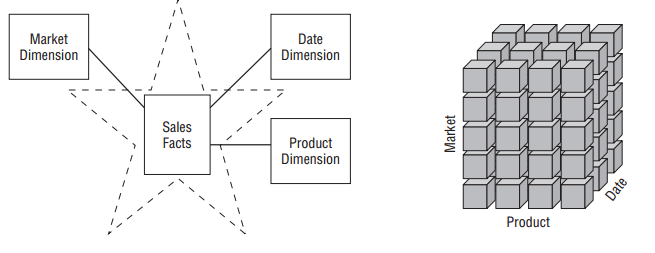
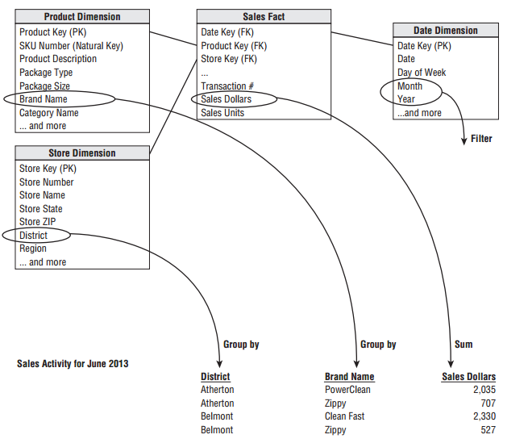

# Dimensional Modelling
***

## Introduction to Dimensional Data

Dimensional modelling helps to build the ability for users to query the information, for instance analysing results by a geographic region.  Multi-dimensional modelling is an extension to allowing multiple ways to analsye the information, by geographic region but also over time, by product or service, by store or office and so on. It provides a way for a system user, manager or analyst to navigate what information - the 'information space' - is available in a database or data warehouse, but at a more intuitive level [see @FIT5195, lecture 4].  The goal is to help understanding, exploration and to make better decisions.   A dimension is simply a direction, usually query or analytically based, in which you can move.  

The dimensions used therefore become the ways in which the end user wants to query the information.

Typical terms used in the BI arena for helping to navigate this 'information space' include; 'slice and dice' meaning to make a large data space in to a smaller one (you are making a selection or subset of all the available data), 'drill down' meaning to go in to a lower level of a hierachy (moving from a geographic region to a particular store), 'drill up' meaning to go in to a higher level (sometimes called rolling-up) and 'drill across' meaning adding more data (or facts) about something, typically from another source (a different fact table).

There are two slightly different interpretations of a dimensional model:

* **OLAP**: A dimension is a structural attribute of a data cube.  A dimension acts as an index for identifying values in a multi-dimensional array
* **Kimball**:  A dimension table are where the textual descriptions which relate to aspects of the business are stored 
[@FIT5195, lecture 4]

In both instances however, they provide ways to interact and understand our information.

### Data Modelling levels

There are three aspects of information with a Business Intelligence system - conceptual, logical and physical - which exist on a spectrum.  

* Conceptual - The business needs are usually the high level conceptual solution, what things we want to include at a more abstract level
* Logical - We start thinking about what data to include in the model and what data is available, it starts giving something which can be implemented in to a warehouse
* Physical - The final solution which is usually then what is implemented in the data warehouse. It is the more technical/IT solution and may include normalisation (3NF or higher) and perhaps other database optimisations to improve performance of the system.

In some instances, the conceptual and logical can become one and the same thing.    

Table: (\#tab:simple-table) The three levels of data modelling

Feature                Conceptual    Logical    Logical   
--------              ------------  ---------  ---------
Entity Names	             Y            Y
Entity Relationships	     Y            Y
Attributes	 	                          Y          
Primary Keys	 	                        Y          Y
Foreign Keys	 	                        Y          Y 
Table Names	 	 	                                   Y
Column Names	 	 	                                 Y
Column Data Types      

## Architecture considerations

There are a number of different approaches to implementing a data warehouse, or Enterprise Data Warehouse (EDW) from the IT or technical perspective.  However, all approaches use the dimensional data modelling technique.  A full detailed explanation of all possible architecture approaches, including hybrid approaches, is not included here.  Instead we discuss at a high level the three main approaches. Where they differ in terms of data modelling in part depends on the location of the dimensional model.

* **Kimball** - as the last part of the Extract Transform and Load (ETL) process the data is structured and loaded in to the desired dimensional model(s).  There is no EDW in the Kimball approach, instead the presentation area is where data is organized, stored, and made available for direct querying by users, report writers, and other analytical BI applications.  Data is stored in the multi-dimensional views as different data marts, which are typically subsets of all the data originally extracted, perhaps for different business users or services 

* **Inmon** -  suggests that the data should be relationally designed.  The data is stored in an EDW in third normal form (3NF).  The dimensional model then transates the data from the EDW in to something for an end user, visualisation tool or other such BI tool, potentially including data marts. A Hub and Spoke system is often used to describe the approach, with the EDW being the hub and the spokes being the depdendent data marts.  This helps to ensure a 'single verison of the truth'

* **Centralised approach** - similar to Inmon but without the dependent data marts (spokes).  Users directly target the EDW and there may be many different dimensional data models

* **Hybrid** - there are various different ways this could be setup, however one way would be that data is still stored in the EDW, but the dimensional model is used to help structure the data in the EDW.  Therefore the extra translation required from the EDW to a BI tool is reduced

* **Data Vault** - 

In the Kimball approach when attributes in separate dimension tables have the same column names and domain contents. 

> _After validating the data for conformance with the defined one-to-one and many-to-one business rules [as part of the ETL processs], it may be pointless to
take the final step of building a 3NF physical database, just before transforming the data once again into denormalized structures for the BI presentation area._
[@Kimball2013, pg 20]

For the kimball approach to work, so called 'conformed dimensions' must be developed which are said to conform _when attributes in separate dimension tables have the same column names and domain contents_ [@Kimball2013, pg 51].  

Inmon sees that the dimensional modelling technique can cause problems when teams need different star schemas - dimensional models - which then lead to a need to combine the different joins together, or lead to issues of duplication and inconsistencies.  

> simply doing dimensional modeling as a basis for data warehouse design leads down a dark path when multiple star joins are considered. It is never apparent that there is 
a problem with star joins when you are looking at just one star join. But when you look at multiple star joins, the limitations of dimensional modeling become apparent. 
[@Inmon2000]

Inmon concludes that dimensional modelling is only really suitable for data marts (ibid).

## Kimball Approach

Before work begins of the data modelling, it is neccessary to understand the needs of the business and the underlying data [@Kimball2013, pg 37].  The business needs arise out of meetings with manangers, decision makers and other representatives of the business.  Kimball also recommends meetings with _'source system experts and doing high-level
data profiling to assess data feasibilities'_ [@Kimball2013, pg 38].  Whilst the data modeller is 'in charge' the actual model should unfold via a series of interactive workshops with those business representatives.  Data governance reps should also be involved to obtain buy-in.  In this sense, the Kimball approach covers both the conceptual and physical, it may also include some considerations of physical level at initiation.

## Four-Step Dimensional Design Process

Kimball outlines four key decisions that are to be made during the design of a dimensional model include:

1. Select the business process - the operational activities done by the business, these activities create the facts

2. Declare the grain - what a single row represents.  The _atomic grain_ is the lowest data captured by the business, which is the ideal and can be aggregared (rolled-up) to other levels.  Different grains must not be mixed in the same fact table

3. Identify the dimensions - the descriptive attributes about the facts, to be used for analysis.  Provide the “who, what, where, when, why, and how” (6W) context 

4. Identify the facts - the measurements (how many) from the business process, it should relate to a physical observable event, rather than reporting needs

Typicall the output of this process is a star schema, with a fact table at the centre supported by the associated dimension tables, with primary/forenigh key relationships.  This is often then structured into a online analytical processing (OLAP) cube, which contains the facts and dimensions appropriate to the analysis, but allows for more detailed analytical capabilities than SQL.  Sometimes aggregated fact tables are built to speed up query performance, as are aggregated OLAP cubes which are typically designed for users.

A key advantage of the dimensional model approach is that new dimensions can be added to an existing fact table by adding a new foreign key column. 

## Graphical Representations

(\#fig:StarOLAP)Star schema versus OLAP cube [@Kimball2013, pg 9]

(\#fig:starexample)Star schema example [@Kimball2013, pg 16]

(\#fig:starreport)Star schema reporting [@Kimball2013, pg 17]

## Tips

* Just because something exists in the organisation or in a data source does not mean it has to be included.  You need to think about that to include and what to exclude.

# References {-}
