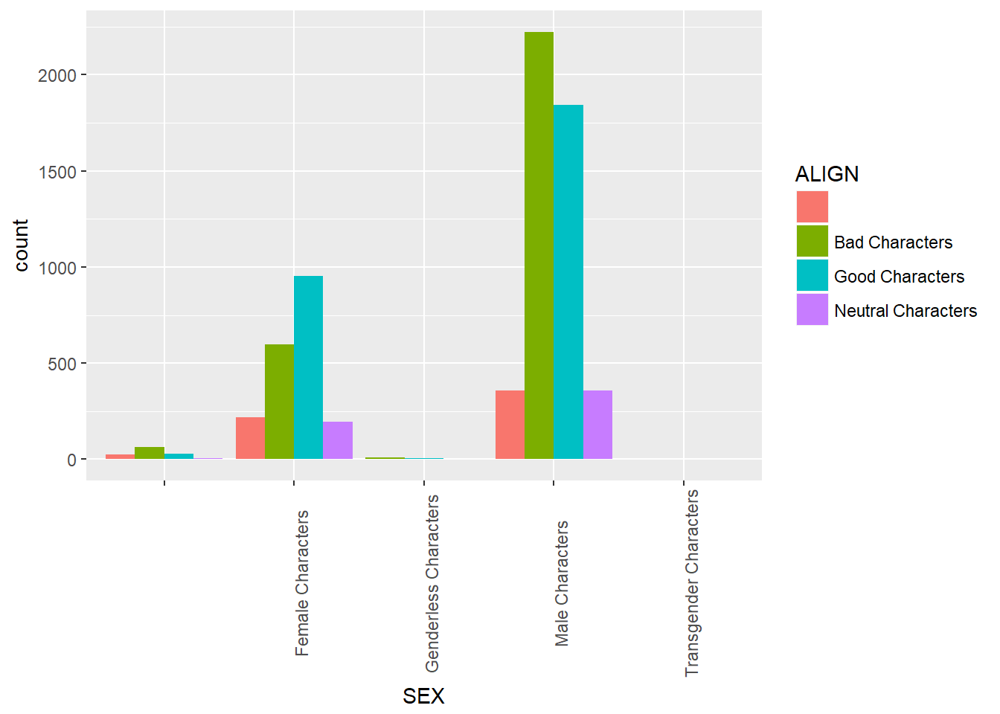
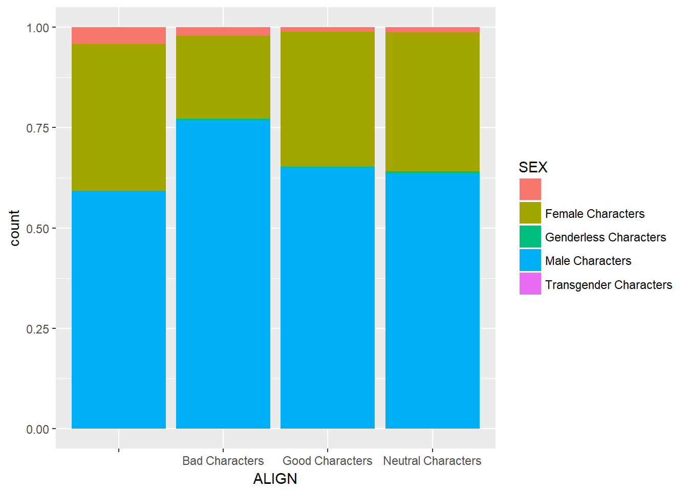
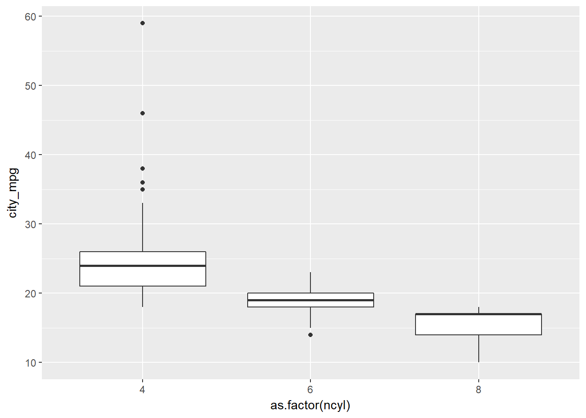
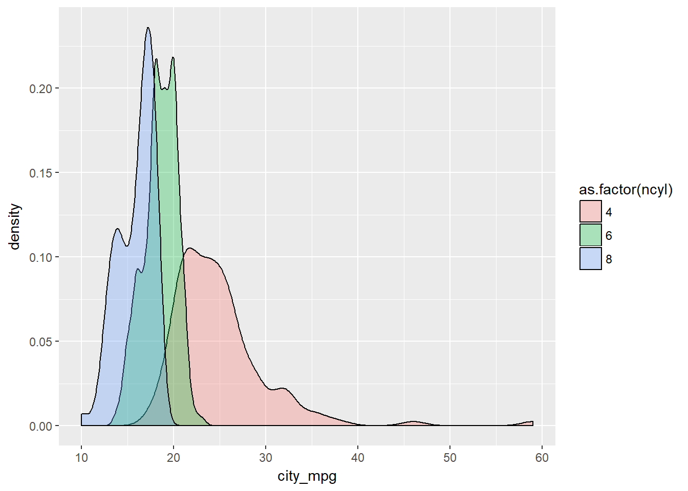
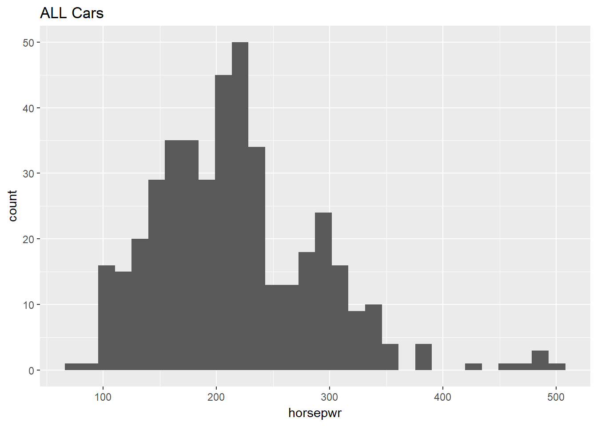
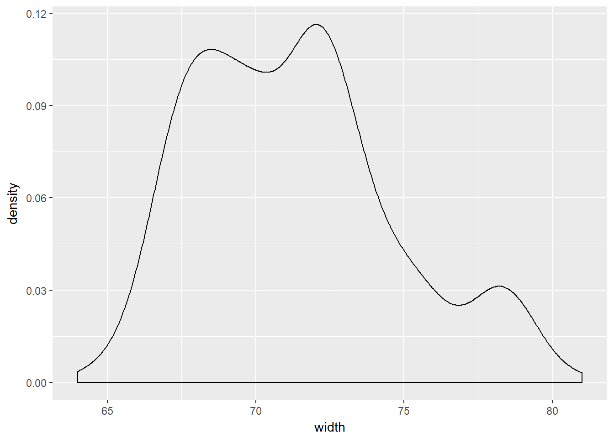
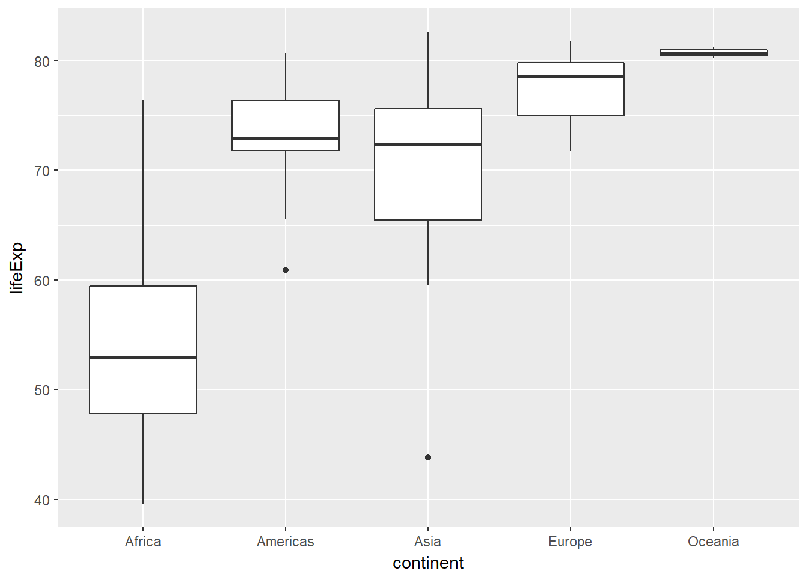
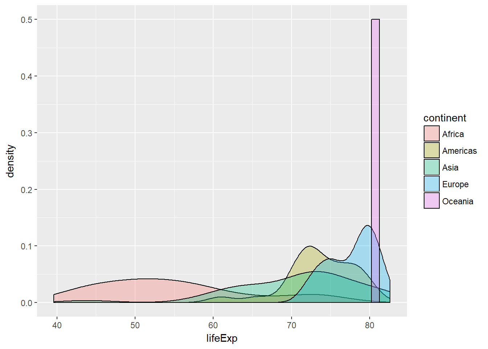

# Exploratory Data Analysis
***
Notes taken during/inspired by the Datacamp course "Exploratory Data Analysis" by Andrew Bray.

## Categorical Data

Common functions when looking at categorical, aka factors variables, are levels(df$var) and to get a contigency or xtab table the table(df$var1, df$var2).  We can also create bar charts to visually represent the data using ggplot.


```r
# Read in our dataset thanks to fivethirtyeight https://github.com/fivethirtyeight/data/tree/master/comic-characters

comics <- read.csv("https://raw.githubusercontent.com/fivethirtyeight/data/master/comic-characters/dc-wikia-data.csv", stringsAsFactors = TRUE)
comics$name <- as.character(comics$name)

# Check levels of align
levels(comics$ALIGN)
```

```
## [1] ""                   "Bad Characters"     "Good Characters"   
## [4] "Neutral Characters" "Reformed Criminals"
```

```r
# Check the levels of gender
levels(comics$SEX)
```

```
## [1] ""                       "Female Characters"     
## [3] "Genderless Characters"  "Male Characters"       
## [5] "Transgender Characters"
```

```r
# Create a 2-way contingency table
table(comics$ALIGN, comics$SEX)
```

```
##                     
##                           Female Characters Genderless Characters
##                        25               220                     0
##   Bad Characters       63               597                    11
##   Good Characters      30               953                     6
##   Neutral Characters    7               196                     3
##   Reformed Criminals    0                 1                     0
##                     
##                      Male Characters Transgender Characters
##                                  356                      0
##   Bad Characters                2223                      1
##   Good Characters               1843                      0
##   Neutral Characters             359                      0
##   Reformed Criminals               2                      0
```

To simplify an analysis, it often helps to drop levels with small amounts of data. In R, this requires two steps: first filtering out any rows with the levels that have very low counts, then removing these levels from the factor variable with droplevels(). This is because the droplevels() function would keep levels that have just 1 or 2 counts; it only drops levels that don"t exist in a dataset.


```r
# Load dplyr
library(dplyr)
```

```
## 
## Attaching package: 'dplyr'
```

```
## The following objects are masked from 'package:stats':
## 
##     filter, lag
```

```
## The following objects are masked from 'package:base':
## 
##     intersect, setdiff, setequal, union
```

```r
# Remove align level
comics <- comics %>%
  filter(ALIGN != "Reformed Criminals") %>%
  droplevels()
```

While a contingency table represents the counts numerically, it"s often more useful to represent them graphically.

Here you"ll construct two side-by-side barcharts of the comics data. This shows that there can often be two or more options for presenting the same data. Passing the argument position = "dodge" to geom_bar() says that you want a side-by-side (i.e. not stacked) barchart.


```r
# Load ggplot2
library(ggplot2)

# Create side-by-side barchart of gender by alignment
ggplot(comics, aes(x = ALIGN, fill = SEX)) + 
  geom_bar(position = "dodge")
```


```r
# Create side-by-side barchart of alignment by gender
ggplot(comics, aes(x = SEX, fill = ALIGN)) + 
  geom_bar(position = "dodge") +
  theme(axis.text.x = element_text(angle = 90))
```



When creatign tables, it is often easier to look at proportions for patterns rather than counts.  We can do this using conditional proportions, by using the prop.table(df_counts, n) where n is the number we want to condition our frequency/count table by, 1 = rows and 2 = columns.


```r
tab <- table(comics$ALIGN, comics$SEX)
options(scipen = 999, digits = 2) # Print fewer digits
prop.table(tab)     # Joint proportions (totals in the entire table)
```

```
##                     
##                              Female Characters Genderless Characters
##                      0.00363           0.03192               0.00000
##   Bad Characters     0.00914           0.08661               0.00160
##   Good Characters    0.00435           0.13826               0.00087
##   Neutral Characters 0.00102           0.02843               0.00044
##                     
##                      Male Characters Transgender Characters
##                              0.05165                0.00000
##   Bad Characters             0.32250                0.00015
##   Good Characters            0.26737                0.00000
##   Neutral Characters         0.05208                0.00000
```

```r
prop.table(tab, 2)  # Conditional on columns (column totals)
```

```
##                     
##                            Female Characters Genderless Characters
##                      0.200             0.112                 0.000
##   Bad Characters     0.504             0.304                 0.550
##   Good Characters    0.240             0.485                 0.300
##   Neutral Characters 0.056             0.100                 0.150
##                     
##                      Male Characters Transgender Characters
##                                0.074                  0.000
##   Bad Characters               0.465                  1.000
##   Good Characters              0.385                  0.000
##   Neutral Characters           0.075                  0.000
```

Here we see that approx. 49% of female characters are good, compared to 39% for males.

Bar charts can tell dramatically different stories depending on whether they represent counts or proportions and, if proportions, what the proportions are conditioned on. To demonstrate this difference, you"ll construct two barcharts in this exercise: one of counts and one of proportions.

```r
# Plot of gender by align
ggplot(comics, aes(x = ALIGN, fill = SEX)) +
  geom_bar()
```


```r
# Plot proportion of gender, conditional on align
ggplot(comics, aes(x = ALIGN, fill = SEX)) + 
  geom_bar(position = "fill")
```




**Conditional barchart**

Now, if you want to break down the distribution of alignment based on gender, you"re looking for conditional distributions.

You could make these by creating multiple filtered datasets (one for each gender) or by faceting the plot of alignment based on gender. As a point of comparison, we"ve provided your plot of the marginal distribution of alignment from the last exercise.


```r
# Plot of alignment broken down by gender
ggplot(comics, aes(x = ALIGN)) + 
  geom_bar() +
  facet_wrap(~ SEX)
```


## Numerical Data


```r
# Data courtesy of http://www.idvbook.com/teaching-aid/data-sets/ with some variable name modifictions to match those in the exercise
library(readxl)
cars <- read_excel("04cars data.xls", sheet = 1)
cars <- cars[-2] # remove variable 2

# Rename vars
names(cars) <- c("name", "sports_car", "suv", "wagon", "minivan", "pickup", "all_wheel", 
                "rear_wheel", "msrp", "dealer_cost", "eng_size", "ncyl", "horsepwr",
                "city_mpg","hwy_mpg",  "weight", "wheel_base", "length", "width")
# Change data tpyes as needed
cars[2:7] <- sapply(cars[2:7],as.logical)
cars[c(8:10,12:19)] <- sapply(cars[c(8:10,12:19)],as.integer)
```

```
## Warning in lapply(X = X, FUN = FUN, ...): NAs introduced by coercion

## Warning in lapply(X = X, FUN = FUN, ...): NAs introduced by coercion

## Warning in lapply(X = X, FUN = FUN, ...): NAs introduced by coercion

## Warning in lapply(X = X, FUN = FUN, ...): NAs introduced by coercion

## Warning in lapply(X = X, FUN = FUN, ...): NAs introduced by coercion

## Warning in lapply(X = X, FUN = FUN, ...): NAs introduced by coercion
```

```r
# Learn data structure
str(cars)
```

```
## Classes 'tbl_df', 'tbl' and 'data.frame':	428 obs. of  19 variables:
##  $ name       : chr  "Acura 3.5 RL 4dr" "Acura 3.5 RL w/Navigation 4dr" "Acura MDX" "Acura NSX coupe 2dr manual S" ...
##  $ sports_car : logi  FALSE FALSE FALSE TRUE FALSE FALSE ...
##  $ suv        : logi  FALSE FALSE TRUE FALSE FALSE FALSE ...
##  $ wagon      : logi  FALSE FALSE FALSE FALSE FALSE FALSE ...
##  $ minivan    : logi  FALSE FALSE FALSE FALSE FALSE FALSE ...
##  $ pickup     : logi  FALSE FALSE FALSE FALSE FALSE FALSE ...
##  $ all_wheel  : logi  FALSE FALSE TRUE FALSE FALSE FALSE ...
##  $ rear_wheel : int  0 0 0 1 0 0 0 0 0 0 ...
##  $ msrp       : int  43755 46100 36945 89765 23820 33195 26990 25940 31840 42490 ...
##  $ dealer_cost: int  39014 41100 33337 79978 21761 30299 24647 23508 28846 38325 ...
##  $ eng_size   : num  3.5 3.5 3.5 3.2 2 3.2 2.4 1.8 3 3 ...
##  $ ncyl       : int  6 6 6 6 4 6 4 4 6 6 ...
##  $ horsepwr   : int  225 225 265 290 200 270 200 170 220 220 ...
##  $ city_mpg   : int  18 18 17 17 24 20 22 22 20 20 ...
##  $ hwy_mpg    : int  24 24 23 24 31 28 29 31 28 27 ...
##  $ weight     : int  3880 3893 4451 3153 2778 3575 3230 3252 3462 3814 ...
##  $ wheel_base : int  115 115 106 100 101 108 105 104 104 105 ...
##  $ length     : int  197 197 189 174 172 186 183 179 179 180 ...
##  $ width      : int  72 72 77 71 68 72 69 70 70 70 ...
```

```r
# Create faceted histogram
ggplot(cars, aes(x = city_mpg)) +
  geom_histogram() +
  facet_wrap(~ suv)
```

```
## `stat_bin()` using `bins = 30`. Pick better value with `binwidth`.
```

```
## Warning: Removed 14 rows containing non-finite values (stat_bin).
```


The mileage of a car tends to be associated with the size of its engine (as measured by the number of cylinders). To explore the relationship between these two variables, you could stick to using histograms, but in this exercise you"ll try your hand at two alternatives: the box plot and the density plot.


```r
# Filter cars with 4, 6, 8 cylinders
common_cyl <- filter(cars, ncyl %in% c(4,6,8))

# Create box plots of city mpg by ncyl
ggplot(common_cyl, aes(x = as.factor(ncyl), y = city_mpg)) +
  geom_boxplot()
```

```
## Warning: Removed 11 rows containing non-finite values (stat_boxplot).
```



```r
# Create overlaid density plots for same data
ggplot(common_cyl, aes(x = city_mpg, fill = as.factor(ncyl))) +
  geom_density(alpha = .3)
```

```
## Warning: Removed 11 rows containing non-finite values (stat_density).
```



Now, turn your attention to a new variable: horsepwr. The goal is to get a sense of the marginal distribution of this variable and then compare it to the distribution of horsepower conditional on the price of the car being less than $25,000.

You"ll be making two plots using the "data pipeline" paradigm, where you start with the raw data and end with the plot.

In addition to indicating the center and spread of a distribution, a box plot provides a graphical means to detect outliers. You can apply this method to the msrp column (manufacturer"s suggested retail price) to detect if there are unusually expensive or cheap cars.


```r
# Create hist
cars %>% ggplot(aes(horsepwr)) +
  geom_histogram() +
  ggtitle("ALL Cars")
```

```
## `stat_bin()` using `bins = 30`. Pick better value with `binwidth`.
```



```r
# Create hist of horsepwr for affordable cars
cars %>% 
  filter(msrp < 25000) %>%
  ggplot(aes(horsepwr)) +
  geom_histogram() +
  xlim(c(90, 550)) +
  ggtitle("Affordable Cars")
```

```
## `stat_bin()` using `bins = 30`. Pick better value with `binwidth`.
```

```
## Warning: Removed 1 rows containing non-finite values (stat_bin).
```

```
## Warning: Removed 1 rows containing missing values (geom_bar).
```


```r
# Construct box plot of msrp
cars %>%
  ggplot(aes(x = 1, y = msrp)) +
  geom_boxplot()
```


```r
# Exclude outliers from data
cars_no_out <- cars %>%
  filter(msrp < 100000) 

# Construct box plot of msrp using the reduced dataset
cars_no_out %>%
 ggplot(aes(x = 1, y = msrp)) +
  geom_boxplot()
```


Consider two other columns in the cars dataset: city_mpg and width. Which is the most appropriate plot for displaying the important features of their distributions? Remember, both density plots and box plots display the central tendency and spread of the data, but the box plot is more robust to outliers.


```r
# Create plot of city_mpg
cars %>% 
  ggplot(aes(x = width)) +
  geom_density()
```

```
## Warning: Removed 28 rows containing non-finite values (stat_density).
```



```r
# Create plot of width
cars %>%
   ggplot(aes(x = 1, y = city_mpg)) +
   geom_boxplot()
```

```
## Warning: Removed 14 rows containing non-finite values (stat_boxplot).
```


Faceting is a valuable technique for looking at several conditional distributions at the same time. If the faceted distributions are laid out in a grid, you can consider the association between a variable and two others, one on the rows of the grid and the other on the columns.


```r
# Facet hists using hwy mileage and ncyl
common_cyl %>%
  ggplot(aes(x = hwy_mpg)) +
  geom_histogram() +
  facet_grid(ncyl ~ suv) +
  ggtitle("Faceted heavy mpg histograms by No. of Cyl and Suv")
```

```
## `stat_bin()` using `bins = 30`. Pick better value with `binwidth`.
```

```
## Warning: Removed 11 rows containing non-finite values (stat_bin).
```


## Numerical Summaries

Throughout this chapter, you will use data from gapminder, which tracks demographic data in countries of the world over time. To learn more about it, you can bring up the help file with ?gapminder.

For this exercise, focus on how the life expectancy differs from continent to continent. This requires that you conduct your analysis not at the country level, but aggregated up to the continent level. This is made possible by the one-two punch of group_by() and summarize(), a very powerful syntax for carrying out the same analysis on different subsets of the full dataset.


```r
library(gapminder)

# Create dataset of 2007 data
gap2007 <- filter(gapminder, year == 2007)

# Compute groupwise mean and median lifeExp
gap2007 %>%
  group_by(continent) %>%
  summarize(mean(lifeExp),
            median(lifeExp))
```

```
## # A tibble: 5 x 3
##   continent `mean(lifeExp)` `median(lifeExp)`
##      <fctr>           <dbl>             <dbl>
## 1    Africa              55                53
## 2  Americas              74                73
## 3      Asia              71                72
## 4    Europe              78                79
## 5   Oceania              81                81
```

```r
# Generate box plots of lifeExp for each continent
gap2007 %>%
  ggplot(aes(x = continent, y = lifeExp)) +
  geom_boxplot()
```



Let"s extend the powerful group_by() and summarize() syntax to measures of spread. If you"re unsure whether you"re working with symmetric or skewed distributions, it"s a good idea to consider a robust measure like IQR in addition to the usual measures of variance or standard deviation.


```r
# Compute groupwise measures of spread
gap2007 %>%
  group_by(continent) %>%
  summarize(sd(lifeExp),
            IQR(lifeExp),
            n())
```

```
## # A tibble: 5 x 4
##   continent `sd(lifeExp)` `IQR(lifeExp)` `n()`
##      <fctr>         <dbl>          <dbl> <int>
## 1    Africa          9.63          11.61    52
## 2  Americas          4.44           4.63    25
## 3      Asia          7.96          10.15    33
## 4    Europe          2.98           4.78    30
## 5   Oceania          0.73           0.52     2
```

```r
# Generate overlaid density plots
gap2007 %>%
  ggplot(aes(x = lifeExp, fill = continent)) +
  geom_density(alpha = 0.3)
```



```r
# Compute stats for lifeExp in Americas
gap2007 %>%
  filter(continent == "Americas") %>%
  summarize(mean(lifeExp),
            sd(lifeExp))
```

```
## # A tibble: 1 x 2
##   `mean(lifeExp)` `sd(lifeExp)`
##             <dbl>         <dbl>
## 1              74           4.4
```

```r
# Compute stats for population
gap2007 %>%
  summarize(median(pop),
            IQR(pop))
```

```
## # A tibble: 1 x 2
##   `median(pop)` `IQR(pop)`
##           <dbl>      <dbl>
## 1      10517531   26702008
```

### Transformations 
In some data, there are different 'humps' in the distribution, which are calls the modes or the modality of the dataset

* **Unimode** - single mean, this is a normal distribtion
* **Bimodal** - two common distributions
* **Multimodal** - three modes or more

We also should consider whether the distribution is skewed.  Right skewed data has a long tail to the right, with the majority of the distribution to the left - we often see this with income distributions.  Left skewed has a small number of observations to the left and the majoirty of the distribution to the right.  A normal distribution is typically smyterical.

Highly skewed distributions can make it very difficult to learn anything from a visualization. Transformations can be helpful in revealing the more subtle structure.

Here you'll focus on the population variable, which exhibits strong right skew, and transform it with the natural logarithm function (log() in R).


```r
# Create density plot of old variable
gap2007 %>%
  ggplot(aes(x = pop)) +
  geom_density()
```


```r
# Transform the skewed pop variable
gap2007 <- gap2007 %>%
  mutate(log_pop = log(pop))

# Create density plot of new variable
gap2007 %>%
  ggplot(aes(x = log_pop)) +
  geom_density()
```


### Outliers

It is often useful within a dataset to identify, using a column, whether the data is an outlier, this can be done by using the mutate function e.g. df <- df %>% mutate(is_outlier > value), then filtering and arranging the resulting table e.g. df %>% filter(is_outlier) %>% arrange(desc(value)).  We can also use this outlier column to remove the values from a plot e.g. df %>% filter(!is_outlier) %>% ggplot ... The determination of the outlier value might be arbitary, or you could use a percentile value (say top or bottom 2%).


```r
# Filter for Asia, add column indicating outliers
gap_asia <- gap2007 %>%
  filter(continent == "Asia") %>%
  mutate(is_outlier = lifeExp <50)

# Remove outliers, create box plot of lifeExp
gap_asia %>%
  filter(!is_outlier) %>%
  ggplot(aes(x = 1, y = lifeExp)) +
  geom_boxplot()
```


## Email Case Study

The example EDA comes from manually classified 3,900+ emails from the openintro package.  Is there an association between spam and the length of an email? You could imagine a story either way:

* Spam is more likely to be a short message tempting me to click on a link, or
*My normal email is likely shorter since I exchange brief emails with my friends all the time.

Here, you'll use the email dataset to settle that question. Begin by bringing up the help file and learning about all the variables with ?email.

As you explore the association between spam and the length of an email, use this opportunity to try out linking a dplyr chain with the layers in a ggplot2 object.


```r
library(openintro)
```

```
## Please visit openintro.org for free statistics materials
```

```
## 
## Attaching package: 'openintro'
```

```
## The following object is masked _by_ '.GlobalEnv':
## 
##     cars
```

```
## The following object is masked from 'package:datasets':
## 
##     cars
```

```r
# Compute summary statistics
email %>%
  group_by(spam) %>%
  summarise(median(num_char), IQR(num_char))
```

```
## # A tibble: 2 x 3
##    spam `median(num_char)` `IQR(num_char)`
##   <dbl>              <dbl>           <dbl>
## 1     0                6.8            13.6
## 2     1                1.0             2.8
```

```r
# Create plot
email %>%
  mutate(log_num_char = log(num_char)) %>%
  ggplot(aes(x = factor(spam), y = log_num_char)) +
  geom_boxplot()
```


Let's look at a more obvious indicator of spam: exclamation marks. exclaim_mess contains the number of exclamation marks in each message. Using summary statistics and visualization, see if there is a relationship between this variable and whether or not a message is spam.

Note: when computing the log(0) is -Inf in R, which isn't a very useful value! You can get around this by adding a small number (like .01) to the quantity inside the log() function. This way, your value is never zero. This small shift to the right won't affect your results.


```r
# Compute center and spread for exclaim_mess by spam
email %>%
  group_by(spam) %>%
  summarise(mean(exclaim_mess), sd(exclaim_mess))
```

```
## # A tibble: 2 x 3
##    spam `mean(exclaim_mess)` `sd(exclaim_mess)`
##   <dbl>                <dbl>              <dbl>
## 1     0                  6.5                 48
## 2     1                  7.3                 80
```

```r
# Create plot for spam and exclaim_mess
email %>%
  ggplot(aes(log(exclaim_mess)+0.1)) +
  geom_histogram() +
  facet_wrap( ~ spam) +
  ggtitle("Number of exclamation marks by not-spam vs spam")
```

```
## `stat_bin()` using `bins = 30`. Pick better value with `binwidth`.
```

```
## Warning: Removed 1435 rows containing non-finite values (stat_bin).
```


If it was difficult to work with the heavy skew of exclaim_mess, the number of images attached to each email (image) poses even more of a challenge.


```r
table(email$image)
```

```
## 
##    0    1    2    3    4    5    9   20 
## 3811   76   17   11    2    2    1    1
```

Recall that this tabulates the number of cases in each category (so there were 3811 emails with 0 images, for example). Given the very low counts at the higher number of images, let's collapse image into a categorical variable that indicates whether or not the email had at least one image. In this exercise, you'll create this new variable and explore its association with spam.

** Here we deal with zero inflation** by converting the many zero values and the non zeros in to a categorical variable.  There are other strategies, such as doing analysis on these two groups seperatley.


```r
# Create plot of proportion of spam by image
email %>%
  mutate(has_image = image > 0) %>%
  ggplot(aes(x = has_image, fill = factor(spam))) +
  geom_bar(position = "fill")
```


Sometimes it is neccessary to check if our understanding of the data and how it has been created is correct and if the values we expect are in fact true.  

In this instance, we check first if the number of charecters in the email is greater than zero (which it should be), then secondly whether images count as attachments using a boolean operator.  If image is never greater than attach, we can infer that images are counted as attachments.


```r
# Verify that all emails have non-negative values for num_char
sum(email$num_char < 0)
```

```
## [1] 0
```

```r
# Test if images count as attachments
sum(email$images >= email$attach)
```

```
## [1] 0
```

When you have a specific question about a dataset, you can find your way to an answer by carefully constructing the appropriate chain of R code. For example, consider the following question:

> "Within non-spam emails, is the typical length of emails shorter for those that were sent to multiple people?"

This can be answered with the following chain:


```r
email %>%
   filter(spam == "not-spam") %>%
   group_by(to_multiple) %>%
   summarize(median(num_char))
```

```
## # A tibble: 0 x 2
## # ... with 2 variables: to_multiple <dbl>, median(num_char) <lgl>
```

The code makes it clear that you are using num_char to measure the length of an email and median() as the measure of what is typical. If you run this code, you'll learn that the answer to the question is "yes": the typical length of non-spam sent to multiple people is a bit lower than those sent to only one person.

This chain concluded with summary statistics, but others might end in a plot; it all depends on the question that you're trying to answer.

> For emails containing the word "dollar", does the typical spam email contain a greater number of occurrences of the word than the typical non-spam email? Create a summary statistic that answers this question.
> If you encounter an email with greater than 10 occurrences of the word "dollar", is it more likely to be spam or not-spam? Create a barchart that answers this question.


```r
# Question 1
email %>%
  filter(dollar > 0) %>%
  group_by(spam) %>%
  summarize(median(dollar))
```

```
## # A tibble: 2 x 2
##    spam `median(dollar)`
##   <dbl>            <dbl>
## 1     0                4
## 2     1                2
```

```r
# Question 2
email %>%
  filter(dollar > 10) %>%
  ggplot(aes(x = spam)) +
  geom_bar()
```


Turn your attention to the variable called number. To explore the association between this variable and spam, select and construct an informative plot. For illustrating relationships between categorical variables, you've seen


```r
# Reorder levels
email$number <- factor(email$number, levels = c("none", "small", "big"))

# Construct plot of number
ggplot(email, aes(x = number)) +
  geom_bar() +
  facet_wrap(~ spam)
```


