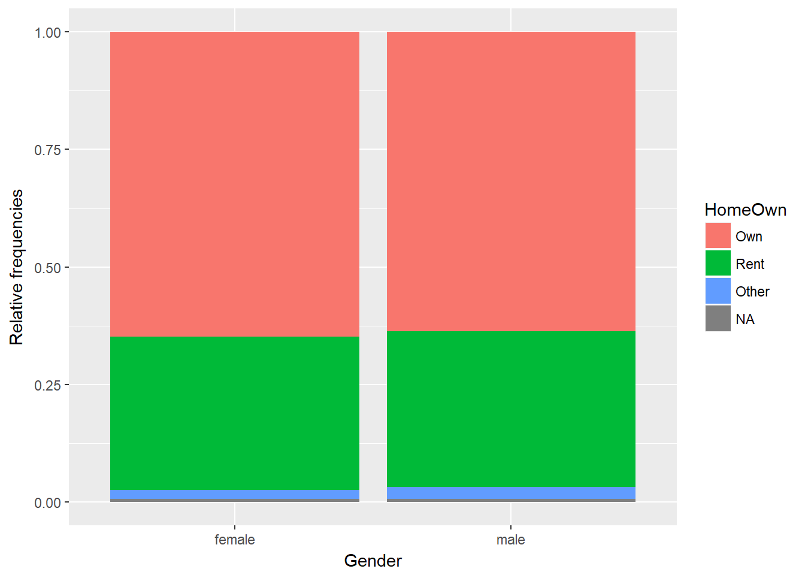
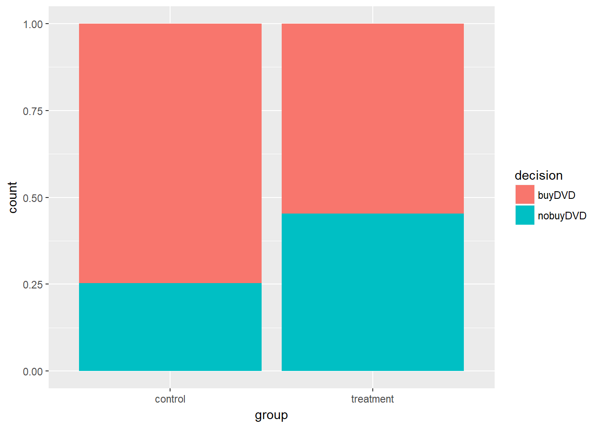
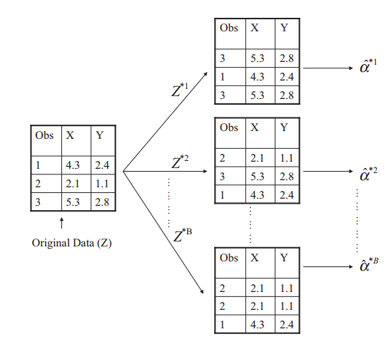

# Foundations of Inference
***
Notes taken during/inspired by the Datacamp course 'Foundations of Inference' by Jo Hardin, collaborators; Nick Carchedi and Tom Jeon.

## Introduction to Inference

Classical statistical inference is the process of making claims about a population based on a sample of information.  We are making an inference from a small group (sample) to a much larger one (population).  We typically have:

* **Null Hypothesis $H_{0}$**: What we are researching has no effect
* **Alternate Hypothesis $H_{A}$**: What we are researching does have an effect

Under the null hypothesis, chance alone is responsible for the results.  Under the alternate hypothesis, we reject the null hypothesis, by using statistical techniques that indicate that chance is not responsible for our findings.  Hypothesis or statistical testing goes back over 300 years, with the first recorded use by John Arbuthnot: 

Table: (\#tab:simple-table) Statistical Testing Applications 

 Year     Person        Context   
--------  ------------  -------------  
1710      Arbuthnot     Sex ratio at birth          
1767      Michelle      Distribution of  stars 
1823      Laplace       Moon phase and barometric changes 
1900      K. Pearson    Goodness of  fit 
1908      Gosset        A single mean 

Source: [@Huberty1993, pg 318]

Contemporary statistical testing is a usually that of either Fisher or Neyman-Pearson approaches. Fisher tends to use a single hypothesis test and a p-value strength of evidence test, where as the Neyman-Pearson test will set a critical alpha value and compare the null hypothesis against an alternative hypothesis, rejecting the null if the test statistic is high enough [@Huberty1993, pg 318]. 

The course goes on to say that idea behind statistical inference is to understand samples from a hypothetical population, where the null hypothesis is true - there is no difference between two groups. We can do this by calculating one statistic - for instance the proportion (mean) of a test group who show a positive response when testing a new drug, compared to a placebo control group - for each repeated sample from a population, then work out the difference between these two groups means. With each sample, the mean will change, resulting in a changing difference for each sample.

We can then generate a distribution (histogram) of differences, assuming the null hypothesis - that there is no link between drug effectiveness between a test group and a control group - is true. *"Generating a distribution of the statistic from the null population gives information about whether the observed data are inconsistent with the null hypothesis"*. That is to say, by taking repeated samples and creating a distribution, we can then say whether our observed difference is consistent (within an acceptable value range due to chance) to the null hypothesis. The null samples consist of randomly shuffled drug effectiveness variables (permuted samples from the population), so that the samples don't have any dependency between the two groups and effectiveness. 

## Home Ownership by Gender

Data used in the exercises are from NHANES 2009-2012 With Adjusted Weighting.

This is survey data collected by the US National Center for Health Statistics (NCHS) which has conducted a series of health and nutrition surveys since the early 1960's. Since 1999 approximately 5,000 individuals of all ages are interviewed in their homes every year and complete the health examination component of the survey. The health examination is conducted in a mobile examination centre (MEC).

The NHANES target population is "the non-institutionalized civilian resident population of the United States". NHANES, (American National Health and Nutrition Examination surveys), use complex survey designs (see http://www.cdc.gov/nchs/data/series/sr_02/sr02_162.pdf) that oversample certain subpopulations like racial minorities. 


```r
# Load packages
library("dplyr")
library("ggplot2")
library("NHANES")
library("oilabs")
```


```r
# Create bar plot for Home Ownership by Gender
ggplot(NHANES, aes(x = Gender, fill = HomeOwn)) + 
  geom_bar(position = "fill") +
  ylab("Relative frequencies")
```




```r
# Density for SleepHrsNight coloured by SleepTrouble, faceted by HealthGen
ggplot(NHANES, aes(x = SleepHrsNight, col = SleepTrouble)) + 
  geom_density(adjust = 2) + 
  facet_wrap(~ HealthGen)
```


Next we want to create a selection for just our variables of interest - rent and owner occupation.


```r
# Subset the data: homes
homes <- NHANES %>%
  select(Gender, HomeOwn) %>%
  filter(HomeOwn %in% c("Own", "Rent"))
```

We build a distribution of differences assuming the null hypothesis - that there is no link between gender and home ownership - is true. 

In this first step, we just do a single iteration, or permutation from the true values.  The null (permuted) version here will create a randomly shuffled home ownership variable, so that the permuted version does not have any dependency between gender and homeownership.  We effectively have the same gender split variables as per the original, with the same owned and rented proportions, but disassociated from the gender variable - just randomly shuffled.


```r
# Perform one permutation 
homes %>%
  mutate(HomeOwn_perm = sample(HomeOwn)) %>%
  group_by(Gender) %>%
  summarize(prop_own_perm = mean(HomeOwn_perm == "Own"), 
            prop_own = mean(HomeOwn == "Own")) %>%
  summarize(diff_perm = diff(prop_own),
            diff_orig = diff(prop_own_perm))
```

```
## # A tibble: 1 x 2
##      diff_perm    diff_orig
##          <dbl>        <dbl>
## 1 -0.007828723 0.0008207949
```

It is easier to see what is going on by breaking the results down iteratively.  Our selected and filtered homes dataset looks like. 


```r
head(homes)
```

```
## # A tibble: 6 x 2
##   Gender HomeOwn
##   <fctr>  <fctr>
## 1   male     Own
## 2   male     Own
## 3   male     Own
## 4   male     Own
## 5 female    Rent
## 6   male    Rent
```

Next we shuffle this data, let's call it homes 2. we can then check the total number of owns and rents are the same using the summary function, which confirms the data is just randomly shuffled.


```r
homes2 <- homes %>%
  mutate(HomeOwn_perm = sample(HomeOwn)) %>%
  group_by(Gender)
tail(homes2)
```

```
## # A tibble: 6 x 3
## # Groups:   Gender [2]
##   Gender HomeOwn HomeOwn_perm
##   <fctr>  <fctr>       <fctr>
## 1   male    Rent         Rent
## 2   male    Rent         Rent
## 3 female     Own         Rent
## 4   male     Own         Rent
## 5   male     Own          Own
## 6   male     Own          Own
```

```r
summary(homes2)
```

```
##     Gender      HomeOwn     HomeOwn_perm
##  female:4890   Own  :6425   Own  :6425  
##  male  :4822   Rent :3287   Rent :3287  
##                Other:   0   Other:   0
```

Then we calculate the mean value of home ownership (Own) across our original and shuffled (permutated) data


```r
homes3 <- homes2 %>% 
  summarize(prop_own_perm = mean(HomeOwn_perm == "Own"), 
             prop_own = mean(HomeOwn == "Own"))
homes3
```

```
## # A tibble: 2 x 3
##   Gender prop_own_perm  prop_own
##   <fctr>         <dbl>     <dbl>
## 1 female     0.6640082 0.6654397
## 2   male     0.6590626 0.6576109
```

FFinally we calculate the differences in ownership - note that the difference for the permuted value here may be different from the full code above, as it a new random permutation and we have used the set.seed() function which would create an identical permutation.


```r
homes4 <- homes3 %>% 
  summarize(diff_perm = diff(prop_own),
  diff_orig = diff(prop_own_perm))
homes4
```

```
## # A tibble: 1 x 2
##      diff_perm   diff_orig
##          <dbl>       <dbl>
## 1 -0.007828723 -0.00494555
```

## Density Plots
Next we can make multiple permutations using the rep_sample_n from the oilabs package.  We specify  the data (tbl), the sample size, the number of samples to take (reps), and whether sampling should be done with or without replacement (replace). The output includes a new column, replicate, which indicates the sample number. We can create 100 permutations and create a dot plot of the results.


```r
# Perform 100 permutations
homeown_perm <- homes %>%
  rep_sample_n(size = nrow(homes), reps = 100) %>%
  mutate(HomeOwn_perm = sample(HomeOwn)) %>%
  group_by(replicate, Gender) %>%
  summarize(prop_own_perm = mean(HomeOwn_perm == "Own"), 
            prop_own = mean(HomeOwn == "Own")) %>%
  summarize(diff_perm = diff(prop_own_perm),
            diff_orig = diff(prop_own)) # male - female

# Dotplot of 100 permuted differences in proportions
ggplot(homeown_perm, aes(x = diff_perm)) + 
  geom_dotplot(binwidth = .001)
```


We can go further and run 1000 permutations and create a density chart.


```r
set.seed(666)
# Perform 1000 permutations
homeown_perm <- homes %>%
  rep_sample_n(size = nrow(homes), reps = 1000) %>%
  mutate(HomeOwn_perm = sample(HomeOwn)) %>%
  group_by(replicate, Gender) %>%
  summarize(prop_own_perm = mean(HomeOwn_perm == "Own"), 
            prop_own = mean(HomeOwn == "Own")) %>%
  summarize(diff_perm = diff(prop_own_perm),
            diff_orig = diff(prop_own)) # male - female

# Density plot of 1000 permuted differences in proportions
ggplot(homeown_perm, aes(x = diff_perm)) + 
  geom_density()
```


Now we have our density plot of the null hypothesis - randomly permuted samples - we can see where our actual observed difference lies, plus how many randomly permuted differences were less than the observed difference.


```r
  # Plot permuted differences
ggplot(homeown_perm, aes(x = diff_perm)) + 
  geom_density() +
  geom_vline(aes(xintercept = diff_orig),
          col = "red")
```


```r
# Compare permuted differences to observed difference and calculate the percent of differences
homeown_perm %>%
  summarize(sum(diff_orig >= diff_perm)) /1000 * 100
```

```
##   sum(diff_orig >= diff_perm)
## 1                        21.5
```

So in this instance, when we set the seed of 666 we end up with 20.5% of randomly shuffled (permuted) differences being greater than the observed difference, so the observed difference is consistent with the null hypothesis.  That it to say it is within the range we may expect by chance alone, were we to repeat the exercise, although we should specify a distribtion we are comparing against, in this which is inferred as being the normal distribution in this instance.  __We can therefore say that there is no statistically significant difference between gender and home ownership__.  Or put more formally

>__We fail to reject the null hypothesis:__
> There is no evidence that our data are inconsistent with the null hypothesis

## Gender Discrimination (p-values)

In this section we use data from @Rosen1974, where 48 male bank supervisors were given personnel files and asked if they should be promoted to Branch Manager. All files were identical, but half (24) were named as female, and the other half (24) were named male.  The results showed 21 males were promoted and 14 females, meaning 35  of the total 48 were promoted. In @Rosen1974 sex was given along with an indication of the difficulty - routine or complex - here we only look at the routine promotion candidates.  Do we know if gender is a statistically significant factor?  

* **Null Hypothesis $H_{0}$**: Gender and promotion are unrelated variables
* **Alternate Hypothesis $H_{A}$**: Men are more likely to be promoted

First, we create the data frame disc


```r
disc <- data.frame(
  promote = c(rep("promoted", 35), rep("not_promoted", 13)),
  sex = c(rep("male", 21), rep("female", 14), rep("male", 3), rep("female", 10))
)
```

Then let's see the resulting table and proportion who were promoted


```r
table(disc)
```

```
##               sex
## promote        female male
##   not_promoted     10    3
##   promoted         14   21
```

```r
disc %>%
  group_by(sex) %>%
  summarise(promoted_prop = mean(promote == "promoted"))
```

```
## # A tibble: 2 x 2
##      sex promoted_prop
##   <fctr>         <dbl>
## 1 female     0.5833333
## 2   male     0.8750000
```

So there difference in promotions by gender is around 0.3 or around 30%, but could this be due to chance?  We can create 1000 permutations and compare our observed diffrence to the distribution, plus how many randomly permuted differences were less than the observed difference.


```r
# Create a data frame of differences in promotion rates
set.seed(42)
disc_perm <- disc %>%
  rep_sample_n(size = nrow(disc), reps = 1000) %>%
  mutate(prom_perm = sample(promote)) %>%
  group_by(replicate, sex) %>%
  summarize(prop_prom_perm = mean(prom_perm == "promoted"),
            prop_prom = mean(promote == "promoted"))   %>%
  summarize(diff_perm = diff(prop_prom_perm),
            diff_orig = diff(prop_prom))  # male - female

# Histogram of permuted differences
ggplot(disc_perm, aes(x = diff_perm)) + 
  geom_density() +
  geom_vline(aes(xintercept = diff_orig), col = "red")
```


```r
# Compare permuted differences to observed difference and calculate the percent of differences
disc_perm %>%
  summarize(sum(diff_orig >= diff_perm)) /1000 * 100
```

```
##   sum(diff_orig >= diff_perm)
## 1                        99.3
```

So here, just 0.5% of the randomly permuted/shuffled results are greater than our observed promotion differences, or 99.5% are lower, so our results are definitely quite extreme.  We typically use a 5% cut off, which the course mentions is arbitrary and historic, being attributed to Fisher.  So we can say at 0.5% our value is within this critical region, meaning the results are statistically significant - we should not ignore them.  We can calculate quantiles of the null statistic using our randomly generated shuffles.


```r
disc_perm %>% 
  summarize(q.90 = quantile(diff_perm, p = 0.90),
            q.95 = quantile(diff_perm, p = 0.95),
            q.99 = quantile(diff_perm, p = 0.99))
```

```
## # A tibble: 1 x 3
##        q.90      q.95      q.99
##       <dbl>     <dbl>     <dbl>
## 1 0.2083333 0.2083333 0.2916667
```

So here, 95% of our null differences are 0.208 or lower, indeed 99% are 0.292 or lower, so our observed difference of 0.3 is quite extreme - it is in the critical region of the distribution.  We can go one step further by calculating the p-value.

> __The p-value is__: the probability of observing data as or more extreme than what we actually got given that the null hypothesis is true.


```r
disc_perm %>%
  summarize(mean(diff_orig <= diff_perm))
```

```
## # A tibble: 1 x 1
##   `mean(diff_orig <= diff_perm)`
##                            <dbl>
## 1                          0.025
```

So the p-value here is 0.028 (less than 3 %).  If repeat the exercise with smaller and larger number of shuffles we would get different p-values.


```
## # A tibble: 1 x 1
##   `mean(diff_orig <= diff_perm)`
##                            <dbl>
## 1                           0.01
```

```
## # A tibble: 1 x 1
##   `mean(diff_orig <= diff_perm)`
##                            <dbl>
## 1                         0.0227
```

With 100 shuffles our p-value is 0.03, and with 10,000 shuffles our p-value is 0.0235.  If we had a two-tailed test - for instance if we said the original research hypothesis had focused on any difference in promotion rates between men and women instead of focusing on whether men are more likely to be promoted than women - we could simple double the p-value.  

>__In both cases, the p-value is below or close to the 0.05 (5%) critical value, meaning we can reject the null hypthesis as there is evidence that our data are inconsistent with the null hypothesis.  However, as both values are close to the critical value, we should indicate that more work should be done__.  

Indeed since the @Rosen1974 study, many further studies have been undertaken and found a similar pattern of discrimination.

## Opportunity Cost

In @Frederick2009 their study showed that when potential purchasers were reminded that if they did not buy a particular DVD they could instead save the money, when compared to a control group who were just told they could not buy the DVD, those being reminded of the saving appeared to be more inclined not to make the purchase - 34 in the treatment group did not buy compared to 19 in the control.  So our test is setup as:

* **Null Hypothesis $H_{0}$**: Reminding students will have no impact on their spending decisions 
* **Alternate Hypothesis $H_{A}$**: Reminding students will reduce the chance they continue with a purchase

We can create a data frame containing the results and find the initial proportions.


```r
#create the data frame
opportunity <- data.frame(
  decision = c(rep("buyDVD", 97), rep("nobuyDVD", 53)),
  group = c(rep("control", 56), rep("treatment", 41), rep("control", 19), rep("treatment", 34))
)
```


```r
# Tabulate the data
opportunity %>%
  select(decision, group) %>%
  table()
```

```
##           group
## decision   control treatment
##   buyDVD        56        41
##   nobuyDVD      19        34
```

```r
# Find the proportion who bought the DVD in each group
opportunity %>%
  group_by(group) %>%
  summarize(buy_prop = mean(decision == "buyDVD"))
```

```
## # A tibble: 2 x 2
##       group  buy_prop
##      <fctr>     <dbl>
## 1   control 0.7466667
## 2 treatment 0.5466667
```

So around 55% of the treatment group  - those who were reminded they could save the money - bought the DVD, comapred to 75% of the control group.  We can represent this with a bar plot.



As before, we can calculate 1000 random shuffles and then compare our difference in proportions, to the distribution of those 1000 samples.  


And finally, we can calculate the p-value


```
## # A tibble: 1 x 1
##   `mean(diff_perm <= diff_orig)`
##                            <dbl>
## 1                          0.012
```

In this instance, of p-value is substantially less than the usual critical value - 0.8% versus the usual value of 5% - so we can can reject the null hypthesis as there is evidence that our data are inconsistent with the null hypothesis.  Our results would only occur 8 times in 1000 by chance.  We can therefore accept the alternative hypothesis ($H_{A}$) that reminding students does cause them to be less likely to buy a DVD, as they were randomly assigned to the treatment and control groups, therefore any difference is due to the reminder to save.  Who can we therefore make the inference to?  Our sample was drawn from the student population for the @Frederick2009 study, so we would be able to generalise to that student population however defined, but not to another wider population.

## Type I and Type II errors

In our research and conslusions there is a risk that we will be incorrect, we will make an error.  The two errors are:

>__Type I error__ : The null hypothesis ($H_{0}$) is true, but is rejected.  On the basis of the evidence, we have decided to erroneously accept the alternative hypothesis ($H_{A}$) when in fact the null hypothesis is correct. It is sometimes called a false positive.

>__Type II error__ : the null hypothesis is false, but erroneously fails to be rejected.  On the basis of the evidence, we have failed to accept the alternative hypothesis despite it being correct - an effect that exists in the population. It is sometimes called a false negative.

If we return to our previous example, our associated errors would be

Type I: There is not a difference in proportions, but the observed difference is big enough to indicate that the proportions are different.

Type II: There is a difference in proportions, but the observed difference is not large enough to indicate that the proportions are different.

## Bootstrapping

Sometimes we are not neccessarily interested in testing a hypothesis, we are instead interested in making a claim about how our sample can be inferred to a large population.  To do so we use confidece intervals.  When calculating confidence intervals there is no null hypothesis like in hypothesis testing.  We need to understand how samples from our population vary around the parameter of interest.  In an ideal world we would take many samples from the population or know what the true value is in the population, but realistically this is not possible, so we use booststrapping.

Bootstrapping is the process of taking repeated samples from the same sample, to estimate the variability.  As our population parameters are not known, we can use our sample to estimate a simulated population parameter ($\hat{p}*$) by repeated sampling.  We can then estimate other parameters such as the standard deviation, s.e. and the confidence interval.  Instead of taking repeated samples from our population, we take repeated samples from our data, with replacement, each bootstrap sample is the same size as the original sample.

<div class="figure">

<p class="caption">(\#fig:bootstrap)Illustration of the bootstrap approach on a small sample containing n = 3 observations [@ISLR2013, pg 190]</p>
</div>

Firstly we setup our single poll, where 70% (21/30) are intended to vote for a particular candidate


```r
# Setup our single poll example
one_poll <- sample(rep(c(0, 1), times = c(9,21)))
one_poll <- tbl_df(one_poll)
colnames(one_poll) <- "vote"
```

Next we can create 1000 bootstrap samples from this original poll, then calculate the variability


```r
set.seed(42)
# Generate 1000 resamples of one_poll: one_poll_boot_30
one_poll_boot_30 <- one_poll %>%
  rep_sample_n(size = 30, replace = TRUE, reps = 1000)

# Compute p-hat* for each resampled poll
ex1_props <- one_poll_boot_30 %>%
  summarize(prop_yes = mean(vote)) %>%
  summarize(sd(prop_yes)) #compute variability p-hat*
ex1_props
```

```
## # A tibble: 1 x 1
##   `sd(prop_yes)`
##            <dbl>
## 1     0.08624387
```

So the variability - the standard error or SE - of $\hat{p}*$ is 0.0841.  We can now use this SE to calculate a confidence interval, since 95% of samples will be within +/- 1.96 standard errors of the centre of the distribution assuming a normal distribution $N(\mu, \sigma ^2)$.  We also use the bootstrap to calculate our bootstrap confidence interval, to give a range of possible values.


```r
# Compute p-hat for one poll
p_hat <- mean(one_poll$vote)

set.seed(42)
# Bootstrap to find the SE of p-hat: one_poll_boot
one_poll_boot <- one_poll %>%
  rep_sample_n(30, replace = TRUE, reps = 1000) %>%
  summarize(prop_yes_boot = mean(vote))

# Create an interval of possible values
one_poll_boot %>%
  summarize(lower = p_hat - 1.96 * sd(prop_yes_boot),
            upper = p_hat + 1.96 * sd(prop_yes_boot))
```

```
## # A tibble: 1 x 2
##      lower    upper
##      <dbl>    <dbl>
## 1 0.530962 0.869038
```

So our possible range of values, using the bootstrap at 95%, is between 53.2% and 86.8%.  Going back to our original statement, we had a single poll where 70% of those polled intended to vote for a particular candidate.  We can now say, using the bootstrap t-confidence interval, we are 95% confident that the true proportion planning to vote for the candidate is between 53% and 87%.  We are assuming that the distribution is normally distributed $N(\mu, \sigma ^2)$.

# References {-}
