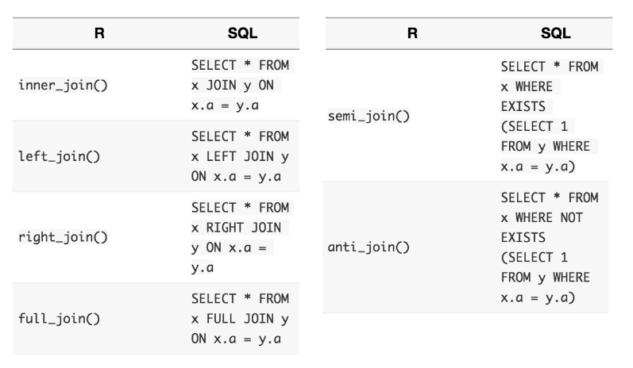

# Joining Data in R with dplyr
***
Notes taken during/inspired by the Datacamp course 'Joining Data in R with dplyr' by Garrett Grolemund.

Other useful info:

* [R for Data Science Book](http://r4ds.had.co.nz/)
* [Data Wrangling Cheatsheet](https://www.rstudio.com/wp-content/uploads/2015/02/data-wrangling-cheatsheet.pdf)
* [dplyr two table verbs vignette](https://cran.r-project.org/web/packages/dplyr/vignettes/two-table.html)
* [dbplyr vignette](https://cran.r-project.org/web/packages/dbplyr/vignettes/dbplyr.html)

Course Slides:

* [Part1 - Mutating Joins](https://s3.amazonaws.com/assets.datacamp.com/production/course_1074/slides/ch1-pdf.pdf)
* [Part2 - Filtering joins and set operations](https://s3.amazonaws.com/assets.datacamp.com/production/course_1074/slides/ch2-pdf.pdf)
* [Part3 - Assembling data](https://s3.amazonaws.com/assets.datacamp.com/production/course_1074/slides/ch3-pdf.pdf)
* [Part4 - Advanced joining](https://s3.amazonaws.com/assets.datacamp.com/production/course_1074/slides/ch4-pdf.pdf)
* [Part5 - Case Study](https://s3.amazonaws.com/assets.datacamp.com/production/course_1074/slides/ch5-pdf.pdf)

## Mutating joins

Data is best used in R when in a single data table.  This course introduces a number of techniques to achieve this.  Dplyr also has connectors to a range of different databases, so can be used to both extract and manipulate data in databases.

### Keys

We often want to join two tables together, adding a set of values or variables from a second table(s).  For this to happen, we need a key, whereby we have a key in the initial table (a primary key) that is uniquely identifies rows in that within that table or dataset (we don't have duplicates) and we then use this key to add in data from a secondary table (the foreign key to that table).  The foreign key in the secondary table may be duplicated or not appear at all.  Sometimes no single variable acts as a primary key in a dataset. Instead, it takes a combination of variables to uniquely identify each row, for example a table of addresses with different columns representing sections of the address - house number, street name, postcode/zip code.

When working with dplyr, it works with the following tables for the purposes of joining data

* **Tables** in dplyr are one of the following:
* **data frames**
* **tibbles (tbl_df)** - similar to data frame but only what fits in to your R console window will be displayed but you can use View() all the table if needed 
* **tbl references**

<div class="figure">

<p class="caption">(\#fig:Dplyr Joins)Joins available in Dplyr</p>
</div>

```
## 
## Attaching package: 'dplyr'
```

```
## The following objects are masked from 'package:stats':
## 
##     filter, lag
```

```
## The following objects are masked from 'package:base':
## 
##     intersect, setdiff, setequal, union
```

### Left and right joins

left_join() is the basic join function in dplyr. You can use it whenever you want to augment a data frame with information from another data frame.

For example, left_join(x, y) joins y to x. The second dataset you specify is joined to the first dataset. In right_join() the order of the datasets reversed


```r
# Join artists to bands
bands2 <- left_join(bands, artists, by = c("first", "last"))

# Examine the results
bands2

# Recreate bands3 with a right join
bands2 <- left_join(bands, artists, by = c("first", "last"))
bands3 <- right_join(artists, bands, by = c("first", "last"))

# Check that bands3 is equal to bands2
setequal(bands2, bands3)
```

### Inner and full joins

Left_join and right_join are half of a class of 'mutating joins' with the name coming from dplyrs mutate() function which returns a copy of the dataset with one or more columns of the data added to it.  The other two functions are:

* **inner_join**: only retains rows from both/all datasets
* **full_join**: retains any row from both/any data set
* **%>%**: Can be used to string joins or other functions together


```r
# Create goal2 using full_join() and inner_join() 
goal2 <- artists %>%
  full_join(bands, by = c("first","last")) %>%
  inner_join(songs, by = c("first","last"))

# Create one table that combines all information
artists %>%
  full_join(bands, by = c("first","last")) %>%
  full_join(songs, by = c("first","last")) %>%
  full_join(albums, by = c("album", "band"))
```

## Filtering joins and set operations

Filtering joins returns a copy of the origianl data set rather than an augmented version of the original dataset.  

<div class="figure">

<p class="caption">(\#fig:Filtering Joins)Filtering and Mutating Joins</p>
</div>

Semi_join() is one of the filtering join functions, it can be used to check which rows in one table match the rows in another table, perhaps before a mutating join.  Semi_join is sometimes easier than many seperate functions together, for instance


```r
# View the output of semi_join()
artists %>% 
  semi_join(songs, by = c("first", "last"))

# Create the same result
artists %>% 
  right_join(songs, by = c("first", "last")) %>% 
  filter(!is.na(instrument)) %>% 
  select(first, last, instrument) 
```

Semi-joins provide a useful way to explore the connections between multiple tables of data.

For example, you can use a semi-join to determine the number of albums in the albums dataset that were made by a band in the bands dataset.


```r
albums %>% 
  # Collect the albums made by a band
  semi_join(bands, by = "band") %>% 
  # Count the albums made by a band
  nrow()
```

Anti-joins shows records which are in the primary table but do not have matches in the second data table.  This can be useful for checking spelling or key value errors.


```r
# Return rows of artists that don't have bands info
artists %>% 
  anti_join(bands, by = c("first", "last"))

# Check whether album names in labels are mis-entered
labels %>% 
  anti_join(albums, by = "album")
```

Joins can also be used to count the number of records.


```r
# Determine which key joins labels and songs
labels
songs

songs %>% 
  # Find the rows of songs that match a row in labels
  semi_join(labels, by = "album") %>% 
  # Number of matches between labels and songs
  nrow()
```

## Set Operations

When two datasets contain the same variables, it can be useful to combine the datasets with set operations (rather than joins).  The three set operations can be used to combine observations from two datasets in to a single dataset.

<div class="figure">

<p class="caption">(\#fig:Set Ops)Set Operations</p>
</div>

For instance we can count the number of unique songs in two data tables.


```r
# Import files
aerosmith <- read.csv("C:/Users/DEsktop/Nextcloud/Documents/2017/RData/aerosmith.csv", stringsAsFactors = FALSE)
greatest_hits <- read.csv("C:/Users/DEsktop/Nextcloud/Documents/2017/RData/greatest_hits.csv", stringsAsFactors = FALSE)

aerosmith %>% 
  # Create the new dataset using a set operation
  union(greatest_hits) %>% 
  # Count the total number of songs
  nrow()
```

```
## [1] 24
```

Or use it to see which is in both (where the dataset has the exact same variables) - this is similar to the semi_join function.


```r
# Create the new dataset using a set operation
aerosmith %>% 
  intersect(greatest_hits)
```

```
##       song length
## 1 Dream On   4:28
```

Or use it to identify which are in one dataset but not the other.  Here, we also match on just the variable we are interested in that matches across both datasets.


```r
# Import file
live <- read.csv("C:/Users/DEsktop/Nextcloud/Documents/2017/RData/live.csv", stringsAsFactors = FALSE)

# Select the song names from live
live_songs <- live %>% select(song)

# Select the song names from greatest_hits
greatest_songs <- greatest_hits %>% select(song)

# Create the new dataset using a set operation - songs in live that are not in greatest_hits
live_songs %>% 
  setdiff(greatest_songs)
```

```
##                                          song
## 1                          Lord of the Thighs
## 2                           Toys in the Attic
## 3                               Sick as a Dog
## 4                         Sight for Sore Eyes
## 5                            S.O.S. (Too Bad)
## 6                             I Ain't Got You
## 7                Mother Popcorn/Draw the Line
## 8 Train Kept A-Rollin'/Strangers in the Night
```

There is no set operation to find rows that appear in one data frame or another, but not both. However, you can accomplish this by combining set operators.


```r
live_songs <- live %>% select(song)
greatest_songs <- greatest_hits %>% select(song)

# Return the songs that only exist in one dataset
live_songs %>% 
  setdiff(greatest_songs) %>% 
  union(greatest_songs %>% 
  setdiff(live_songs))
```

```
##                                           song
## 1                                Sick as a Dog
## 2                            Seasons of Winter
## 3                      Same Old Song and Dance
## 4                            Toys in the Attic
## 5                              I Ain't Got You
## 6                 Mother Popcorn/Draw the Line
## 7                           Lord of the Thighs
## 8                            Lightning Strikes
## 9                        One Way Street (live)
## 10 Train Kept A-Rollin'/Strangers in the Night
## 11              Remember (Walking in the Sand)
## 12                       Sweet Emotion (remix)
## 13                            S.O.S. (Too Bad)
## 14                            Kings and Queens
## 15                         Sight for Sore Eyes
## 16                         Big Ten Inch Record
## 17                               Draw the Line
```

**Note**: The union() function removes duplicate rows, even if a duplicate is desired (perhaps a different record such as someone with the same name).

Its common to want to know if one data set is the same as another dataset dplyr’s setequal will do this easily base R’s identical is will only return true if the datasets have the exact same rows in the exact same order
Recap:

* Mutating Joins:
  *left_join
  *right_join
  *inner_join
  *full_join

*Filtering Joins:
  *semi_join
  *anti_join

*Set Operations:
  *union
  *intersect
  *setdiff

*Comparisions:
  *setequal
  
The definitive and complete contain the songs that appear in competing Led Zeppelin anthologies: The Definitive Collection and The Complete Studio Recordings, respectively.

Both anthologies claim to contain the complete studio recordings of Led Zeppelin, but do the anthologies contain the same exact songs?

```r
# Import files
complete <- read.csv("C:/Users/DEsktop/Nextcloud/Documents/2017/RData/complete.csv", stringsAsFactors = FALSE)
definitive <- read.csv("C:/Users/DEsktop/Nextcloud/Documents/2017/RData/definitive.csv", stringsAsFactors = FALSE)

# Check if same order: definitive and complete
identical(definitive, complete)
```

```
## [1] FALSE
```

```r
# Check if any order: definitive and complete
setequal(definitive, complete)
```

```
## FALSE: Different number of rows
```

```r
# Songs in definitive but not complete
complete %>% 
  setdiff(definitive)
```

```
## [1] song  album
## <0 rows> (or 0-length row.names)
```

```r
# Songs in complete but not definitive
definitive %>%
  setdiff(complete)
```

```
##                           song                     album
## 1                Rock and Roll The Song Remains the Same
## 2              Celebration Day The Song Remains the Same
## 3                    Black Dog The Song Remains the Same
## 4  Over the Hills and Far Away The Song Remains the Same
## 5           Misty Mountain Hop The Song Remains the Same
## 6   Since I've Been Loving You The Song Remains the Same
## 7                   No Quarter The Song Remains the Same
## 8    The Song Remains the Same The Song Remains the Same
## 9                The Rain Song The Song Remains the Same
## 10                   The Ocean The Song Remains the Same
## 11          Dazed and Confused The Song Remains the Same
## 12          Stairway to Heaven The Song Remains the Same
## 13                   Moby Dick The Song Remains the Same
## 14                Heartbreaker The Song Remains the Same
## 15            Whole Lotta Love The Song Remains the Same
```

```r
# Return songs in definitive that are not in complete
definitive %>% 
  anti_join(complete, by = c("song", "album"))
```

```
##                           song                     album
## 1                Rock and Roll The Song Remains the Same
## 2              Celebration Day The Song Remains the Same
## 3                    Black Dog The Song Remains the Same
## 4  Over the Hills and Far Away The Song Remains the Same
## 5           Misty Mountain Hop The Song Remains the Same
## 6   Since I've Been Loving You The Song Remains the Same
## 7                   No Quarter The Song Remains the Same
## 8    The Song Remains the Same The Song Remains the Same
## 9                The Rain Song The Song Remains the Same
## 10                   The Ocean The Song Remains the Same
## 11          Dazed and Confused The Song Remains the Same
## 12          Stairway to Heaven The Song Remains the Same
## 13                   Moby Dick The Song Remains the Same
## 14                Heartbreaker The Song Remains the Same
## 15            Whole Lotta Love The Song Remains the Same
```

```r
# Return songs in complete that are not in definitive
complete %>% 
  anti_join(definitive, by = c("song", "album"))
```

```
## [1] song  album
## <0 rows> (or 0-length row.names)
```

It appears that The Definitive Collection contains songs from the soundtrack of The Song Remains the Same, a movie filmed during a live Led Zeppelin concert. Is this the only difference between The Definitive Collection and The Complete Studio Recordings?  

* **Remember**: base R’s identical is will only return true if the datasets have the exact same rows in the _exact_ same order.


```r
# Import file sounddtrack
soundtrack <- read.csv("C:/Users/DEsktop/Nextcloud/Documents/2017/RData/soundtrack.csv", stringsAsFactors = FALSE)

# Check if same order: definitive and union of complete and soundtrack
complete %>%
  union(soundtrack) %>%
  identical(definitive)
```

```
## [1] FALSE
```

```r
# Check if any order: definitive and union of complete and soundtrack
complete %>%
  union(soundtrack) %>%
  setequal(definitive)
```

```
## TRUE
```

## Bind in  Dplyr

Whilst base R has rbrind and cbind, dplyr has bind_rows and bind_cols as equivalents.  Bind_rows adds the second dataset underneath the first, bind_cols assumes the datasets are in the exact same order and can be thought of as a 'lazy join'.

The benefits of dplyr binds are:

* Faster
* Return a tibble
* Can handle lists of data frames
* .id

The last one (.id) will return a name to indicate which source the data in the new data frame (tibble) the data came from, particularly useful for things like ggplot and keeping track of your data overall.


```r
# Examine side_one and side_two
side_one
side_two

# Bind side_one and side_two into a single dataset
side_one %>% 
  bind_rows(side_two)
```

discography and jimi contain all of the information you need to create an anthology dataset for the band The Jimi Hendrix Experience.

discography contains a data frame of each album by The Jimi Hendrix Experience and the year of the album.

jimi contains a list of data frames of album tracks, one for each album released by The Jimi Hendrix Experience. You can pass bind_rows() a list of data frames like jimi to bind together into a single data frame.


```r
# Examine discography and jimi
discography
jimi

jimi %>% 
  # Bind jimi into a single data frame
  bind_rows(.id = "album")  %>% 
  # Make a complete data frame
  left_join(discography)
```


```r
# Import file sounddtrack
hank_years <- read.csv("C:/Users/DEsktop/Nextcloud/Documents/2017/RData/hank_years.csv", stringsAsFactors = FALSE)
hank_charts <- read.csv("C:/Users/DEsktop/Nextcloud/Documents/2017/RData/hank_charts.csv", stringsAsFactors = FALSE)

# Examine hank_years and hank_charts
hank_years
```

```
##    year                                            song
## 1  1947                                 Move It On Over
## 2  1947            My Love for You (Has Turned to Hate)
## 3  1947         Never Again (Will I Knock on Your Door)
## 4  1947            On the Banks of the Old Ponchartrain
## 5  1947                                    Pan American
## 6  1947                     Wealth Won't Save Your Soul
## 7  1948                           A Mansion on the Hill
## 8  1948                                   Honky Tonkin'
## 9  1948                                 I Saw the Light
## 10 1948                           I'm a Long Gone Daddy
## 11 1948                      My Sweet Love Ain't Around
## 12 1949                     I'm So Lonesome I Could Cry
## 13 1949                                    Lost Highway
## 14 1949                                  Lovesick Blues
## 15 1949                          Mind Your Own Business
## 16 1949                    My Bucket's Got a Hole in It
## 17 1949         Never Again (Will I Knock on Your Door)
## 18 1949                                   Wedding Bells
## 19 1949        You're Gonna Change (Or I'm Gonna Leave)
## 20 1950           I Just Don't Like This Kind of Living
## 21 1950                        Long Gone Lonesome Blues
## 22 1950                               Moanin' the Blues
## 23 1950                  My Son Calls Another Man Daddy
## 24 1950                        Nobody's Lonesome for Me
## 25 1950             They'll Never Take Her Love from Me
## 26 1950                           Why Don't You Love Me
## 27 1950                       Why Should We Try Anymore
## 28 1951                 (I Heard That) Lonesome Whistle
## 29 1951                      Baby, We're Really in Love
## 30 1951                                Cold, Cold Heart
## 31 1951                                     Crazy Heart
## 32 1951                                       Dear John
## 33 1951                                Hey Good Lookin'
## 34 1951                             Howlin' At the Moon
## 35 1951 I Can't Help It (If I'm Still in Love With You)
## 36 1952                                    Half as Much
## 37 1952                                Honky Tonk Blues
## 38 1952          I'll Never Get Out of This World Alive
## 39 1952                        Jambalaya (On the Bayou)
## 40 1952                       Settin' the Woods on Fire
## 41 1952                                   You Win Again
## 42 1953                                     Calling You
## 43 1953                         I Won't Be Home No More
## 44 1953                                        Kaw-Liga
## 45 1953                 Take These Chains from My Heart
## 46 1953                        Weary Blues from Waitin'
## 47 1953                             Your Cheatin' Heart
## 48 1954                    (I'm Gonna) Sing, Sing, Sing
## 49 1954                      How Can You Refuse Him Now
## 50 1954                          I'm Satisfied with You
## 51 1954                 You Better Keep It on Your Mind
## 52 1955                            A Teardrop on a Rose
## 53 1955                       At the First Fall of Snow
## 54 1955                                  Mother Is Gone
## 55 1955                    Please Don't Let Me Love You
## 56 1955                                       Thank God
## 57 1956                                A Home in Heaven
## 58 1956                               California Zephyr
## 59 1956                               Singing Waterfall
## 60 1956       There's No Room in My Heart for the Blues
## 61 1957                   Leave Me Alone with the Blues
## 62 1957                                Ready to Go Home
## 63 1957                           The Waltz of the Wind
## 64 1958                                    Just Waitin'
## 65 1965                    The Pale Horse and His Rider
## 66 1966                                        Kaw-Liga
## 67 1989                       There's a Tear in My Beer
```

```r
hank_charts
```

```
##                                               song peak
## 1                  (I Heard That) Lonesome Whistle    9
## 2                     (I'm Gonna) Sing, Sing, Sing   NA
## 3                                 A Home in Heaven   NA
## 4                            A Mansion on the Hill   12
## 5                             A Teardrop on a Rose   NA
## 6                        At the First Fall of Snow   NA
## 7                       Baby, We're Really in Love    4
## 8                                California Zephyr   NA
## 9                                      Calling You   NA
## 10                                Cold, Cold Heart    1
## 11                                     Crazy Heart    4
## 12                                       Dear John    8
## 13                                    Half as Much    2
## 14                                Hey Good Lookin'    1
## 15                                Honky Tonk Blues    2
## 16                                   Honky Tonkin'   14
## 17                      How Can You Refuse Him Now   NA
## 18                             Howlin' At the Moon    3
## 19 I Can't Help It (If I'm Still in Love With You)    2
## 20           I Just Don't Like This Kind of Living    5
## 21                                 I Saw the Light   NA
## 22                         I Won't Be Home No More    4
## 23          I'll Never Get Out of This World Alive    1
## 24                           I'm a Long Gone Daddy    6
## 25                          I'm Satisfied with You   NA
## 26                     I'm So Lonesome I Could Cry    2
## 27                        Jambalaya (On the Bayou)    1
## 28                                    Just Waitin'   NA
## 29                                        Kaw-Liga    1
## 30                                        Kaw-Liga   NA
## 31                   Leave Me Alone with the Blues   NA
## 32                        Long Gone Lonesome Blues    1
## 33                                    Lost Highway   12
## 34                                  Lovesick Blues    1
## 35                          Mind Your Own Business    5
## 36                               Moanin' the Blues    1
## 37                                  Mother Is Gone   NA
## 38                                 Move It On Over    4
## 39                    My Bucket's Got a Hole in It    2
## 40            My Love for You (Has Turned to Hate)   NA
## 41                  My Son Calls Another Man Daddy    9
## 42                      My Sweet Love Ain't Around   NA
## 43         Never Again (Will I Knock on Your Door)   NA
## 44         Never Again (Will I Knock on Your Door)    6
## 45                        Nobody's Lonesome for Me    9
## 46            On the Banks of the Old Ponchartrain   NA
## 47                                    Pan American   NA
## 48                    Please Don't Let Me Love You    9
## 49                                Ready to Go Home   NA
## 50                       Settin' the Woods on Fire    2
## 51                               Singing Waterfall   NA
## 52                 Take These Chains from My Heart    1
## 53                                       Thank God   NA
## 54                    The Pale Horse and His Rider   NA
## 55                           The Waltz of the Wind   NA
## 56                       There's a Tear in My Beer    7
## 57       There's No Room in My Heart for the Blues   NA
## 58             They'll Never Take Her Love from Me    5
## 59                     Wealth Won't Save Your Soul   NA
## 60                        Weary Blues from Waitin'    7
## 61                                   Wedding Bells    2
## 62                           Why Don't You Love Me    1
## 63                       Why Should We Try Anymore    9
## 64                 You Better Keep It on Your Mind   NA
## 65                                   You Win Again   10
## 66        You're Gonna Change (Or I'm Gonna Leave)    4
## 67                             Your Cheatin' Heart    1
```

```r
hank_years %>% 
  # Reorder hank_years alphabetically by song title
  arrange(song) %>% 
  # Select just the year column
  select(year) %>% 
  # Bind the year column
  bind_cols(hank_charts) %>% 
  # Arrange the finished dataset
  arrange(year, song)
```

```
##    year                                            song peak
## 1  1947                                 Move It On Over    4
## 2  1947            My Love for You (Has Turned to Hate)   NA
## 3  1947         Never Again (Will I Knock on Your Door)   NA
## 4  1947            On the Banks of the Old Ponchartrain   NA
## 5  1947                                    Pan American   NA
## 6  1947                     Wealth Won't Save Your Soul   NA
## 7  1948                           A Mansion on the Hill   12
## 8  1948                                   Honky Tonkin'   14
## 9  1948                          I'm Satisfied with You   NA
## 10 1948           I Just Don't Like This Kind of Living    5
## 11 1948                      My Sweet Love Ain't Around   NA
## 12 1949                         I Won't Be Home No More    4
## 13 1949                                    Lost Highway   12
## 14 1949                                  Lovesick Blues    1
## 15 1949                          Mind Your Own Business    5
## 16 1949                    My Bucket's Got a Hole in It    2
## 17 1949         Never Again (Will I Knock on Your Door)    6
## 18 1949                                   Wedding Bells    2
## 19 1949                 You Better Keep It on Your Mind   NA
## 20 1950                           I'm a Long Gone Daddy    6
## 21 1950                        Long Gone Lonesome Blues    1
## 22 1950                               Moanin' the Blues    1
## 23 1950                  My Son Calls Another Man Daddy    9
## 24 1950                        Nobody's Lonesome for Me    9
## 25 1950             They'll Never Take Her Love from Me    5
## 26 1950                           Why Don't You Love Me    1
## 27 1950                       Why Should We Try Anymore    9
## 28 1951                    (I'm Gonna) Sing, Sing, Sing   NA
## 29 1951                      Baby, We're Really in Love    4
## 30 1951                                Cold, Cold Heart    1
## 31 1951                                     Crazy Heart    4
## 32 1951                                       Dear John    8
## 33 1951                                Hey Good Lookin'    1
## 34 1951                             Howlin' At the Moon    3
## 35 1951          I'll Never Get Out of This World Alive    1
## 36 1952                                    Half as Much    2
## 37 1952                                Honky Tonk Blues    2
## 38 1952 I Can't Help It (If I'm Still in Love With You)    2
## 39 1952                        Jambalaya (On the Bayou)    1
## 40 1952                       Settin' the Woods on Fire    2
## 41 1952        You're Gonna Change (Or I'm Gonna Leave)    4
## 42 1953                                     Calling You   NA
## 43 1953                     I'm So Lonesome I Could Cry    2
## 44 1953                                        Kaw-Liga    1
## 45 1953                 Take These Chains from My Heart    1
## 46 1953                        Weary Blues from Waitin'    7
## 47 1953                             Your Cheatin' Heart    1
## 48 1954                 (I Heard That) Lonesome Whistle    9
## 49 1954                      How Can You Refuse Him Now   NA
## 50 1954                                 I Saw the Light   NA
## 51 1954                                   You Win Again   10
## 52 1955                            A Teardrop on a Rose   NA
## 53 1955                       At the First Fall of Snow   NA
## 54 1955                                  Mother Is Gone   NA
## 55 1955                    Please Don't Let Me Love You    9
## 56 1955                                       Thank God   NA
## 57 1956                                A Home in Heaven   NA
## 58 1956                               California Zephyr   NA
## 59 1956                               Singing Waterfall   NA
## 60 1956       There's No Room in My Heart for the Blues   NA
## 61 1957                   Leave Me Alone with the Blues   NA
## 62 1957                                Ready to Go Home   NA
## 63 1957                           The Waltz of the Wind   NA
## 64 1958                                    Just Waitin'   NA
## 65 1965                    The Pale Horse and His Rider   NA
## 66 1966                                        Kaw-Liga   NA
## 67 1989                       There's a Tear in My Beer    7
```
Unfortunately, there is usually no clear way to tell whether or not the rows in two datasets align unless the datasets contain a mutual key. In that scenario, you can use a mutating join to bind the datasets in a foolproof way.

### Data frames

data.frame() defaults

* Changes strings to factors
* Adds row names
* Changes unusual column names

However sometimes we do not want this behaviour, so we can use data_frame() from dplyr

data_frame() will not…

* Change the data type of vectors (e.g. strings to factors)
* Add row names
* Change column names
* Recycle vectors greater than length one


```r
# Make combined data frame using data_frame()
data_frame(year = hank_year, song = hank_song, peak = hank_peak) %>% 
  # Extract songs where peak equals 1
  filter(peak == "1")


# Or if the data was a list of vectors

# Convert the hank list into a data frame
as_data_frame(hank)  %>% 
  # Extract songs where peak equals 1
  filter(peak == "1")

# Or if we had nested data tables as a list of vectors

bind_rows(michael, .id = "album") %>% 
  group_by(album) %>% 
  mutate(rank = min_rank(peak)) %>% 
  filter(rank == 1) %>% 
  select(-rank, -peak)
```

### Data Types

Usually R will do sensible things when working with data, linke 1 + 1 = 2, but "one" + "one" = error.  You should be aware of some of the data types when working in R.  

Every piece of data in R is a vector, even if it only has a single value in it.  Unless the data is in a list, all elements in the vector are going to be in one of six data types - known as atomic data types.  You can use typeof() to identfy what is in a vector.


Table: (\#tab:simple-table) Atomic Data Types in R

Type             Output          Atomic data type   
---------------  --------------  -------------  
>typeof(TRUE)    [1] "logical"   Logical        
>typeof("hello") [1] "character" Character (i.e. string)
>typeof(3.14)    [1] "double"    Double (i.e. numeric w/ decimal)  
>typeof(1L)      [1] "integer"   Integer (i.e. numeric w/o decimal)
>typeof(1 + 2i)  [1] "complex"   Complex
>typeof(raw(1))  [1] "raw"       Raw  

New classes of data, such as factors which are used for categorical variables, are created from one of the six types above giving it a class attributing and other metadata stored as attributes.  A factor is a an integer vector with a factor class atribute, a levels attribute and sometimes a level attribute.  Whilst they contain a sequence of integers, they are dispalyed as the asssocicated labels.

**In R, each column in a data frame must be of a single type or class of data** because each column is stored as a single vector. If mutliple tables or columns are being combined, R uses coercion rules to decide what to do.  

* If any variable being combined has a character, it stores it as a character string
* Doubles being combined with Integers or logicals gets stored as a double (T = 1, F = 0)
* If integers are being combined with a logical, it gets stored as a integer (T = 1, F = 0)
* factors with charecters, the factor lables gets converted to strings (A = "A", B = "B")
* factors with doubles or integers, the factor gets converted to their numeric values (A = 1, B = 2)

**Note** pay particular attention to factor data with numeric labels - e.g. if 4, 5 and 6 values have factor levels of 1, 2 and 3, when combining or coercing with or to a numeric, the result will be 4, 5 and 6 rather than the factor lables.  To get the lables which are numeric values, convert the factor to a character string then convert those to a double or integer e.g. as.numeric(as.character(x)).  

Dplyr won't try and coerce different data but will throw an error and let you manually determine what you want to do with the data.  If combining factors, dplyr will convert them to charecters then give a warning message. 

For example, sixties contains the top selling albums in the US in the 1960s. It stores year as a numeric (double). When you combine it with seventies, which stores year as a factor, bind_rows() returns an error.

You can fix this by coercing seventies$year to a numeric. But if you seventies %>% mutate(year = as.numeric(year)) will not return the correct year.  We need to convert the factor to a string.


```r
seventies %>% 
  # Coerce seventies$year into a useful numeric
  mutate(year = as.numeric(as.character(year))) %>% 
  # Bind the updated version of seventies to sixties
  bind_rows(sixties) %>% 
  arrange(year)
```

## Advanced Joining

Sometimes joins can fail for one of two principle reasons - missing keys or duplicate keys.  These can be either related to the values or the columns.    

One common problem can be that column names are missing and that the rows are called by their actual value.   R's data frames can store important information in the row.names attribute. This is not a tidy way to store data, but it does happen quite commonly. If the primary key of your dataset is stored in row.names, you will have trouble joining it to other datasets.

For example, stage_songs contains information about songs that appear in musicals. However, it stores the primary key (song name) in the row.names attribute. As a result, you cannot access the key with a join function.

One way to remedy this problem is to use the function rownames_to_column() from the tibble package. rownames_to_column() returns a copy of a dataset with the row names added to the data as a column.


```r
# Import the data
stage_songs <- read.csv("C:/Users/DEsktop/Nextcloud/Documents/2017/RData/stage_songs.csv", stringsAsFactors = FALSE)
stage_writers <- read.csv("C:/Users/DEsktop/Nextcloud/Documents/2017/RData/stage_writers.csv", stringsAsFactors = FALSE)

# And view
stage_songs
```

```
##                        X              musical year
## 1   Children Will Listen       Into the Woods 1986
## 2                  Maria      West Side Story 1957
## 3                 Memory                 Cats 1981
## 4 The Music of the Night Phantom of the Opera 1986
```

```r
stage_writers
```

```
##                     song            composer
## 1   Children Will Listen    Stephen Sondheim
## 2                  Maria   Leonard Bernstein
## 3                 Memory Andrew Lloyd Webber
## 4 The Music of the Night Andrew Lloyd Webber
```

```r
# Load the tibble package
library(tibble)

stage_songs %>% 
  # Add row names as a column named song
  rownames_to_column(var = "song") %>% 
  # Left join stage_writers to stage_songs
  left_join(stage_writers)
```

```
## Joining, by = "song"
```

```
##   song                      X              musical year composer
## 1    1   Children Will Listen       Into the Woods 1986     <NA>
## 2    2                  Maria      West Side Story 1957     <NA>
## 3    3                 Memory                 Cats 1981     <NA>
## 4    4 The Music of the Night Phantom of the Opera 1986     <NA>
```

If there are duplicate rows in the primary table, there will be duplicate joins to the second table, resulting in a mutiple of new rows.  Equally, if there are multiple rows in the secondary table there will be duplicate entries.  This can be made worse if there are what appear to be duplicate key values in both sets of tables resulting in n^2 rows.

In the case of missing data, it is best to remove the data with a filter first, before joining.


```r
# Remove NA's from key before joining
two_songs %>% 
  filter(!is.na(movie)) %>% 
  inner_join(singers, by = "movie")
```

It is not always needed to add the by = argument when joining, dplyr when compare both tables looking for a common field.  However, where the column names differ (but have the same contents) when can explicitly state the columns to join by.  Equally, sometimes you may have to specify the by = argument when column names are the same, but contain different data, so you specify which column to actually join on.  


```r
# Import the data
movie_studios <- read.csv("C:/Users/DEsktop/Nextcloud/Documents/2017/RData/movie_studios.csv", stringsAsFactors = FALSE)
movie_years <- read.csv("C:/Users/DEsktop/Nextcloud/Documents/2017/RData/movie_years.csv", stringsAsFactors = FALSE)

# View the data
movie_studios
```

```
##                      movie                  name
## 1      The Road to Morocco    Paramount Pictures
## 2             Going My Way    Paramount Pictures
## 3           Anchors Aweigh   Metro-Goldwyn-Mayer
## 4  Till the Clouds Roll By   Metro-Goldwyn-Mayer
## 5          White Christmas    Paramount Pictures
## 6          The Tender Trap   Metro-Goldwyn-Mayer
## 7             High Society   Metro-Goldwyn-Mayer
## 8        The Joker is Wild    Paramount Pictures
## 9                 Pal Joey     Columbia Pictures
## 10                 Can-Can Twentieth-Century Fox
```

```r
movie_years
```

```
##                      movie          name year
## 1      The Road to Morocco   Bing Crosby 1942
## 2             Going My Way   Bing Crosby 1944
## 3           Anchors Aweigh Frank Sinatra 1945
## 4  Till the Clouds Roll By Frank Sinatra 1946
## 5          White Christmas   Bing Crosby 1954
## 6          The Tender Trap Frank Sinatra 1955
## 7             High Society   Bing Crosby 1956
## 8        The Joker is Wild Frank Sinatra 1957
## 9                 Pal Joey Frank Sinatra 1957
## 10                 Can-Can Frank Sinatra 1960
```

In this instance, name refers to the studio and the name of the actor in each data table.  By default, dplyr will ignore duplicate column names if you set the by argument and do not include the duplicated name in the argument. When you do this, dplyr will treat the columns in the normal fashion, but it will add .x and .y to the duplicated names to help you tell the columns apart.  We can use rename(data, new_name = old_name) renames old_name to new_name in data to something else if desired.


```r
movie_years %>% 
  # Left join movie_studios to movie_years
  left_join(movie_studios, by = "movie") %>% 
  # Rename the columns: artist and studio
  rename(artist = name.x, studio = name.y)
```

```
##                      movie        artist year                studio
## 1      The Road to Morocco   Bing Crosby 1942    Paramount Pictures
## 2             Going My Way   Bing Crosby 1944    Paramount Pictures
## 3           Anchors Aweigh Frank Sinatra 1945   Metro-Goldwyn-Mayer
## 4  Till the Clouds Roll By Frank Sinatra 1946   Metro-Goldwyn-Mayer
## 5          White Christmas   Bing Crosby 1954    Paramount Pictures
## 6          The Tender Trap Frank Sinatra 1955   Metro-Goldwyn-Mayer
## 7             High Society   Bing Crosby 1956   Metro-Goldwyn-Mayer
## 8        The Joker is Wild Frank Sinatra 1957    Paramount Pictures
## 9                 Pal Joey Frank Sinatra 1957     Columbia Pictures
## 10                 Can-Can Frank Sinatra 1960 Twentieth-Century Fox
```

In the next example, name refers to different objects. To make the join, set by to a named vector. The names of the vector will refer to column names in the primary dataset (x). The values of the vector will correspond to the column names in the secondary dataset (y), e.g.

> x %>% left_join(y, by = c("x.name1" = "y.name2"))


```r
# Import the data
elvis_songs <- read.csv("C:/Users/DEsktop/Nextcloud/Documents/2017/RData/elvis_songs.csv", stringsAsFactors = FALSE)
elvis_movies <- read.csv("C:/Users/DEsktop/Nextcloud/Documents/2017/RData/elvis_movies.csv", stringsAsFactors = FALSE)

# And view
elvis_songs
```

```
##                                   name          movie
## 1 (You're So Square) Baby I Don't Care Jailhouse Rock
## 2         I Can't Help Falling in Love    Blue Hawaii
## 3                       Jailhouse Rock Jailhouse Rock
## 4                       Viva Las Vegas Viva Las Vegas
## 5                    You Don't Know Me       Clambake
```

```r
elvis_movies
```

```
##             name year
## 1 Jailhouse Rock 1957
## 2    Blue Hawaii 1961
## 3 Viva Las Vegas 1963
## 4       Clambake 1967
```

```r
elvis_movies %>% 
  # Left join elvis_songs to elvis_movies by this column
  left_join(elvis_songs, by = c("name" = "movie")) %>% 
  # Rename columns
  rename(movie = name, song = name.y)
```

```
##            movie year                                 song
## 1 Jailhouse Rock 1957 (You're So Square) Baby I Don't Care
## 2 Jailhouse Rock 1957                       Jailhouse Rock
## 3    Blue Hawaii 1961         I Can't Help Falling in Love
## 4 Viva Las Vegas 1963                       Viva Las Vegas
## 5       Clambake 1967                    You Don't Know Me
```

In the following example, the two datasets in question have the same key variable, however the has a different column name that connects the datasets. We also rename one of the columns within the select statement to aid understanding in the dplyr pipeline.


```r
# Import the data
movie_directors <- read.csv("C:/Users/DEsktop/Nextcloud/Documents/2017/RData/movie_directors.csv", stringsAsFactors = FALSE)

# Identify the key columns
movie_directors
```

```
##                       name        director                studio
## 1           Anchors Aweigh   George Sidney   Metro-Goldwyn-Mayer
## 2                  Can-Can     Walter Lang Twentieth-Century Fox
## 3             Going My Way     Leo McCarey    Paramount Pictures
## 4             High Society Charles Walters   Metro-Goldwyn-Mayer
## 5                 Pal Joey   George Sidney     Columbia Pictures
## 6        The Joker is Wild   Charles Vidor    Paramount Pictures
## 7      The Road to Morocco    David Butler    Paramount Pictures
## 8          The Tender Trap Charles Walters   Metro-Goldwyn-Mayer
## 9  Till the Clouds Roll By   Richard Whorf   Metro-Goldwyn-Mayer
## 10         White Christmas  Michael Curtiz    Paramount Pictures
```

```r
movie_years
```

```
##                      movie          name year
## 1      The Road to Morocco   Bing Crosby 1942
## 2             Going My Way   Bing Crosby 1944
## 3           Anchors Aweigh Frank Sinatra 1945
## 4  Till the Clouds Roll By Frank Sinatra 1946
## 5          White Christmas   Bing Crosby 1954
## 6          The Tender Trap Frank Sinatra 1955
## 7             High Society   Bing Crosby 1956
## 8        The Joker is Wild Frank Sinatra 1957
## 9                 Pal Joey Frank Sinatra 1957
## 10                 Can-Can Frank Sinatra 1960
```

```r
movie_years %>% 
  # Left join movie_directors to movie_years
  left_join(movie_directors, by = c("movie" = "name")) %>% 
  # Arrange the columns using select()
  select(year, movie, artist = name, director, studio)
```

```
##    year                   movie        artist        director
## 1  1942     The Road to Morocco   Bing Crosby    David Butler
## 2  1944            Going My Way   Bing Crosby     Leo McCarey
## 3  1945          Anchors Aweigh Frank Sinatra   George Sidney
## 4  1946 Till the Clouds Roll By Frank Sinatra   Richard Whorf
## 5  1954         White Christmas   Bing Crosby  Michael Curtiz
## 6  1955         The Tender Trap Frank Sinatra Charles Walters
## 7  1956            High Society   Bing Crosby Charles Walters
## 8  1957       The Joker is Wild Frank Sinatra   Charles Vidor
## 9  1957                Pal Joey Frank Sinatra   George Sidney
## 10 1960                 Can-Can Frank Sinatra     Walter Lang
##                   studio
## 1     Paramount Pictures
## 2     Paramount Pictures
## 3    Metro-Goldwyn-Mayer
## 4    Metro-Goldwyn-Mayer
## 5     Paramount Pictures
## 6    Metro-Goldwyn-Mayer
## 7    Metro-Goldwyn-Mayer
## 8     Paramount Pictures
## 9      Columbia Pictures
## 10 Twentieth-Century Fox
```

## Joining mutiple tables

Whilst it would be possible to join multiple tables iteratively, for instance

> df1 %>%
> left_join(df2) %>%
> left_join(df3) %>%
> left_join(df4)

We can use the purrr package instead.  We list the dataframes as a vector first, then pass the vector as the first argument to the reduce() function, the second argument should be the dplyr function (e.g. left_join without brackets), the third argument should be the by = var to specify what to join on.


```r
# Load the purrr library
library(purrr)

# Place supergroups, more_bands, and more_artists into a list
list(supergroups, more_bands, more_artists) %>% 
  # Use reduce to join together the contents of the list
  reduce(left_join, by = c("first", "last"))

# Or to list just those appear in all three tables
list(more_artists, more_bands, supergroups) %>% 
  # Return rows of more_artists in all three datasets
  reduce(semi_join, by = c("first", "last"))
```

## Other implentations

Dplyr join functions are similar to SQL statements, as shown below.  

<div class="figure">

<p class="caption">(\#fig:SQL functions Dplyr)Joins available in Dplyr</p>
</div>


With dplyr it is possible to create a connection to a database using the DBI package:

* **src_sqlite()**: for SQLite datbases
* **src_mysql**: mySQL and MariaDB
* **src_postgres**: PostgreSQL

## Case Study - Lahman DB

In this seciton we will use the Sean Lahman baseball statistics data.  


```r
# Load names and the package
lahmanNames <- readRDS("C:/Users/DEsktop/Nextcloud/Documents/2017/RData/lahmanNames.rds")
library(purrr)
library(Lahman)

# Find variables in common
reduce(lahmanNames, intersect)
```

```
## # A tibble: 0 x 1
## # ... with 1 variables: var <chr>
```

There are no common (intersecting) variables across the datasets.  But perhaps some variables are in more than one table. 


```r
lahmanNames %>%  
  # Bind the data frames in lahmanNames
  bind_rows() %>%
  # Group the result by var
  group_by(var) %>%
  # Tally the number of appearances
  tally() %>%
  # Filter the data
  filter(n > 1) %>% 
  # Arrange the results
  arrange(desc(n))
```

```
## # A tibble: 59 x 2
##         var     n
##       <chr> <int>
##  1   yearID    21
##  2 playerID    19
##  3     lgID    17
##  4   teamID    13
##  5        G    10
##  6        L     6
##  7        W     6
##  8       BB     5
##  9       CS     5
## 10       GS     5
## # ... with 49 more rows
```

So PlayerID appears regularly, but in which tables?


```r
lahmanNames %>% 
  # Bind the data frames
  bind_rows(.id = 'dataframe') %>%
  # Filter the results
  filter(var == "playerID") %>% 
  # Extract the dataframe variable
  `$`(dataframe)
```

```
##  [1] "AllstarFull"         "Appearances"         "AwardsManagers"     
##  [4] "AwardsPlayers"       "AwardsShareManagers" "AwardsSharePlayers" 
##  [7] "Batting"             "BattingPost"         "CollegePlaying"     
## [10] "Fielding"            "FieldingOF"          "FieldingPost"       
## [13] "HallOfFame"          "Managers"            "ManagersHalf"       
## [16] "Master"              "Pitching"            "PitchingPost"       
## [19] "Salaries"
```

Next we can begin to look at the salaries data.  First, let's begin by ensuring that we have salary information for each player in the database, or at least no systematic holes in our coverage.  Our new table will be concise and players contains only one row for each distinct player.


```r
players <- Master %>% 
  # Return one row for each distinct player
  distinct(playerID, nameFirst, nameLast)
```

Next, how many missing values do we have?


```r
players %>% 
  # Find all players who do not appear in Salaries
  anti_join(Salaries, by = "playerID") %>%
  # Count them
  count()
```

```
## # A tibble: 1 x 1
##       n
##   <int>
## 1 13958
```

The answer - a lot!  Is it possible that these players somehow did not play (and hence did not earn a salary)?

We can check with the Appearances data frame. Appearances contains information about every game played in major league baseball. That is, if a player played a game, it would show up as a row in Appearances.


```r
players %>% 
  anti_join(Salaries, by = "playerID") %>% 
  # How many unsalaried players appear in Appearances?
  semi_join(Appearances, by = "playerID") %>% 
  count()
```

```
## # A tibble: 1 x 1
##       n
##   <int>
## 1 13765
```

So a large number of players played a game but are missing salary information. Interestingly, 193 players neither played a game nor have a recorded salary.  Perhaps the unsalaried players only played one or two games, and hence did not earn a full salary.


```r
players %>% 
  # Find all players who do not appear in Salaries
  anti_join(Salaries, by = "playerID") %>% 
  # Join them to Appearances
  left_join(Appearances, by = "playerID") %>% 
  # Calculate total_games for each player
  group_by(playerID) %>%
  summarise(total_games = sum(G_all, na.rm = T)) %>%
  # Arrange in descending order by total_games
  arrange(desc(total_games))
```

```
## # A tibble: 13,958 x 2
##     playerID total_games
##        <chr>       <int>
##  1 yastrca01        3308
##  2 aaronha01        3298
##  3  cobbty01        3034
##  4 musiast01        3026
##  5  mayswi01        2992
##  6 robinbr01        2896
##  7 kalinal01        2834
##  8 collied01        2824
##  9 robinfr02        2808
## 10 wagneho01        2795
## # ... with 13,948 more rows
```
Here we some some players played thousands of games, so the idea that some didn't play enough games doesn't seem to hold.

Is it possible that the unsalaried players did not actually play in the games that they appeared in? One way to check would be to determine if the players had an at-bat (i.e. batted) in the games that they appeared in.


```r
players %>%
  # Find unsalaried players
  anti_join(Salaries, by = "playerID") %>% 
  # Join Batting to the unsalaried players
  left_join(Batting, by = "playerID") %>% 
  # Group by player
  group_by(playerID) %>% 
  # Sum at-bats for each player
  summarise(total_at_bat = sum(AB, na.rm = T)) %>% 
  # Arrange in descending order
  arrange(desc(total_at_bat))
```

```
## # A tibble: 13,958 x 2
##     playerID total_at_bat
##        <chr>        <int>
##  1 aaronha01        12364
##  2 yastrca01        11988
##  3  cobbty01        11434
##  4 musiast01        10972
##  5  mayswi01        10881
##  6 robinbr01        10654
##  7 wagneho01        10430
##  8 brocklo01        10332
##  9 ansonca01        10277
## 10 aparilu01        10230
## # ... with 13,948 more rows
```
The unpaid players definitely participated in the games. The highest number of at bats is Hank Aaron so it looks like we are dealing with missing data here and not unsalaried players.

Next, lets look at the Hall of Fame players


```r
# Find the distinct players that appear in HallOfFame
nominated <- HallOfFame %>% 
  distinct(playerID)

nominated %>% 
  # Count the number of players in nominated
  count()
```

```
## # A tibble: 1 x 1
##       n
##   <int>
## 1  1260
```

```r
nominated_full <- nominated %>% 
  # Join to Master
  left_join(Master, by = "playerID") %>% 
  # Return playerID, nameFirst, nameLast
  select(playerID, nameFirst, nameLast)
```

Next, let's find out how many of those nominated are now inducted in to the HoF


```r
# Find distinct players in HallOfFame with inducted == "Y"
inducted <- HallOfFame %>% 
  filter(inducted == "Y") %>% 
  distinct(playerID)

inducted %>% 
  # Count the number of players in inducted
  count()
```

```
## # A tibble: 1 x 1
##       n
##   <int>
## 1   317
```

```r
inducted_full <- inducted %>% 
  # Join to Master
  left_join(Master, by = "playerID") %>% 
  # Return playerID, nameFirst, nameLast
  select(playerID, nameFirst, nameLast)
```

Now that we know who was inducted and who was nominated, let's examine what separates the nominees who were inducted from the nominees who were not.  Let's start with a simple question: Did nominees who were inducted get more awards than nominees who were not inducted?


```r
# Tally the number of awards in AwardsPlayers by playerID
nAwards <- AwardsPlayers %>% 
  group_by(playerID) %>% 
  tally()

nAwards %>% 
  # Filter to just the players in inducted 
  semi_join(inducted, by = "playerID") %>% 
  # Calculate the mean number of awards per player
  summarize(avg_n = mean(n, na.rm = T))
```

```
## # A tibble: 1 x 1
##      avg_n
##      <dbl>
## 1 12.14583
```

```r
nAwards %>% 
  # Filter to just the players in nominated 
  semi_join(nominated, by = "playerID") %>% 
  # Filter to players NOT in inducted 
  anti_join(inducted, by = "playerID") %>% 
  # Calculate the mean number of awards per player
  summarize(avg_n = mean(n, na.rm = T))
```

```
## # A tibble: 1 x 1
##      avg_n
##      <dbl>
## 1 4.231054
```

The answer is yes - it looks like about 3 times the number.  Was the salary much higher for those who were inducted?


```r
# Find the players who are in nominated, but not inducted
notInducted <- nominated %>% 
   setdiff(inducted)

Salaries %>% 
  # Find the players who are in notInducted
  semi_join(notInducted, by = "playerID") %>% 
  # Calculate the max salary by player
  group_by(playerID) %>% 
  summarize(max_salary = max(salary, na.rm = T)) %>% 
  # Calculate the average of the max salaries
  summarize(avg_salary = mean(max_salary, na.rm = T))
```

```
## # A tibble: 1 x 1
##   avg_salary
##        <dbl>
## 1    5124653
```

```r
# Repeat for players who were inducted
Salaries %>% 
  semi_join(inducted, by = "playerID") %>% 
  # Calculate the max salary by player
  group_by(playerID) %>% 
  summarize(max_salary = max(salary, na.rm = T)) %>% 
  # Calculate the average of the max salaries
  summarize(avg_salary = mean(max_salary, na.rm = T))
```

```
## # A tibble: 1 x 1
##   avg_salary
##        <dbl>
## 1    6092038
```

So the salaries of the players who were inducted was higher.  Were any players nominated 5 years before they retired?


```r
players <- Appearances %>% 
  # Filter Appearances against nominated
  semi_join(nominated, by = "playerID") %>% 
  # Find last year played by player
  group_by(playerID) %>% 
  summarize(last_year = max(yearID, na.rm = T)) %>% 
  # Join to full HallOfFame
  left_join(HallOfFame, by = "playerID") %>% 
  # Filter for unusual observations
  filter((yearID - last_year) < 5 ) 

players
```

```
## # A tibble: 194 x 10
##     playerID last_year yearID votedBy ballots needed votes inducted
##        <chr>     <int>  <int>   <chr>   <int>  <int> <int>   <fctr>
##  1 altroni01      1933   1937   BBWAA     201    151     3        N
##  2 applilu01      1950   1953   BBWAA     264    198     2        N
##  3 bartedi01      1946   1948   BBWAA     121     91     1        N
##  4  beckro01      2004   2008   BBWAA     543    408     2        N
##  5 boudrlo01      1952   1956   BBWAA     193    145     2        N
##  6 camildo01      1945   1948   BBWAA     121     91     1        N
##  7 chandsp01      1947   1950   BBWAA     168    126     2        N
##  8 chandsp01      1947   1951   BBWAA     226    170     1        N
##  9 chapmbe01      1946   1949   BBWAA     153    115     1        N
## 10 cissebi01      1938   1937   BBWAA     201    151     1        N
## # ... with 184 more rows, and 2 more variables: category <fctr>,
## #   needed_note <chr>
```

```r
players %>%
  group_by(playerID) %>%
  tally() %>%
  # Arrange the results
  arrange(desc(n))
```

```
## # A tibble: 92 x 2
##     playerID     n
##        <chr> <int>
##  1  deandi01     9
##  2 dickebi01     7
##  3  foxxji01     6
##  4 lyonste01     6
##  5 greenha01     5
##  6 ruffire01     5
##  7 cronijo01     4
##  8 dimagjo01     4
##  9 gehrich01     4
## 10  hackst01     4
## # ... with 82 more rows
```

So we get a list of 194 players who were nominated within 5 years of having last played, with some players being nominated many times.  And of those, how many were nominated whilst still playing?


```r
Appearances %>% 
  # Filter Appearances against nominated
  semi_join(nominated, by = "playerID") %>% 
  # Find last year played by player
  group_by(playerID) %>% 
  summarize(last_year = max(yearID, na.rm = T)) %>% 
  # Join to full HallOfFame
  left_join(HallOfFame, by = "playerID") %>% 
  # Filter for unusual observations
  filter(yearID <= last_year) %>%
  # look for the most recent incident of nomination before reirement
  arrange(desc(yearID))
```

```
## # A tibble: 39 x 10
##     playerID last_year yearID votedBy ballots needed votes inducted
##        <chr>     <int>  <int>   <chr>   <int>  <int> <int>   <fctr>
##  1 francju02      2014   2013   BBWAA     569    427     6        N
##  2  rijojo01      2002   2001   BBWAA     515    387     1        N
##  3 stephjo03      2002   1979   BBWAA     432    324     0        N
##  4 minosmi01      1980   1969   BBWAA     340    255     6        N
##  5 spahnwa01      1965   1958   BBWAA     266    200     1        N
##  6 rizzuph01      1956   1956   BBWAA     193    145     1        N
##  7 paigesa01      1965   1951   BBWAA     226    170     1        N
##  8 waltebu01      1950   1950   BBWAA     168    126     4        N
##  9 medwijo01      1948   1948   BBWAA     121     91     1        N
## 10  deandi01      1947   1947   BBWAA     161    121    88        N
## # ... with 29 more rows, and 2 more variables: category <fctr>,
## #   needed_note <chr>
```
So around 40 players were nominated whilst still plaing
