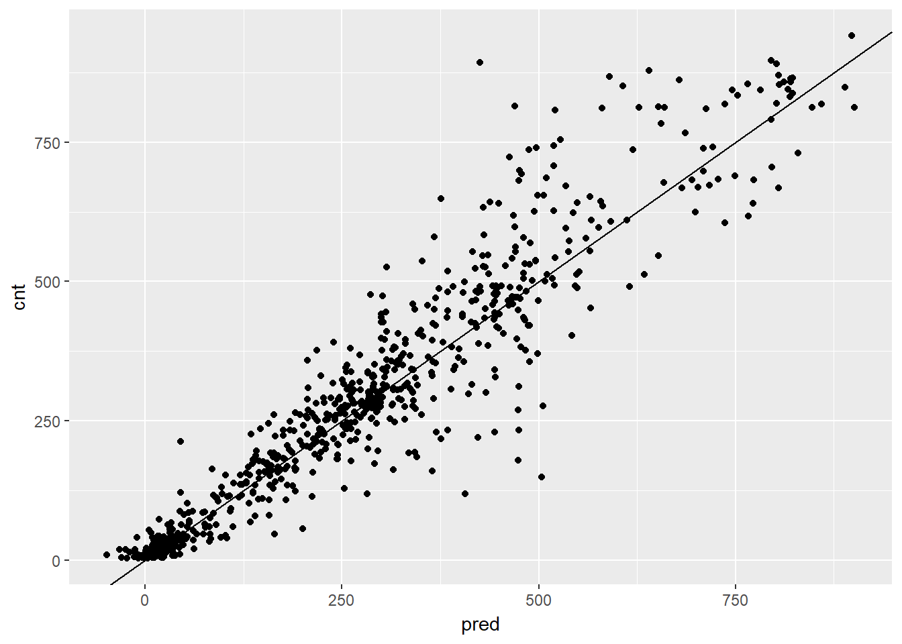
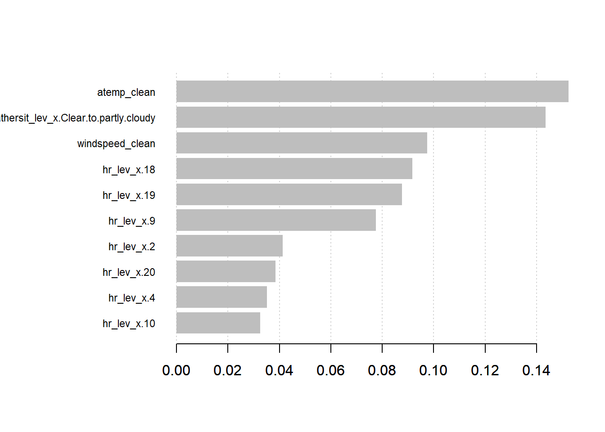

# Supervised Learning
***
Notes taken during/inspired by the Datacamp course 'Supervised Learning in R: Regression' by Nina Zumel and John Mount.

## Tree Based Models

Tree based models can be used for both regression and classification models.  Decision Trees say 'if a AND b AND c THEN y'.  We can therefore model non-linear models and multiplicative relationships - what is the affect of this AND that when combined together.  We can use RMSE as a measure of accuracy of the model.  The challenge with tree models is that they are interested in the model space as a whole, splitting this in to regions.  Linear models can be better for linear relationships.  We can adjust the tree depth, but there is a risk of overfitting (too deep/complex) or underfitting (to shallow/coarse).

An ensemble model can be built combining different trees or indeed different models together, which will usually have the outcome of being better than a sinlge tree and less prone to overfitting, but at the loss of interpretability.

### Random Forests

One example of an ensemble approach is a random forest, building multiple trees from the training data.  We can average the results of multiple models together to reduce the degree of overfitting.  To build a random forest we perform the following

1. Draw bootstrapped sample from training data
2. For each sample grow a tree
    * At each node, pick best variable to split on (from a random
    subset of all variables)
    * Continue until tree is grown
3. To score a datum, evaluate it with all the trees and average the results.

We can use the ranger package to fit random forests.  If the outcome is numeric, ranger will automatically do regression rather than classification.  The default is for 500 trees, a minimum approach is 200.  The value respect.unordered.factors will handle categorical values, set it to "order" if using cateogrical values, which will convert the values to numeric values.

The measures of accuracy are R squared and OOB (Out of Bag or out of sample performance).  You should still evaluate the model further using test data.

In this exercise you will again build a model to predict the number of bikes rented in an hour as a function of the weather, the type of day (holiday, working day, or weekend), and the time of day. You will train the model on data from the month of July.

You will use the ranger package to fit the random forest model. For this exercise, the key arguments to the ranger() call are:

* formula
* data
* num.trees: the number of trees in the forest.
* respect.unordered.factors : Specifies how to treat unordered factor variables. We recommend setting this to "order" for regression.
* seed: because this is a random algorithm, you will set the seed to get reproducible results
Since there are a lot of input variables, for convenience we will specify the outcome and the inputs in the variables outcome and vars, and use paste() to assemble a string representing the model formula.


```r
bikes <- load(url("https://assets.datacamp.com/production/course_3851/datasets/Bikes.RData"))

# bikesJuly is in the workspace
str(bikesJuly)
```

```
## 'data.frame':	744 obs. of  12 variables:
##  $ hr        : Factor w/ 24 levels "0","1","2","3",..: 1 2 3 4 5 6 7 8 9 10 ...
##  $ holiday   : logi  FALSE FALSE FALSE FALSE FALSE FALSE ...
##  $ workingday: logi  FALSE FALSE FALSE FALSE FALSE FALSE ...
##  $ weathersit: chr  "Clear to partly cloudy" "Clear to partly cloudy" "Clear to partly cloudy" "Clear to partly cloudy" ...
##  $ temp      : num  0.76 0.74 0.72 0.72 0.7 0.68 0.7 0.74 0.78 0.82 ...
##  $ atemp     : num  0.727 0.697 0.697 0.712 0.667 ...
##  $ hum       : num  0.66 0.7 0.74 0.84 0.79 0.79 0.79 0.7 0.62 0.56 ...
##  $ windspeed : num  0 0.1343 0.0896 0.1343 0.194 ...
##  $ cnt       : int  149 93 90 33 4 10 27 50 142 219 ...
##  $ instant   : int  13004 13005 13006 13007 13008 13009 13010 13011 13012 13013 ...
##  $ mnth      : int  7 7 7 7 7 7 7 7 7 7 ...
##  $ yr        : int  1 1 1 1 1 1 1 1 1 1 ...
```

```r
# Random seed to reproduce results
seed <- 423563

# The outcome column
(outcome <- "cnt")
```

```
## [1] "cnt"
```

```r
# The input variables
(vars <- c("hr", "holiday", "workingday", "weathersit", "temp", "atemp", "hum", "windspeed"))
```

```
## [1] "hr"         "holiday"    "workingday" "weathersit" "temp"      
## [6] "atemp"      "hum"        "windspeed"
```

```r
# Create the formula string for bikes rented as a function of the inputs
(fmla <- paste("cnt", "~", paste(vars, collapse = " + ")))
```

```
## [1] "cnt ~ hr + holiday + workingday + weathersit + temp + atemp + hum + windspeed"
```

```r
# Load the package ranger
library(ranger)

# Fit and print the random forest model
(bike_model_rf <- ranger(fmla, # formula 
                         bikesJuly, # data
                         num.trees = 500, 
                         respect.unordered.factors = "order", 
                         seed = seed))
```

```
## Ranger result
## 
## Call:
##  ranger(fmla, bikesJuly, num.trees = 500, respect.unordered.factors = "order",      seed = seed) 
## 
## Type:                             Regression 
## Number of trees:                  500 
## Sample size:                      744 
## Number of independent variables:  8 
## Mtry:                             2 
## Target node size:                 5 
## Variable importance mode:         none 
## OOB prediction error (MSE):       8230.568 
## R squared (OOB):                  0.8205434
```

In this exercise you will use the model that you fit in the previous exercise to predict bike rentals for the month of August.

The predict() function for a ranger model produces a list. One of the elements of this list is predictions, a vector of predicted values. You can access predictions with the $ notation for accessing named elements of a list:

* predict(model, data)$predictions


```r
library(dplyr)
```

```
## 
## Attaching package: 'dplyr'
```

```
## The following objects are masked from 'package:stats':
## 
##     filter, lag
```

```
## The following objects are masked from 'package:base':
## 
##     intersect, setdiff, setequal, union
```

```r
library(ggplot2)

# bikesAugust is in the workspace
str(bikesAugust)
```

```
## 'data.frame':	744 obs. of  12 variables:
##  $ hr        : Factor w/ 24 levels "0","1","2","3",..: 1 2 3 4 5 6 7 8 9 10 ...
##  $ holiday   : logi  FALSE FALSE FALSE FALSE FALSE FALSE ...
##  $ workingday: logi  TRUE TRUE TRUE TRUE TRUE TRUE ...
##  $ weathersit: chr  "Clear to partly cloudy" "Clear to partly cloudy" "Clear to partly cloudy" "Clear to partly cloudy" ...
##  $ temp      : num  0.68 0.66 0.64 0.64 0.64 0.64 0.64 0.64 0.66 0.68 ...
##  $ atemp     : num  0.636 0.606 0.576 0.576 0.591 ...
##  $ hum       : num  0.79 0.83 0.83 0.83 0.78 0.78 0.78 0.83 0.78 0.74 ...
##  $ windspeed : num  0.1642 0.0896 0.1045 0.1045 0.1343 ...
##  $ cnt       : int  47 33 13 7 4 49 185 487 681 350 ...
##  $ instant   : int  13748 13749 13750 13751 13752 13753 13754 13755 13756 13757 ...
##  $ mnth      : int  8 8 8 8 8 8 8 8 8 8 ...
##  $ yr        : int  1 1 1 1 1 1 1 1 1 1 ...
```

```r
# bike_model_rf is in the workspace
bike_model_rf
```

```
## Ranger result
## 
## Call:
##  ranger(fmla, bikesJuly, num.trees = 500, respect.unordered.factors = "order",      seed = seed) 
## 
## Type:                             Regression 
## Number of trees:                  500 
## Sample size:                      744 
## Number of independent variables:  8 
## Mtry:                             2 
## Target node size:                 5 
## Variable importance mode:         none 
## OOB prediction error (MSE):       8230.568 
## R squared (OOB):                  0.8205434
```

```r
# Make predictions on the August data
bikesAugust$pred <- predict(bike_model_rf, bikesAugust)$predictions

# Calculate the RMSE of the predictions
bikesAugust %>% 
  mutate(residual = cnt - pred)  %>% # calculate the residual
  summarize(rmse  = sqrt(mean(residual^2)))      # calculate rmse
```

```
##       rmse
## 1 97.18347
```

```r
# Plot actual outcome vs predictions (predictions on x-axis)
ggplot(bikesAugust, aes(x = pred, y = cnt)) + 
  geom_point() + 
  geom_abline()
```


In the previous exercise, you saw that the random forest bike model did better on the August data than the quasiposson model, in terms of RMSE.

In this exercise you will visualize the random forest model's August predictions as a function of time. The corresponding plot from the quasipoisson model that you built in a previous exercise is in the workspace for you to compare.

Recall that the quasipoisson model mostly identified the pattern of slow and busy hours in the day, but it somewhat underestimated peak demands. You would like to see how the random forest model compares.


```r
library(tidyr)

# Plot predictions and cnt by date/time
randomforest_plot <- bikesAugust %>% 
  mutate(instant = (instant - min(instant))/24) %>%  # set start to 0, convert unit to days
  gather(key = valuetype, value = value, cnt, pred) %>%
  filter(instant < 14) %>% # first two weeks
  ggplot(aes(x = instant, y = value, color = valuetype, linetype = valuetype)) + 
  geom_point() + 
  geom_line() + 
  scale_x_continuous("Day", breaks = 0:14, labels = 0:14) + 
  scale_color_brewer(palette = "Dark2") + 
  ggtitle("Predicted August bike rentals, Random Forest plot")
randomforest_plot
```


The random forest model captured the day-to-day variations in peak demand better than the quasipoisson model, but it still underestmates peak demand, and also overestimates minimum demand. So there is still room for improvement.

### One-Hot-Encoding Categorical Variables

For modelling purposes, we need to convert categorical variables to indicator variables.  Some R packages do this automatically, but some non-native R packages, such as the xgboost package does not.  So, these categorical variables need to be converted to numeric ones.  We can use the vtreat package.

* DesignTreatmentsZ() to design a treatment plan from the training data, then
* prepare() to created "clean" data
  * all numerical
  * no missing values
  * use prepare() with treatment plan for all future data
  
In this exercise you will use vtreat to one-hot-encode a categorical variable on a small example. vtreat creates a treatment plan to transform categorical variables into indicator variables (coded "lev"), and to clean bad values out of numerical variables (coded "clean").

To design a treatment plan use the function designTreatmentsZ()


```r
treatplan <- designTreatmentsZ(data, varlist)
```

* data: the original training data frame
* varlist: a vector of input variables to be treated (as strings).

designTreatmentsZ() returns a list with an element scoreFrame: a data frame that includes the names and types of the new variables:


```r
scoreFrame <- treatplan %>% 
            magrittr::use_series(scoreFrame) %>% 
            select(varName, origName, code)
```


* varName: the name of the new treated variable
* origName: the name of the original variable that the treated variable comes from
* code: the type of the new variable.
  * "clean": a numerical variable with no NAs or NaNs 
  * "lev": an indicator variable for a specific level of the original categorical variable.

(magrittr::use_series() is an alias for $ that you can use in pipes.)

For these exercises, we want varName where code is either "clean" or "lev":


```r
(newvarlist <- scoreFrame %>% 
             filter(code %in% c("clean", "lev") %>%
             magrittr::use_series(varName))
```

To transform the data set into all numerical and one-hot-encoded variables, use prepare():

* data.treat <- prepare(treatplan, data, varRestrictions = newvarlist)
* treatplan: the treatment plan
* data: the data frame to be treated
* varRestrictions: the variables desired in the treated data


```r
# Create the dataframe for cleaning
color <- c("b", "r", "r", "r", "r", "b", "r", "g", "b", "b")
size <- c(13, 11, 15, 14, 13, 11, 9, 12, 7, 12)
popularity <- c(1.0785088, 1.3956245, 0.9217988, 1.2025453, 1.0838662, 0.8043527, 1.1035440, 0.8746332, 0.6947058, 0.8832502)
dframe <- cbind(color, size, popularity)
dframe <- as.data.frame((dframe))

# dframe is in the workspace
dframe
```

```
##    color size popularity
## 1      b   13  1.0785088
## 2      r   11  1.3956245
## 3      r   15  0.9217988
## 4      r   14  1.2025453
## 5      r   13  1.0838662
## 6      b   11  0.8043527
## 7      r    9   1.103544
## 8      g   12  0.8746332
## 9      b    7  0.6947058
## 10     b   12  0.8832502
```

```r
# Create and print a vector of variable names
(vars <- c("color", "size"))
```

```
## [1] "color" "size"
```

```r
# Load the package vtreat
library(vtreat)

# Create the treatment plan
treatplan <- designTreatmentsZ(dframe, vars)
```

```
## [1] "desigining treatments Wed Aug 23 16:18:27 2017"
## [1] "designing treatments Wed Aug 23 16:18:27 2017"
## [1] " have level statistics Wed Aug 23 16:18:27 2017"
## [1] "design var color Wed Aug 23 16:18:27 2017"
## [1] "design var size Wed Aug 23 16:18:27 2017"
## [1] " scoring treatments Wed Aug 23 16:18:27 2017"
## [1] "have treatment plan Wed Aug 23 16:18:27 2017"
```

```r
# Examine the scoreFrame
(scoreFrame <- treatplan %>%
    magrittr::use_series(scoreFrame) %>%
    select(varName, origName, code))
```

```
##          varName origName code
## 1  color_lev_x.b    color  lev
## 2  color_lev_x.g    color  lev
## 3  color_lev_x.r    color  lev
## 4     color_catP    color catP
## 5  size_lev_x.11     size  lev
## 6  size_lev_x.12     size  lev
## 7  size_lev_x.13     size  lev
## 8  size_lev_x.14     size  lev
## 9  size_lev_x.15     size  lev
## 10  size_lev_x.7     size  lev
## 11  size_lev_x.9     size  lev
## 12     size_catP     size catP
```

```r
# We only want the rows with codes "clean" or "lev"
(newvars <- scoreFrame %>%
    filter(code %in% c("clean", "lev")) %>%
    magrittr::use_series(varName))
```

```
##  [1] "color_lev_x.b" "color_lev_x.g" "color_lev_x.r" "size_lev_x.11"
##  [5] "size_lev_x.12" "size_lev_x.13" "size_lev_x.14" "size_lev_x.15"
##  [9] "size_lev_x.7"  "size_lev_x.9"
```

```r
# Create the treated training data
(dframe.treat <- prepare(treatplan, dframe, varRestriction = newvars))
```

```
##    color_lev_x.b color_lev_x.g color_lev_x.r size_lev_x.11 size_lev_x.12
## 1              1             0             0             0             0
## 2              0             0             1             1             0
## 3              0             0             1             0             0
## 4              0             0             1             0             0
## 5              0             0             1             0             0
## 6              1             0             0             1             0
## 7              0             0             1             0             0
## 8              0             1             0             0             1
## 9              1             0             0             0             0
## 10             1             0             0             0             1
##    size_lev_x.13 size_lev_x.14 size_lev_x.15 size_lev_x.7 size_lev_x.9
## 1              1             0             0            0            0
## 2              0             0             0            0            0
## 3              0             0             1            0            0
## 4              0             1             0            0            0
## 5              1             0             0            0            0
## 6              0             0             0            0            0
## 7              0             0             0            0            1
## 8              0             0             0            0            0
## 9              0             0             0            1            0
## 10             0             0             0            0            0
```
 
The new indicator variables have '_lev_' in their names, and the new cleaned continuous variables have '_clean' in their names. The treated data is all numerical, with no missing values, and is suitable for use with xgboost and other R modeling functions.

When a level of a categorical variable is rare, sometimes it will fail to show up in training data. If that rare level then appears in future data, downstream models may not know what to do with it. When such novel levels appear, using model.matrix or caret::dummyVars to one-hot-encode will not work correctly.

vtreat is a "safer" alternative to model.matrix for one-hot-encoding, because it can manage novel levels safely. vtreat also manages missing values in the data (both categorical and continuous).


```r
# Create the testframe for testing new vars
color <- c("g", "g", "y", "g", "g", "y", "b", "g", "g", "r")
size <- c(7, 8, 10, 12, 6, 8, 12, 12, 12, 8)
popularity <- c(0.9733920, 0.9122529, 1.4217153, 1.1905828, 0.9866464, 1.3697515, 1.0959387, 0.9161547, 1.0000460, 1.3137360)
testframe <- cbind(color, size, popularity)
testframe <- as.data.frame((dframe))

# treatplan is in the workspace
summary(treatplan)
```

```
##               Length Class           Mode     
## treatments    4      -none-          list     
## scoreFrame    8      data.frame      list     
## outcomename   1      -none-          character
## vtreatVersion 1      package_version list     
## outcomeType   1      -none-          character
## outcomeTarget 1      -none-          character
## meanY         1      -none-          logical  
## splitmethod   1      -none-          character
```

```r
# newvars is in the workspace
newvars
```

```
##  [1] "color_lev_x.b" "color_lev_x.g" "color_lev_x.r" "size_lev_x.11"
##  [5] "size_lev_x.12" "size_lev_x.13" "size_lev_x.14" "size_lev_x.15"
##  [9] "size_lev_x.7"  "size_lev_x.9"
```

```r
# Print dframe and testframe
dframe
```

```
##    color size popularity
## 1      b   13  1.0785088
## 2      r   11  1.3956245
## 3      r   15  0.9217988
## 4      r   14  1.2025453
## 5      r   13  1.0838662
## 6      b   11  0.8043527
## 7      r    9   1.103544
## 8      g   12  0.8746332
## 9      b    7  0.6947058
## 10     b   12  0.8832502
```

```r
testframe
```

```
##    color size popularity
## 1      b   13  1.0785088
## 2      r   11  1.3956245
## 3      r   15  0.9217988
## 4      r   14  1.2025453
## 5      r   13  1.0838662
## 6      b   11  0.8043527
## 7      r    9   1.103544
## 8      g   12  0.8746332
## 9      b    7  0.6947058
## 10     b   12  0.8832502
```

```r
# Use prepare() to one-hot-encode testframe
(testframe.treat <- prepare(treatplan, testframe, varRestriction = newvars))
```

```
##    color_lev_x.b color_lev_x.g color_lev_x.r size_lev_x.11 size_lev_x.12
## 1              1             0             0             0             0
## 2              0             0             1             1             0
## 3              0             0             1             0             0
## 4              0             0             1             0             0
## 5              0             0             1             0             0
## 6              1             0             0             1             0
## 7              0             0             1             0             0
## 8              0             1             0             0             1
## 9              1             0             0             0             0
## 10             1             0             0             0             1
##    size_lev_x.13 size_lev_x.14 size_lev_x.15 size_lev_x.7 size_lev_x.9
## 1              1             0             0            0            0
## 2              0             0             0            0            0
## 3              0             0             1            0            0
## 4              0             1             0            0            0
## 5              1             0             0            0            0
## 6              0             0             0            0            0
## 7              0             0             0            0            1
## 8              0             0             0            0            0
## 9              0             0             0            1            0
## 10             0             0             0            0            0
```

vtreat encodes novel colors like yellow that were not present in the data as all zeros: 'none of the known colors'. This allows downstream models to accept these novel values without crashing.

In this exercise you will create one-hot-encoded data frames of the July/August bike data, for use with xgboost later on. 
vars defines the variable vars with the list of variable columns for the model.


```r
# The outcome column
(outcome <- "cnt")
```

```
## [1] "cnt"
```

```r
# The input columns
(vars <- c("hr", "holiday", "workingday", "weathersit", "temp", "atemp", "hum", "windspeed"))
```

```
## [1] "hr"         "holiday"    "workingday" "weathersit" "temp"      
## [6] "atemp"      "hum"        "windspeed"
```

```r
# Load the package vtreat
library(vtreat)

# Create the treatment plan from bikesJuly (the training data)
treatplan <- designTreatmentsZ(bikesJuly, vars, verbose = FALSE)

# Get the "clean" and "lev" variables from the scoreFrame
(newvars <- treatplan %>%
  magrittr::use_series(scoreFrame) %>%        
  filter(code %in% c("clean", "lev")) %>%  # get the rows you care about
  magrittr::use_series(varName))           # get the varName column
```

```
##  [1] "hr_lev_x.0"                             
##  [2] "hr_lev_x.1"                             
##  [3] "hr_lev_x.10"                            
##  [4] "hr_lev_x.11"                            
##  [5] "hr_lev_x.12"                            
##  [6] "hr_lev_x.13"                            
##  [7] "hr_lev_x.14"                            
##  [8] "hr_lev_x.15"                            
##  [9] "hr_lev_x.16"                            
## [10] "hr_lev_x.17"                            
## [11] "hr_lev_x.18"                            
## [12] "hr_lev_x.19"                            
## [13] "hr_lev_x.2"                             
## [14] "hr_lev_x.20"                            
## [15] "hr_lev_x.21"                            
## [16] "hr_lev_x.22"                            
## [17] "hr_lev_x.23"                            
## [18] "hr_lev_x.3"                             
## [19] "hr_lev_x.4"                             
## [20] "hr_lev_x.5"                             
## [21] "hr_lev_x.6"                             
## [22] "hr_lev_x.7"                             
## [23] "hr_lev_x.8"                             
## [24] "hr_lev_x.9"                             
## [25] "holiday_clean"                          
## [26] "workingday_clean"                       
## [27] "weathersit_lev_x.Clear.to.partly.cloudy"
## [28] "weathersit_lev_x.Light.Precipitation"   
## [29] "weathersit_lev_x.Misty"                 
## [30] "temp_clean"                             
## [31] "atemp_clean"                            
## [32] "hum_clean"                              
## [33] "windspeed_clean"
```

```r
# Prepare the training data
bikesJuly.treat <- prepare(treatplan, bikesJuly,  varRestriction = newvars)

# Prepare the test data
bikesAugust.treat <- prepare(treatplan, bikesAugust,  varRestriction = newvars)

# Call str() on the treated data
str(bikesAugust.treat)
```

```
## 'data.frame':	744 obs. of  33 variables:
##  $ hr_lev_x.0                             : num  1 0 0 0 0 0 0 0 0 0 ...
##  $ hr_lev_x.1                             : num  0 1 0 0 0 0 0 0 0 0 ...
##  $ hr_lev_x.10                            : num  0 0 0 0 0 0 0 0 0 0 ...
##  $ hr_lev_x.11                            : num  0 0 0 0 0 0 0 0 0 0 ...
##  $ hr_lev_x.12                            : num  0 0 0 0 0 0 0 0 0 0 ...
##  $ hr_lev_x.13                            : num  0 0 0 0 0 0 0 0 0 0 ...
##  $ hr_lev_x.14                            : num  0 0 0 0 0 0 0 0 0 0 ...
##  $ hr_lev_x.15                            : num  0 0 0 0 0 0 0 0 0 0 ...
##  $ hr_lev_x.16                            : num  0 0 0 0 0 0 0 0 0 0 ...
##  $ hr_lev_x.17                            : num  0 0 0 0 0 0 0 0 0 0 ...
##  $ hr_lev_x.18                            : num  0 0 0 0 0 0 0 0 0 0 ...
##  $ hr_lev_x.19                            : num  0 0 0 0 0 0 0 0 0 0 ...
##  $ hr_lev_x.2                             : num  0 0 1 0 0 0 0 0 0 0 ...
##  $ hr_lev_x.20                            : num  0 0 0 0 0 0 0 0 0 0 ...
##  $ hr_lev_x.21                            : num  0 0 0 0 0 0 0 0 0 0 ...
##  $ hr_lev_x.22                            : num  0 0 0 0 0 0 0 0 0 0 ...
##  $ hr_lev_x.23                            : num  0 0 0 0 0 0 0 0 0 0 ...
##  $ hr_lev_x.3                             : num  0 0 0 1 0 0 0 0 0 0 ...
##  $ hr_lev_x.4                             : num  0 0 0 0 1 0 0 0 0 0 ...
##  $ hr_lev_x.5                             : num  0 0 0 0 0 1 0 0 0 0 ...
##  $ hr_lev_x.6                             : num  0 0 0 0 0 0 1 0 0 0 ...
##  $ hr_lev_x.7                             : num  0 0 0 0 0 0 0 1 0 0 ...
##  $ hr_lev_x.8                             : num  0 0 0 0 0 0 0 0 1 0 ...
##  $ hr_lev_x.9                             : num  0 0 0 0 0 0 0 0 0 1 ...
##  $ holiday_clean                          : num  0 0 0 0 0 0 0 0 0 0 ...
##  $ workingday_clean                       : num  1 1 1 1 1 1 1 1 1 1 ...
##  $ weathersit_lev_x.Clear.to.partly.cloudy: num  1 1 1 1 0 0 1 0 0 0 ...
##  $ weathersit_lev_x.Light.Precipitation   : num  0 0 0 0 0 0 0 0 0 0 ...
##  $ weathersit_lev_x.Misty                 : num  0 0 0 0 1 1 0 1 1 1 ...
##  $ temp_clean                             : num  0.68 0.66 0.64 0.64 0.64 0.64 0.64 0.64 0.66 0.68 ...
##  $ atemp_clean                            : num  0.636 0.606 0.576 0.576 0.591 ...
##  $ hum_clean                              : num  0.79 0.83 0.83 0.83 0.78 0.78 0.78 0.83 0.78 0.74 ...
##  $ windspeed_clean                        : num  0.1642 0.0896 0.1045 0.1045 0.1343 ...
```

```r
str(bikesJuly.treat)
```

```
## 'data.frame':	744 obs. of  33 variables:
##  $ hr_lev_x.0                             : num  1 0 0 0 0 0 0 0 0 0 ...
##  $ hr_lev_x.1                             : num  0 1 0 0 0 0 0 0 0 0 ...
##  $ hr_lev_x.10                            : num  0 0 0 0 0 0 0 0 0 0 ...
##  $ hr_lev_x.11                            : num  0 0 0 0 0 0 0 0 0 0 ...
##  $ hr_lev_x.12                            : num  0 0 0 0 0 0 0 0 0 0 ...
##  $ hr_lev_x.13                            : num  0 0 0 0 0 0 0 0 0 0 ...
##  $ hr_lev_x.14                            : num  0 0 0 0 0 0 0 0 0 0 ...
##  $ hr_lev_x.15                            : num  0 0 0 0 0 0 0 0 0 0 ...
##  $ hr_lev_x.16                            : num  0 0 0 0 0 0 0 0 0 0 ...
##  $ hr_lev_x.17                            : num  0 0 0 0 0 0 0 0 0 0 ...
##  $ hr_lev_x.18                            : num  0 0 0 0 0 0 0 0 0 0 ...
##  $ hr_lev_x.19                            : num  0 0 0 0 0 0 0 0 0 0 ...
##  $ hr_lev_x.2                             : num  0 0 1 0 0 0 0 0 0 0 ...
##  $ hr_lev_x.20                            : num  0 0 0 0 0 0 0 0 0 0 ...
##  $ hr_lev_x.21                            : num  0 0 0 0 0 0 0 0 0 0 ...
##  $ hr_lev_x.22                            : num  0 0 0 0 0 0 0 0 0 0 ...
##  $ hr_lev_x.23                            : num  0 0 0 0 0 0 0 0 0 0 ...
##  $ hr_lev_x.3                             : num  0 0 0 1 0 0 0 0 0 0 ...
##  $ hr_lev_x.4                             : num  0 0 0 0 1 0 0 0 0 0 ...
##  $ hr_lev_x.5                             : num  0 0 0 0 0 1 0 0 0 0 ...
##  $ hr_lev_x.6                             : num  0 0 0 0 0 0 1 0 0 0 ...
##  $ hr_lev_x.7                             : num  0 0 0 0 0 0 0 1 0 0 ...
##  $ hr_lev_x.8                             : num  0 0 0 0 0 0 0 0 1 0 ...
##  $ hr_lev_x.9                             : num  0 0 0 0 0 0 0 0 0 1 ...
##  $ holiday_clean                          : num  0 0 0 0 0 0 0 0 0 0 ...
##  $ workingday_clean                       : num  0 0 0 0 0 0 0 0 0 0 ...
##  $ weathersit_lev_x.Clear.to.partly.cloudy: num  1 1 1 1 1 1 1 1 1 1 ...
##  $ weathersit_lev_x.Light.Precipitation   : num  0 0 0 0 0 0 0 0 0 0 ...
##  $ weathersit_lev_x.Misty                 : num  0 0 0 0 0 0 0 0 0 0 ...
##  $ temp_clean                             : num  0.76 0.74 0.72 0.72 0.7 0.68 0.7 0.74 0.78 0.82 ...
##  $ atemp_clean                            : num  0.727 0.697 0.697 0.712 0.667 ...
##  $ hum_clean                              : num  0.66 0.7 0.74 0.84 0.79 0.79 0.79 0.7 0.62 0.56 ...
##  $ windspeed_clean                        : num  0 0.1343 0.0896 0.1343 0.194 ...
```

## Gradient Boosting Machines

Gradient boosting is an interative ensemble method, by improving the model each time.  We start the model with a usually shallow tree.  Next, we fit another model to the residuals ofd the model, then find the weighted sum of the second and first models that give the best fit.  We can regualrise the learning by the factor eta, eta = 1 gives fast learning but with overfitting risk, smaller eta reduces speed of learning but reduces the risk of overfitting.  We then repeat this process until the stopping condition is met.  

Gradient boosting works on the training data, so it can be easy to overfit.  The best approach then is to use OOB and cross validation (CV) for each model, then determine how many trees to use.  

xgb.cv() is the function we use and has a number of diagnostic measures.  One such measure is the 

* xgb.cv()$evaluation_log: records estimated RMSE for each round - find the number that minimises the RMSE

Inputs to xgb.cv() and xgboost() are:

* data: input data as matrix ; label: outcome
* label: vector of outcomes (also numeric)
* objective: for regression - "reg:linear"
* nrounds: maximum number of trees to fit
* eta: learning rate
* max_depth: depth of trees
* early_stopping_rounds: after this many rounds without improvement, stop
* nfold (xgb.cv() only): number of folds for cross validation.  5 is a good number
* verbose: 0 to stay silent.

Then we use

elog <- as.data.frame(cv$evaluation_log)
nrounds <- which.min(elog$test_rmse_mean)

With the resulting number being the best number of trees.  We then use xbgoost with this number (nrounds <- n) to get the final model.

In this exercise you will get ready to build a gradient boosting model to predict the number of bikes rented in an hour as a function of the weather and the type and time of day. You will train the model on data from the month of July.

The July data is loaded into your workspace. Remember that bikesJuly.treat no longer has the outcome column, so you must get it from the untreated data: bikesJuly$cnt.

You will use the xgboost package to fit the random forest model. The function xgb.cv() uses cross-validation to estimate the out-of-sample learning error as each new tree is added to the model. The appropriate number of trees to use in the final model is the number that minimizes the holdout RMSE.


```r
# The July data is in the workspace
ls()
```

```
##  [1] "bike_model_rf"     "bikes"             "bikesAugust"      
##  [4] "bikesAugust.treat" "bikesJuly"         "bikesJuly.treat"  
##  [7] "color"             "dframe"            "dframe.treat"     
## [10] "fmla"              "newvars"           "outcome"          
## [13] "popularity"        "randomforest_plot" "scoreFrame"       
## [16] "seed"              "size"              "testframe"        
## [19] "testframe.treat"   "treatplan"         "vars"
```

```r
# Load the package xgboost
library(xgboost)
```

```
## 
## Attaching package: 'xgboost'
```

```
## The following object is masked from 'package:dplyr':
## 
##     slice
```

```r
# Run xgb.cv
cv <- xgb.cv(data = as.matrix(bikesJuly.treat), 
            label = bikesJuly$cnt,
            nrounds = 100,
            nfold = 5,
            objective = "reg:linear",
            eta = 0.3,
            max_depth = 6,
            early_stopping_rounds = 10,
            verbose = 0    # silent
)

# Get the evaluation log 
elog <- as.data.frame(cv$evaluation_log)

# Determine and print how many trees minimize training and test error
elog %>% 
   summarize(ntrees.train = which.min(elog$train_rmse_mean),   # find the index of min(train_rmse_mean)
             ntrees.test  = which.min(elog$test_rmse_mean))   # find the index of min(test_rmse_mean)
```

```
##   ntrees.train ntrees.test
## 1           97          87
```

In most cases, ntrees.test is less than ntrees.train. The training error keeps decreasing even after the test error starts to increase. It's important to use cross-validation to find the right number of trees (as determined by ntrees.test) and avoid an overfit model.


```r
# The number of trees to use, as determined by xgb.cv
ntrees <- 84

# Run xgboost
bike_model_xgb <- xgboost(data = as.matrix(bikesJuly.treat), # training data as matrix
                   label = bikesJuly$cnt,  # column of outcomes
                   nrounds = ntrees,       # number of trees to build
                   objective = "reg:linear", # objective
                   eta = 0.3,
                   depth = 6,
                   verbose = 0  # silent
)

# Make predictions
bikesAugust$pred <- predict(bike_model_xgb, as.matrix(bikesAugust.treat))

# Plot predictions (on x axis) vs actual bike rental count
ggplot(bikesAugust, aes(x = pred, y = cnt)) + 
  geom_point() + 
  geom_abline()
```


Overall, the scatterplot looked pretty good, but did you notice that the model made some negative predictions? In the next exercise, you'll compare this model's RMSE to the previous bike models that you've built.  Finally we can calculate the RMSE


```r
# Calculate RMSE
bikesAugust %>%
  mutate(residuals = cnt - pred) %>%
  summarize(rmse = sqrt(mean(residuals ^ 2)))
```

```
##       rmse
## 1 76.36407
```

Even though this gradient boosting made some negative predictions, overall it makes smaller errors than the previous model. Perhaps rounding negative predictions up to zero is a reasonable tradeoff. 

Finally we can compare the results graphically.


```r
randomforest_plot
```


```r
# Plot predictions and actual bike rentals as a function of time (days)
bikesAugust %>% 
  mutate(instant = (instant - min(instant))/24) %>%  # set start to 0, convert unit to days
  gather(key = valuetype, value = value, cnt, pred) %>%
  filter(instant < 14) %>% # first two weeks
  ggplot(aes(x = instant, y = value, color = valuetype, linetype = valuetype)) + 
  geom_point() + 
  geom_line() + 
  scale_x_continuous("Day", breaks = 0:14, labels = 0:14) + 
  scale_color_brewer(palette = "Dark2") + 
  ggtitle("Predicted August bike rentals, Gradient Boosting model")
```


We can also plot the importance of the top factors


```r
names <- dimnames(data.matrix(bikesJuly.treat[,-1]))[[2]]
importance_matrix <- xgb.importance(names, model = bike_model_xgb)
xgb.plot.importance(importance_matrix[1:10,])
```



Looking at the results indicates that the temperature and clear/partly cloudy and the two most important factors, followed by the windspeed.  The other factors relate to the time of day - higher at commuting times (9-10 am and 6-7 pm) and lower at night (2 and 4 am).
