# Advanced ggplot2
***
Notes taken during/inspired by the Datacamp course 'Data Visualization with ggplot2 (Part 3)' by Rick Scavetta.  This course builds on the first course and second courses, which looked at how to build plots, aesthetics, statistics and practical matters such as themes.

The focus of this course is on more specific plot types, including looking at handling large data plots.  We also look at maps and video frames aka animations.  The fourth chapter looks at the internals of GGPlot2 including the grid extra package.  Finally we will look at a case study, which includes looking at how we can use the extensions function to build our own plots from scratch.  

Course slides:
* [Part 1 - Statistical Plots](https://s3.amazonaws.com/assets.datacamp.com/production/course_862/slides/ggplot2_course_3_ch1.pdf)
* [Part 2 - Plots for Specific Data Part 1](https://s3.amazonaws.com/assets.datacamp.com/production/course_862/slides/ggplot2_course_3_ch2.pdf)
* [Part 3 - Plots for Specific Data Part 2](https://s3.amazonaws.com/assets.datacamp.com/production/course_862/slides/ggplot2_course_3_ch3.pdf)
* [Part 4 - GGPlot2 Internals](https://s3.amazonaws.com/assets.datacamp.com/production/course_862/slides/ggplot2_course_3_ch4.pdf)
* [Part 5 - Case Study](https://s3.amazonaws.com/assets.datacamp.com/production/course_862/slides/ggplot2_course_3_ch5.pdf)

## Refresher

As a refresher to statistical plots, let's build a scatter plot with an additional statistic layer.

A dataset called movies_small is coded in your workspace. It is a random sample of 1000 observations from the larger movies dataset, that's inside the ggplot2movies package. The dataset contains information on movies from IMDB. The variable votes is the number of IMDB users who have rated a movie and the rating (converted into a categorical variable) is the average rating for the movie.


```r
library(ggplot2)
#load the data
movies_small <- readRDS("D:/CloudStation/Documents/2017/RData/ch1_movies_small.RDS")

# Explore movies_small with str()
str(movies_small)
```

```
## Classes 'tbl_df', 'tbl' and 'data.frame':	10000 obs. of  24 variables:
##  $ title      : chr  "Fair and Worm-er" "Shelf Life" "House: After Five Years of Living" "Three Long Years" ...
##  $ year       : int  1946 2000 1955 2003 1963 1992 1999 1972 1994 1985 ...
##  $ length     : int  7 4 11 76 103 107 87 84 127 94 ...
##  $ budget     : int  NA NA NA NA NA NA NA NA NA NA ...
##  $ rating     : Factor w/ 10 levels "1","2","3","4",..: 7 7 6 8 8 5 4 8 5 5 ...
##  $ votes      : int  16 11 15 11 103 28 105 9 37 28 ...
##  $ r1         : num  0 0 14.5 4.5 4.5 4.5 14.5 0 4.5 4.5 ...
##  $ r2         : num  0 0 0 0 4.5 0 4.5 0 4.5 0 ...
##  $ r3         : num  0 0 4.5 4.5 0 4.5 4.5 0 14.5 4.5 ...
##  $ r4         : num  0 0 4.5 0 4.5 4.5 4.5 0 4.5 14.5 ...
##  $ r5         : num  4.5 4.5 0 0 4.5 0 4.5 14.5 24.5 4.5 ...
##  $ r6         : num  4.5 24.5 34.5 4.5 4.5 0 14.5 0 4.5 14.5 ...
##  $ r7         : num  64.5 4.5 24.5 0 14.5 4.5 14.5 14.5 14.5 14.5 ...
##  $ r8         : num  14.5 24.5 4.5 4.5 14.5 24.5 14.5 24.5 14.5 14.5 ...
##  $ r9         : num  0 0 0 14.5 14.5 24.5 14.5 14.5 4.5 4.5 ...
##  $ r10        : num  14.5 24.5 14.5 44.5 44.5 24.5 14.5 44.5 4.5 24.5 ...
##  $ mpaa       : chr  "" "" "" "" ...
##  $ Action     : int  0 0 0 0 0 0 0 0 0 0 ...
##  $ Animation  : int  1 0 0 0 0 0 0 0 0 0 ...
##  $ Comedy     : int  1 0 0 1 0 1 1 1 0 0 ...
##  $ Drama      : int  0 0 0 0 1 0 0 0 1 1 ...
##  $ Documentary: int  0 0 1 0 0 0 0 0 0 0 ...
##  $ Romance    : int  0 0 0 0 0 0 1 0 0 0 ...
##  $ Short      : int  1 1 1 0 0 0 0 0 0 0 ...
```

```r
# Build a scatter plot with mean and 95% CI
ggplot(movies_small, aes(x = rating, y = votes)) +
  geom_point() +
  stat_summary(fun.data = "mean_cl_normal",
               geom = "crossbar",
               width = 0.2,
               col = "red") +
  scale_y_log10()
```

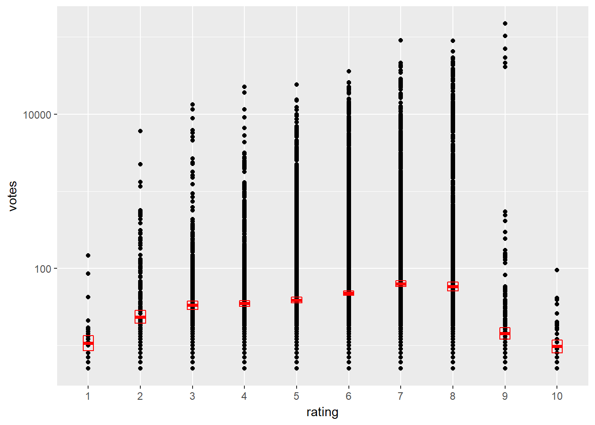

Next we are going to look at the diamons dataset.  Recall that there are a variety of scale_ functions. Here, data are transformed or filtered first, after which the plot and associated statistics are computed. For example, scale_y_continuous(limits = c(100, 1000) will remove values outside that range.

Contrast this to coord_cartesian(), which computes the statistics before plotting. That means that the plot and summary statistics are performed on the raw data. That's why we say that coord_cartesian(c(100, 1000)) "zooms in" a plot. This was discussed in the chapter on coordinates in course 2.

Here we're going to expand on this and introduce scale_x_log10() and scale_y_log10() which perform log10 transformations, and coord_equal(), which sets an aspect ratio of 1 (coord_fixed() is also an option).


```r
str(diamonds)
```

```
## Classes 'tbl_df', 'tbl' and 'data.frame':	53940 obs. of  10 variables:
##  $ carat  : num  0.23 0.21 0.23 0.29 0.31 0.24 0.24 0.26 0.22 0.23 ...
##  $ cut    : Ord.factor w/ 5 levels "Fair"<"Good"<..: 5 4 2 4 2 3 3 3 1 3 ...
##  $ color  : Ord.factor w/ 7 levels "D"<"E"<"F"<"G"<..: 2 2 2 6 7 7 6 5 2 5 ...
##  $ clarity: Ord.factor w/ 8 levels "I1"<"SI2"<"SI1"<..: 2 3 5 4 2 6 7 3 4 5 ...
##  $ depth  : num  61.5 59.8 56.9 62.4 63.3 62.8 62.3 61.9 65.1 59.4 ...
##  $ table  : num  55 61 65 58 58 57 57 55 61 61 ...
##  $ price  : int  326 326 327 334 335 336 336 337 337 338 ...
##  $ x      : num  3.95 3.89 4.05 4.2 4.34 3.94 3.95 4.07 3.87 4 ...
##  $ y      : num  3.98 3.84 4.07 4.23 4.35 3.96 3.98 4.11 3.78 4.05 ...
##  $ z      : num  2.43 2.31 2.31 2.63 2.75 2.48 2.47 2.53 2.49 2.39 ...
```

```r
# Produce the plot - To get nice formatting we're using the expression() function for the labels
ggplot(diamonds, aes(x = carat, y = price, col = color)) +
  geom_point(alpha = 0.5, size = 0.5, shape = 16) +
  scale_x_log10(expression(log[10](Carat)), limits = c(0.1,10)) +
  scale_y_log10(expression(log[10](Price)), limits = c(100,100000)) +
  scale_color_brewer(palette = "YlOrRd") +
  coord_equal() + # sets the aspect ratio to 1
  theme_classic()
```

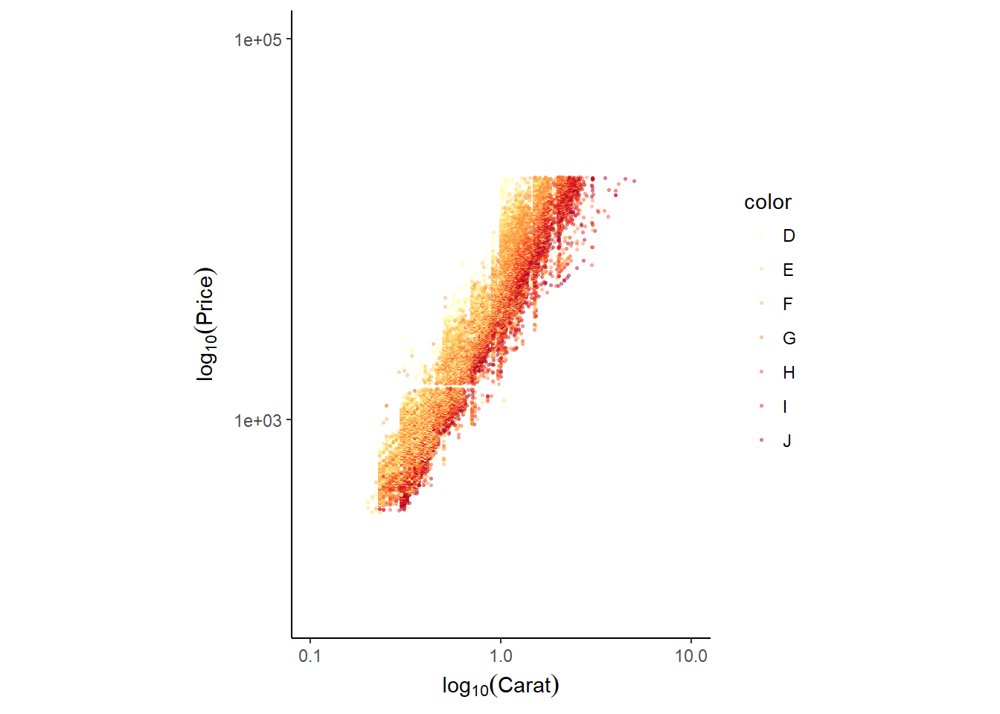

Or we can present the data as a smooth/linear model


```r
# Add smooth layer and facet the plot
ggplot(diamonds, aes(x = carat, y = price, col = color)) +
  stat_smooth(method = "lm") +
  scale_x_log10(expression(log[10](Carat)), limits = c(0.1,10)) +
  scale_y_log10(expression(log[10](Price)), limits = c(100,100000)) +
  scale_color_brewer(palette = "YlOrRd") +
  coord_equal() +
  theme_classic()
```

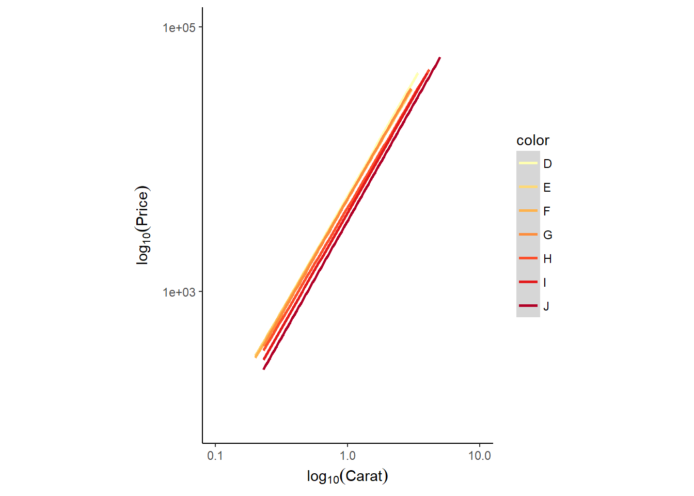

## Statistical plots

Whilst all the previous plots could be considered as statistical plots, we now concentrate on those more suited to a statistical or academic audienc - two examples are box plots and density plots.  In this exercise you'll return to the first plotting exercise and see how box plots compare to dot plots for representing high-density data.

### Box plots

Box plots are very useful, but they don't solve all your problems all the time, for example, when your data are heavily skewed, you will still need to transform it. You'll see that here, using the movies_small dataset, a subset of 10,000 observations of ggplot2movies::movies.


```r
# Add a boxplot geom
d <- ggplot(movies_small, aes(x = rating, y = votes)) +
  geom_point() +
  geom_boxplot() +
  stat_summary(fun.data = "mean_cl_normal",
               geom = "crossbar",
               width = 0.2,
               col = "red")

# Untransformed plot
d
```

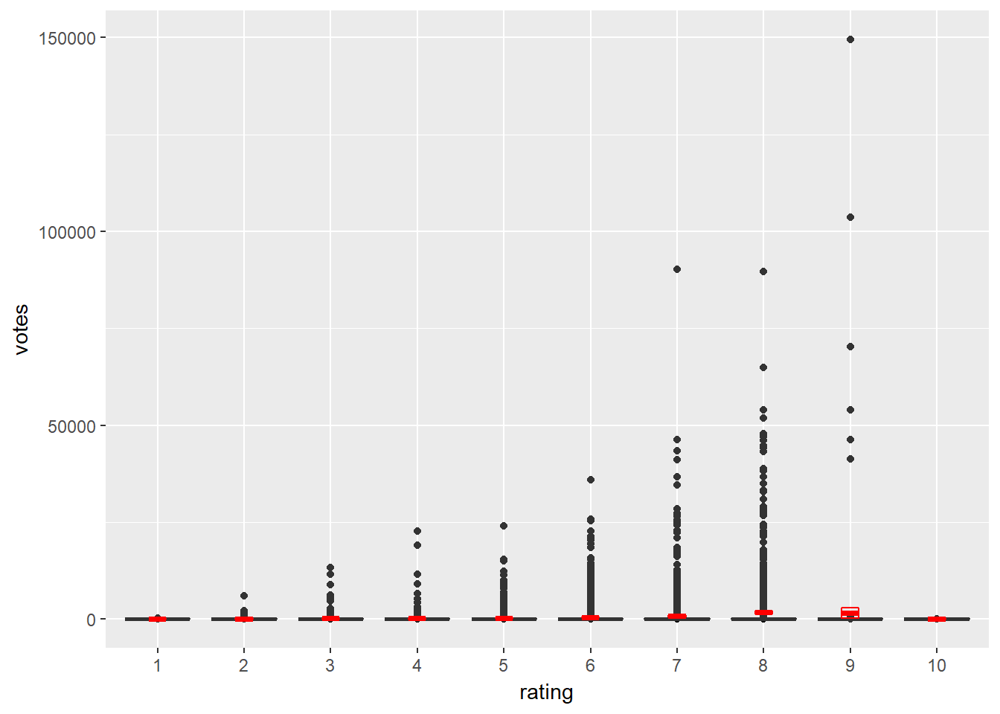

```r
# Transform the scale
d + scale_y_log10()
```

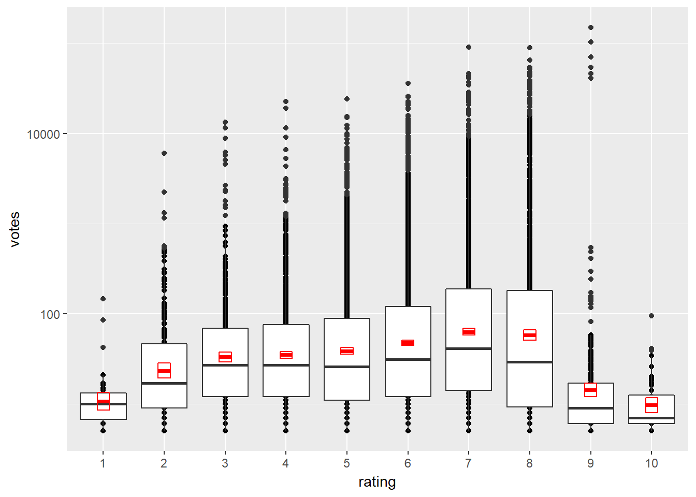

```r
# Transform the coordinates
d + coord_trans(y = "log10")
```

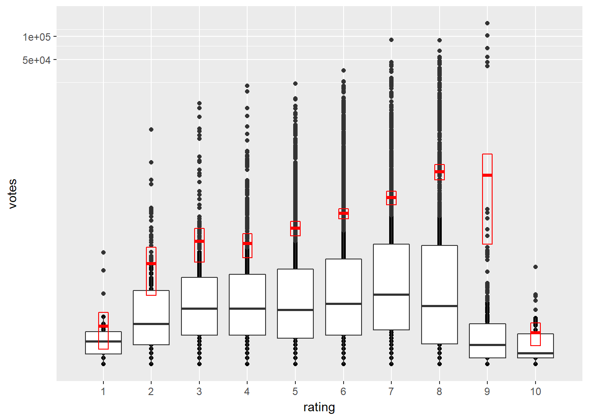

Notice how different the normal distribution estimation (red boxes) and boxplots (less prone to outliers) are.

If you only have continuous variables, you can convert them into ordinal variables using any of the following functions:

* cut_interval(x, n) makes n groups from vector x with equal range.
* cut_number(x, n) makes n groups from vector x with (approximately) equal numbers of observations.
* cut_width(x, width) makes groups of width width from vector x.

This is useful when you want to summarize a complex scatter plot. By applying these functions to the carat variable and mapping that onto the group aesthetic, you can convert the scatter plot in the viewer into a series of box plots on the fly.

Going from a continuous to a categorical variable reduces the amount of information, but sometimes that helps us understand the data.


```r
# Plot object p
p <- ggplot(diamonds, aes(x = carat, y = price))

# Use cut_interval
p + geom_boxplot(aes(group = cut_interval(carat, n = 10)))
```

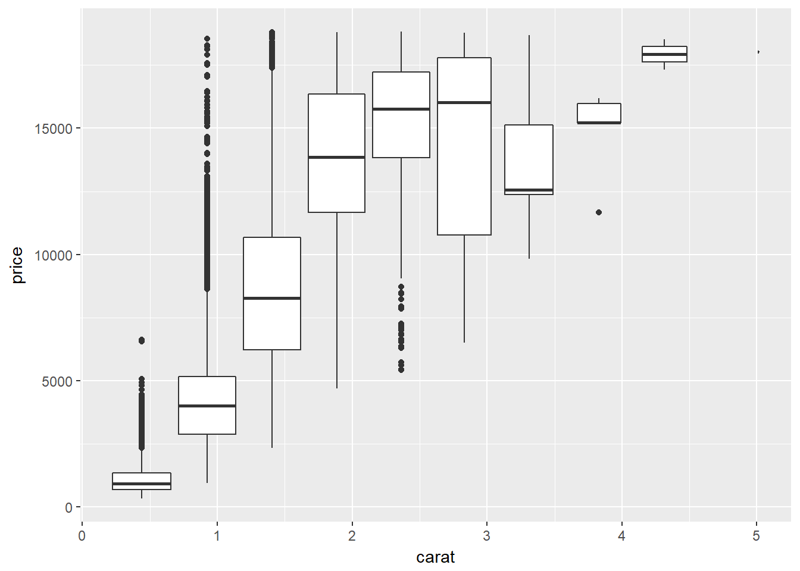

```r
# Use cut_number
p + geom_boxplot(aes(group = cut_number(carat, n = 10)))
```

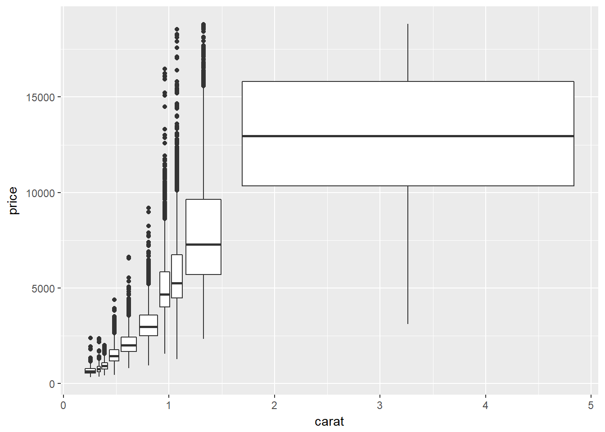

```r
# Use cut_width
p + geom_boxplot(aes(group = cut_width(carat, width = 0.25)))
```

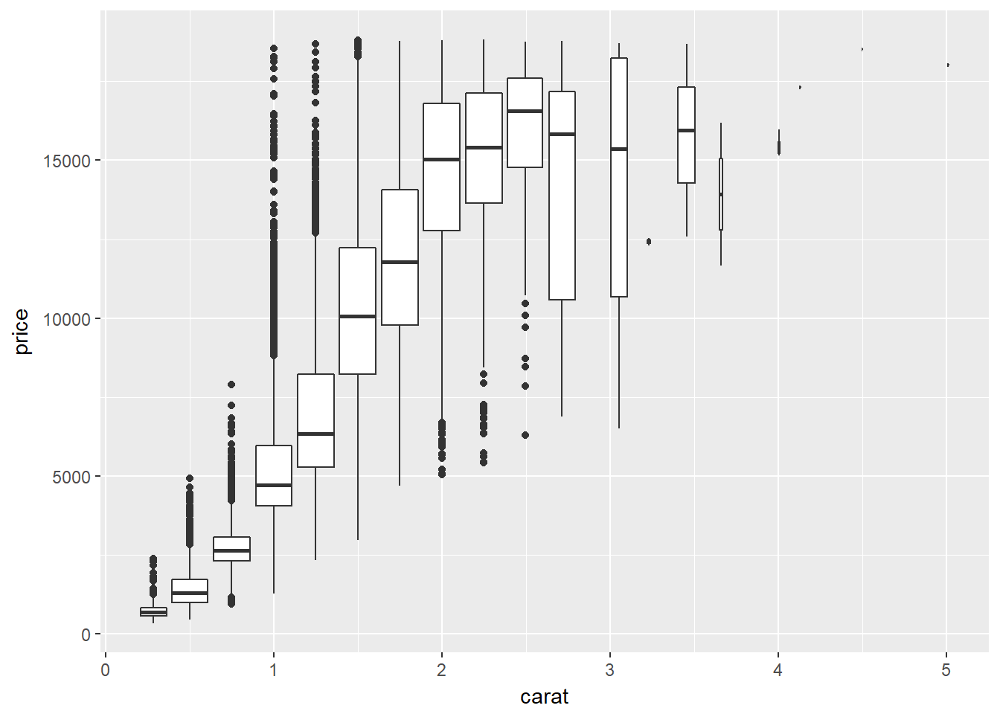

Be aware that there are many ways to calculate the IQR, short for inter-quartile range (that is Q3−Q1Q3−Q1). These are defined in the help pages for the quantile() function:

> ?quantile

Generally, the IQR becomes more consistent across methods as the sample size increases, you are likely to encounter spurious artefacts when drawing box plots with small sample sizes.

### Density Plots

Density plots are similar to histograms but less well used.  They are used to display the distribution of univariate data, such as probabilty density functions (PDFs).  One aspect you can set is the bandwidth, which helps to determine how 'lumpy' or how high the seperation is between each individual peak in a dataset.  

To make a straightforward density plot, add a geom_density() layer.

Before plotting, you will calculate the emperical density function, similar to how you can use the density() function in the stats package, available by default when you start R. The following default parameters are used (you can specify these arguments both in density() as well as geom_density()):

> bw = "nrd0", telling R which rule to use to choose an appropriate bandwidth.
> kernel = "gaussian", telling R to use the Gaussian kernel.

There is some test data, containing three columns: norm, bimodal and uniform. Each column represents 200 samples from a normal, bimodal and uniform distribution.


```r
# Load the test data
load("D:/CloudStation/Documents/2017/RData/test_datasets.RData")
test_data <- ch1_test_data

# Calculating density: d
d <- density(test_data$norm)

# Use which.max() to calculate mode
mode <- d$x[which.max(d$y)]

# Finish the ggplot call
ggplot(test_data, aes(x = norm)) +
  geom_rug() +
  geom_density() +
  geom_vline(xintercept = mode, col = "red")
```

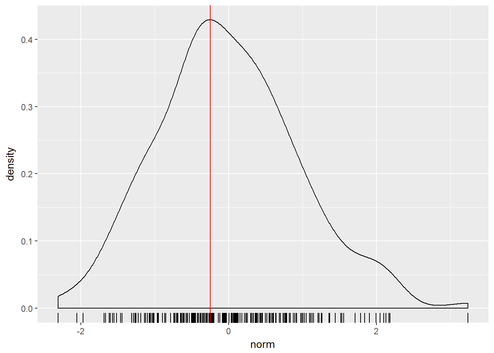

Sometimes it is useful to compare a histogram with a density plot. However, the histogram's y-scale must first be converted to frequency instead of absolute count. After doing so, you can add an empirical PDF using geom_density() or a theoretical PDF using stat_function().


```r
# Arguments you'll need later on
fun_args <- list(mean = mean(test_data$norm), sd = sd(test_data$norm))

# Finish the ggplot
ggplot(test_data, aes(x = norm)) + 
  geom_histogram(aes(y = ..density..)) + 
  geom_density(col = "red") + 
  stat_function(fun = dnorm, args = fun_args, col = "blue")
```

```
## `stat_bin()` using `bins = 30`. Pick better value with `binwidth`.
```

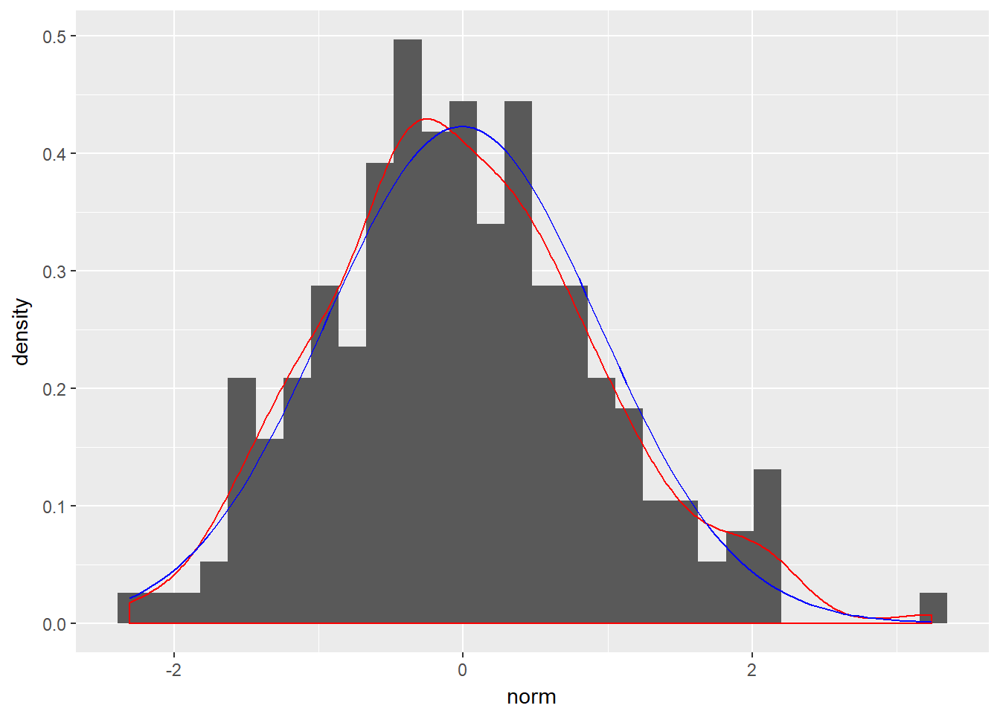

There are three parameters that you may be tempted to adjust in a density plot:

* bw - the smoothing bandwidth to be used, see ?density for details
* adjust - adjustment of the bandwidth, see density for details
* kernel - kernel used for density estimation, defined as
* "g" = gaussian
* "r" = rectangular
* "t" = triangular
* "e" = epanechnikov
* "b" = biweight
* "c" = cosine
* "o" = optcosine

In this exercise you'll use a dataset containing only four points, small_data, so that you can see how these three arguments affect the shape of the density plot.

The vector get_bw contains the bandwidth that is used by default in geom_density(). p is a basic plotting object that you can start from.


```r
x <- c(-3.5, 0.0, 0.5, 6.0)
small_data <- data.frame(x)

# Get the bandwith
get_bw <- density(small_data$x)$bw

# Basic plotting object
p <- ggplot(small_data, aes(x = x)) +
  geom_rug() +
  coord_cartesian(ylim = c(0,0.5))

# Create three plots
p + geom_density()
```

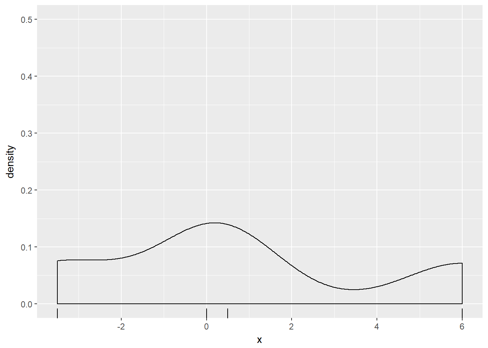

```r
p + geom_density(adjust = 0.25)
```

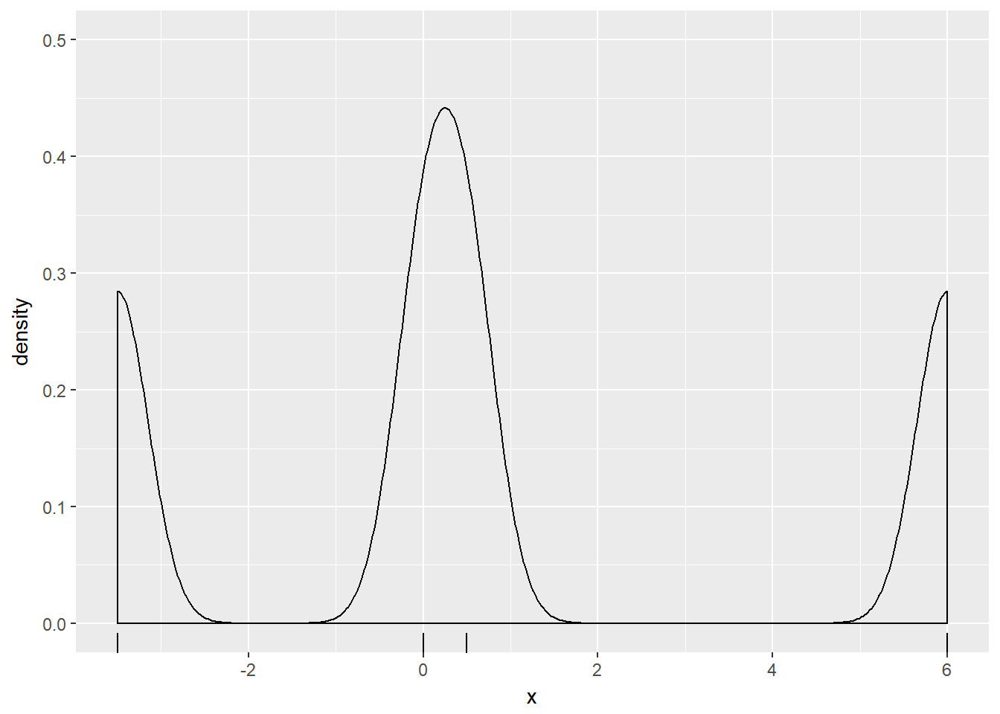

```r
p + geom_density(bw = 0.25 * get_bw)
```


```r
# Create two plots
p + geom_density(kernel = "r")
```

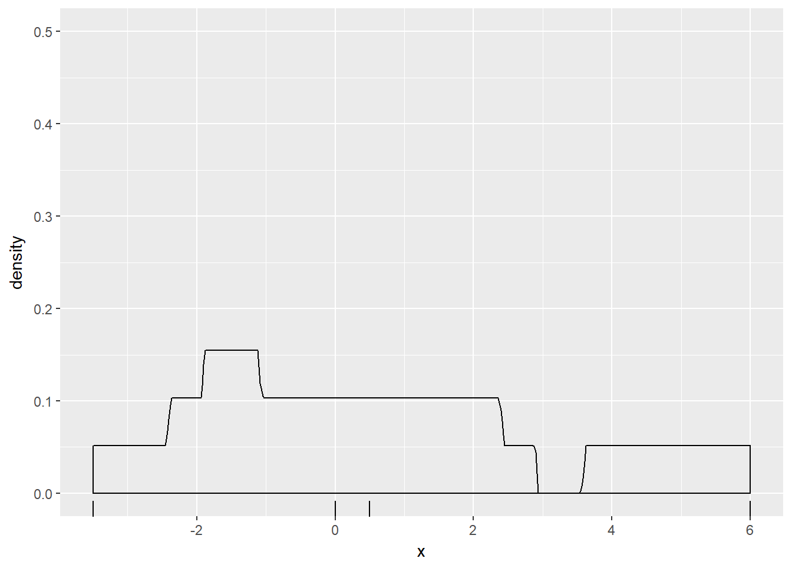

```r
p + geom_density(kernel = "e")
```

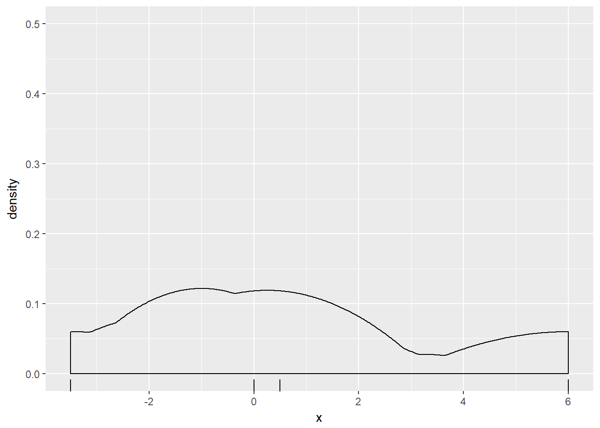

Notice how the curve contained more features and their individual heights were increased as the bandwidth decreased.

## Multiple groups or variables

Groups = levels of a factor variable.  A drawback of showing a box plot per group, is that you don't have any indication of the sample size, n, in each group, that went into making the plot. One way of dealing with this is to use a variable width for the box, which reflects differences in n.


```r
# Diamond box plot sized according to the number of observations
ggplot(diamonds, aes(x = cut, y = price, col = color)) +
  geom_boxplot(varwidth = TRUE) +
  facet_grid(. ~ color)
```


This helps us see the differences in group size, but unfortunately there is no legend, so it's not a complete solution.

The next section of code combines multiple density plots. Here, you'll combine just two distributions, a normal and a bimodal.

The first thing to remember is that you can consider values as two separate variables, like in the test_data data frame, or as a single continuous variable with their ID as a separate categorical variable, like in the test_data2 data frame. test_data2 is more convenient for combining and comparing multiple distributions.

A small number of overlapping density plots are a fantastic way of comparing distinct distributions, for example, when descriptive statistics only (mean and sd) don't represent the data well enough.


```r
# Load the data
test_data  <- ch1_test_data
test_data2 <- ch1_test_data2

# check the structure
str(test_data)
```

```
## 'data.frame':	200 obs. of  3 variables:
##  $ norm   : num  -0.5605 -0.2302 1.5587 0.0705 0.1293 ...
##  $ bimodal: num  0.199 -0.688 -2.265 -1.457 -2.414 ...
##  $ uniform: num  -0.117 -0.537 -1.515 -1.812 -0.949 ...
```

```r
str(test_data2)
```

```
## 'data.frame':	400 obs. of  2 variables:
##  $ dist : Factor w/ 2 levels "norm","bimodal": 1 1 1 1 1 1 1 1 1 1 ...
##  $ value: num  -0.5605 -0.2302 1.5587 0.0705 0.1293 ...
```

```r
# Plot with test_data
ggplot(test_data, aes(x = norm)) +
  geom_rug() +
  geom_density()
```

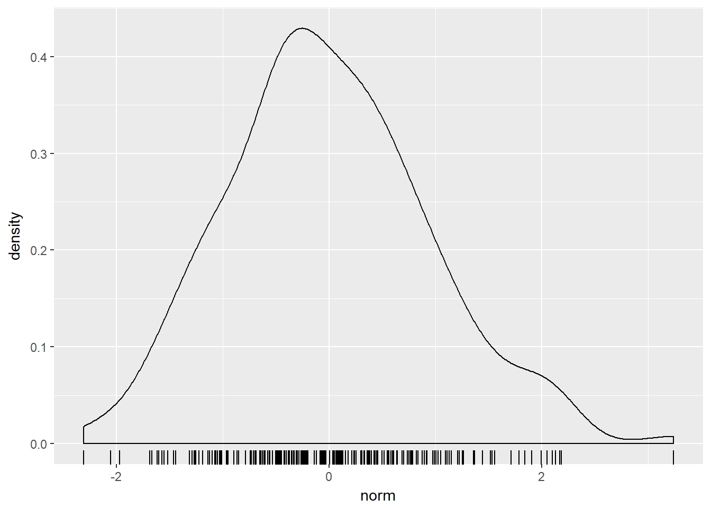

```r
# Plot two distributions with test_data2
ggplot(test_data2, aes(x = value, fill = dist, col = dist)) +
  geom_rug(alpha = 0.6) +
  geom_density(alpha = 0.6)
```

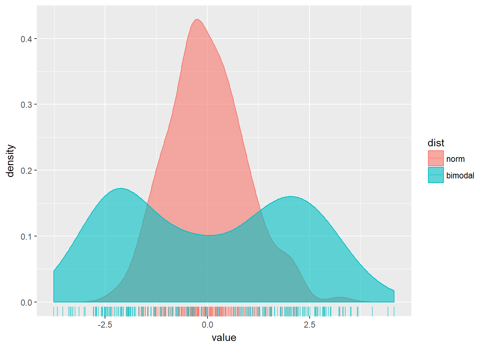
When you looked at multiple box plots, you compared the total sleep time of various mammals, sorted according to their eating habits. One thing you noted is that for insectivores, box plots didn't really make sense, since there were only 5 observations to begin with. You decided that you could nonetheless use the width of a box plot to show the difference in sample size between the groups. Here, you'll see a similar thing with density plots.

A cleaned up version of the mammalian dataset is first loaded as mammals.


```r
mammals <- readRDS("D:/CloudStation/Documents/2017/RData/mammals.RDS")

# Individual densities
ggplot(mammals[mammals$vore == "Insectivore", ], aes(x = sleep_total, fill = vore)) +
  geom_density(col = NA, alpha = 0.35) +
  scale_x_continuous(limits = c(0, 24)) +
  coord_cartesian(ylim = c(0, 0.3))
```

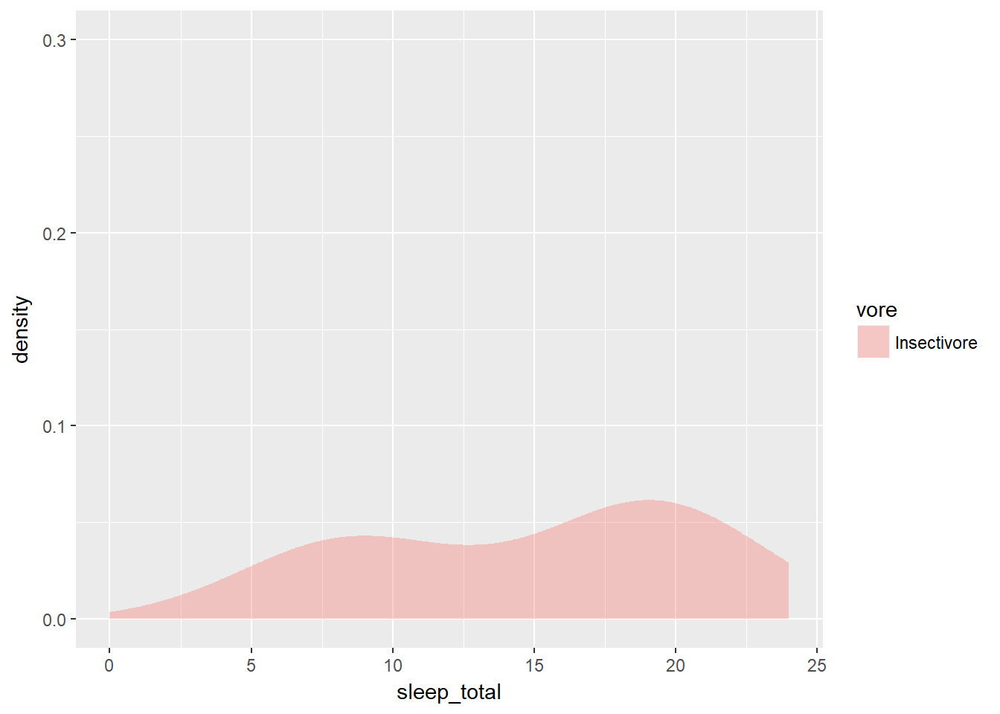

```r
# With faceting
ggplot(mammals, aes(x = sleep_total, fill = vore)) +
  geom_density(col = NA, alpha = 0.35) +
  scale_x_continuous(limits = c(0, 24)) +
  coord_cartesian(ylim = c(0, 0.3)) +
  facet_wrap( ~ vore, nrow = 2)
```

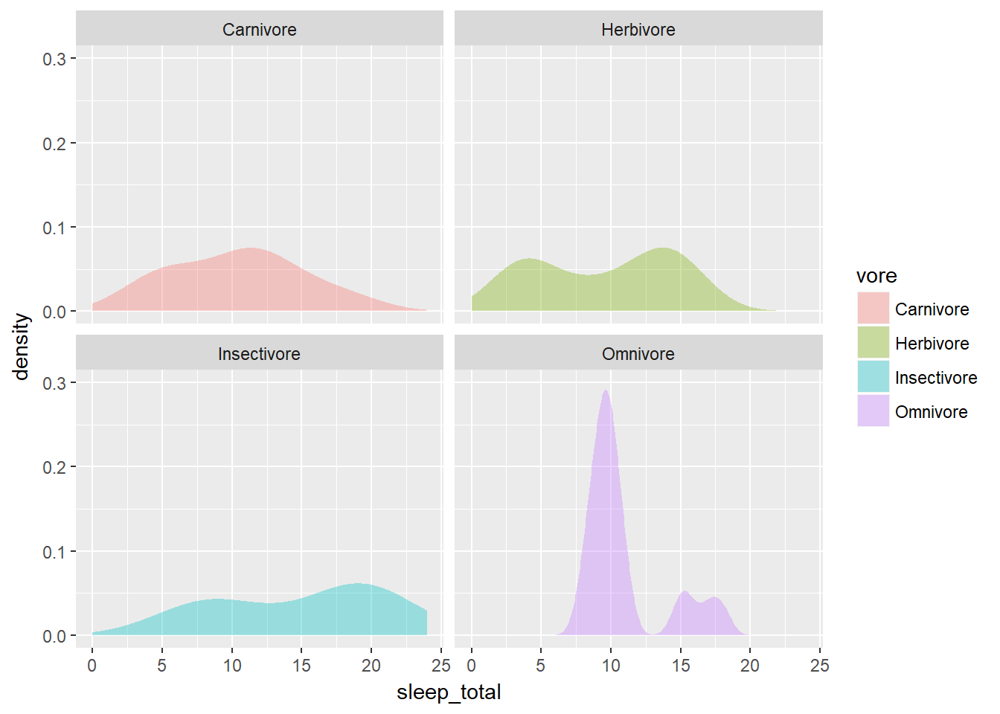

```r
# Note that by default, the x ranges fill the scale
ggplot(mammals, aes(x = sleep_total, fill = vore)) +
  geom_density(col = NA, alpha = 0.35) +
  scale_x_continuous(limits = c(0, 24)) +
  coord_cartesian(ylim = c(0, 0.3))
```

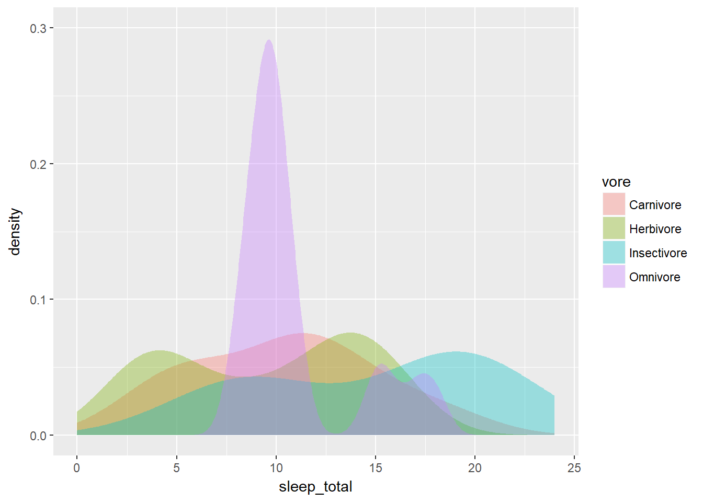

```r
# Trim each density plot individually
ggplot(mammals, aes(x = sleep_total, fill = vore)) +
  geom_density(col = NA, alpha = 0.35, trim = TRUE) +
  scale_x_continuous(limits=c(0,24)) +
  coord_cartesian(ylim = c(0, 0.3))
```

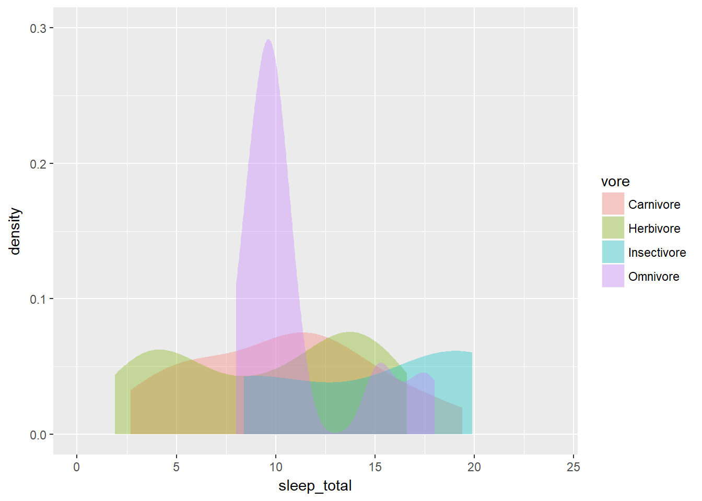
When plotting a single variable, the density plots (and their bandwidths) are calculated separate for each variable (see the first plot).

However, when you compare several variables (such as eating habits) it's useful to see the density of each subset in relation to the whole data set. This holds true for multiple density plots as well as for violin plots.

For this, we need to weight the density plots so that they're relative to each other. Each density plot is adjusted according to what proportion of the total data set each sub-group represents. We calculated this using the dplyr commands in the third section.

After executing the commnads, it will have the variable n, which we'll use for weighting.  To generate the weighted density plot, use aes() to map n onto the weight aesthetic inside geom_density().  The results will be more detailed and accurate.


```r
# Unweighted density plot from before
ggplot(mammals, aes(x = sleep_total, fill = vore)) +
  geom_density(col = NA, alpha = 0.35) +
  scale_x_continuous(limits = c(0, 24)) +
  coord_cartesian(ylim = c(0, 0.3))
```


```r
# Unweighted violin plot
ggplot(mammals, aes(x = vore, y = sleep_total, fill = vore)) +
  geom_violin()
```

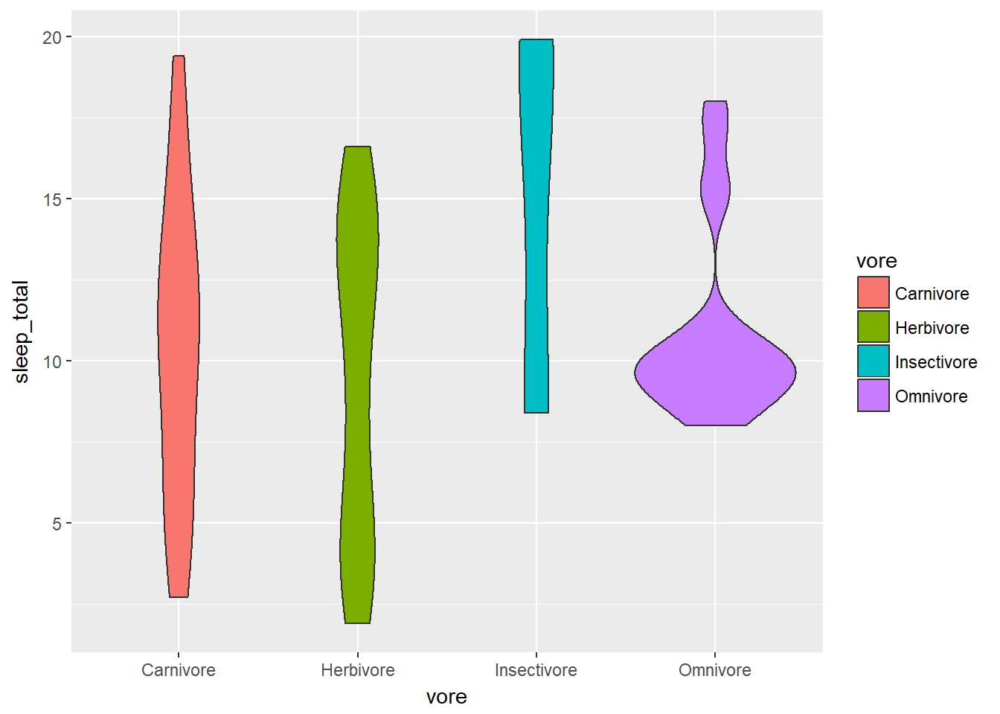

```r
# Calculate weighting measure
library(dplyr)
```

```
## 
## Attaching package: 'dplyr'
```

```
## The following objects are masked from 'package:stats':
## 
##     filter, lag
```

```
## The following objects are masked from 'package:base':
## 
##     intersect, setdiff, setequal, union
```

```r
mammals2 <- mammals %>%
  group_by(vore) %>%
  mutate(n = n() / nrow(mammals)) -> mammals

# Weighted density plot
ggplot(mammals2, aes(x = sleep_total, fill = vore)) +
  geom_density(aes(weight = n), col = NA, alpha = 0.35) +
  scale_x_continuous(limits = c(0, 24)) +
  coord_cartesian(ylim = c(0, 0.3))
```

```
## Warning in density.default(x, weights = w, bw = bw, adjust = adjust, kernel
## = kernel, : sum(weights) != 1 -- will not get true density

## Warning in density.default(x, weights = w, bw = bw, adjust = adjust, kernel
## = kernel, : sum(weights) != 1 -- will not get true density

## Warning in density.default(x, weights = w, bw = bw, adjust = adjust, kernel
## = kernel, : sum(weights) != 1 -- will not get true density

## Warning in density.default(x, weights = w, bw = bw, adjust = adjust, kernel
## = kernel, : sum(weights) != 1 -- will not get true density
```

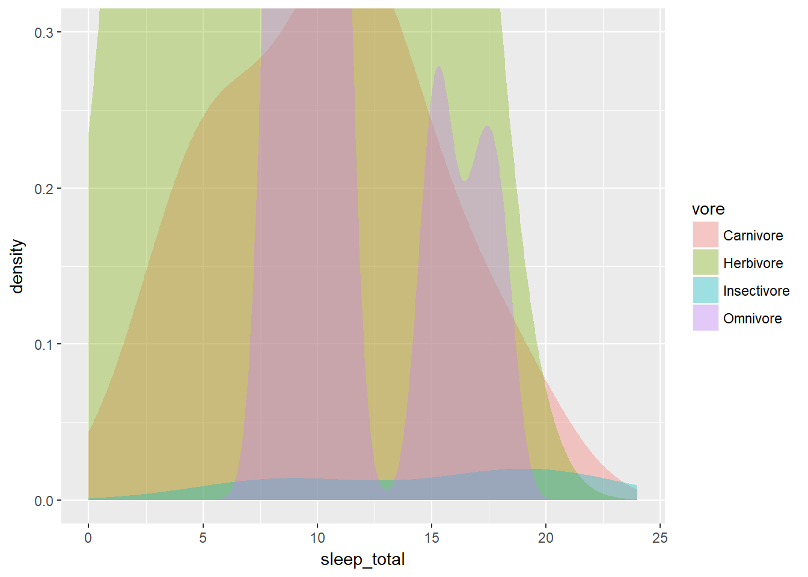

```r
# Weighted violin plot
ggplot(mammals2, aes(x = vore, y = sleep_total, fill = vore)) +
  geom_violin(aes(weight = n), col = NA)
```

```
## Warning in density.default(x, weights = w, bw = bw, adjust = adjust, kernel
## = kernel, : sum(weights) != 1 -- will not get true density

## Warning in density.default(x, weights = w, bw = bw, adjust = adjust, kernel
## = kernel, : sum(weights) != 1 -- will not get true density

## Warning in density.default(x, weights = w, bw = bw, adjust = adjust, kernel
## = kernel, : sum(weights) != 1 -- will not get true density

## Warning in density.default(x, weights = w, bw = bw, adjust = adjust, kernel
## = kernel, : sum(weights) != 1 -- will not get true density
```

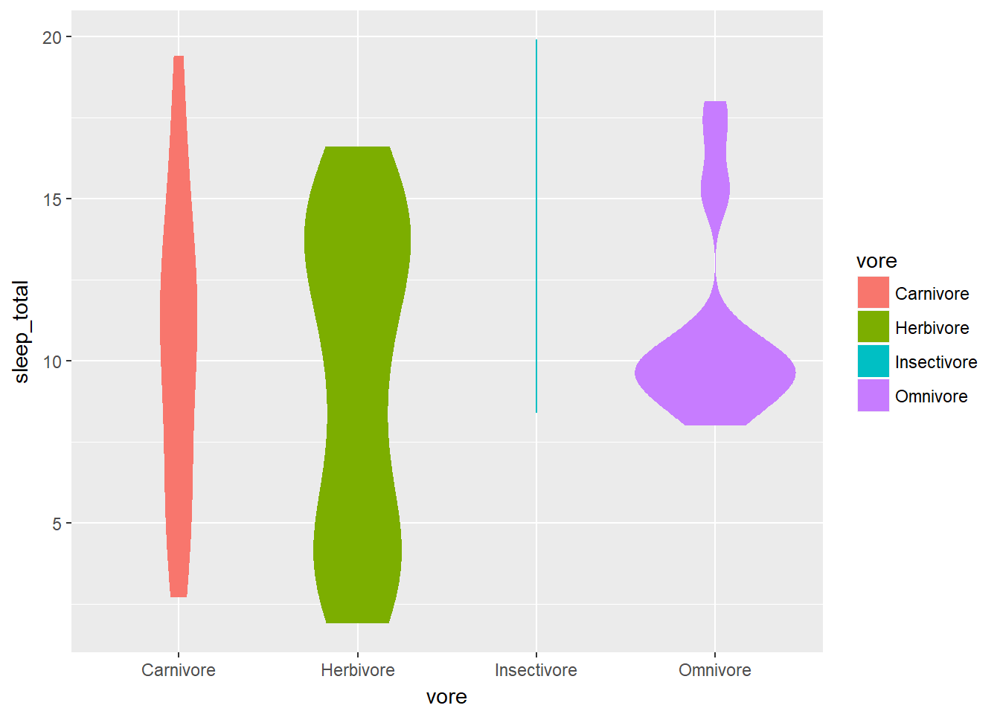

We can also create 2D density plots.  You can consider two orthogonal density plots in the form of a 2D density plot. Just like with a 1D density plot, you can adjust the bandwidth of both axes independently.

The data is stored in the faithful data frame, available in the datasets package. The object p contains the base definitions of a plot.  Think about the message in your scatter plots, sometimes clusters of high-density are more intersting than linear models.


```r
# Base layers
p <- ggplot(faithful, aes(x = waiting, y = eruptions)) +
  scale_y_continuous(limits = c(1, 5.5), expand = c(0, 0)) +
  scale_x_continuous(limits = c(40, 100), expand = c(0, 0)) +
  coord_fixed(60 / 4.5)

# 1 - Use geom_density_2d()
p + geom_density_2d()
```

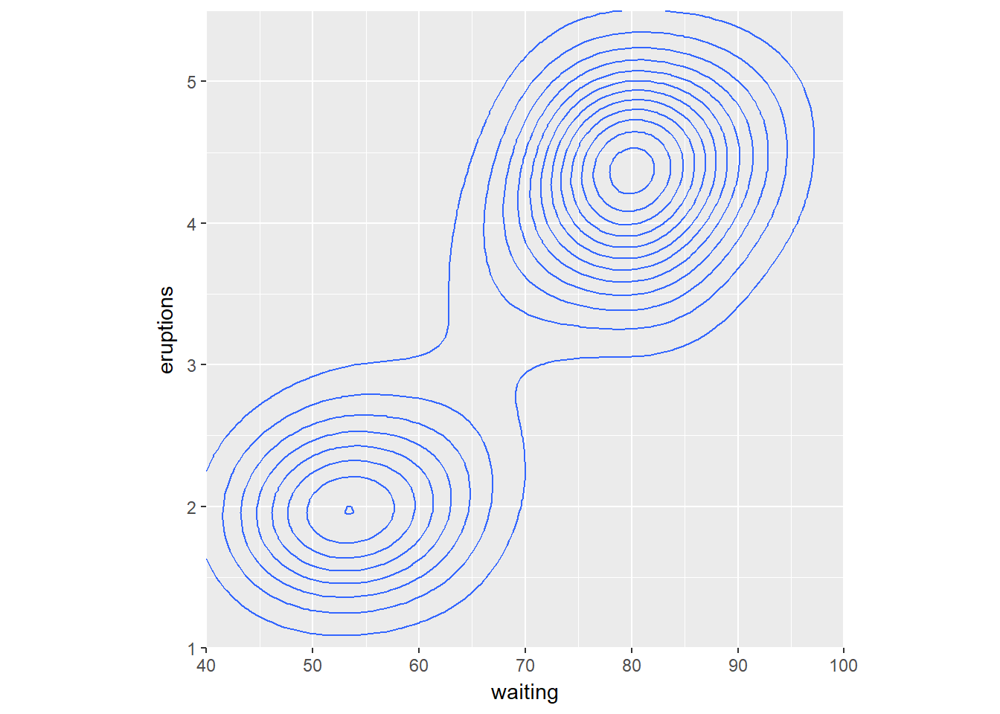

```r
# 2 - Use stat_density_2d() with arguments
p + stat_density_2d(aes(col = ..level..), h = c(5, 0.5))
```

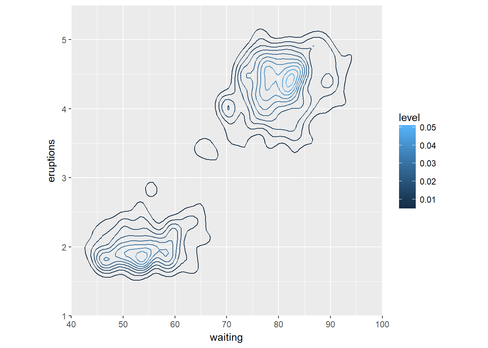

Next we use the viridis package. This package contains multi-hue color palettes suitable for continuous variables.

The advantage of these scales is that instead of providing an even color gradient for a continuous scale, they highlight the highest values by using an uneven color gradient on purpose. The high values are lighter colors (yellow versus blue), so they stand out more.


```r
# Load in the viridis package
library(viridis)
```

```
## Loading required package: viridisLite
```

```r
# Add viridis color scale
ggplot(faithful, aes(x = waiting, y = eruptions)) +
  scale_y_continuous(limits = c(1, 5.5), expand = c(0,0)) +
  scale_x_continuous(limits = c(40, 100), expand = c(0,0)) +
  coord_fixed(60/4.5) +
  stat_density_2d(geom = "tile", aes(fill = ..density..), h=c(5,.5), contour = FALSE) + 
  scale_fill_viridis()
```

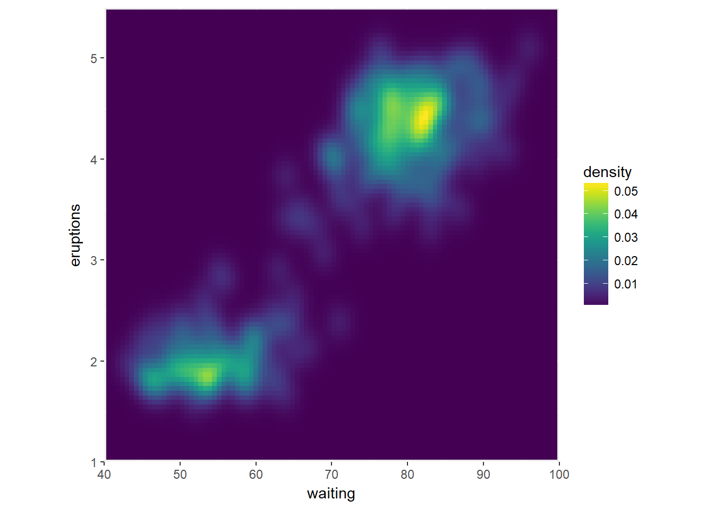

## Plots for Specific Data 1

In this and the next section, we cover a lot of different plot types which are meant for specific use cases.  They give an overview of the different plots so you can remember them when you have appropriate data, even if that isn't very often.  

### Big data

This could be in the form of many observations, or it could be many variables (multidimensional data) or some combination thereof.  

In the case of many observations (big n) there are some techniques we can use:

* Reducing overplotting
* Reducing the amount of information that is plotted
* Aggregating data

In the case of multidimensional or hign  data (big p) there are other techniques we can use:

* Data Reduction methods (e.g. PCA)
* Use facets in plots
* Use a SPLOM - Scatter PLOt Matrix, a nice example is the chart.Correlation fun in PerformanceAnalytics package
* Use a parallel coordinate plot, which can be used for continous and discreet data, inluding those on different scales

First we will look at SPLOMs. Base R features two useful quick-and-dirty pairs plots functions. They both only take continuous variables.  There are two datasets - iris dataset and mtcars_fact, a version of mtcars where categorical variables have been converted into actual factor columns.

*S*catter *PLO*t *M*atrices.


```r
# Convert nums to factors where needed for mtcars
mtcars_fact <- mtcars
mtcars_fact[c(2, 8:11)] <- lapply(mtcars_fact[c(2, 8:11)], as.factor)

# pairs
pairs(iris[1:4])
```


```r
# chart.Correlation
library(PerformanceAnalytics)
chart.Correlation(iris[1:4])
```

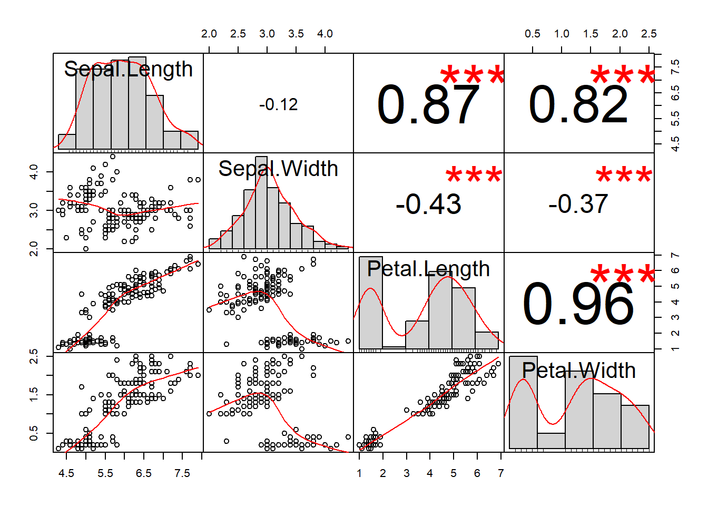

```r
# ggpairs
library(GGally)
ggpairs(mtcars_fact[1:3])
```

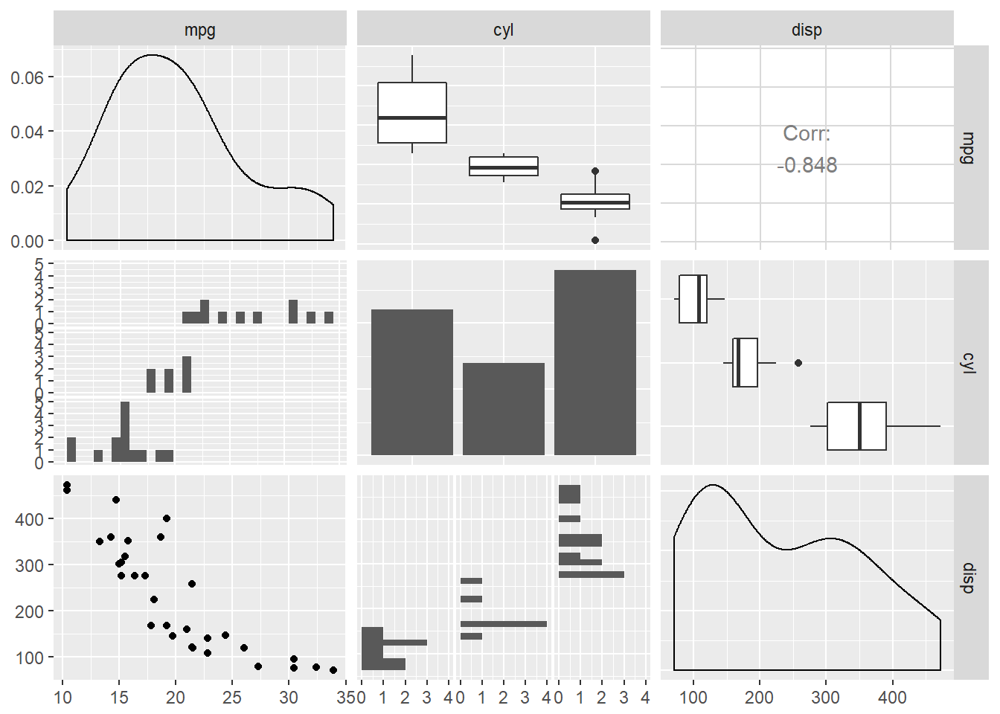

Instead of using an off-the-shelf correlation matrix function, you can of course create your own plot. For starters, a correlation matrix can be calculated using, for example, cor(dataframe) (if all variables are numerical). Before you can use your data frame to create your own correlation matrix plot, you'll need to get it in the right format.

There is a definition of cor_list(), a function that re-formats the data frame x. Here, L is used to add the points to the lower triangle of the matrix, and M is used to add the numerical values as text to the upper triangle of the matrix. With reshape2::melt(), the correlation matrices L and M are each converted into a three-column data frame: the x and y axes of the correlation matrix make up the first two columns and the corresponding correlation coefficient makes up the third column. These become the new variables "points" and "labels", which can be mapped onto the size aesthetic for the points in the lower triangle and onto the label aesthetic for the text in the upper triangle, respectively. Their values will be the same, but their positions on the plot will be symmetrical about the diagonal! Merging L and M, you have everything you need.

We use reshape2 instead of tidyr is that reshape2::melt() can handle a matrix, whereas tidyr::gather() requires a data frame. At this point you just need to understand how to use the output from cor_list().

First use dplyr to execute this function on the continuous variables in the iris data frame (the first four columns), but separately for each species. Next, you'll actually plot the resulting data frame with ggplot2 functions.


```r
library(reshape2)

cor_list <- function(x) {
  L <- M <- cor(x)
  
  M[lower.tri(M, diag = TRUE)] <- NA
  M <- melt(M)
  names(M)[3] <- "points"
  
  L[upper.tri(L, diag = TRUE)] <- NA
  L <- melt(L)
  names(L)[3] <- "labels"
  
  merge(M, L)
}

# Calculate xx with cor_list
library(dplyr)
xx <- iris %>%
  group_by(Species) %>%
  do(cor_list(.[1:4])) 

# Finish the plot
ggplot(xx, aes(x = Var1, y = Var2)) +
  geom_point(
    aes(col = points, size = abs(points)), 
    shape = 16
    ) +
  geom_text(
    aes(col = labels, size = abs(labels), label = round(labels, 2))
    ) +
  scale_size(range = c(0, 6)) +
  scale_color_gradient2("r", limits = c(-1, 1)) +
  scale_y_discrete("", limits = rev(levels(xx$Var1))) +
  scale_x_discrete("") +
  guides(size = FALSE) +
  geom_abline(slope = -1, intercept = nlevels(xx$Var1) + 1) +
  coord_fixed() +
  facet_grid(. ~ Species) +
  theme(axis.text.y = element_text(angle = 45, hjust = 1),
        axis.text.x = element_text(angle = 45, hjust = 1),
        strip.background = element_blank())
```

```
## Warning: Removed 30 rows containing missing values (geom_point).
```

```
## Warning: Removed 30 rows containing missing values (geom_text).
```

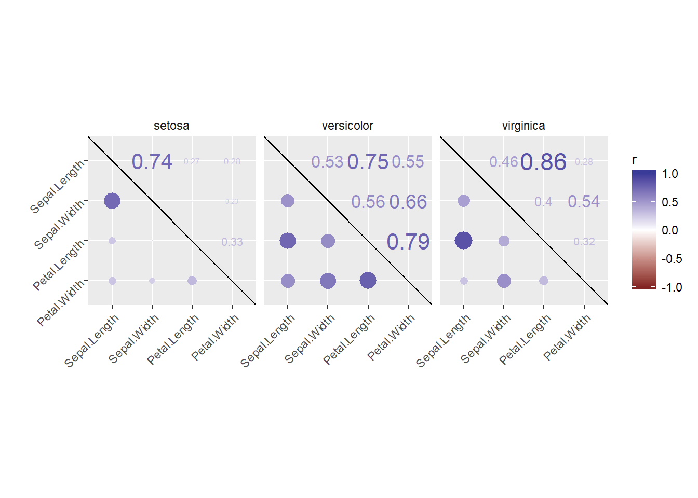

