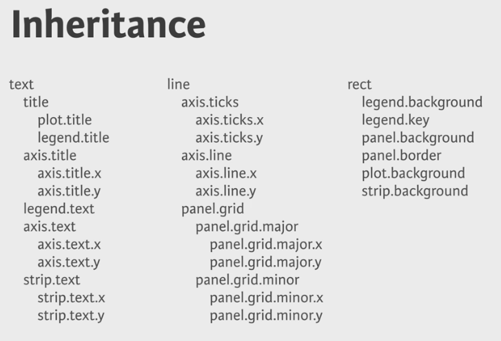

# Intermediate ggplot2
***
Notes taken during/inspired by the Datacamp course 'Data Visualization with ggplot2 (Part 2)' by Rick Scavetta.  This course builds on the first course, which looked at how to build plots, aesthetics, layers and principles.  This second part includes topics such as how to build meaningful plots, statistics and practical matters such as themes.

The focus of this course is onfour layers (statistics, coordinates, facets and themes). 

Course slides:
* [Part 1 - Statistics](https://s3.amazonaws.com/assets.datacamp.com/course/ggplot2/course_2/ggplot2_course2_ch1_slides.pdf)
* [Part 2 - Coordinates and Facets](https://s3.amazonaws.com/assets.datacamp.com/course/ggplot2/course_2/ggplot2_course2_ch2_slides.pdf)
* [Part 3 - Themes]()
* [Part 4 - Best Practices]()
* [Part 5 - Case Study]()

Other useful info:
* [Name](Link)

## Statistics

There are two categories of statistical functions:

* Called from within a geom
* Called independently
* Note geom_FUN <-> stat_FUN

Typically they are called using stat_ but ggplot will translate commands e.g. geom_histogram will call the histogram function. Often warning messages will appear as stat_FUN such as stat_bin when default bin widths are used.  

The following examples use the mtcars data for 32 cars from Motor Trends magazine from 1973. This dataset is small, intuitive, and contains a variety of continuous and categorical (both nominal and ordinal) variables.  Firstly we will add some smoothing lines to the data.  

* You can use either stat_smooth() or geom_smooth() to apply a linear model.

```{r}
library(ggplot2)

# Explore the mtcars data frame with str()
str(mtcars)

# A scatter plot with LOESS smooth:
ggplot(mtcars, aes(x = wt, y = mpg)) +
  geom_point() +
  geom_smooth()

# A scatter plot with an ordinary Least Squares linear model:
ggplot(mtcars, aes(x = wt, y = mpg)) +
  geom_point() +
  geom_smooth(method = "lm")


# The previous plot, without CI ribbon:
ggplot(mtcars, aes(x = wt, y = mpg)) +
  geom_point() +
  geom_smooth(method = "lm", se = FALSE)

# The previous plot, without points:
ggplot(mtcars, aes(x = wt, y = mpg)) +
  geom_smooth(method = "lm", se = FALSE)
```

We can also look sub-groups in our dataset. For this we'll encounter the invisible group aesthetic.  

* In the first plot, our smooth is calculated for each subgroup because there is an invisible aesthetic, group which inherits from col.  
* In the second plot,  we use multiple aesthetic layers, just like we can use multiple geom layers. Each aesthetic layer can be mapped onto a specific geom.

```{r}
# Define cyl as a factor variable
ggplot(mtcars, aes(x = wt, y = mpg, col = factor(cyl))) +
  geom_point() +
  stat_smooth(method = "lm", se = F)

# Complete the following ggplot command as instructed
ggplot(mtcars, aes(x = wt, y = mpg, col = factor(cyl))) +
  geom_point() +
  stat_smooth(method = "lm", se = F) + 
  stat_smooth(aes(group = 1), method = "lm", se = F)
```

Here we'll consider the span for LOESS smoothing and we'll take a look at a nice scenario of how to properly map our different models.  LOESS smoothing is a non-parametric form of regression that uses a weighted, sliding-window, average to calculate a line of best fit. We can control the size of this window with the span argument.


Plot 1:  We can control the size of the loess window with the span argument. 

Plot 2: In this plot, we set a linear model for the entire dataset as well as each subgroup, defined by cyl. In the second stat_smooth(),
Set method to "loess" Add span, set it to 0.7

Plot 3: Plot 2 presents a problem because there is a black line on our plot that is not included in the legend. To get this, we need to map something to col as an aesthetic, not just set col as an attribute.
Add col to the aes() function in the second stat_smooth(), set it to "All". This will name the line properly.
Remove the col attribute in the second stat_smooth(). Otherwise, it will overwrite the col aesthetic.

Plot 4: Now we should see our "All" model in the legend, but it's not black anymore.
Add a scale layer: scale_color_manual() with the first argument set to "Cylinders" and values set to the predfined myColors variable

```{r}
# Plot 1: change the LOESS span
ggplot(mtcars, aes(x = wt, y = mpg)) +
  geom_point() +
  # Add span below
  geom_smooth(se = F, span = 0.7)

# Plot 2: Set the overall model to LOESS and use a span of 0.7
ggplot(mtcars, aes(x = wt, y = mpg, col = factor(cyl))) +
  geom_point() +
  stat_smooth(method = "lm", se = F) +
  # Change method and add span below
  stat_smooth(method = "loess", aes(group = 1),
              se = F, col = "black", span = 0.7)

# Plot 3: Set col to "All", inside the aes layer of stat_smooth()
ggplot(mtcars, aes(x = wt, y = mpg, col = factor(cyl))) +
  geom_point() +
  stat_smooth(method = "lm", se = F) +
  stat_smooth(method = "loess",
              # Add col inside aes()
              aes(group = 1, col = "All"),
              # Remove the col argument below
              se = F, span = 0.7)

# Plot 4: Add scale_color_manual to change the colors
myColors <- c(brewer.pal(3, "Dark2"), "black")

ggplot(mtcars, aes(x = wt, y = mpg, col = factor(cyl))) +
  geom_point() +
  stat_smooth(method = "lm", se = F, span = 0.75) +
  stat_smooth(method = "loess",
              aes(group = 1, col="All"),
              se = F, span = 0.7) +
  # Add correct arguments to scale_color_manual
  scale_color_manual("Cylinders", values = myColors)
```

The next example shows 4 plots

Plot 1: builds a jittered plot of vocabulary against education of the Vocab data frame.
Add a stat_smooth() layer with method set to "lm". Make sure no CI ribbons are shown by setting se to FALSE.

Plot 2: We'll just focus on the linear models from now on.
Copy the previous command, remove the geom_jitter() layer.
Add the col aesthetic to the ggplot() command. Set it to factor(year).

Plot 3: The default colors are pretty unintuitive. Since this can be considered an ordinal scale, it would be nice to use a sequential color palette.
Copy the previous command, add scale_color_brewer() to use a default ColorBrewer. This should result in an error, since the default palette, "Blues", only has 9 colors, but we have 16 years here.

Plot 4: Overcome the error by using year as a numeric vector. You'll have to specify the invisible group aesthetic which will be factor(year). You are given a scale layer which will fix your coloring, but you'll need to make the following changes:
Add group inside aes(), set it to factor(year).
Inside stat_smooth(), set alpha equal to 0.6 and size equal to 2.

When mapping onto color you can sometimes treat a continuous scale, like year, as an ordinal variable, but only if it is a regular series. The better alternative is to leave it as a continuous variable and use the group aesthetic as a factor to make sure your plot is drawn correctly.

```{r}
# load the data Vocab from the car package
library(car)

# load the RColorBrewer package for plot 4
library(RColorBrewer)

# Plot 1: Jittered scatter plot, add a linear model (lm) smooth:
ggplot(Vocab, aes(x = education, y = vocabulary)) +
  geom_jitter(alpha = 0.2) +
  stat_smooth(method = "lm", se = FALSE)

# Plot 2: Only lm, colored by year
ggplot(Vocab, aes(x = education, y = vocabulary, col = factor(year))) +
  stat_smooth(method = "lm", se = FALSE)

# Plot 3: Set a color brewer palette
ggplot(Vocab, aes(x = education, y = vocabulary, col = factor(year))) +
  stat_smooth(method = "lm", se = FALSE) + 
  scale_color_brewer()

# Plot 4: Add the group, specify alpha and size
ggplot(Vocab, aes(x = education, y = vocabulary, col = year, group = factor(year))) +
  stat_smooth(method = "lm", se = F, alpha = 0.6, size = 2) +
  scale_color_gradientn(colors = brewer.pal(9,"YlOrRd"))
```

The previous example used the Vocab dataset and applied linear models describing vocabulary by education for different years. Here we'll continue with that example by using stat_quantile() to apply a quantile regression (method rq).

By default, the 1st, 2nd (i.e. median), and 3rd quartiles are modeled as a response to the predictor variable, in this case education. Specific quantiles can be specified with the quantiles argument.

If you want to specify many quantile and color according to year, then things get too busy. The resulting plot will be a mess, because there are three quartiles drawn by default in the first plot. The second plot takes the code for the previous plot and sets the quantiles argument to 0.5 so that only the median is shown.

```{r, messages = FALSE}
# Use stat_quantile instead of stat_smooth:
ggplot(Vocab, aes(x = education, y = vocabulary, col = year, group = factor(year))) +
  stat_quantile(alpha = 0.6, size = 2) +
  scale_color_gradientn(colors = brewer.pal(9,"YlOrRd"))

# Set quantile to 0.5:
ggplot(Vocab, aes(x = education, y = vocabulary, col = year, group = factor(year))) +
  stat_quantile(quantiles = 0.5, alpha = 0.6, size = 2) +
  scale_color_gradientn(colors = brewer.pal(9,"YlOrRd"))
```

Another useful stat function is stat_sum() which calculates the count for each group.  Typically we'd draw our models on top of the dots, but in this case we didn't so that we could just keep recycling the p object.

```{r}
# Plot with linear and loess model
p <- ggplot(Vocab, aes(x = education, y = vocabulary)) +
       stat_smooth(method = "loess", aes(col = "red"), se = F) +
       stat_smooth(method = "lm", aes(col = "blue"), se = F) +
       scale_color_discrete("Model", labels = c("blue" = "lm", "red" = "LOESS"))

# Add stat_sum
p + stat_sum()

# Add stat_sum and set size range
p + stat_sum() + scale_size(range = c(1, 10))
```

### Stats outside geoms

We can use the fun.data = functio_name() which will feed the results in to our plot.  In the Hmisc package, we can calculate a 95% CI using the command smean.cl.normal() or within ggplot2 using mean_cl_normal(). We can use any statistical method inside ggplot2, as long as the output format is the same as the required format of the geom that is called.  So making sure the data is in the right format and that all the positions that we might use in our plots are defined is an important first step.  The following example also sets up some base variables and base graphics.

```{r}
# Display structure of mtcars
str(mtcars)

# Convert cyl and am to factors:
mtcars$cyl <- as.factor(mtcars$cyl)
mtcars$am <- as.factor(mtcars$am)

# Define positions:
posn.d <- position_dodge(width = 0.1)
posn.jd <- position_jitterdodge(jitter.width = 0.1, dodge.width = 0.2)
posn.j <- position_jitter(width = 0.2)

# base layers:
#wt.cyl.am <- ggplot(mtcars, aex(x = cyl, y = wt, col = am, fill = am, group = am)) # more explicit naming
wt.cyl.am <- ggplot(mtcars, aes(cyl, wt, col = am, fill = am, group = am))
```

Plot 2: Add a stat_summary() layer to wt.cyl.am and calculate the mean and standard deviation as we did in the video: set fun.data to mean_sdl and specify fun.args to be list(mult = 1). Set the position argument to posn.d.

Plot 3: Repeat the previous plot, but use the 95% confidence interval instead of the standard deviation. You can use mean_cl_normal instead of mean_sdl this time. There's no need to specify fun.args in this case. Again, set position to posn.d.

The above plots were simple because they implicitly used a default geom, which is geom_pointrange(). For Plot 4, fill in the blanks to calculate the mean and standard deviation separately with two stat_summary() functions:
For the mean, use geom = "point" and set fun.y = mean. This time you should use fun.y because the point geom uses the y aesthetic behind the scenes.
Add error bars with another stat_summary() function. Set geom = "errorbar" to get the real "T" tips. Set fun.data = mean_sdl.

```{r}
library(Hmisc) # required for the stat_summary() functions

# Plot 1: Jittered, dodged scatter plot with transparent points
wt.cyl.am +
  geom_point(position = posn.jd, alpha = 0.6)

# Plot 2: Mean and SD - the easy way
wt.cyl.am +
  stat_summary(fun.data = mean_sdl, fun.args = list(mult = 1), position = posn.d)


# Plot 3: Mean and 95% CI - the easy way
wt.cyl.am +
  stat_summary(fun.data = mean_cl_normal, position = posn.d)


# Plot 4: Mean and SD - with T-tipped error bars - fill in ___
wt.cyl.am +
  stat_summary(geom = "point", fun.y = mean,
               position = posn.d) +
  stat_summary(geom = "errorbar", fun.data = mean_sdl,
               position = posn.d, fun.args = list(mult = 1), width = 0.1)
```

The only difference between ggplot2::mean_sdl() and Hmisc::smean.sdl() is the naming convention. In order to use the results of a function directly in ggplot2 we need to ensure that the names of the variables match the aesthetics needed for our respective geoms.

Here we'll create two new functions. One function will measure the full range of the dataset and the other will measure the interquartile range.

```{r}

xx <- 1:100 # our data

# Function to save range for use in ggplot
gg_range <- function(x) {
  # Change x below to return the instructed values
  data.frame(ymin = min(x), # Min
             ymax = max(x)) # Max
}

gg_range(xx)
# Required output:
#   ymin ymax
# 1    1  100

# Function to Custom function:
med_IQR <- function(x) {
  # Change x below to return the instructed values
  data.frame(y = median(x), # Median
             ymin = quantile(x)[2], # 1st quartile
             ymax = quantile(x)[4])  # 3rd quartile
}

med_IQR(xx)
# Required output:
#        y  ymin  ymax
# 25% 50.5 25.75 75.25
```

We have now created functions that will allow us to plot the five-number summary (the minimum, 1st quartile, median, 3rd quartile, and the maximum). Here, we'll implement that into a unique plot type.

All the functions and objects from the previous exercise are available including the updated mtcars data frame, the position object posn.d, the base layers wt.cyl.am and the functions med_IQR() and gg_range().

```{r}
# Add three stat_summary calls to wt.cyl.am
wt.cyl.am +
  stat_summary(geom = "linerange", fun.data = med_IQR,
               position = posn.d, size = 3) +
  stat_summary(geom = "linerange", fun.data = gg_range,
               position = posn.d, size = 3,
               alpha = 0.4) +
  stat_summary(geom = "point", fun.y = median,
               position = posn.d, size = 3,
               col = "black", shape = "X")
```

## Coordinates Layer

The coordinates layer controls the dimensions of the plot using the coord_ such as the coord_cartesian() which controls the x and y elements.  You can use the scale_x_continous to effectivly show just a section of the plot if you so desire, but some data will be missed out as it itsn't on the plot.  Conversley the coord_cartesian will draw all the plot, but zoom in to just a section of it.  We can also alter the aspect ratio, which can make certain trends in data easier to see, however there is a risk of deceiving the viewer, perhaps by mistake, if we are not careful.


```{r}
# Basic ggplot() command
p <- ggplot(mtcars, aes(x = wt, y = hp, col = am)) + geom_point() + geom_smooth()

# Add scale_x_continuous
p + scale_x_continuous(limits = c(3, 6), expand = c(0, 0))

# The proper way to zoom in - shows the data appropriatley
p + coord_cartesian(xlim = c(3, 6))
```
 
We can set the aspect ratio of a plot with coord_fixed() or coord_equal(). Both use aspect = 1 as a default. A 1:1 aspect ratio is most appropriate when two continuous variables are on the same scale, as with the iris dataset.

All variables are measured in centimeters, so it only makes sense that one unit on the plot should be the same physical distance on each axis. This gives a more truthful depiction of the relationship between the two variables since the aspect ratio can change the angle of our smoothing line. This would give an erroneous impression of the data.

Of course the underlying linear models don't change, but our perception can be influenced by the angle drawn.  As a rule of thumb you'll want to use a 1:1 aspect ratio when your axes show the same scales, but there are always exceptions.

```{r}
# Complete basic scatter plot function
base.plot <- ggplot(iris, aes(x = Sepal.Length, y = Sepal.Width, col = Species)) +
               geom_jitter() +
               geom_smooth(method = "lm", se = F)

# Plot base.plot: default aspect ratio
base.plot

# Fix aspect ratio (1:1) of base.plot
base.plot + coord_equal()
```

The coord_polar() function converts a planar x-y cartesian plot to polar coordinates. This can be useful if you are producing pie charts.

We can imagine two forms for pie charts - the typical filled circle, or a colored ring.

As an example, consider a stacked bar chart. Imagine that we just take the y axis on the left and bend it until it loops back on itself, while expanding the right side as we go along. We'd end up with a pie chart - it's simply a bar chart transformed onto a polar coordinate system.

Typical pie charts omit all of the non-data ink, which we'll learn about in the next chapter. Pie charts are not really better than stacked bar charts, but we'll come back to this point in the fourth chapter on best practices.

This function is particularly useful if you are dealing with a cycle, like yearly data, that you would like to see represented as such.

```{r}
# Create stacked bar plot: thin.bar
thin.bar <- ggplot(mtcars, aes(x = 1, fill = cyl)) +
              geom_bar()

# Convert thin.bar to pie chart
thin.bar + coord_polar(theta = "y")

# Create stacked bar plot: wide.bar
wide.bar <- ggplot(mtcars, aes(x = 1, fill = cyl)) +
              geom_bar(width = 1)


# Convert wide.bar to pie chart
wide.bar + coord_polar(theta = "y")
```

## Facets

These are small elements of information, as suggested by Edward Tufte in the Visualisation of Qunatative Information, 1983.  The idea is we can split up a larger plot into smaller ones which use the exact same coordinate system.  

The most straightforward way of using facets is facet_grid(). Here we just need to specify the categorical variable to use on rows and columns using formula notation.

Notice that we can also take advantage of ordinal variables by positioning them in the correct order as columns or rows, as is the case with the number of cylinders.

```{r}
# Basic scatter plot:
p <- ggplot(mtcars, aes(x = wt, y = mpg)) +
  geom_point()

# Separate rows according to transmission type, am
p + facet_grid(. ~ am)

# Separate columns according to cylinders, cyl
p + facet_grid(cyl ~ .)

# Separate by both columns and rows 
p + facet_grid(cyl ~ am)
```

Facets are another way of presenting categorical variables. Sometimes it's possible to overdo it. Here we'll present a plot with 6 variables and see if we can add even more.

Let's begin by using a trick to map two variables onto two color scales - hue and lightness. We combine cyl and am into a single variable cyl_am. To accommodate this we also make a new color palette with alternating red and blue of increasing darkness. This is saved as myCol.  The last plot created here is simply trying to plot too much information.

```{r}

# Code to create the cyl_am col and myCol vector
mtcars$cyl_am <- paste(mtcars$cyl, mtcars$am, sep = "_")
myCol <- rbind(brewer.pal(9, "Blues")[c(3,6,8)],
               brewer.pal(9, "Reds")[c(3,6,8)])

# Basic scatter plot, add color scale:
ggplot(mtcars, aes(x = wt, y = mpg, col = cyl_am)) +
  geom_point() +
  scale_color_manual(values = myCol)
  
# Facet according on rows and columns.
ggplot(mtcars, aes(x = wt, y = mpg, col = cyl_am)) +
  geom_point() +
  scale_color_manual(values = myCol) +
  facet_grid(vs ~ gear)

# Add more variables.  Note, with a denser plot we would need to set an alpha value to see all points
ggplot(mtcars, aes(x = wt, y = mpg, col = cyl_am, size = disp)) +
  geom_point() +
  scale_color_manual(values = myCol) +
  facet_grid(vs ~ gear)

```

When you have a categorical variable with many levels which are not all present in sub-groups of another variable, it may be desirable to drop the unused levels. As an example let's return to the mammalian sleep dataset, mamsleep. It is available in your workspace.

The variables of interest here are name, which contains the full popular name of each animal, and vore, the eating behavior. Each animal can only be classified under one eating habit, so if we facet according to vore, we don't need to repeat the full list in each sub-plot.

```{r}

library(reshape2)

# Setup the data
mamsleep <- msleep[,c("vore", "name", "sleep_total", "sleep_rem")] 
mamsleep <- mamsleep[complete.cases(mamsleep),] 
mamsleep <- melt(mamsleep, id = c("vore","name"), variable.name = "sleep", value.name = "time") 
levels(mamsleep$sleep) <- sub("sleep_", "", levels(mamsleep$sleep))

# Basic scatter plot
p <- ggplot(mamsleep, aes(x = time, y = name, col = sleep)) +
  geom_point()      
p

# Facet rows accoding to vore
p + facet_grid(vore ~ .)

# Specify scale and space arguments to free up rows
p + facet_grid(vore ~ ., scale = 'free_y', space = 'free_y')
```

## Themes

The Themes layer hold all the visual elements not part of the data, there are three types; text, lines and rectangles.  

* Text includes things like the axis, legends, plot and axis titles.  Headers for individual facets are named as strip text e.g. strip.text.x = 
* Lines includes tick marks, axis lines and grid lines.  
* Rectanges (rect) includes the plot area, legends and so on.

Elements are in a hierachy so if you change some of the higher components, lower ones will be affected.  Text is one instance of this.  The diagram below shows the other nested elements.

```{r Theme Inheritance, echo = FALSE, fig.cap='Inheritance in ggplot2 themes'}

```

If we want certain items to not appear on the plot we can use the element_blank command e.g. line = element_blank().

```{r, eval = FALSE}

# Define our pink for use
myPink <- "#FEE0D2"

# Plot 1: change the plot background color to myPink:
z + theme(plot.background = element_rect(fill = myPink))

# Plot 2: adjust the border to be a black line of size 3
z + theme(plot.background = element_rect(fill = myPink, 
      colour = "black", size = 3))

# Plot 3: set panel.background, legend.key, legend.background and strip.background to element_blank()
uniform_panels <- theme(panel.background = element_blank(), 
                        legend.key = element_blank(), 
                        legend.background=element_blank(), 
                        strip.background = element_blank()) 
                        
z <- z + 
  theme(plot.background = element_rect(fill = myPink, 
      color = "black", size = 3)) + uniform_panels

# Extend z with theme() function and three arguments to change the appearance of lines
z + theme(panel.grid = element_blank(),
  axis.line = element_line(color = "black"),
  axis.ticks = element_line(color = "black"))

# Extend z with theme() function and four arguments to make the text better
z + theme(
  strip.text = element_text(size = 16, color = myRed),
  axis.title.y = element_text(color = myRed, hjust = 0, face = "italic"),
  axis.title.x = element_text(color = myRed, hjust = 0, face = "italic"),
  axis.text = element_text(color = "black")
)
```

We can also use similar arguments to change the location and other settings of the legend

```{r, eval = FALSE}

# Move legend by position, now top right of third facet
z + theme(legend.position = c(0.85, 0.85))

# Change direction of the legend entries
z + theme(legend.direction = "horizontal")

# Change location by name
z + theme(legend.position = "bottom")

# Remove legend entirely
z + theme(legend.position = "none")
```

The different rectangles of your plot have spacing between them. There's spacing between the facets, between the axis labels and the plot rectangle, between the plot rectangle and the entire panel background, etc.

Suppose you want to have more spacing between the different facets. You can control this by specifying panel.spacing.x inside a theme() function you add to z. For the argument value, you should pass a unit object. To achieve this, load the grid package with library().

```{r, eval = FALSE}

# Increase spacing between facets
library(grid)
z + theme(panel.spacing.x = unit(2, "cm"))

# Add code to remove any excess plot margin space
z + theme(panel.spacing.x = unit(2, "cm"),
  plot.margin = unit(c(0, 0, 0, 0), "cm"))
```

### Recycling themes

When using the same themes repeatedly, for instance in a publication or report, we wouldn't want to repeate the theme instructions every time.  To do this, we save our theme element as an R object.  If a new chart type or chart element then appears in a later plot, we can reuse the previous theme but just extend with a little more code to account for this new chart or object type, without having to re-type all the theme code.  

If we want all our plots to use the same theme, we can use the theme_set(theme_name()) command and all plots will do this.  To return to the default, you can speficy theme_grey(). 

There are many themes available by default in ggplot2: theme_bw(), theme_classic(), theme_gray(), etc. In the previous exercise, you saw that you can apply these themes to all following plots, with theme_set():

> theme_set(theme_bw())

But you can also apply them on a particular plot, with:

> ... + theme_bw()

Next, it's perfectly possible and super-easy to extend these themes with your own modifications. In this exercise, you will experiment with this and use some preset templates available from the ggthemes package.

```{r, eval = FALSE}
# Load ggthemes package
library(ggthemes)

# Apply theme_tufte
z2 + theme_tufte()


# Apply theme_tufte, modified:
 z2 + theme_tufte() + 
  theme(
    legend.position = c(0.9, 0.9),
    legend.title = element_text(face = "italic", size = 12),
    axis.title = element_text(face = "bold", size = 14)
  )
```

## Best Practice

Knowing how to create the plots is important, but choosing the right chart type is equally important.  

### Bar Plots

Typically two types

* Absolute values e.g. counts
* Distribution plots

Problems in interpretation can arise, for instance if a bar plot shows sleep patters, there will be a distribution around a mean, but no values of zero hours, but the plot axies is likely to go to zero.  It is equally problematic to see extreme value, such as animals with many hours of sleep, since we typically show a mean and perhaps a standard deviation line.  

A better option would be to use a scatter plot of sleep times, with jitter and some transparency (alpha) to reduce any over plotting.  

The example below shows a bar plot with error bars, sometimes referred to as a dynamite plot.

```{r}
# Base layers
m <- ggplot(mtcars, aes(x = cyl, y = wt))

# Draw dynamite plot
m +
  stat_summary(fun.y = mean, geom = "bar", fill = "skyblue") +
  stat_summary(fun.data = mean_sdl, fun.args = list(mult = 1), geom = "errorbar", width = 0.1)
```

```{r}
# Base layers, update m so that we split the bars according to transmission type, am
m <- ggplot(mtcars, aes(x = cyl,y = wt, col = am, fill = am))

# Plot 1: Draw dynamite plot - error bars overlap
m +
  stat_summary(fun.y = mean, geom = "bar") +
  stat_summary(fun.data = mean_sdl, fun.args = list(mult = 1), geom = "errorbar", width = 0.1)

# Plot 2: Set position dodge in each stat function, dodge them, which does not work because the default dodging is different for the different stat_summary() functions
m +
  stat_summary(fun.y = mean, geom = "bar", position = "dodge") +
  stat_summary(fun.data = mean_sdl, fun.args = list(mult = 1), 
               geom = "errorbar", width = 0.1, position = "dodge")

# Set your dodge posn manually
posn.d <- position_dodge(0.9)

# Plot 3:  Redraw dynamite plot
m +
  stat_summary(fun.y = mean, geom = "bar", position = posn.d) +
  stat_summary(fun.data = mean_sdl, fun.args = list(mult = 1), geom = "errorbar", width = 0.1, position = posn.d)
```

### Pie Charts

Pie charts are not usually your first choice for plots.  Angle, area and length elements are hard to compare, particularly if you are comparing more than one pie chart.  Pie charts work based when comparing differences between of around 3 groups.  A better alternative is to use bar charts - usually a horizontal bar where two bars can be plotted next to each other and compared.  

In this example we're going to consider a typical use of pie charts - a categorical variable as the proportion of another categorical variable. For example, the proportion of each transmission type am, in each cylinder, cyl class.  We use dummy aesthetic for the x. Changing the aes() function such that factor(1) maps onto x.

```{r}
# Convert bar chart to pie chart
ggplot(mtcars, aes(x = factor(1), fill = am)) +
  geom_bar(position = "fill", width = 1) +
  facet_grid(. ~ cyl) + 
  coord_polar(theta = "y")
```

In the previous example, we looked at the proportions of one categorical variable (am) as a proportion of another (cyl). In this example, we're interested in two, or possibly many, categorical variables independent of each other. 

The trick is to use a parallel coordinates plot.  Each variable is plotted on its own axis and they are plotted as parallel axes. The individual observations are connected with lines, which can be colored according to another variable. This is a surprisingly useful visualization since we can combine many variables, even if they are on entirely different scales.

A word of caution though: typically it is very taboo to draw lines in this way. It's the reason why we don't draw lines across levels of a nominal variable - the order, and thus the slope of the line, is meaningless. Parallel plots are a (very useful) exception to the rule!

Parallel plots not only allow us to see many different variables at the same time, but because we can apply specific statistics to each axis or the order of the axes, we can derive even more information from these plots.

```{r, message=FALSE}
# Parallel coordinates plot using GGally
library(GGally)

# All columns except am
group_by_am <- which(names(mtcars) == 'am')
my_names_am <- (1:11)[-group_by_am]

# Basic parallel plot - each variable plotted as a z-score transformation
ggparcoord(mtcars, my_names_am, groupColumn = group_by_am, alpha = 0.8)
```

The parallel coordinate plot from the last exercise is an excellent example of an exploratory plot. It presents a massive amount of information and allows the specialist to explore many relationships all at once. Another great example is a plot matrix (a SPLOM, from scatter plot matrix).

GGally::ggpairs(mtcars2) will produce the plot of a selection of the mtcars dataset, mtcars2. Depending on the nature of the dataset a specific plot type will be produced and if both variables are continuous the correlation (rho) will also be calculated.

The relationship between the variables drat and mpg is shown in two areas. What is the correlation between these two variables?

```{r}
mtcars2 <- mtcars[, c(1, 3, 5, 6, 7)]
ggpairs(mtcars2)
```

The answer is 0.681, this is in the first row, in the first column you can find the scatter plot.

### Heat Maps

Heat Maps can be difficult to read as the interpretation can change, dependent on the colours around each element.  Plotting continous data on comon scales is always the better option.  

You may encounter a case in which you really do want to use one. Luckily, they're fairly straightforward to produce in ggplot2.

We begin by specifying two categorical variables for the x and y aesthetics. At the intersection of each category we'll draw a box, except here we call it a tile, using the geom_tile() layer. Then we will fill each tile with a continuous variable.

We'll produce the heat map we saw in the video with the built-in barley dataset. The barley dataset is in the lattice package and has already been loaded for you. Begin by exploring the structure of the data in the console using str().

```{r}
library(RColorBrewer)
library(lattice)
data(barley)

# Create color palette
myColors <- brewer.pal(9, "Reds")

# Build the heat map from scratch
ggplot(barley, aes(x = year, y = variety, fill = yield)) +
  geom_tile() + 
  facet_wrap( ~ site, ncol = 1) +
  scale_fill_gradientn(colors = myColors)
```

There are several alternatives to heat maps. The best choice really depends on the data and the story you want to tell with this data. If there is a time component, the most obvious choice is a line plot like what we see in the viewer.

```{r}
# Line plots
ggplot(barley, aes(x = year, y = variety, col = variety, group = variety)) + 
  geom_line() + 
  facet_wrap( ~ site, nrow = 1)
```

You can use dodged error bars or you can use overlapping transparent ribbons (shown in the viewer). In this exercise we'll try to recreate the second option, the transparent ribbons.

```{r}
ggplot(barley, aes(x = year, y = yield, colour = site, group = site, fill = site)) + 
  stat_summary(fun.y = mean, geom = "line") + 
  stat_summary(
    fun.data = mean_sdl, 
    fun.args = list(mult = 1), 
    geom = "ribbon", 
    col = NA, 
    alpha = 0.1
    )
```

## Case Study - Descriptive statistics

Data from from the California Health Interview Survey (CHIS).  The original dataset from 2009 has over 47,000 respondents across 536 variables, but we will use a slightly filtered version with around 44,000 responses over 10 variables.  The data is filtered to show just the 4 largest ethnicity groups giving the over 44,000 responses.  

In this chapter we're going to continuously build on our plotting functions and understanding to produce a mosaic plot (aka Merimeko plot). This is a visual representation of a contingency table, comparing two categorical variables. Essentially, our question is which groups are over or under represented in our dataset. To visualize this we'll color groups according to their pearson residuals from a chi-squared test. At the end of it all we'll wrap up our script into a flexible function so that we can look at other variables.

We'll familiarize ourselves with a small number of variables from the 2009 CHIS adult-response dataset (as opposed to children). We have selected the following variables to explore:

* RBMI: BMI Category description
* BMI_P: BMI value
* RACEHPR2: race
* SRSEX: sex
* SRAGE_P: age
* MARIT2: Marital status
* AB1: General Health Condition
* ASTCUR: Current Asthma Status
* AB51: Type I or Type II Diabetes
* POVLL: Poverty level

We'll filter our dataset to plot a more reliable subset (we'll still retain over 95% of the data).

Before we get into mosaic plots it's worthwhile exploring the dataset using simple distribution plots - i.e. histograms.

```{r}
# load the data
load("D:/CloudStation/Documents/2017/RData/CHIS2009_reduced_2.Rdata")

# Explore the dataset with summary and str
str(adult)
summary(adult)

# Age histogram
ggplot(adult, aes(x = SRAGE_P)) + geom_histogram() 


# BMI histogram
ggplot(adult, aes(x = BMI_P)) + geom_histogram() 


# Age colored by BMI, default binwidth
ggplot(adult, aes(x = SRAGE_P, fill = factor(RBMI))) + geom_histogram(binwidth = 1) 
```

Next we want to tidy our dateset, we'll remove some extreme values then provide some better labels to help with plotting.

```{r}
# Remove individual aboves 84, as it seems >85 is grouped together
adult <- adult[adult$SRAGE_P <= 84, ]

# Remove individuals with a BMI below 16 and above or equal to 52
adult <- adult[adult$BMI_P >= 16 & adult$BMI_P < 52, ]

# Relabel the race variable to make plotting easier:
adult$RACEHPR2 <- factor(adult$RACEHPR2, labels = c("Latino", "Asian", "African American", "White"))

# Relabel the BMI categories variable to make plotting easier:
adult$RBMI <- factor(adult$RBMI, labels = c("Under-weight", "Normal-weight", "Over-weight", "Obese"))
```

When we introduced histograms we focused on univariate data, which is exactly what we've been doing here. However, when we want to explore distributions further there is much more we can do. For example, there are density plots, which you'll explore in the next course. For now, we'll look deeper at frequency histograms and begin developing our mosaic plots.

```{r}
# The color scale used in the plot
BMI_fill <- scale_fill_brewer("BMI Category", palette = "Reds")

# Theme to fix category display in faceted plot
fix_strips <- theme(strip.text.y = element_text(angle = 0, hjust = 0, vjust = 0.1, size = 14),
                    strip.background = element_blank(),
                    legend.position = "none")

# Histogram, add BMI_fill and customizations
ggplot(adult, aes (x = SRAGE_P, fill= factor(RBMI))) +
  geom_histogram(binwidth = 1) +
  fix_strips +
  BMI_fill + 
  facet_grid(RBMI ~ .) +
  theme_classic()
```

In the previous exercise we looked at different ways of showing the absolute count of multiple histograms. This is fine, but density would be more useful measure if we wanted to see how the frequency of one variable changes accross another. However, there are some difficulties here, so let's take a closer look at different plots.

```{r}
# Plot 1 - Count histogram
ggplot(adult, aes (x = SRAGE_P, fill= factor(RBMI))) +
  geom_histogram(binwidth = 1) +
  BMI_fill

# Plot 2 - Density histogram - odd because we get the density within each BMI category, not within each age group
ggplot(adult, aes (x = SRAGE_P, fill= factor(RBMI))) +
  geom_histogram(aes(y = ..density..),binwidth = 1) +
  BMI_fill

# Plot 3 - Faceted count histogram - if we are interested in the frequency distribution within each BMI category
ggplot(adult, aes (x = SRAGE_P, fill= factor(RBMI))) +
  geom_histogram(binwidth = 1) +
  BMI_fill + 
  facet_grid(RBMI ~.)

# Plot 4 - Faceted density histogram - similat to 3 but density rather than count
ggplot(adult, aes (x = SRAGE_P, fill= factor(RBMI))) +
  geom_histogram(aes(y = ..density..),binwidth = 1) +
  BMI_fill + 
  facet_grid(RBMI ~.)

# Plot 5 - Density histogram with position = "fill" - not an accurate representation, as density calculates the proportion across category, and not across bin
ggplot(adult, aes (x = SRAGE_P, fill= factor(RBMI))) +
  geom_histogram(aes(y = ..density..),binwidth = 1, position = "fill") +
  BMI_fill

# Plot 6 - The accurate histogram
ggplot(adult, aes (x = SRAGE_P, fill= factor(RBMI))) +
  geom_histogram(aes(y = ..count../sum(..count..)),binwidth = 1, position = "fill") +
  BMI_fill
```

In the previous exercise we looked at how to produce a frequency histogram when we have many sub-categories. The problem here is that this can't be facetted because the calculations occur on the fly inside ggplot2.

To overcome this we're going to calculate the proportions outside ggplot2. This is the beginning of our flexible script for a mosaic plot.

```{r}
# An attempt to facet the accurate frequency histogram from before (failed)
ggplot(adult, aes (x = SRAGE_P, fill= factor(RBMI))) +
  geom_histogram(aes(y = ..count../sum(..count..)), binwidth = 1, position = "fill") +
  BMI_fill +
  facet_grid(RBMI ~ .)

# Create DF with table()
DF <- table(adult$RBMI, adult$SRAGE_P)

# Use apply on DF to get frequency of each group - the second argument is 2 because we want to do calculations on each column
DF_freq <- apply(DF, 2, function(x) x/sum(x))

# Load reshape2 and use melt on DF to create DF_melted
library(reshape2)
DF_melted <- melt(DF_freq)

# Change names of DF_melted
names(DF_melted) <- c("FILL", "X", "value")

# Add code to make this a faceted plot - note we are now using geom_bar
ggplot(DF_melted, aes(x = X, y = value, fill = FILL)) +
  geom_bar(stat = "identity", position = "stack") +
  BMI_fill +
  facet_grid(FILL ~ .)
```

### Mosaic Plots

Mosaic plots are similar to the last plot we created, however they show the proportion that the item makes up of the whole dataset, not just a particular year.  In effect, we have a large contigency table derived from two categorical variables - BMI category and age (we treat this as an ordinal variable for the mosaic plot).  We want to know if the proportions of one variable, such as BMI, within groups of another variable such as age, stray from the null model of equal proportions. This is in effect a visual representation of a chi-squared plot, as developed by Michael Friendly.  We can now think about colouring the bars for each group based on it's residual value. 

Mosaic plots are a bit more involved, because the aim is not to draw bars, but rather rectangles, for which we can control the widths. Whilst bars are simply rectangles, but we don't have easy access to the xmin and xmax aesthetics, but in geom_rect() we do. Likewise, we also have access to ymin and ymax. So we're going to draw a box for every one of our 268 distinct groups of BMI category and age.

In this first section we need to create our data frame, based on our contigency table, but with some more calculations. 

```{r}
# The initial contingency table
DF <- as.data.frame.matrix(table(adult$SRAGE_P, adult$RBMI))

# Add the columns groupsSum, xmax and xmin. Remove groupSum again.
DF$groupSum <- rowSums(DF)
DF$xmax <- cumsum(DF$groupSum)
DF$xmin <- DF$xmax - DF$groupSum 
# The groupSum column needs to be removed
DF$groupSum <- NULL

# Copy row names to variable X as the names of the x axis groups are stored in the row name
DF$X <- row.names(DF)

# Melt the dataset
library(reshape2)
DF_melted <- melt(DF, id.vars = c("X", "xmin", "xmax"), variable.name = "FILL")

# dplyr call to calculate ymin and ymax - first groups by X and then calculates cumulative proportions
library(dplyr)
DF_melted <- DF_melted %>%
  group_by(X) %>%
  mutate(ymax = cumsum(value/sum(value)),
         ymin = ymax - value/sum(value))

# Plot rectangles - don't change.
library(ggthemes)
ggplot(DF_melted, aes(ymin = ymin,
                 ymax = ymax,
                 xmin = xmin,
                 xmax = xmax,
                 fill = FILL)) +
  geom_rect(colour = "white") +
  scale_x_continuous(expand = c(0,0)) +
  scale_y_continuous(expand = c(0,0)) +
  BMI_fill +
  theme_tufte()
```

Previously we generated a plot where each individual bar was plotted separately using rectangles . This means we have access to each piece and we can apply different fill parameters.

So let's make some new parameters. To get the Pearson residuals, we'll use the chisq.test().

```{r}
# Perform chi.sq test (RBMI and SRAGE_P)
results <- chisq.test(table(adult$RBMI, adult$SRAGE_P))

# Melt results$residuals and store as resid
resid <- melt(results$residuals)

# Change names of resid - so that we have a consistent naming convention
names(resid) <- c("FILL", "X", "residual")

# merge the two datasets:
DF_all <- merge(DF_melted, resid)

# Update plot command
library(ggthemes)
ggplot(DF_all, aes(ymin = ymin,
                   ymax = ymax,
                   xmin = xmin,
                   xmax = xmax,
                   fill = residual)) +
  geom_rect() +
  scale_fill_gradient2() +
  scale_x_continuous(expand = c(0,0)) +
  scale_y_continuous(expand = c(0,0)) +
  theme_tufte()
```

Now that we are not coloring according to BMI category, we have to add the group labels manually. Also, we neglected to label the x-axis properly.

Here we'll use the label aesthetic inside geom_text(). The actual labels will be the FILL and X columns in the DF data frame. Since we have axes on the left and bottom of our plot, we'll add information to the top and right inner edges of the plot. We could have also added margin text, but that is a more advanced topic. This will be a suitable solution for the moment.

To position our labels correctly, we need to calculate the midpoint between each xmax and xmin value. To get this, calculate the half difference between each pair of xmax and xmin then add this value to xmin.

For the y label positions, we only want to work with the values at the maximum xmax, i.e. at the very end. 

Now that xtext and ytext are available, we can add the labels to our plot. In the two geom_text() functions, separate aesthetics are defined that control the x and y positioning of the labels.

For the age groups, set the x position with xtext. The y position is fixed since our y axis is always going to end at 1.  For the labeling of the y axis, the second geom_text() has three aesthetics since the position on the right will depend on the size of our dataset in the future. 

Some additional attributes have been set inside geom_text(), outside the aes() function. This is just some fine tweaking to get the positioning and angle correct. It's not perfect, but since this is an exploratory plot, it does a pretty good job.

```{r}
# Position for labels on x axis
DF_all$xtext <- DF_all$xmin + (DF_all$xmax - DF_all$xmin)/2

# Position for labels on y axis (don't change)
index <- DF_all$xmax == max(DF_all$xmax)
DF_all$ytext <- DF_all$ymin[index] + (DF_all$ymax[index] - DF_all$ymin[index])/2

# Plot
ggplot(DF_all, aes(ymin = ymin, ymax = ymax, xmin = xmin,
                   xmax = xmax, fill = residual)) +
  geom_rect(col = "white") +
  # geom_text for ages (i.e. the x axis)
  geom_text(aes(x = xtext,
                label = X),
            y = 1,
            size = 3,
            angle = 90,
            hjust = 1,
            show.legend = FALSE) +
  # geom_text for BMI (i.e. the fill axis)
  geom_text(aes(x = max(xmax),
                y = ytext,
                label = FILL),
            size = 3,
            hjust = 1,
            show.legend  = FALSE) +
  scale_fill_gradient2() +
  theme_tufte() +
  theme(legend.position = "bottom")
```

We can now wrap all the steps into a single function that we can use to examine any two variables of interest in our data frame (or in any other data frame for that matter). 

Notice that the function takes multiple arguments, such as the data frame of interest and the variables that you want to create the mosaic plot for. None of the arguments have default values, so you'll have to specify all three if you want the mosaicGG() function to work.

```{r}
# Load all packages
library(ggplot2)
library(reshape2)
library(dplyr)
library(ggthemes)

# Script generalized into a function
mosaicGG <- function(data, X, FILL) {

  # Proportions in raw data
  DF <- as.data.frame.matrix(table(data[[X]], data[[FILL]]))
  DF$groupSum <- rowSums(DF)
  DF$xmax <- cumsum(DF$groupSum)
  DF$xmin <- DF$xmax - DF$groupSum
  DF$X <- row.names(DF)
  DF$groupSum <- NULL
  DF_melted <- melt(DF, id = c("X", "xmin", "xmax"), variable.name = "FILL")
  library(dplyr)
  DF_melted <- DF_melted %>%
    group_by(X) %>%
    mutate(ymax = cumsum(value/sum(value)),
           ymin = ymax - value/sum(value))

  # Chi-sq test
  results <- chisq.test(table(data[[FILL]], data[[X]])) # fill and then x
  resid <- melt(results$residuals)
  names(resid) <- c("FILL", "X", "residual")

  # Merge data
  DF_all <- merge(DF_melted, resid)

  # Positions for labels
  DF_all$xtext <- DF_all$xmin + (DF_all$xmax - DF_all$xmin)/2
  index <- DF_all$xmax == max(DF_all$xmax)
  DF_all$ytext <- DF_all$ymin[index] + (DF_all$ymax[index] - DF_all$ymin[index])/2

  # plot:
  g <- ggplot(DF_all, aes(ymin = ymin,  ymax = ymax, xmin = xmin,
                          xmax = xmax, fill = residual)) +
  geom_rect(col = "white") +
  geom_text(aes(x = xtext, label = X),
            y = 1, size = 3, angle = 90, hjust = 1, show.legend = FALSE) +
  geom_text(aes(x = max(xmax),  y = ytext, label = FILL),
            size = 3, hjust = 1, show.legend = FALSE) +
  scale_fill_gradient2("Residuals") +
  scale_x_continuous("Individuals", expand = c(0,0)) +
  scale_y_continuous("Proportion", expand = c(0,0)) +
  theme_tufte() +
  theme(legend.position = "bottom")
  print(g)
}

# BMI described by age
mosaicGG(adult, "SRAGE_P","RBMI")

# Poverty described by age
mosaicGG(adult, "SRAGE_P","POVLL")

# mtcars: am described by cyl
mosaicGG(mtcars, "cyl", "am") 

# Vocab: vocabulary described by education
library(car)
mosaicGG(Vocab, "education", "vocabulary")
```

