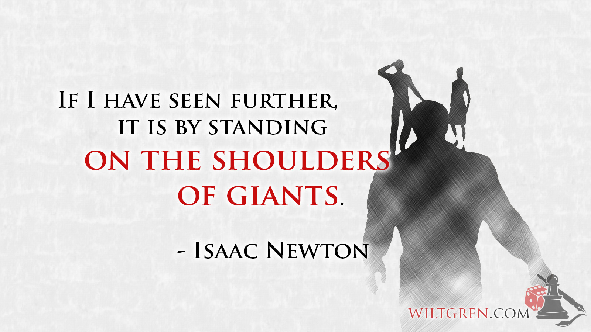

--- 
title: "Study notes"
author: "James Solomon-Rounce"
date: 'Last built:`r Sys.Date()`'
bibliography: book.bib
description: Study notes taken from courses and self learning.
documentclass: book
github-repo: James-SR/study-notes-master
link-citations: yes
site: bookdown::bookdown_site
biblio-style: apalike
url: http\://github.com/James-SR/study-notes-master
---

# Preface {-}

The following notes were taken by me for educational, non-commercial, purposes. If you find the information useful, buy the material/take the course.

Thank you to the original content providers.  Additional ramblings are my own.  

```{r, echo = FALSE, out.width = "100%"}

```

